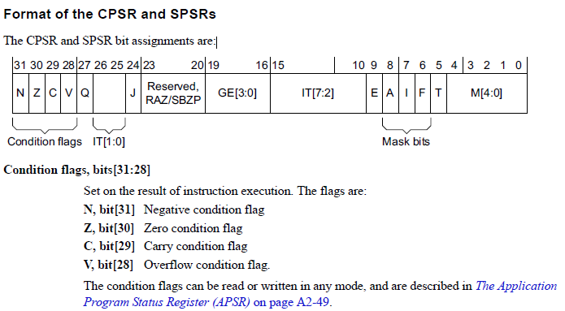
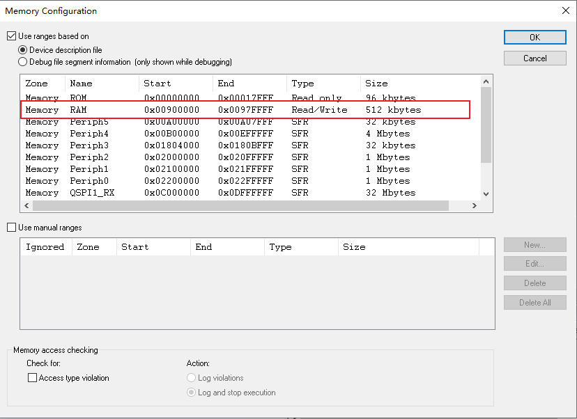
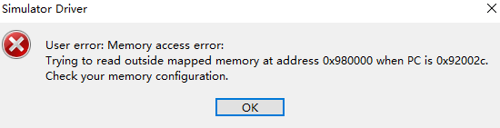
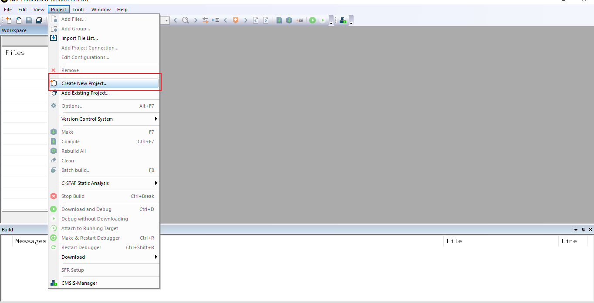
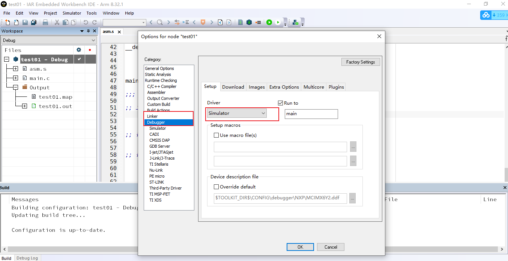
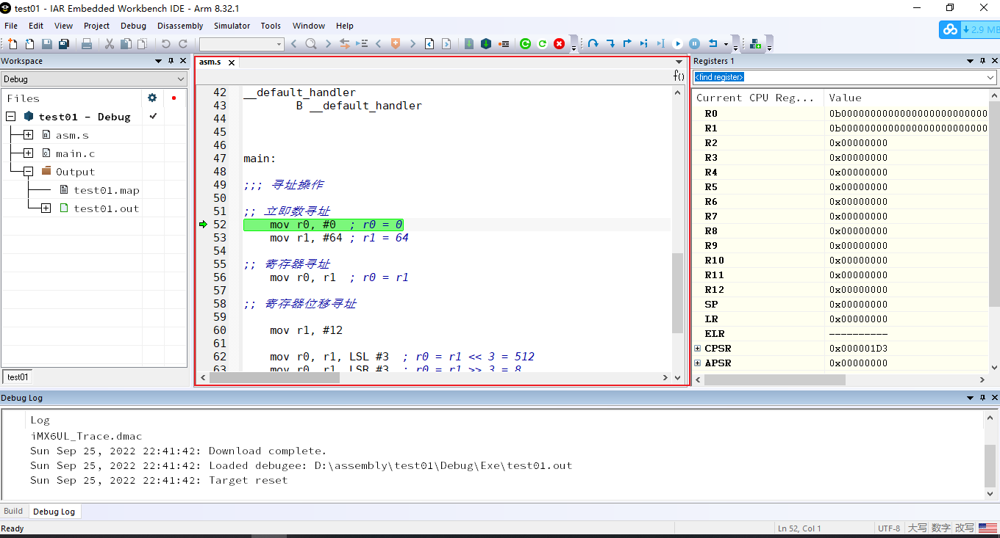

# Arm笔记


## 体系结构

参考文件

[arm指令手册1](./source/arm%E6%8C%87%E4%BB%A4%E6%89%8B%E5%86%8C1.pdf)
[arm指令手册2](./source/arm%E6%8C%87%E4%BB%A4%E6%89%8B%E5%86%8C2.pdf)
[arm指令手册3](./source/arm%E6%8C%87%E4%BB%A4%E6%89%8B%E5%86%8C3.pdf)

### 相关术语

+ 流水线
+ DSP
+ Jazelle
+ ThumbEE
+ Thumb-2
+ TrustZone
+ VFP
+ NEON
+ LAPE
+ big.LITTLE

### 工具链

| 文件名    | 详解                         |
| --------- | ---------------------------- |
| addr2line | 把程序地址转化为文件名和行号 |
| ar        | 建立、修改和提取归档文件     |
| as        | 汇编编译器                   |
| ld        | 链接器                       |
| nm        | 列出文件的符号               |
| objcopy   | 文件个数格式转换             |
| objdump   | 反汇编                       |
| ranlib    | 产生索引,并且保存进入文件中  |
| readelf   | 显示elf文件信息              |
| size      | 列出文件大小                 |
| string    | 打印文件可打印字符串         |
| strip     | 丢弃文件符号                 |

交叉工具链测试

```shell
arm-none-eabi-addr2line      arm-none-eabi-gdb          
arm-none-eabi-ar             arm-none-eabi-gdb-add-index
arm-none-eabi-as             arm-none-eabi-gfortran     
arm-none-eabi-c++            arm-none-eabi-gprof        
arm-none-eabi-c++filt        arm-none-eabi-ld           
arm-none-eabi-cpp            arm-none-eabi-ld.bfd       
arm-none-eabi-dwp            arm-none-eabi-ld.gold      
arm-none-eabi-elfedit        arm-none-eabi-lto-dump     
arm-none-eabi-g++            arm-none-eabi-nm           
arm-none-eabi-gcc            arm-none-eabi-objcopy      
arm-none-eabi-gcc-10.2.1     arm-none-eabi-objdump      
arm-none-eabi-gcc-ar         arm-none-eabi-ranlib       
arm-none-eabi-gcc-nm         arm-none-eabi-readelf      
arm-none-eabi-gcc-ranlib     arm-none-eabi-size         
arm-none-eabi-gcov           arm-none-eabi-strings      
arm-none-eabi-gcov-dump      arm-none-eabi-strip        
arm-none-eabi-gcov-tool
```

### ARMv7处理器模式

| 模式             | 编码  | 功能                          | 安全       | 优先级 |
| ---------------- | ----- | ----------------------------- | ---------- | ------ |
| User (USR)       | 10000 | 大多数运行的非特权模式        | Both       | PL0    |
| FIQ              | 10001 | FIQ中断                       | Both       | PL1    |
| IRQ              | 10010 | IRQ中断                       | Both       | PL1    |
| Supervisor (SVC) | 10011 | 设备重启或者SVC指令           | Both       | PL1    |
| Monitor (MON)    | 10110 | 安全扩展实现                  | only       | PL1    |
| Abort (ABT)      | 10111 | 内存权限异常                  | Both       | PL1    |
| Hyp (HYP)        | 11010 | 虚拟化扩展实现.               | Non-secure | PL2    |
| Undef (UND)      | 11011 | 未定义指令调用                | Both       | PL1    |
| System (SYS)     | 11111 | 特权模式,与用户模式共享寄存器 | Both       | PL1    |

不同的处理器模式上寄存器共享的情况


### 指令条件码

指令条件码由`CPSR/SPSR`同时确定




## 寻址方式

+ 立即数寻址
+ 寄存器寻址
+ 寄存器间接寻址
+ 寄存器偏移寻址
+ 寄存器基址变址寻址
+ 批量寄存器寻址
+ 相对寻址
+ 堆栈寻址
+ 块拷贝寻址

### 立即数寻址

立即数为操作数,其中立即数前面加上`#`

```asm
    ;; 立即数寻址
	mov r0, #0	; r0 = 0
	mov r1, #64	; r1 = 64
```

### 寄存器寻址

### 寄存器偏移寻址

寄存器寻址就是直接将寄存器中的数值作为操作数

| 指令 | 作用 |
| ---- | ----|
| LSL | Logical Shift Left by 1-31 bits.|
| LSR | Logical Shift Right by 1-32 bits. |
| ASR | Arithmetic Shift Right by 1-32 bits. |
| ROR | Rotate Right by 1-31 bits.|
| RRX | Rotate Right with Extend. |

```asm
    mov r0, r1	; r0 = r1

	mov r1, #12         ; r1 = 12;
	mov r0, r1, LSL #3	; r0 = r1 << 3 = 512
	mov r0, r1, LSR #3  ; r0 = r1 >> 3 = 8
	mov r0, r1, ASR #3  ; r0 = r1 >> 3 = 8 		不改写符号位
	mov r0, r1, ROR #3	; r1 = 0x80000001
	mov r0, r1, RRX  	; r0 = r1 >> 1 | 空位 = C
```

### 寄存器间接寻址

获取内存地址中的数据,需要使用`LDR/STR`操作符;

首先确定,RAM的地址范围;

打开`simulator->Memory Configuration`



可以得到RAM的地址0x00900000 --> 0x0097FFFF,

```asm
ldr r0, =0x123		;; r0 = 0x123
ldr r1, =0x900000	;; r1 = 0x900000
str r0, [r1]		;; *((unsigned long *)r1) = r0;
mov r0, 0			;; r0 = 0
ldr r0, [r1]		;; r0 = *((unsigned long *)r1)
```

但是此时只能得到一些奇怪的数据,那如何确定程序是运行正常的?

```assembly
;; 读取异常地址,看看是否会崩溃
;; 如果获取一个异常的地址,
;; 看看会发生什么?
ldr r1, =0x00980000
ldr r0, [r1]
```

程序立即崩溃, 我们的测试是正确的;




### 寄存器基址变址寻址

```assembly
LDR    R0,	[R1,#0X0F] ;; R0 = *(unsigned long *)(R1 + 0x0f)
LDR    R0,	[R1],#4	   ;; R0 = *(unsigned long *)(R1 + 0x04)
LDR    R0,	[R1,R2]	   ;; R0 = *(unsigned long *)(R1 + R2)
```

### 批量寄存器寻址

批量寻址来自于批量操作符`STM/LDM`,

```assembly
LDMIA    R0,{R1,R2,R3,R4}
STMIA    R0,{R3-R5,R10}
```

### 堆栈寻址

```assembly
LDMFD    SP!,{R1-R7,LR}
STMFD    SP!,{R1-R7,LR}
```

## 指令集

### 跳转指令

> 跳转指令可以向前后32M地址跳转
> 跳转为24位长有符号数据

+ B: 绝对跳转
+ BL: 带返回的跳转 
+ BLX: 带返回和状态切换的跳转
+ BX: 状态切换的跳转

B(跳转) 
L(设置链接寄存器)
X(切换arm/thumb状态)

跳转指令的详细解释:
add pc, pc, #跳转地址

```assembly
;; 跳转指令
	B label_jump_B
label_jump_B:
	mov pc, lr

;; 但是此时编译会报错,需要状态切换
BX label_jump_BX
	label_jump_BX:

	BL label_jump_BL
label_jump_BL:
	
	BLX label_jump_BLX
label_jump_BLX:
```
### 数据处理指令

#### 数据传送指令

+ mov: 直接传送 
+ mvn: 取反码传送

```assembly
	mov r0, #12 ;; R0 = 0x0000000C
	mvn r1, #12 ;; R1 = 0xFFFFFFF3
```

#### 比较指令

+ cmp
+ cmn
+ tst
+ teq

```assembly
	cmp r0, r1 ;; r0 - r1 ==> NZCV
	cmn r0, r1 ;; r0 + r1 ==> NZCV
	tst r0, r1 ;; r0 & r1 ==> NZCV
```

比较指令会影响到NZCV标志

N -> Negative 负数
Z -> Zero     零
C -> Carry    进位
V -> oVerflow 溢出

#### 加减法

+ add
+ sub
+ rsb
+ adc
+ sbc
+ rsc

```assembly

```

#### 逻辑运算

+ and
+ bic
+ eor
+ orr

```assembly

```

### 乘法指令

+ mul
+ mla
+ smull
+ umull
+ umlal

### 杂项算数指令

+ clz

### 状态寄存器

+ mrs: 状态寄存器到通用寄存器
+ msr: 通用寄存器到状态寄存器

### 内存操作指令

+ ldr/str
+ ldm/stm

### 信号量操作指令

> 原子操作指令

+ swp
+ swpb

### 异常与中端指令

+ swi
+ bkpt

### 协处理器指令

+ cdp
+ ldc
+ stc

+ mcr
+ mrc

### NEON指令

> 16个NEON寄存器(128bit), Q0-Q15(同时也可以被视为32个64bit的寄存器,D0-D31)

### VFP指令

+ 16个VFP寄存器(32bit),S0-S15

## 伪指令

### 启动符号

#### IAR

```assembly
	SECTION .intvec:CODE:NOROOT (2)
	END
```

但是此时是无法进行编译的

#### GCC

```assembly
.global _start
_start:      @汇编入口
loop:
	B loop
.end         @汇编程序结束
```

### 符号定义

#### IAR

#### GCC

### 数据定义

#### IAR

#### GCC

### 汇编控制

#### IAR

#### GCC

### 段定义

#### IAR

#### GCC

### 杂项指令

| GCC      | armasm         | 描述信息                       	 |
| -------- | -------------- | --------------------------------- |
| @        | ;              | Comment                           |
| #&       | #0x            | An immediate hex value            |
| .if      | IFDEF, IF      | 条件编译                           |
| .else    | ELSE           |                                   |
| .elseif  | ELSEIF         |                                   |
| .endif   | ENDIF          |                                   |
| .ltorg   | LTORG          |                                   |
| `|`      | :OR:           | OR                                |
| &        | :AND:          | AND                               |
| <<       | :SHL:          | Shift Left                        |
| >>       | :SHR:          | Shift Right                       |
| .macro   | MACRO          | Start macro definition            |
| .endm    | ENDM           | End macro definition              |
| .include | INCLUDE        | GNU Assembler requires “filename” |
| .word    | DCD            | A data word                       |
| .short   | DCW            |                                   |
| .long    | DCD            |                                   |
| .byte    | DCB            |                                   |
| .req     | RN             |                                   |
| .global  | IMPORT, EXPORT |                                   |
| .equ     | EQU            |                                   |

## 程序设计

### 条件语句

### 循环语句

### 函数定义

## 混合编程

### C与汇编

### C与thumb

## 存储系统

### MMU

### cache

## 仿真工具

### IAR仿真设置

新建工程



设置仿真



构建仿真



### eclipse仿真设置

+ arm-none-eabi-gcc: 编译器
+ openocd: 调试器
+ qemu: 仿真器
