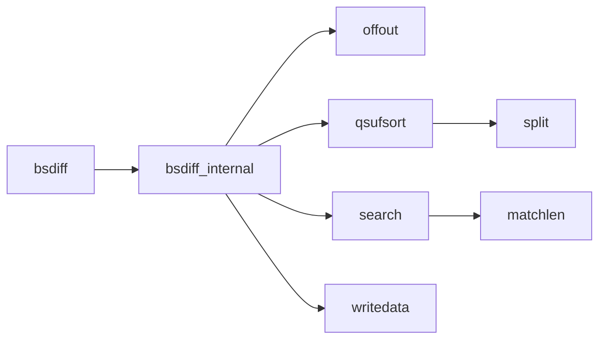
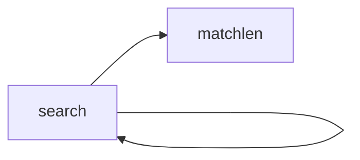
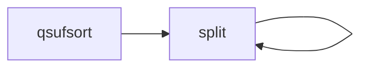

# Bsdiff


## 引言

> bsdiff and bspatch are tools for building and applying patches to binary files. By using suffix >  sorting (specifically, Larsson and Sadakane's qsufsort) and taking advantage of how
> executable files change, bsdiff routinely produces binary patches 50-80% smaller than
> those produced by Xdelta, and 15% smaller than those produced by .RTPatch (a $2750/seat
> commercial patch tool) -- 直接摘抄自官网

详情可以查看[bsdiff官网](http://www.daemonology.net/bsdiff/),存在这个详细描述.

bsdiff基本原理：

1. 存在差异的数据: diff
2. 不存在的数据: extra

最后生成的文件 = diff + extra;

## 测试
新建立两个文件`old.c`与`new.c`,二者的差别是
```c
// new.c
#include <stdio.h>
int main(void)
{
	printf("Hello World\r\n");
	return 0;
}

// old.c
#include <stdio.h>
int main(void)
{
	return 0;
}
```

测试的情况
```shell
# 执行编译
gcc old.c -o old && ./old
gcc new.c -o new && ./new
```

计算md5
```shell
md5sum old
# d08fd167e74f279522fe8aa64d8e27dd  old

md5sum new
# b0b4be993de61064a118d32a692bf795  new

md5sum mid
# b0b4be993de61064a118d32a692bf795  mid
```

生成补丁并且测试

```shell
# 生成diff
bsdiff  old new  test.diff

# 打入补丁-->mid
bspatch old mid test.diff
```

## 原理

> 后缀数组实现

### 后缀数组定义

### 后缀数组计算

> 倍增法和桶排序

1. 倍增法的时间复杂度是O(NlogN)的,程序简单,算法过程易于理解.
2. 桶排序时间复杂度是O(N),数据量大的时候,效率比倍增算法有显著提升,但是缺点在于DC3算法原理较难理解,代码冗长.

## 补丁文件

bsdiff更新数据由四部分组成:Header,ctrl block,diff block,extra block
+ Header描述了文件基本信息
+ ctrl 包含了ADD和INSERT指令的控制文件
	+ 每一个ADD指令指定了旧文件中的偏移位置和长度，从旧文件中读取相应数量的字节内容并且从差异文件中读取相同字节的内容添加进去。
	+ INSERT指令仅仅制定一个长度，用于从额外文件中读取指定数量的字节内容
+ diff 含了概率匹配中不同字节内容的差异文件
+ extra 包含了不属于概略匹配中内容的额外的文件

| start/bytes | length/bytes | content                  |
| ----------- | ------------ | ------------------------ |
| 0           | 8            | "BSDIFF40"               |
| 8           | 8            | the length of ctrl block |
| 16          | 8            | the length of diff block |
| 24          | 8            | 新文件的大小             |


1. BSDIFF40
2. 0x93   	-->     147
3. 0x313 	-->      787
4. 0x3ED0  -->     16080 可以匹配新生成的文件

## 生成补丁

+ [bsdiff](#生成补丁)
+ [bspatch](#打入补丁)

### 数据结构

```c
struct bsdiff_stream
{
	void* opaque;								/* bzip文件 */
	void* (*malloc)(size_t size);				/* 内存申请接口 */
	void (*free)(void* ptr);					/* 内存释放接口 */
	int (*write)(struct bsdiff_stream* stream,  /* 写文件接口 */
                 const void* buffer, int size);
};

struct bsdiff_request
{
	const uint8_t* old;
	int64_t oldsize;
	const uint8_t* new;
	int64_t newsize;
	struct bsdiff_stream* stream;
	int64_t *I;
	uint8_t *buffer;
};
```

### 接口分析

#### 函数执行


#### 代码分析

```c
int bsdiff(const uint8_t* old, int64_t oldsize, const uint8_t* new, int64_t newsize, struct bsdiff_stream* stream)
{
	int result;
	struct bsdiff_request req;

	if((req.I=stream->malloc((oldsize+1)*sizeof(int64_t)))==NULL)
		return -1;

	if((req.buffer=stream->malloc(newsize+1))==NULL)
	{
		stream->free(req.I);
		return -1;
	}

	req.old = old;
	req.oldsize = oldsize;
	req.new = new;
	req.newsize = newsize;
	req.stream = stream;

	result = bsdiff_internal(req);

	stream->free(req.buffer);
	stream->free(req.I);

	return result;
}
```

此处的代码只能

### 核心处理

#### 函数执行



#### 代码分析

```c
static int bsdiff_internal(const struct bsdiff_request req)
{
	int64_t *I,*V;
	int64_t scan,pos,len;
	int64_t lastscan,lastpos,lastoffset;
	int64_t oldscore,scsc;
	int64_t s,Sf,lenf,Sb,lenb;
	int64_t overlap,Ss,lens;
	int64_t i;
	uint8_t *buffer;
	uint8_t buf[8 * 3];

	if((V=req.stream->malloc((req.oldsize+1)*sizeof(int64_t)))==NULL) return -1;
	I = req.I;

	qsufsort(I, V, req.old, req.oldsize);
	req.stream->free(V);

	buffer = req.buffer;

	/* Compute the differences, writing ctrl as we go */
	scan=0;len=0;pos=0;
	lastscan=0;lastpos=0;lastoffset=0;
	while(scan<req.newsize) {
		oldscore=0;

		for(scsc=scan+=len;scan<req.newsize;scan++) {
			len=search(I,req.old,req.oldsize,req.new+scan,req.newsize-scan,
					0,req.oldsize,&pos);

			for(;scsc<scan+len;scsc++)
			if((scsc+lastoffset<req.oldsize) &&
				(req.old[scsc+lastoffset] == req.new[scsc]))
				oldscore++;

			if(((len==oldscore) && (len!=0)) ||
				(len>oldscore+8)) break;

			if((scan+lastoffset<req.oldsize) &&
				(req.old[scan+lastoffset] == req.new[scan]))
				oldscore--;
		};

		if((len!=oldscore) || (scan==req.newsize)) {
			s=0;Sf=0;lenf=0;
			for(i=0;(lastscan+i<scan)&&(lastpos+i<req.oldsize);) {
				if(req.old[lastpos+i]==req.new[lastscan+i]) s++;
				i++;
				if(s*2-i>Sf*2-lenf) { Sf=s; lenf=i; };
			};

			lenb=0;
			if(scan<req.newsize) {
				s=0;Sb=0;
				for(i=1;(scan>=lastscan+i)&&(pos>=i);i++) {
					if(req.old[pos-i]==req.new[scan-i]) s++;
					if(s*2-i>Sb*2-lenb) { Sb=s; lenb=i; };
				};
			};

			if(lastscan+lenf>scan-lenb) {
				overlap=(lastscan+lenf)-(scan-lenb);
				s=0;Ss=0;lens=0;
				for(i=0;i<overlap;i++) {
					if(req.new[lastscan+lenf-overlap+i]==
					   req.old[lastpos+lenf-overlap+i]) s++;
					if(req.new[scan-lenb+i]==
					   req.old[pos-lenb+i]) s--;
					if(s>Ss) { Ss=s; lens=i+1; };
				};

				lenf+=lens-overlap;
				lenb-=lens;
			};

			offtout(lenf,buf);
			offtout((scan-lenb)-(lastscan+lenf),buf+8);
			offtout((pos-lenb)-(lastpos+lenf),buf+16);

			/* Write control data */
			if (writedata(req.stream, buf, sizeof(buf)))
				return -1;

			/* Write diff data */
			for(i=0;i<lenf;i++)
				buffer[i]=req.new[lastscan+i]-req.old[lastpos+i];
			if (writedata(req.stream, buffer, lenf))
				return -1;

			/* Write extra data */
			for(i=0;i<(scan-lenb)-(lastscan+lenf);i++)
				buffer[i]=req.new[lastscan+lenf+i];
			if (writedata(req.stream, buffer, (scan-lenb)-(lastscan+lenf)))
				return -1;

			lastscan=scan-lenb;
			lastpos=pos-lenb;
			lastoffset=pos-scan;
		};
	};

	return 0;
}
```

### 偏移转缓存

+ [偏移转缓存](#偏移转缓存)
+ [缓存转偏移](#缓存转偏移)

```c
static void offtout(int64_t x, uint8_t *buf)
{
	int64_t y;

	if(x<0) y=-x; else y=x;

	buf[0]=y%256;y-=buf[0];
	y=y/256;buf[1]=y%256;y-=buf[1];
	y=y/256;buf[2]=y%256;y-=buf[2];
	y=y/256;buf[3]=y%256;y-=buf[3];
	y=y/256;buf[4]=y%256;y-=buf[4];
	y=y/256;buf[5]=y%256;y-=buf[5];
	y=y/256;buf[6]=y%256;y-=buf[6];
	y=y/256;buf[7]=y%256;

	if(x<0) buf[7]|=0x80;
}
```


### 搜索

#### 函数执行



#### 代码分析

```c
static int64_t matchlen(const uint8_t *old,int64_t oldsize,const uint8_t *new,int64_t newsize)
{
	int64_t i;

	for(i=0;(i<oldsize)&&(i<newsize);i++)
		if(old[i]!=new[i]) break;

	return i;
}

static int64_t search(const int64_t *I,const uint8_t *old,int64_t oldsize,
		const uint8_t *new,int64_t newsize,int64_t st,int64_t en,int64_t *pos)
{
	int64_t x,y;

	if(en-st<2) {
		x=matchlen(old+I[st],oldsize-I[st],new,newsize);
		y=matchlen(old+I[en],oldsize-I[en],new,newsize);

		if(x>y) {
			*pos=I[st];
			return x;
		} else {
			*pos=I[en];
			return y;
		}
	};

	x=st+(en-st)/2;
	if(memcmp(old+I[x],new,MIN(oldsize-I[x],newsize))<0) {
		return search(I,old,oldsize,new,newsize,x,en,pos);
	} else {
		return search(I,old,oldsize,new,newsize,st,x,pos);
	};
}
```

### 排序

#### 函数执行



#### 代码分析

```c
static void split(int64_t *I,int64_t *V,int64_t start,int64_t len,int64_t h)
{
	int64_t i,j,k,x,tmp,jj,kk;

	if(len<16) {
		for(k=start;k<start+len;k+=j) {
			j=1;x=V[I[k]+h];
			for(i=1;k+i<start+len;i++) {
				if(V[I[k+i]+h]<x) {
					x=V[I[k+i]+h];
					j=0;
				};
				if(V[I[k+i]+h]==x) {
					tmp=I[k+j];I[k+j]=I[k+i];I[k+i]=tmp;
					j++;
				};
			};
			for(i=0;i<j;i++) V[I[k+i]]=k+j-1;
			if(j==1) I[k]=-1;
		};
		return;
	};

	x=V[I[start+len/2]+h];
	jj=0;kk=0;
	for(i=start;i<start+len;i++) {
		if(V[I[i]+h]<x) jj++;
		if(V[I[i]+h]==x) kk++;
	};
	jj+=start;kk+=jj;

	i=start;j=0;k=0;
	while(i<jj) {
		if(V[I[i]+h]<x) {
			i++;
		} else if(V[I[i]+h]==x) {
			tmp=I[i];I[i]=I[jj+j];I[jj+j]=tmp;
			j++;
		} else {
			tmp=I[i];I[i]=I[kk+k];I[kk+k]=tmp;
			k++;
		};
	};

	while(jj+j<kk) {
		if(V[I[jj+j]+h]==x) {
			j++;
		} else {
			tmp=I[jj+j];I[jj+j]=I[kk+k];I[kk+k]=tmp;
			k++;
		};
	};

	if(jj>start) split(I,V,start,jj-start,h);

	for(i=0;i<kk-jj;i++) V[I[jj+i]]=kk-1;
	if(jj==kk-1) I[jj]=-1;

	if(start+len>kk) split(I,V,kk,start+len-kk,h);
}

static void qsufsort(int64_t *I, const uint8_t *old, int64_t oldsize)
{
	int64_t buckets[256];
	int64_t i,h,len;
	int64_t *V;

	if ((V = req.stream->malloc((req.oldsize+1) * sizeof(int64_t))) == NULL) {
		return -1;
	}

	for (i=0; i<256; i++) {
		buckets[i]=0;
	}

	for(i=0;i<oldsize;i++) buckets[old[i]]++;
	for(i=1;i<256;i++) buckets[i]+=buckets[i-1];
	for(i=255;i>0;i--) buckets[i]=buckets[i-1];
	buckets[0]=0;

	for(i=0;i<oldsize;i++) I[++buckets[old[i]]]=i;
	I[0]=oldsize;
	for(i=0;i<oldsize;i++) V[i]=buckets[old[i]];
	V[oldsize]=0;
	for(i=1;i<256;i++) if(buckets[i]==buckets[i-1]+1) I[buckets[i]]=-1;
	I[0]=-1;

	for(h=1;I[0]!=-(oldsize+1);h+=h) {
		len=0;
		for(i=0;i<oldsize+1;) {
			if(I[i]<0) {
				len-=I[i];
				i-=I[i];
			} else {
				if(len) I[i-len]=-len;
				len=V[I[i]]+1-i;
				split(I,V,i,len,h);
				i+=len;
				len=0;
			};
		};
		if(len) I[i-len]=-len;
	};

	for(i=0;i<oldsize+1;i++) I[V[i]]=i;

	free(V);
}
```

### 保存文件

> 简要写法 </br>
> 主要的操作就是将buffer直接写到文件中

```c
static int64_t writedata(struct bsdiff_stream* stream, const void* buffer, int64_t length)
{
	const int writeresult = stream->write(stream, buffer, length);
	return writeresult;
}
```

> 原始写法 </br>
> 为了保证大小不超过API的大小

```c
static int64_t writedata(struct bsdiff_stream* stream, const void* buffer, int64_t length)
{
	int64_t result = 0;

	while (length > 0)
	{
		const int smallsize = (int)MIN(length, INT_MAX);
		const int writeresult = stream->write(stream, buffer, smallsize);
		if (writeresult == -1)
		{
			return -1;
		}

		result += writeresult;
		length -= smallsize;
		buffer = (uint8_t*)buffer + smallsize;
	}

	return result;
}
```

## 打入补丁

+ [bsdiff](#生成补丁)
+ [bspatch](#打入补丁)

### 缓存转偏移

+ [偏移转缓存](#偏移转缓存)
+ [缓存转偏移](#缓存转偏移)

```c
/* 一般情况下,buf的长度为8个字节 */
static int64_t offtin(uint8_t *buf)
{
	int64_t y;

	y=buf[7]&0x7F; 		/* 提取绝对值 */

	y=y*256;y+=buf[6];
	y=y*256;y+=buf[5];
	y=y*256;y+=buf[4];
	y=y*256;y+=buf[3];
	y=y*256;y+=buf[2];
	y=y*256;y+=buf[1];
	y=y*256;y+=buf[0];

    /* 根据最高位置确定正负 */
	if (buf[7] & 0x80) {
        y=-y;
    }

	return y;
}
```

### 核心功能

#### 执行路线


#### 代码分析

```c
int bspatch(const uint8_t* old, int64_t oldsize,
            uint8_t* new, int64_t newsize,
            struct bspatch_stream* stream)
{
	uint8_t buf[8];
	int64_t oldpos;
    int64_t newpos;
	int64_t ctrl[3];
	int64_t i;

	oldpos=0;
    newpos=0;
	while (newpos < newsize) {
		/* Read control data 3*8个为一组,每次生成3个控制数据 */
		for(i=0;i<=2;i++) {
			if (stream->read(stream, buf, 8))
				return -1;
			ctrl[i]=offtin(buf);
		};

		/* 健壮性检查 */
		if (ctrl[0]<0 || ctrl[0]>INT_MAX ||
			ctrl[1]<0 || ctrl[1]>INT_MAX ||
			newpos+ctrl[0]>newsize)
			return -1;

		/* Read diff string */
		if (stream->read(stream, new + newpos, ctrl[0]))
			return -1;

		/* Add old data to diff string */
		for(i=0;i<ctrl[0];i++)
			if((oldpos+i>=0) && (oldpos+i<oldsize))
				new[newpos+i]+=old[oldpos+i];

		/* Adjust pointers */
		newpos+=ctrl[0];
		oldpos+=ctrl[0];

		/* Sanity-check */
		if(newpos+ctrl[1]>newsize)
			return -1;

		/* Read extra string */
		if (stream->read(stream, new + newpos, ctrl[1]))
			return -1;

		/* Adjust pointers */
		newpos+=ctrl[1];
		oldpos+=ctrl[2];
	};

	return 0;
}
```
