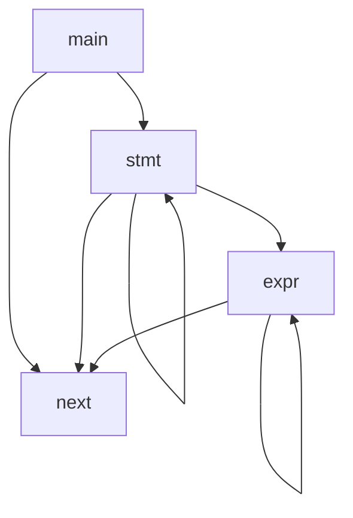

# C4


## C4实现

C4共实现了4个函数

```c
void stmt();
void next();
void expr(int lev);
int main(int argc, char **argv);
```
### 全局数据

#### 全局变量

```c
char *p, *lp, // current position in source code
     *data;   // data/bss pointer

int *e, *le,  // current position in emitted code
    *id,      // currently parsed identifier
    *sym,     // symbol table (simple list of identifiers)
    tk,       // current token
    ival,     // current token value
    ty,       // current expression type
    loc,      // local variable offset
    line,     // current line number
    src,      // print source and assembly flag
    debug;    // print executed instructions
```

#### 表达式描述

```c
// 符号描述
enum {
  Num = 128, Fun, Sys, Glo, Loc, Id,
  Char, Else, Enum, If, Int, Return, Sizeof, While,
  Assign, Cond, Lor, Lan, Or, Xor, And, Eq, Ne, Lt, Gt, Le, Ge, Shl, Shr, Add, Sub, Mul, Div, Mod, Inc, Dec, Brak
};

// 操作符
enum 
{ 
	LEA ,
	IMM ,
	JMP ,
	JSR ,
	BZ  ,
	BNZ ,
	ENT ,
	ADJ ,
	LEV ,
	LI  ,
	LC  ,
	SI  ,
	SC  ,
	PSH ,
    OR  ,
	XOR ,
	AND ,
	EQ  ,
	NE  ,
	LT  ,
	GT  ,
	LE  ,
	GE  ,
	SHL ,
	SHR ,
	ADD ,
	SUB ,
	MUL ,
	DIV ,
	MOD ,
    OPEN,
	READ,
	CLOS,
	PRTF,
	MALC,
	FREE,
	MSET,
	MCMP,
	EXIT 
};

// 类型描述
enum 
{ 
	CHAR, 
	INT,
	PTR 
};

// 表达式描述
enum 
{ 
	Tk,
	Hash, 
	Name, 
	Class, 
	Type, 
	Val, 
	HClass, 
	HType, 
	HVal, 
	Idsz 
};
```

### 基本架构



## 词法分析(next)
> 提取下一个单词
```c

tk,       // current token
ival,     // current token value

```

## parse

## code generator

## stack based virtual machine

+ pc 
+ sp
+ bp

```c
  while (1) {
    i = *pc++; ++cycle;
    if      (i == LEA) a = (int)(bp + *pc++);                             // load local address
    else if (i == IMM) a = *pc++;                                         // load global address or immediate
    else if (i == JMP) pc = (int *)*pc;                                   // jump
    else if (i == JSR) { *--sp = (int)(pc + 1); pc = (int *)*pc; }        // jump to subroutine
    else if (i == BZ)  pc = a ? pc + 1 : (int *)*pc;                      // branch if zero
    else if (i == BNZ) pc = a ? (int *)*pc : pc + 1;                      // branch if not zero
    else if (i == ENT) { *--sp = (int)bp; bp = sp; sp = sp - *pc++; }     // enter subroutine
    else if (i == ADJ) sp = sp + *pc++;                                   // stack adjust
    else if (i == LEV) { sp = bp; bp = (int *)*sp++; pc = (int *)*sp++; } // leave subroutine
    else if (i == LI)  a = *(int *)a;                                     // load int
    else if (i == LC)  a = *(char *)a;                                    // load char
    else if (i == SI)  *(int *)*sp++ = a;                                 // store int
    else if (i == SC)  a = *(char *)*sp++ = a;                            // store char
    else if (i == PSH) *--sp = a;                                         // push

    else if (i == OR)  a = *sp++ |  a;
    else if (i == XOR) a = *sp++ ^  a;
    else if (i == AND) a = *sp++ &  a;
    else if (i == EQ)  a = *sp++ == a;
    else if (i == NE)  a = *sp++ != a;
    else if (i == LT)  a = *sp++ <  a;
    else if (i == GT)  a = *sp++ >  a;
    else if (i == LE)  a = *sp++ <= a;
    else if (i == GE)  a = *sp++ >= a;
    else if (i == SHL) a = *sp++ << a;
    else if (i == SHR) a = *sp++ >> a;
    else if (i == ADD) a = *sp++ +  a;
    else if (i == SUB) a = *sp++ -  a;
    else if (i == MUL) a = *sp++ *  a;
    else if (i == DIV) a = *sp++ /  a;
    else if (i == MOD) a = *sp++ %  a;

    else if (i == OPEN) a = open((char *)sp[1], *sp);
    else if (i == READ) a = read(sp[2], (char *)sp[1], *sp);
    else if (i == CLOS) a = close(*sp);
    else if (i == PRTF) { t = sp + pc[1]; a = printf((char *)t[-1], t[-2], t[-3], t[-4], t[-5], t[-6]); }
    else if (i == MALC) a = (int)malloc(*sp);
    else if (i == FREE) free((void *)*sp);
    else if (i == MSET) a = (int)memset((char *)sp[2], sp[1], *sp);
    else if (i == MCMP) a = memcmp((char *)sp[2], (char *)sp[1], *sp);
    else if (i == EXIT) { printf("exit(%d) cycle = %d\n", *sp, cycle); return *sp; }
    else { printf("unknown instruction = %d! cycle = %d\n", i, cycle); return -1; }
  }
```
