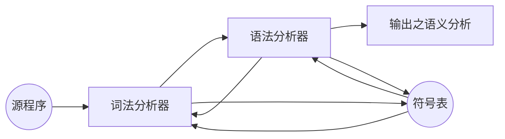
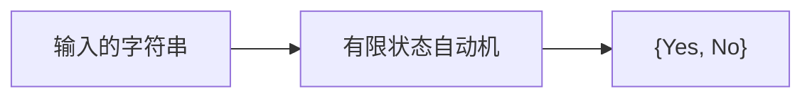
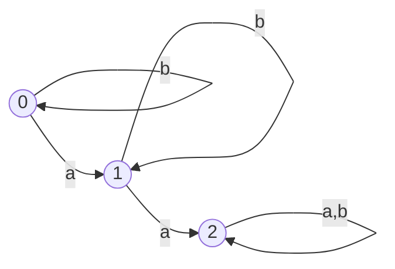
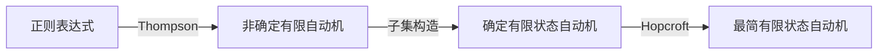
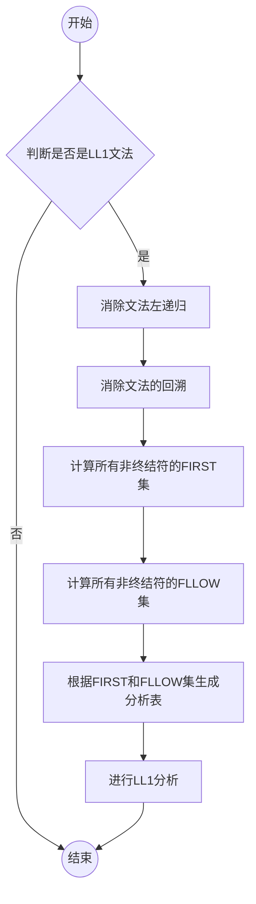

# 编译原理笔记


## 词法分析
### 概述
>词法分析是编译原理的第一个阶段,词法分析的任务是读入源程序的输入字符,生成一个个的单词,其主要的功能是为语法分析提供词法单元



### 正则表达式

+ 对于给定的正则表达式 $\Sigma$={c1, c2, c3...cn}
+ 归纳定义:
  + 对于空串是正则表达式$\epsilon$是正则表达式
  + 对于任何$c\in\Sigma$,$c$是正则表达式
  + 如果M和N都是正则表达式,那么下面的也是正则表达式
    + 选择: M | N = {M, N}
    + 连接: MN = {mn| m $\in$ M, n, $\in$ M }
    + 闭包: M* = { $\epsilon$ , M, MM, MMMM....}

#### flex正则表达式
> 使用flex学习正则表达式

Flex由三部分组成
```text
定义部分
%%
规则部分
%%
用户附加的C语言部分
```

```c
%%
[+-]?[0-9]+ { /* Print integers */
  printf("%s\n", yytext);
}

\n { /* newline */
}

. { /* For others, do nothing */
}
%%

void main(){
    yylex();
}

int yywrap(){
    return 1;
}
```

编译指令

```shell
#!/bin/sh

# 生成c源程序
flex lex.l

# 执行程序编译
gcc lex.yy.c
```

### 有限状态自动机(FA)



#### 数学描述
M = ($\Epsilon$, $S$, $q0$, $F$, $\delta$)
+ $\Epsilon$ 字母表
+ $S$ 状态集
+ $q0$ 初始状态
+ $F$ 终止状态
+ $\delta$ 转移函数

#### 例子
+ 下面什么样子的串可以接受

+ 转移函数
  + ($q0$, a) --> $q1$, ($q0$, b) --> $q0$,
  + ($q1$, a) --> $q2$, ($q1$, b) --> $q1$,
  + ($q2$, a) --> $q2$, ($q2$, b) --> $q2$,

### 自动生成


#### Thompson算法

##### 解释
+ 基于RE的结构进行归纳
  + 对基本的RE进行直接构造
  + 对于复合的RE进行递归构造
+ 递归,容易实现
  + 代码实现较少

##### 例子
$a(b|c)*$

#### 子集构造算法

#### Hopcroft算法

##  语法分析

编译原理中的语法分析是编译过程中的关键阶段，其核心任务是根据词法分析生成的词法单元序列，验证输入是否符合源语言的语法规则，并构建语法结构（如抽象语法树）。以下是语法分析的总结：

---

### ** 核心任务**
- **验证语法正确性**：检查词法单元序列是否符合文法规则。
- **构建语法结构**：生成**语法树**（Parse Tree）或**抽象语法树**（Abstract Syntax Tree, AST）。
- **错误处理**：检测并报告语法错误（如括号不匹配、语句结构错误）。

---

### ** 文法与语法规则**
- **上下文无关文法（CFG, Context-Free Grammar）**：语法分析的理论基础。
  - 四元组：\( G = (N, T, P, S) \)
    - \( N \)：非终结符集合（如表达式、语句）。
    - \( T \)：终结符集合（如关键字、运算符）。
    - \( P \)：产生式集合（如 \( E \rightarrow E + T \)）。
    - \( S \)：开始符号。
- **二义性文法**：需避免或通过优先级/结合性规则解决。

---

### ** 语法分析方法**
#### **(1) 自顶向下分析（Top-Down Parsing）**
- **递归下降分析**：手工编写递归函数，适合简单文法。
- **LL(k) 分析**：
  - 从左向右扫描输入，最左推导（Leftmost Derivation）。
  - 需要构造预测分析表（基于 `FIRST` 和 `FOLLOW` 集）。
  - 限制：无法处理左递归文法。
  - **LL(1)**：最常用，向前看 1 个符号。

#### **(2) 自底向上分析（Bottom-Up Parsing）**
- **LR 分析**：
  - 从左向右扫描输入，最右推导的逆（Rightmost Derivation）。
  - 核心是构造状态机和动作表（移进、归约、接受、报错）。
  - 类型：
    - **LR(0)**：基础版本，但能力有限。
    - **SLR(1)**：简化版，基于 `FOLLOW` 集解决冲突。
    - **LR(1)**：更强大但复杂。
    - **LALR(1)**：平衡能力与复杂度（如 Yacc/Bison 使用）。
- **算符优先分析**：适用于表达式解析，基于运算符优先级和结合性。

---

### ** 关键算法与工具**
- **FIRST 和 FOLLOW 集合**：用于 LL 分析表构造。
- **LR 自动机构造**：基于闭包（Closure）和转移（Goto）操作。
- **工具**：
  - **ANTLR**：生成 LL(\*) 分析器。
  - **Yacc/Bison**：生成 LALR(1) 分析器。
  - **递归下降手写解析器**：灵活但需处理左递归和冲突。

---

### ** 错误恢复策略**
- **恐慌模式**：跳过输入直到同步符号（如分号、右括号）。
- **短语级恢复**：局部替换或插入符号。
- **错误产生式**：在文法中预定义错误处理规则。

---

### ** 抽象语法树（AST）**
- 去除了语法树中冗余的中间节点（如推导步骤），保留程序逻辑结构。
- 示例：表达式 `3 + 5 * 2` 的 AST 直接体现运算符优先级，而非具体推导过程。

---

### ** 常见挑战**
- **左递归消除**：将直接/间接左递归转换为右递归（如 \( E \rightarrow E + T \) → \( E \rightarrow T E' \)）。
- **冲突解决**：
  - **移进-归约冲突**：通过优先级/结合性解决（如 `if-else` 的最近匹配）。
  - **归约-归约冲突**：调整文法规则。


---

语法分析是编译器的核心环节，理解其原理和工具应用对设计高效、健壮的编译器至关重要。

###  自顶向下
+ 递归下降
+ 预测分析LL(1)

#### LL(1)分析文法
> 鉴于自定向下分析法存在回溯的问题,对于现代编译器设计是不可以接受的;由此提出了LL(1)分析文法

##### LL(1)文法概述

给出文法
```
0: S -> N V M
1: N -> s
2:   | t
3:   | g
4:   | w
5: V -> e
6:   | d
```

那么同时给出LL(1)分析表

| `N\T` |  `s`  |  `t`  |  `g`  |  `w`  |  `e`  |  `d`  |
| :---: | :---: | :---: | :---: | :---: | :---: | :---: |
|  `S`  |   0   |   0   |   0   |   0   |   X   |   X   |
|  `N`  |   1   |   2   |   3   |   4   |   X   |   X   |
|  `V`  |   X   |   X   |   X   |   X   |   5   |   6   |

那么在分析`g d w`语句的时候,可以得到如下的分析

解析算法
```pascal
tokens[];  // all tokens
i = 0;
stack = [S]  // S 是开始符号
while(stack[] != [])
    if(stack[top] is a terminal t)
        if(t == tokens[i++])
            pop();
        else
            error(...);
    else if(stack[top] is a nonterminal T)
             pop();
             push(table[T, tokens[i]])
```

##### LL(1)一般步骤
> 如何判断文法是LL(1)文法
> 求出该文法的first集、follow集和select集，
> 通过select集之间的关系进行判断



##### 如何生成LL(1)分析表

那么就可以得到一个没有回溯的分析算法,但是怎么得到这个分析表呢？

###### `FIRST`集

###### `FOLLOW`集

###### `SELECT`集

#### 分析流程

### 自底向上

#### LR(0)分析算法
> 移进-规约算法

#### 点记号
`.`为了方便标记语法分析器已经读入可多少输入,我们可以引入一个点记号,来表示为读入的数据

#### 生成一个逆序的最右推导
+ 需要两个步骤
  - `移进`一个记号到栈顶上
  - `规约`栈顶上的n个符号到左部的非终结符
    + 对于产生式 $A$ -> $\beta$1 ... $\beta$n,如果可以推导,那么弹出$\beta$1 ... $\beta$n,
    + 压入非终结符
+ 如何确定移进-规约的时机

##### 构造分析表

## 语义分析

