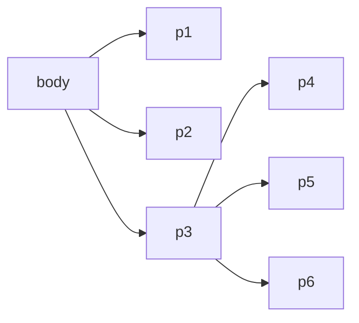

# CSS3基础教程


## 基础知识

> Cascading Style Sheets(层叠样式表)

HTML + CSS + JavaScript => 名词 + 形容词 + 动词

`CSS`可以认为对原始的`HTML`进行美化


### 快速入门

1. CSS是什么
2. CSS怎么用
3. CSS选择器
4. 美化网页
5. 盒子模型
6. 浮动
7. 定位
8. 网页动画

### 什么是CSS
美化:字体, 颜色,高度,宽度, 背景图片

### CSS的优势
+ 内容和表现分离
+ CSS文件可以复用
+ 样式十分丰富
+ 建议使用独立的CSS文件

### CSS导入的方法

1. 行内样式
```html
<h1 style="color: red">一级标题</h1>
```
2. style标签
```html
<style></style>
```
3. 外部样式

+ 链接方式
```html
<link rel="stylesheet" href="style.css">
```

+ 导入式
```html
<style>
	@import url("css/style.css");
</style>
```

### 基本语法

```css
/* 注释语法 */
selector {
	/* 声明 */
	attr:value;
}
```

下面的代码可以直接修改背景颜色

```css
<style>
    body {
        background-color:gray;

    }
</style>
```

<style>
    body {
        background-color:gray;
    }
</style>

CSS基本操作
1. 选中元素(选择某一类或者某一个)
2. 属性修改(修改一个或者多个)

## 选择器

> 选择某一类或者某一个元素

### 基本选择器

+ 标签选择器
+ 类选择器
+ ID选择器

#### 标签选择器

> 选中html的标签

```css
h1 {
    color: red;
}
h2 {
    color: black;
}
h3 {
    color: yellow;
}

h4 {
    color: red;
}
```
#### 类选择器
```html
<h1 class="test">测试</h1>
```

此时,可以讲HTML选中
类选择器使用`.`+`className`

```css
.test {
    color: black;
}
```

#### ID选择器

```html
<h1 id="test">测试</h1>
```

```css
#test {
	color: black;
}
```

> ID唯一确定,不可以共享;
> 最为最精准的对位方式

### 高级选择器

1. 层次选择器
2. 结构伪类选择器
3. 属性选择器

#### 层次选择器

+ 后代选择器
+ 子选择器
+ 相邻兄弟选择器
+ 通用选择器

那么我们设想出一种结构,为其编写`CSS`



根据此图写出html

```html
<body>
    <p>p1</p>
    <p>p2</p>
    <p>p3</p>
    <ul>
        <li>
            <p>p4</p>
        </li>
        <li>
            <p>p5</p>
        </li>
        <li>
            <p>p6</p>
        </li>
    </ul>
</body>
```

##### 后代选择器

下面的代码可以使得body标签中的`所有p标签`为红色(没有实现,因为造成网页的颜色太恶心了)

```css
body p {
    color: red;
}
```

##### 子选择器

下面的代码可以使得body标签中的`第一级别p标签`为红色(没有实现,因为造成网页的颜色太恶心了)

```css
body>p {
    color: green;
}
```

##### 相邻兄弟选择器

1. 后面的兄弟
2. 只有一个

```html
<p class="active">p1</p>
<p>p2</p>

<p id="test">p3</p>
<p>p4</p>

<style>
    .active+p {
        color: red;
    }
    #test+p {
        color: blue;
    }
</style>
```

可以得知选中了p2,p4,二者变色<br>

<p class="active">p1</p>
<p>p2</p>
<p id="test">p3</p>
<p>p4</p>
<style>
    .active+p {
        color: red;
    }
    #test+p {
        color: blue;
    }
</style>

##### 通用兄弟选择器

1. 选中所有下的
2. 相同标签

```html
<p>p1</p>
<p class="hello">p2</p>
<p>p3</p>
<style>
    .hello~{
        color: red;
    }
</style>
```

<p>p1</p>
<p class="hello">p2</p>
<p>p3</p>
<p>p4</p>
<p>p5</p>
<p>p6</p>
<style>
    .hello~p{
        color: red;
    }
</style>

#### 结构伪类选择器

> 结构可以根据元素在文档中所处的位置,来动态选择元素,从而减少HTML文档对ID或类的依赖,有助于保持代码干净整洁;

```html
<body>
<p>p1</p>
<p>p2</p>
<p>p3</p>
<ul>
    <li>
        <p>p4</p>
    </li>
    <li>
        <p>p5</p>
    </li>
    <li>
        <p>p6</p>
    </li>
</ul>
<p id="test">p7</p>
<p>p8</p>
</body>
</html>
```

1. 选中`ul`标签下面的`li`的第一个子成员
```css
ul li:first-child {
	color: red;
}
```

2. 选中`ul`标签下面的`li`的最后一个子成员
```css
ul li:last-child {
	color: red;
}
```

3. 选中父节点的第n个元素,并且是P标签
```css
p:nth-child(1) {
	background: green;
}
```

#### 属性选择器 
> 选择携带某个属性的元素

```css
/* 选中所有带有id属性的元素 */
p[id] {
    color: pink;
}

/* 选中id为test的元素 */
p[id="test"] {
    color: pink;
}

/* 选中id开头为test的元素 */
p[id^="test"] {
    color: pink;
}
```

## CSS属性
> 选中元素开始设置属性

### 属性基础

1. 字体样式
2. 文本样式
3. 文本阴影
4. 超链接
5. 列表样式
6. 背景
span标签强调,这是一个标签,
div标签,分块

```html
<!-- 字体样式  -->
<style>
    body {
        font-family: 'Times New Roman', Times, serif;
        font-size: 20px;
        font-style: oblique;
    }
</style>
```

+ font-family; 字体设置
+ font-size 字体大小
+ font-style 字体风格

### 属性提高

1. 盒子模型与边框

