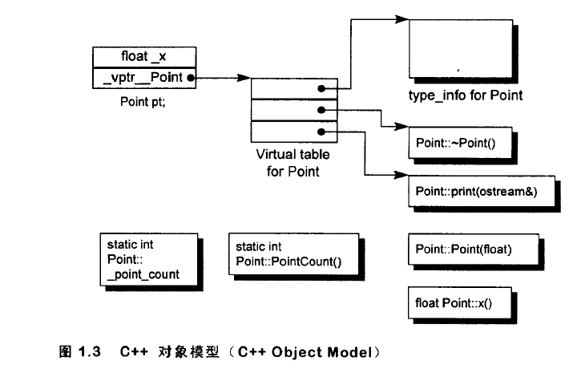
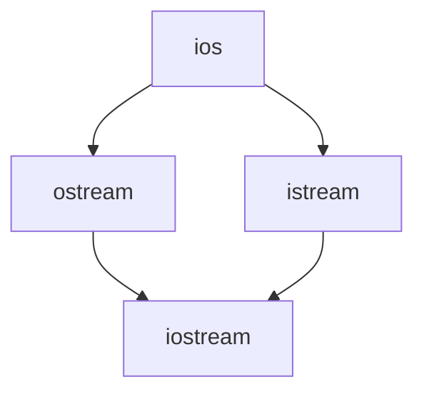
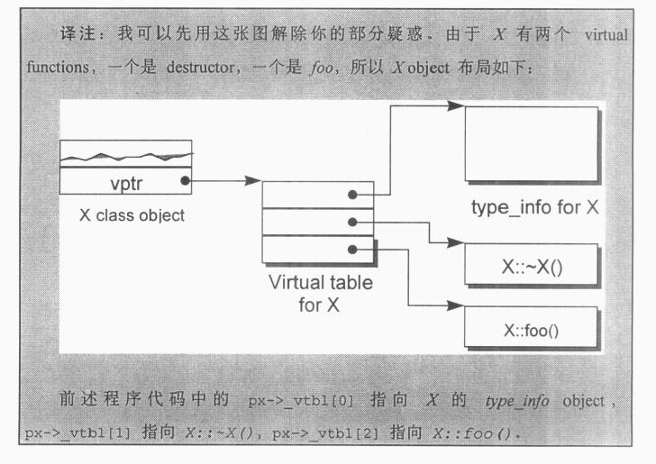
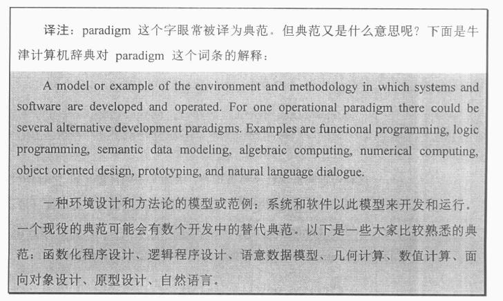
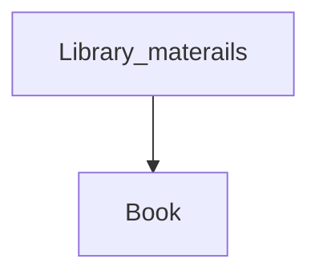
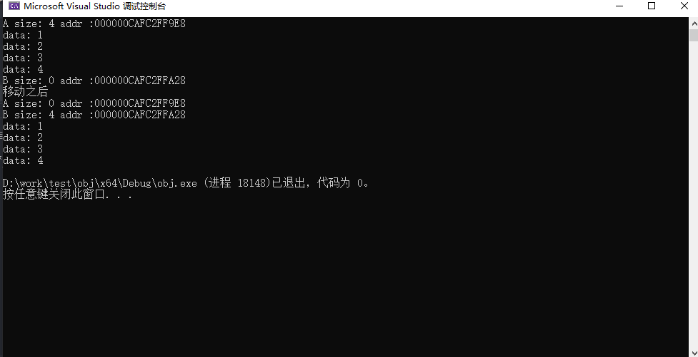

# C++增强笔记


<!--more-->

> 这个是我在学习`C++`语言中所记录的笔记,有可能会存在错误和遗漏,并且我有一点点C语言基础,
> 会大量的提及C语言与C++的不同,从而造成笔记晦涩;
> 另外C++的学习是一个长期且艰难的过程,因此本文进行了切分;

[C++基础笔记]()</br>
[C++提高笔记]()</br>
[C++增强笔记]()</br>
[C++模板笔记]()</br>

<!--more-->

## C++对象模型(深入版)

> + 对象模型是一种描述计算机程序中的对象及其相互关系的方式。在面向对象编程中，每个对象都有一个类型、属性和方法。对象之间可以相互通信，从而实现特定的任务。
> + 在对象模型中，对象类是描述对象的通用模板。每个类都有一组属性和方法，它们定义了该类的行为。当我们创建一个对象时，我们使用该类来生成该对象，并且该对象将具备该类所定义的属性和方法。
> + 对象之间可以通过消息传递进行通信。消息包含了一个方法调用请求，接收者也就是被调用的对象会执行该方法，并将结果返回给发送者。这种方式实现了数据和操作的封装，使得程序的实现更加模块化和灵活。
> + 总之，对象模型是一种以对象为基本单位的编程范式，通过对对象的抽象，实现了高度复用性、可扩展性和可维护性的程序设计。

### 关于对象(Object Lessons)

在C++中农, Point3d可以 使用独立的抽象数据类型(abstract data types ADT)

```c++
class Point3d {
public:
    Point3d(float x = 0.0, float y = 0.0, float z = 0.0) : _x(x), _y(y), _z(z) {}
    float x() const { return _x; }
    float y() const { return _y; }
    float z() const { return _z; }

private:
    float _x;
    float _y;
    float _z;
};

inline std::ostream& operator << (std::ostream &os, const Point3d &pt)
{
    os << '{' << pt.x() << pt.y() << pt.z() << '}';
    return os;
}
```

双层或者三层class体系

```c++
class Point {
public:
    Point(float x = 0.0) : _x(x) {}
    float x() const { return _x; }
    void x(float val = 0.0) { _x = val; }

protected:
    float _x;
};

class Point2d : public Point {
public:
    Point2d(float x = 0.0, float y = 0.0) : Point(x), _y(y) {}
    float y() const { return _y; }
    void y(float val = 0.0) { _y = val; }

protected:
    float _y;
};

class Point3d : public Point2d {
public:
    Point3d(float x = 0.0, float y = 0.0, float z = 0.0) : Point2d(x, y), _z(z) {}
    float z() const { return _z; }
    void z(float val = 0.0) { _z = val; }

protected:
    float _z;
};

inline std::ostream& operator << (std::ostream &os, const Point3d &pt)
{
    os << '{' << pt.x() << pt.y() << pt.z() << '}';
    return os;
}
```

更近一步，不管哪一种形式，他们都可以被参数化,也可以坐标参数化


```c++
template<class T>
class Point3d {
public:
    Point3d(T x = 0.0, T y = 0.0, T z = 0.0) : _x(x), _y(y), _z(z) {}
    T x() const { return _x; }
    T y() const { return _y; }
    T z() const { return _z; }

private:
    T _x;
    T _y;
    T _z;
};

template<class T>
inline std::ostream& operator << (std::ostream &os, const Point3d<T> &pt)
{
    os << '{' << pt.x() << pt.y() << pt.z() << '}';
    return os;
}
```

也可以是坐标类型和坐标数目都参数化

```c++
template<class T, int dim>
class Point {
public:
    Point();
    Point(T coords[dim]) {
        for (int index = 0; index < dim; index++) {
            _coords[index] = coords[index];
        }
    }

    T& operator[](int index) {
        assert(index < dim && index >= 0);
        return _coords[index];
    }

    T operator[](int index) const {
        assert(index < dim && index >= 0);
        return _coords[index];
    }

private:
    T _coords[dim];
};

template<class T, int dim>
inline std::ostream& operator << (std::ostream &os, const Point<T, dim> &pt)
{
    os << '{';
    for (int i = 0; i <= dim - 1; i++) {
        os << pt[i] << ";";
    }
    os << '}';
    return os;
}
```

**加上封装后的布局成本**

+ **virtual function机制**
+ **virtual base class机制**

#### C++对象模型

在C++中,有两种class data member: `static`和`nonstatic`
有三种class function member: `static`,`nonstatic`与`virtual`

已知下面的class point的声明:

```c++
class Point {
public:
	Point(float val);
	virtual ~Point();
	float x() const;
	static int PointCount();

protected:
	virtual ostream& print(ostream &os) const;

	float _x;
	static int _point_count;
}
```
那么这个class point在机器中将会怎么样表现呢?也就是说我们如何模型(modeling)出各种data member与function member呢?

**C++ 对象模型(The C++ Object Model )**

>  C++之父的最终设想

Stroustrup 当初设计 （ 当前亦仍占有优势） 的 C＋＋ 对象模型是从简单对象 模 型派生而来的 ，并对内存空间和存取时间做了优化 ．在此模型中，Nonstatic data members 被配置于每一 个 class object 之内 ，static data members 则被存放在所有 的 class object 之外. Static 和 nonstatic function members 也被放在所有的 class object 之外. Virtual functions 则以两个步骤支持之 ：

1. 每一 个  class   产 生 出一 堆 始 向 virtual   functions   的指 针 ，放 在 表 格 之 中．这 个表格被称为 virtuaI  table  (**vtbl**）
2.   每 一 个 class object   被添加一 个指针，指向相关 的 virtual table . 通 常 这个指针被 称为 **vptr**。
**vptr**的设定 （ setting ） 和重 置  （ resetting ） 都 由 每 一 个 `class`的 `constructor`, `destructor`和 `copy assignment  `运算符自动完成，每一个`class `所关联 的 `type_info object`（ 用以支持 runtime type identification, **RTTI**) 经由virtualtable被指出来，通 常是放在表格的第一个`slot `处 ．


图 1.3  说明 C＋＋ 对象模型如何应用于前面所说的 Point class 身上。这个模型的主要优点在于它的空间和存取时间的效率 ；主要缺点则是 ，如果应用程序代码本身未曾改变，但所用到的 class objects 的 nonstatic data members 有所修改（ 可能是增加、移除或更改 ）， 那么那些应用程序代码 同样得重新编译 ．关于这 点，前述的双表格模型就提供了较大的 弹性 ，因为它多提供了一 层间接性 。不过，它也因此付出空间和执行效率两方面的代价就是了。

**加上继承（Adding Inheritance)**

C++支持的单一继承

```c++
class Libray_materials {...};
class Book : public Libray_materials {...};
class Rental_book : public Book {...};
```

C++也支持多重继承

```c++
// 原本iostream的实现方式
class iostream:
  public istream,
  public ostream {...};
```
甚至，继承关系也可以指定为虚拟(virtaul,也就是共享的意思)

```c++
class istream : virtual public ios {...};
class ostream : virtual public ios {...};
```



在虚拟继承的情况下, base class 不管在继承串链中被派生 （ derived ） 多少次 ， 永远只会存在一个实体 （ 称为 subobject ） 。例如 iostream 之中就只有 virtual ios base  class    的一个实体。

自C++ 2.0  起才新导入的 virtual base class，需要一些间接的 base class  表现 方法 。Virtual  base  class  的原始模型是在 class  object 中为每一个有关联的 `virtaul base  class`加上一个指针 ．其它演化出来的模型则若不是 导入 一个 virtual   base，class table ，就是扩充原已存在的 virtual table ，以便维护每 一个 virtual base class 的位置。


**对象模型如何影响程序(How to Object Model Effects Programs)**

不同的对象模型 ，会导致 “现有的程序代码必须修改” 以及 “ 必须加入新 的程序代码” 两个结果 。

例如下面这个 函数 ，其中 class X 定义了一个 copy constructor ，一个 virtual destructor ，和一个 virtual  function *foo*

```c++
X foorbar()
{
	X xx;
	x *px = new X;

	// foo是一个virtaul function
	xx.foo();
	px->foo();

	delete px;
	delete xx;
}
```

这个函数有可能在内部转换为

```c++
void foobar(X &_result)
{
    // 构造_result
	// 用result用来取代 local xx
    _result.X::X();

	// 扩展 X *px = new  X;
	px  =  _new(sizeof(x));
	if (px != 0)
        px->X::X();

    // 扩展xx.foo(),但不使用virtual机制
    // 以result取代xx.foo(&result);
    // 使用virtual机制扩展px->foo( )

    (*px->vtbl[2])(px)

	// 扩展 delet e px ;
	if (px != 0) {
		( *px->vtbl [1])(px); // destructor
		_delete (px) ;
    }

// 不需使用 named return statement
// 不需要摧毁 local object xx
    return ;
}
```



#### 对象的差异(An Object Distinction)

> C++程序设计模型直接支持三种programming paradiagms(程序设计典范);



1.  **程序模型(prcedural model)**,就像C一样, `C++`当然也支持它,字符串的处理就是一个例子,我们可以使用字符数组以及`str*`函数集(定义在标准的C函数库中)

```c++
    char boy [ ]   ＝”Da nny” ；
    char *p_son;
    ...
    p_son = new char[strlen(boy) + 1];
    strcpy(p_son, boy) ;
    ...
    if (!strcmp(p_son, boy))
        take_to_disneyland(boy);
```

2.  **抽象数据类型模型(abstract data type model, ADT)**. 该模型所谓的“抽象”是和一组表达式(public接口)一起提供, 而其运算定义
仍然隐而未明. 例如下面的`String class`:

```c++
String girl == "Anna";
String daughter;
...
// String::operator=();
daughter  =  girl;
...
// St ring ::ope rator== ( ) ;
if (girl == daughter)
    take_t o_disneyland (girl);
```

3.  **面向对象模型(object-oriented  model)**。在此模型中有一些彼此相关的类型，通过一个抽象的base class(用以提供共通接口)被封装起来。
Library_ materials class  就是一个例子，真正的 subtypes  例如 Book、Video、Compac仁Disc 、Puppet、Laptop等等都可以从那里派生而来：
```c++
void
check_in(Libr ar y_ma te主主als   *pmat)
{
    if (pmat->late())
        pmat->fine() ; pma t ->check  in ( ) ;

    if ( Lend er *plend = pma t -> reser ved ( ) ) pma t->notif y (  plend ) ;
}
```

纯粹以一种 paradigm 写程序 ，有助于整体行为的 良好稳固．然而如果混 合 了不同的 paradigms，就可能会带来让人惊 吓的后果 ，特别是在没有谨慎处理的情 况下
。最常见的疏忽发生在当你以一 个 base class 的具体实体如：

    Library_materails thinql;

来完成某种多态(polymorphism)局面时:



```c++
class Book : public Library_materials { ... };
Book book ;

// 喔欧：thingl不是一个Book !
// book被裁切（sliced ）了．
// 不过 thingl仍保有一个 Library_materials
thingl = book ;

// 喔欧：调用的是Library_rnaterials::check_in()
thingl.check_in();
```

而不是通过 base class 的 pointer 或 reference 来完成多态局面：

```c++
// OK ：现在 thing2 参考到 book
Library_materials & thing2 = boo k ;

// OK ：现在引发的是 Book : :check in ( )
thing2 .check_in (  )  ;
```

虽然你可以直接或间接处理继承体系中的一个 base class object ，但只有通过 pointer 或 reference 的间接处理 ，才支持OO程序设计所需的多态性质．上个例子中的 thing2 的定义和运用，是OO paradigm 中一个良好的例证 thingl 的定 义和运用则逸出了OO的习惯 ：它反映 的是一个 ADT paradigm 的良好行为,thingl的行为是好是坏 ，视程序员 的意图而定 ．在此范例 中，它的行为非常有可 能不是你要的！

在OO paradigm 之中 ，程序员需要处理 一个未知实体 ，它的类型虽然有所界 定，却有无穷可能．这组类型受限于其继承体系 ，然而该体系理论上没有深度和 广度的限制．原则上 ，被指定 的
obje ct 的真实类型在每一个特定 执行点之前 ，是 无法解析的．在 C＋＋ 中，只有通过  pointers  和 references  的操作才能够完成 4  相反地 ，在 ADT
paradigm 中程序员处理的是一 个拥有固定而单一类型的实体 ， 它在编译时期就已经完全定义好了   ．举个例子  ，下面这组声明：


／／描述 obj ect s ：不确定类型
Libra r_materials   *px   =   retrieve_ some_ma ter主al {} ; Libr ar_ma ter ials   & rx   =   *px ;

／／描述已知物： 不可能有令 人惊讶的结果产生
Libra r_ma teria l s dx    步 px ;


你绝对没有办法确定地说出 px 或 rx 到底指向何种类型的 objects ，你只能 够说它要不就是 Library_materials object ，要不就是后者的一个子类型 （
subtype ） 。 不过 ，我们倒是可以确定 ，dx 只能是 Libraη materials class 的一个 object o 本 节稍后 ，我会讨论为什么这样的行为虽然或许未如你所预
期，却是良好的行为 e

虽然 “对于 object  的多态操作” 要求此 object  必须可以经由一个 pointer  或 reference  来存取 ，然而 C＋＋ 中的 pointer  或
reference  的处理却不是多态的必要 结果．想想下面的情况 ：

／／没有多态 （ 译注z 因为操作对象不是 class obj ect ) int   *pi;

／／没有语言所支持的多态 （ 译注：因为操作对象不是 class obj ect ) void    *pvi;

II ok  : class x 视为一 个 ba se class （ 译注：可以有多态的效果）
x  *px;


在 C忡，多态只存在于一个个的 public class 体系中．举个例子 ，px 可能指 向自我类型的一个 object ，或指向以 public 派生而来的一个类型 （ 请不要把不良
的转型操作考虑在内） o Nonpublic 的派生行为以及类型为 void ＊ 的指针可以说 是多态 ，但它们并没有被语言明白地支持，也就是说它们必须由程序员通过明白 的转型操作来管理    （
你或许可以说它们并不是多态对象的一线选手 ）．

C＋＋ 以下列方法支持多态 ：

？．经由一组隐 含 的转化 操作 ．例如把 一 个 derived class  指针转化 为  个指
向其 public base type 的指针 ：

```c++
shape *ps =  new  circle() ;
```

2.  经由 virtual function  机制 ：

ps ->rotate ( ) ;


3. 经由 dynamic_cast   和 type id  运算符 ：

if    (   circle   女pc   =   dynamic_ca st<   circle*   > (   ps   )    )


多态的主要用途是经 由一个共 同的接口来影响类型的封装 ，这个接口通常被 定义在 一 个抽象 的 base class 中．例如Library_materials class 就为 Book 、
阿deo 、Puppet 等 subtype 定义了一个接口．这个共享接口 是以 virtual function 机 制引发的 ，它可以在执行期根据 obje ct
的真正类型解析出到底是哪一个函数实体 被调用 。经由这样的操作 ：

Librar y_ma ter ial->check ou t ( ) ;


我们的代民可以避免由于 “借助某 一特定 library   的 materials，而导致变动无常 。 这表只使得  当类型有所增加 、修改 、或删减时，我们的程序代码不 需改变’＼ 而且也使
个新灼 L.；易r＿ary_materials subtype  的供应者不需要重新写出 “对继承体 系中的所有类型都共渍 ” 白行为和操作 ．

考虑一下这样的码，

v 0j_ d   rotate (
)(  d2.tum,
con  ，ζ   X   *pointer ,
t ’    1st  X  & r ef erence )

／／在执行期之前 ，无法决定到底词用哪一个  rotate （ ）     实体
( *pointer ) .r otate ( ) ; r ef erence . rotate ( ) ;

／／下面这个操作总是调用 X : :rotate ( ) datum .rotate ( ) ;


ma in ( )   {


Z   z ; / /  Z  是 x 的一个子类型

rotate ( z , & z , z ) ; return O ; ....-.    .11


经由 pointer   和 reference  完成的两个 “ 函数调用操作” 会被动态完 成 ！此例 中它们都调用 Z::rotateO o        经由 datum  完成的 “
函数调用操作” 则可能 （ 或可能 不） 经由 virtual   机制 ．不过 ，它反正总是调用 X·:rotateO   就是了．（ 这就是所 谓的 “ 编译素养” 问题 ：不管经由 datum
  所调用的 virtual  function   采不采 用 virtual  机制 ，从语意来说 ，结果都是相同的D          4.2  节对此有更详细的讨论 ）

需要多少内存才能够表现 一个 class obje ct？一般而言要有：

·其 non static data members   的总和大 小：

·加 上 任 何 由于 alignment   （ 译注） 的需求而填补 （ padding  ） 上去的空 间
（ 可 能存在 于 members   之 间 ，也可 能存在于集合体边界 ）  ．


译注：al ignment 就是将数值调整到某数的倍数．在 32 位计算机上 ，通
常 alignment   为 4 bytes  ( 32  位 ） ，以使 bus  的 “运输量” 达到最高效率 。


·加上 为 了支持 virtual   而由内部产 生 的任何额外负担 （ overhead )    •


一个指针2 ，不管它指向哪一种数据类型 ，指针本身所需的内存大小是固定 的．举个例子 ，下面有一 个 ZooAnimal 声明z

class  ZooAnimal   { publ ic :
ZooAnimal ( ) ;
virtual   句 Z ooAnima l ( ) ;

### 构造函数语意学(The Semantics of constructors)

#### Default Constructor的建构操作

#### Copy Constructor的建构操作

#### 程序转换语意学(Program  Transformation Semantics)

#### 成员们的初始化队伍(Member Initialization List)


### Data语意学(The Semantics of Data)

#### Data Member的绑定

#### Data Member的布局

#### Data Member的存取

#### "继承"与Data Member

#### 对象的效率

#### 指向Data Member的指针

### Function语意学(The Semantics of Function)

#### 纯虚函数的存在（Presence of a  Pu re Virtual Function)

#### 虚拟规格的存在 （Presence  of  a  Virtual  Specification )

#### 虚拟规格中const 的存在

#### 重新考虑class的声明

### 构造、析构、拷贝语意学

### 执行期语意学

### 站在对象模型的类端

## 构造函数

### 普通构造(默认构造函数)

在C++中，构造函数是一种特殊的成员函数，其名称与类名称相同，用于初始化实例化的对象的成员变量。构造函数没有返回类型声明，并且通常被声明为公共成员函数。当创建一个对象时，构造函数被自动调用。

普通构造函数（也称为默认构造函数）是不带参数的构造函数。它可以通过一个空的参数列表来定义，如下所示：

```c++
cpp
class MyClass {
public:
    MyClass() {
        // 构造函数代码
    }
};
```
这个类的构造函数不需要任何参数，并且在创建对象时会自动调用。我们可以在构造函数中添加代码来初始化类的各种成员变量，例如：

```c++
class MyClass {
public:
    MyClass() {
        num = 0;
        str = "";
    }

private:
    int num;
    string str;
};
```
在上面的例子中，我们设置了两个私有成员变量num和str的初始值。

此外，如果您想初始化一个常量成员变量，您需要使用构造函数的成员初始化列表，如下所示：

```c++
class MyClass {
public:
    MyClass() : constVar(10) {
        // 构造函数代码
    }
private:
    const int constVar;
};
```

在上面的例子中，我们使用构造函数的成员初始化列表来初始化constVar常量成员变量。

总之，构造函数是用于初始化对象的重要部分。在设计类时，需要考虑到对象的初始化方式，以确保所有成员变量都被正确地初始化。

### 拷贝构造

在C++中，拷贝构造函数是一种特殊的构造函数，用于将一个对象复制到另一个对象。它通常用于按值传递参数或以值返回对象的情况下，从而创建一个新的独立对象。拷贝构造函数也可以用于初始化一个对象数组或在创建对象时调用默认构造函数。

拷贝构造函数有以下格式：

```cpp
class MyClass {
public:
    MyClass(const MyClass& other) {
        // 拷贝构造函数代码
    }
};
```

在上面的代码中，参数other是对同类对象的引用。我们可以使用other来访问它的成员变量，并将其复制到当前对象中。

以下是一个简单的拷贝构造函数示例：

```cpp
class MyClass {
public:
    int num;

    // 普通构造函数
    MyClass(int n) : num(n) {}

    // 拷贝构造函数
    MyClass(const MyClass& other) : num(other.num) {}
};

int main() {
    MyClass obj1(10);
    MyClass obj2 = obj1;  // 调用拷贝构造函数

    cout << obj1.num << endl;  // 输出 10
    cout << obj2.num << endl;  // 输出 10

    return 0;
}
```
在上面的代码中，我们定义了一个MyClass类，它具有一个整数类型的成员变量num。我们定义了一个普通构造函数和一个拷贝构造函数来初始化num成员变量。在主函数中，我们创建了一个名为obj1的MyClass对象，并将其值设置为10。然后，我们使用obj1初始化了另一个MyClass对象obj2，这将调用拷贝构造函数。最后，我们输出obj1和obj2的num成员变量，结果均为10。

需要注意的是，默认情况下，C++会提供一个默认的拷贝构造函数，该函数执行浅拷贝。如果要实现深拷贝，则需要自定义拷贝构造函数来复制指向动态分配内存的指针或其他资源。

### 移动构造

在C++11之后，引入了移动语义的概念，也就是通过将资源所有权从一个对象转移到另一个对象，从而提高程序性能。移动构造函数是一种特殊的构造函数，用于实现移动语义。它通常用于将临时对象的值移动到新对象中。

移动构造函数有以下格式：

```c++
class MyClass {
public:
    MyClass(MyClass&& other) noexcept {
        // 移动构造函数代码
    }
};
```

在上面的代码中，参数other是对同类对象的右值引用。我们可以使用std::move(other)来访问其成员变量，并将其移动到当前对象中。需要注意的是，在移动构造函数中必须使用noexcept关键字进行标记，以确保不会抛出异常。

以下是一个简单的移动构造函数示例：

```c++
class MyClass {
public:
    int* data;
    size_t size;

    // 普通构造函数
    MyClass(size_t s) : data(new int[s]), size(s) {}

    // 移动构造函数
    MyClass(MyClass&& other) noexcept : data(other.data), size(other.size) {
        other.data = nullptr;
        other.size = 0;
    }

    // 析构函数
    ~MyClass() {
        delete[] data;
    }
};

int main() {
    MyClass obj1(10);
    MyClass obj2(std::move(obj1));  // 调用移动构造函数

    cout << obj2.size << endl;  // 输出 10
    cout << obj1.size << endl;  // 输出 0

    return 0;
}
```
在上面的代码中，我们定义了一个MyClass类，它具有一个指向int类型的动态数组data和一个size_t类型的size成员变量。我们定义了一个普通构造函数来初始化data和size成员变量，并使用delete[]释放data内存。

然后，我们定义了一个移动构造函数，它将data和size成员变量从临时对象other中移动到当前对象中。在移动完之后，我们将临时对象other的data指针设置为nullptr，以确保不会删除已经释放的内存。

在主函数中，我们创建了一个名为obj1的MyClass对象，并将其大小设置为10。然后，我们使用std::move(obj1)将值移动到新的MyClass对象obj2中，这将调用移动构造函数。最后，我们输出obj1和obj2的size成员变量，结果分别为0和10。

需要注意的是，移动构造函数只能用于右值引用参数，不能用于左值引用或常量引用参数。

### 委托构造

在C++11之后，引入了委托构造函数的概念。委托构造函数是一种特殊的构造函数，可以在一个构造函数中调用另一个构造函数来完成对象的初始化。这使得代码更加简洁，减少了冗余代码的编写。

委托构造函数有以下格式：

```c++
class MyClass {
public:
    MyClass(int num, string str) : num(num), str(str) {}

    MyClass() : MyClass(0, "") {}
};
```
在上面的代码中，我们定义了一个MyClass类，具有两个私有成员变量num和str。我们定义了一个带参数的构造函数，以及一个不带参数的构造函数。在不带参数的构造函数中，我们通过调用带参数的构造函数并传递默认值来实现对象的初始化。这就是委托构造函数的应用。

需要注意的是，如果要在委托构造函数中使用成员初始化列表，则必须在委托构造函数调用前执行。例如：

```c++
class MyClass {
public:
    MyClass(int num, string str) : num(num), str(str) {}

    MyClass() : MyClass(0, "") {
        // 委托构造函数调用后，还可以添加其他构造函数代码
    }
};
```
在上面的代码中，我们先调用委托构造函数，然后可以在构造函数中添加其他代码。

总之，委托构造函数是一种非常有用的C++11语言特性，可以使代码更加简洁和可读。

## 移动语意

> 移动语义是C++11中引入的一种新特性，通过将资源的所有权从一个对象转移到另一个对象来提高程序的性能

### 左值与右值
> 移动语意的前提: **右值引用**

[微软笔记](https://learn.microsoft.com/zh-cn/cpp/c-language/l-value-and-r-value-expressions?view=msvc-170)

定义可以认为是赋值表达式的左右边;

+ 左值 (lvalue): 处于赋值表达式左边
+ 右值 (rvalue):处于赋值表达式右边

但是上面的定义也太粗糙了吧!

```c++
int a = 0;			// a 是左值
int b = 0;			// b 是左值
int c = a + b;		// c 是左值,但是a与b发生了一次右值转换
```

那么我们写一个例子,强行右值作为左值

```c++
int foo()
{
    return 0;
}

int main()
{
    foo() = 2;
    return 0;
}
```

```txt
已启动生成…
1>------ 已启动生成: 项目: obj, 配置: Debug x64 ------
1>obj.cpp
1>C:\Program Files\Microsoft Visual Studio\2022\Community\MSBuild\Microsoft\VC\v170\Microsoft.CppCommon.targets(693,5): error MSB6006: “CL.exe”已退出，代码为 2。
1>D:\work\test\obj\obj.cpp(8,14): error C2106: “=”: 左操作数必须为左值
1>已完成生成项目“obj.vcxproj”的操作 - 失败。
========== 生成: 成功 0 个，失败 1 个，最新 0 个，跳过 0 个 ==========
```

我们可以清楚的明白,函数不可以赋值，但是下面的例子呢？

```c++
int& foo()
{
    static int a = 10;
    return a;
}

int main()
{
    foo() = 2;
    return 0;
}
```

但是此时我们编译成功了？

我们稍微读一下代码就可以明白,

我们并不是对函数进行赋值，而是对函数的返回值进行赋值

### 可修改的左值

下面看一个例子

```c++
const int a = 1;
a = 2;
```

那`a`是左值还是右值,很明显,左值;

为什么呢？

于是定义需要继续精化。不是所有的左值都可以被赋值。可赋值的左值被称为 *可修改左值 (modifiable lvalues)* 。C99标准定义可修改左值为：

> […] 可修改左值是特殊的左值，不含有数组类型、不完整类型、const 修饰的类型。如果它是 `struct` 或 `union`，它的成员都（递归地）不应含有 const 修饰的类型。

(未完待续。。。)

### 完美转发

提到完美转发，就有必要先说一下，什么是转发，什么样的转发才称得上是完美转发。

在 C++ 中，转发指的就是函数之间的参数传递（例如函数 `f1` 接收了一个参数 `a`，而后又将此参数 `a` 传递给了其函数体内调用的另一个函数 `f2`）。

而完美转发指的就是在函数之间传递参数的过程中，参数在传递后的属性保持不变（如左值仍是左值，右值仍是右值，`const` 修饰也会保留）。

### 移动语意

```c++
#include <iostream>
#include <vector>

using namespace std;

template <class T>
void print_vector(vector<T> &vec)
{
    for (auto v : vec) {
        cout << "data: " << v << endl;
    }
}

int main()
{
    vector<int> A = {1, 2, 3, 4};
    vector<int> B;

    cout << "A size: " << A.size() << "addr :" << &A << endl;
    print_vector(A);

    cout << "B size: " << B.size() << "addr :" << &B << endl;
    print_vector(B);

    B = move(A);
    cout << "移动之后" << endl;

    cout << "A size: " << A.size() << "addr :" << &A << endl;
    print_vector(A);

    cout << "B size: " << B.size() << "addr :" << &B << endl;
    print_vector(B);

    return 0;
}
```



1. 左值 (`lvalue`, left value)，顾名思义就是赋值符号左边的值。准确来说，左值是表达式（不一定是 赋值表达式）后依然存在的持久对象

2. 右值 (`rvalue`, right value)，右边的值，是指表达式结束后就不再存在的临时对象。

3. 纯右值 (`prvalue`, pure `rvalue`)
  + 纯粹的右值，要么是纯粹的字面量，例如 10, true；要么是求值 结果相当于字面量或匿名临时对象，例如 1+2。
  + 非引用返回的临时变量、运算表达式产生的临时变量、原始字面量、Lambda 表达式都属于纯右值。
```c++
class Foo {
    const char*&& right = "this is a rvalue"; // 此处字符串字面量为右值
public:
    void bar() {
    right = "still rvalue"; // 此处字符串字面量为右值
    }
};

int main()
{
    const char* const &left = "this is an lvalue"; // 此处字符串字面量为左值
}
```

4. 将亡值 (`xvalue`, expiring value)，是 C++11 为了引入右值引用而提出的概念也就是即将被销毁、却能够被移动的值。
```c++
std::vector<int> foo() {
    std::vector<int> temp = {1, 2, 3, 4};
    return temp;
}

std::vector<int> v = foo();
```
在最后一行中,v是左值、foo()返回的值就是右值（也是纯右值）。
但是, v可以被别的变量捕获到,而foo()产生的那个返回值作为一个临时值，一旦被 v 复制后，将立即被销毁，无法获取、也不能修改。
而将亡值就定义了这样一种行为：**临时的值能够被识别、同时又能够被移动**

### remove_reference

```c++
template <class _Tp> struct remove_reference        {typedef _Tp type;};
```
任何非引用类型。它简单地将输入类型定义为其自身，不做任何修改。

```c++
template <class _Tp> struct remove_reference<_Tp&>  {typedef _Tp type;};
```
当模板参数是一个左值引用时，此特化版本会被使用。它会去掉类型中的引用部分，只留下原始类型

```c++
template <class _Tp> struct remove_reference<_Tp&&> {typedef _Tp type;};
```
右值引用（例如，int&&）。同样，它返回不带引用修饰的基础类型

完美转发实现
```c++
template <class _Tp>
inline constexpr _Tp&& forward(typename remove_reference<_Tp>::type& __t) _NOEXCEPT {
	return static_cast<_Tp&&>(__t);
}
```
完美转发允许函数模板将其参数的左右值属性（包括引用类型）完整地传递给另一个函数，这是通过使用引用折叠(reference collapsing)规则和static_cast来实现的。

```c++
template <class _Tp>
inline  typename remove_reference<_Tp>::type&&move(_Tp&& __t) {
  typedef typename remove_reference<_Tp>::type _Up;
  return static_cast<_Up&&>(__t);
}

```

```c++
#include <iostream>
#include <utility> // 包含 std::forward 和 std::move 所在的头文件

// 目标函数：用于展示对左值和右值的不同处理
void processValue(int& x) {
    std::cout << "processValue (lvalue): " << x << std::endl;
}

void processValue(int&& x) {
    std::cout << "processValue (rvalue): " << x << std::endl;
}

// 通用包装函数：使用 std::forward 实现完美转发，并根据条件使用 std::move
template<typename T>
void wrapper(T&& arg, bool shouldMove) {
    if(shouldMove) {
        std::cout << "Moving argument." << std::endl;
        // 使用 std::move 强制转换为右值引用，即使传入的是左值
        processValue(std::move(arg));
    } else {
        std::cout << "Forwarding argument." << std::endl;
        // 使用 std::forward 保持 arg 的左右值属性
        processValue(std::forward<T>(arg));
    }
}

int main() {
    int a = 10;

    // 传递左值，不进行移动
    std::cout << "Passing lvalue without moving:" << std::endl;
    wrapper(a, false); // 不会调用右值重载版本

    std::cout << "\nPassing lvalue with moving:" << std::endl;
    // 尽管 a 是左值，但由于 std::move，它会被视为右值
    wrapper(a, true);

    std::cout << "\nPassing rvalue without moving:" << std::endl;
    // 传递右值，不进行额外的 std::move
    wrapper(20, false); // 由于是右值，会调用右值重载版本

    return 0;
}
```

### 原理分析

#### forward完美转发原理

**引用折叠规则**：这是理解 `std::forward` 工作原理的关键之一。当使用模板参数推导时，C++ 对引用类型的处理有一些特殊规则:
- T& & 会折叠为 T&
- T& && 也会折叠为 T&
- T&& & 折叠为 T&
- T&& && 折叠为 T&&
这些规则确保了通过适当的类型转换可以保留参数的左右值特性。

```c++
template<typename T>
T&& forward(typename std::remove_reference<T>::type& arg) noexcept {
    return static_cast<T&&>(arg);
}
```
+ 模板参数 T：代表传递给 std::forward 的实际类型。由于是通用引用（T&&），根据上下文，T 可以推导为左值引用（如 int&）或非引用类型（如 int）。
+ 函数参数 arg：接受一个移除了引用修饰的基础类型的左值引用。这样做的目的是为了确保即使是左值引用也能正确地参与后续的类型转换。
+ 返回类型 T&&：通过将 arg 强制转换为 T&&，利用引用折叠规则来保留原参数的左右值特性。如果 T 是左值引用，则最终返回类型是左值引用；如果是非引用类型，则返回右值引用。

在C++中，`std::move` 是一个非常有用的工具，它用于启用移动语义（Move Semantics），从而允许资源从一个对象高效地转移到另一个对象，而不是进行深拷贝。理解 `std::move` 的原理对于编写高效的C++代码至关重要。

#### `std::move` 原理分析

##### 1. 移动语义基础

- **右值引用**：C++11引入了右值引用（用`&&`表示），这使得我们可以区分左值和右值，并针对它们定义不同的行为。右值引用主要用来绑定到临时对象上。
  
- **移动构造函数/赋值操作符**：为了利用移动语义，类需要定义移动构造函数和移动赋值操作符。这些特殊成员函数允许将资源的所有权从一个对象转移到另一个对象，而不是复制这些资源。

##### 2. `std::move` 实现原理

`std::move` 并不真正“移动”任何东西；它实际上只是将它的参数转换为右值引用。这样做的目的是标记该对象可以被“窃取”其资源。下面是 `std::move` 的简化实现：

```cpp
template<typename T>
constexpr typename std::remove_reference<T>::type&& move(T&& t) noexcept {
    return static_cast<typename std::remove_reference<T>::type&&>(t);
}
```

- **模板参数 `T`**：代表传入 `std::move` 的类型。由于使用了通用引用(`T&&`)，`T` 可以推导为左值引用或非引用类型。
  
- **返回类型**：通过移除引用后将 `t` 转换为右值引用，无论 `T` 是否是引用类型。这个转换让接收者知道它可以“窃取” `t` 的资源，因为它现在被视为一个右值。

##### 3. 示例分析

下面是一个简单的例子来展示 `std::move` 如何工作：

```cpp
#include <utility> // 包含 std::move 所在的头文件
#include <iostream>

class MyClass {
public:
    MyClass() { std::cout << "Default constructor\n"; }
    MyClass(const MyClass&) { std::cout << "Copy constructor\n"; }
    MyClass(MyClass&&) { std::cout << "Move constructor\n"; }
};

MyClass createObject() {
    MyClass obj;
    return obj; // 如果开启RVO/NRVO, 这里可能不会调用任何构造函数
}

int main() {
    MyClass myObj = std::move(createObject()); // 使用 std::move 强制调用移动构造函数
    return 0;
}
```

在这个例子中，`createObject` 函数创建了一个局部对象 `obj`。当我们使用 `std::move` 将 `obj` 转换为右值引用时，我们实际上是告诉编译器这个对象可以被移动而不是被复制。因此，在 `main` 中，当我们将 `createObject()` 的结果传递给 `myObj` 时，移动构造函数被调用（假设没有优化如RVO/NRVO发生）。

##### 4. 总结

- `std::move` 的核心功能是将一个对象转换为右值引用，以此来表明这个对象可以被移动而非复制。
  
- 它的实际效果依赖于是否存在相应的移动构造函数或移动赋值操作符。如果类未定义这些函数，编译器会退回到使用复制构造函数或复制赋值操作符。
  
- 使用 `std::move` 可以避免不必要的数据拷贝，特别是在处理大型数据结构时，能够显著提升程序性能。

通过理解和正确使用 `std::move`，你可以编写更加高效、灵活的C++代码，同时充分利用现代C++提供的资源管理特性。

在C++中，移动语义（Move Semantics）是通过移动构造函数和移动赋值操作符实现的。这些特殊成员函数允许资源从一个对象高效地转移到另一个对象，而不是进行深拷贝，从而提高程序性能，尤其是在处理大型数据结构时。

### 移动构造函数

移动构造函数通常用于接收一个右值引用参数，并“窃取”原对象的资源，如动态分配的内存、文件描述符等，而不复制这些资源。这使得原对象进入一种有效的但未指定的状态。

**语法：**
```cpp
class MyClass {
public:
    // 移动构造函数
    MyClass(MyClass&& other) noexcept : /* 初始化列表 */ {
        // 窃取other的资源
        this->resource = other.resource;
        other.resource = nullptr; // 将原对象置为安全状态
    }
private:
    SomeResource* resource;
};
```

### 移动赋值操作符

移动赋值操作符的工作原理与移动构造函数类似，但它是一个赋值操作，因此需要首先释放当前对象拥有的任何资源，然后从右侧操作数“窃取”资源。

**语法：**
```cpp
class MyClass {
public:
    // 移动赋值操作符
    MyClass& operator=(MyClass&& other) noexcept {
        if (this != &other) { // 防止自我赋值
            // 释放已有资源
            delete this->resource;
            
            // 窃取other的资源
            this->resource = other.resource;
            other.resource = nullptr; // 将原对象置为安全状态
        }
        return *this;
    }
private:
    SomeResource* resource;
};
```

### 完整例子

以下是一个完整的示例，展示了如何定义并使用移动构造函数和移动赋值操作符：

```cpp
#include <iostream>
#include <utility> // 包含 std::move
#include <cstring>

class MyString {
public:
    // 构造函数
    MyString(const char* str = "") 
        : len(std::strlen(str)), data(new char[len + 1]) {
        std::strcpy(data, str);
        std::cout << "Constructor: " << data << "\n";
    }

    // 拷贝构造函数
    MyString(const MyString& other)
        : len(other.len), data(new char[other.len + 1]) {
        std::strcpy(data, other.data);
        std::cout << "Copy Constructor: " << data << "\n";
    }

    // 移动构造函数
    MyString(MyString&& other) noexcept
        : len(0), data(nullptr) {
        *this = std::move(other);
        std::cout << "Move Constructor: " << data << "\n";
    }

    // 拷贝赋值操作符
    MyString& operator=(const MyString& other) {
        if (this != &other) {
            delete[] data;
            len = other.len;
            data = new char[len + 1];
            std::strcpy(data, other.data);
            std::cout << "Copy Assignment: " << data << "\n";
        }
        return *this;
    }

    // 移动赋值操作符
    MyString& operator=(MyString&& other) noexcept {
        if (this != &other) {
            delete[] data; // 释放已有的资源
            len = other.len;
            data = other.data;
            other.data = nullptr; // 将other置为安全状态
            other.len = 0;
            std::cout << "Move Assignment: " << data << "\n";
        }
        return *this;
    }

    ~MyString() {
        delete[] data;
        std::cout << "Destructor\n";
    }

private:
    size_t len;
    char* data;
};

int main() {
    MyString str1("Hello");
    MyString str2 = std::move(str1); // 调用移动构造函数
    
    MyString str3("World");
    str3 = std::move(str2); // 调用移动赋值操作符

    return 0;
}
```

```shell
$ Constructor: Hello
$ Move Assignment: Hello
$ Move Constructor: Hello
$ Constructor: World
$ Move Assignment: Hello
$ Destructor
$ Destructor
$ Destructor
```

- **`noexcept`关键字**：建议将移动构造函数和移动赋值操作符声明为`noexcept`，因为某些标准库容器（如`std::vector`）在进行元素移动时依赖于这一点来优化性能。
  
- **防止自我赋值**：在赋值操作符中检查`this != &other`以避免自我赋值导致的问题。
  
- **清理旧资源**：在移动赋值操作符中，首先要确保释放当前对象已经持有的资源，然后再“窃取”新资源的所有权。

通过使用移动语义，可以显著减少不必要的资源复制，特别是在处理大型对象或容器时，能够带来明显的性能提升。

## 智能指针

> 智能指针是一种 C++ 的语言特性，用于管理动态分配内存的生命周期。它可以自动跟踪一个对象被多少个指针引用，并在不需要时释放对象占用的内存。
>  C++ 智能指针的实现一般采用 RAII（Resource Acquisition Is Initialization）技术，即资源获取即初始化。当一个智能指针对象被创建时，它会自动申请分配所需的内存空间，并将所指对象的指针保存在自己的成员变量中。当这个智能指针对象被销毁时，它会自动释放其所占用的内存空间。

### `std::unique_ptr`

> std::unique_ptr 是 C++ 11 标准中提供的一种智能指针，用于管理独占式所有权的资源。
> 它采用了 RAII 技术，可以自动管理资源的生命周期。

[unique_ptr参考实现](https://en.cppreference.com/w/cpp/memory/unique_ptr)

std::unique_ptr 的最大特点是“独占性”，即同一时间内只能有一个 std::unique_ptr 指向一个资源（内存块、文件句柄等）。当 std::unique_ptr 对象被销毁时，它所管理的资源也会被自动释放，从而避免了内存泄漏和资源泄露等问题。

```c++
int main() {
  // 创建一个指向 int 类型的 unique_ptr
  std::unique_ptr<int> p1(new int(10));

  std::cout << *p1 << std::endl;  // 输出 10

  // 将 p1 转移给 p2，并释放 p1 原本所管理的内存
  std::unique_ptr<int> p2 = std::move(p1);

  std::cout << *p2 << std::endl;  // 输出 10
  std::cout << *p1 << std::endl;  // 错误，p1 已不再指向有效内存,此时直接就会崩溃

  // 使用 make_unique 创建一个指向数组的 unique_ptr
  std::unique_ptr<int[]> p3 = std::make_unique<int[]>(5);
  for (int i = 0; i < 5; ++i) {
    p3[i] = i;
  }

  for (int i = 0; i < 5; ++i) {
    std::cout << p3[i] << " ";
  }
  std::cout << std::endl;  // 输出 0 1 2 3 4

  return 0;
}
```

### `std::shared_ptr`

`shared_ptr`是C++11中的一种智能指针类型，可以用于管理动态分配的对象，以防止内存泄漏。

使用`shared_ptr`时需要注意以下几点：

1. `shared_ptr`管理的对象必须是通过`new`关键字动态分配出来的。
2. 如果多个`shared_ptr`指向同一个对象，那么该对象的引用计数会增加，当所有`shared_ptr`都销毁时，对象的引用计数会减少。当引用计数为0时，对象会被自动删除。这样保证了动态分配的对象不会发生内存泄漏。

[shared_ptr参考实现](https://en.cppreference.com/w/cpp/memory/shared_ptr)

```c++
class MyClass {
public:
  MyClass() { std::cout << "MyClass constructor" << std::endl; }
  ~MyClass() { std::cout << "MyClass destructor" << std::endl; }
  void sayHello() { std::cout << "Hello, world!" << std::endl; }
};

int main() {
  std::shared_ptr<MyClass> ptr1(new MyClass);
  {
    std::shared_ptr<MyClass> ptr2 = ptr1; // 引用计数+1
    std::shared_ptr<MyClass> ptr3(ptr1); // 引用计数+1
    ptr2->sayHello();
  } // 引用计数-2
  ptr1->sayHello();
  return 0;
}
```

### `std::weak_ptr`

`weak_ptr`也是C++11中的一个智能指针类型，它可以被用来协助`shared_ptr`进行管理动态分配的对象。与`shared_ptr`不同的是，`weak_ptr`不会增加对象的引用计数，因此不会对对象的生命周期产生影响。

[weak_ptr参考实现](https://en.cppreference.com/w/cpp/memory/weak_ptr)

`weak_ptr`通常用于需要访问`shared_ptr`所管理的对象，但又不希望影响该对象生命周期的情况，例如：

1. 避免循环引用：当存在多个对象相互引用时，使用`weak_ptr`可以避免出现循环引用导致对象无法正确释放的问题。
2. 延迟初始化：当对象的创建成本较高时，可以使用`weak_ptr`延迟初始化对象，只有在需要访问对象时才创建对象。这样可以提高程序的性能。

下面是一个使用`weak_ptr`的例子：

```c++
#include <iostream>
#include <memory>

class MyClass {
public:
  MyClass() { std::cout << "MyClass constructor" << std::endl; }
  ~MyClass() { std::cout << "MyClass destructor" << std::endl; }
  void sayHello() { std::cout << "Hello, world!" << std::endl; }
};

int main() {
  std::weak_ptr<MyClass> ptr1;
  {
    std::shared_ptr<MyClass> ptr2(new MyClass);
    ptr1 = ptr2; // 使用weak_ptr保存shared_ptr
    std::cout << "ptr2.use_count(): " << ptr2.use_count() << std::endl; // 输出1
  }
  if (!ptr1.expired()) { // 判断是否已经被释放
    std::shared_ptr<MyClass> ptr3 = ptr1.lock(); // 获取shared_ptr
    ptr3->sayHello();
    std::cout << "ptr3.use_count(): " << ptr3.use_count() << std::endl; // 输出1
  } else {
    std::cout << "shared_ptr has been released." << std::endl;
  }
  return 0;
}
```

在上面的代码中，首先定义了一个名为`MyClass`的类，在`main()`函数中，使用`weak_ptr`对象`ptr1`保存了一个尚未创建的`shared_ptr`。接着，定义了一个名为`ptr2`的`shared_ptr`，并将其作为参数传递给了`ptr1`，此时该对象的引用计数为1。

在`ptr2`生命周期结束后，判断`ptr1`所指向的对象是否已经被释放，如果没有被释放，则使用`lock()`函数获取`ptr1`所指向的`shared_ptr`，然后调用`sayHello()`方法输出一条信息。

需要注意的是，由于这里是通过`lock()`函数获取`shared_ptr`，因此要确保在使用`shared_ptr`对象之前，要对`expired()`进行检查，以防止在`lock()`函数执行期间，`shared_ptr`对象已经被释放导致问题发生。

总之，`weak_ptr`可以有效地解决循环引用和延迟初始化等问题，同时还可以提供更为灵活的内存管理方式。

## 强制类型转换

### C风格的强制转换

> 顾名思义，就是C强制类型转换

```c++
int main()
{
	int i = 10;
	float j = (float)i;
}
```

### `const_cast`

在 C++ 中，const_cast 是一种用于去除类型的 const 属性的强制类型转换。它可以用来将 const 变量转换为非 const 变量，或者将指向 const 对象的指针转换为指向非 const 对象的指针。

`const_cast<type>(expression)`

其中，type 表示欲转换的目标类型，expression 表示要进行转换的表达式。需要注意的是，const_cast 只能用于去除 const 属性，如果尝试使用它来添加 const 属性或者将一种类型转换成另一种类型，则会导致未定义的行为。

一个常见的用途是通过 const_cast 去除 const 属性，以便修改对象的值。例如：

```c++
const int i = 10;
int& r = const_cast<int&>(i); // 去除 i 的 const 属性
r = 20; // 修改 r 的值
```
需要注意的是，虽然 const_cast 可以让你去除 const 属性，但这并不意味着你可以随意修改原始对象的值。如果原始对象是 const 类型，则其值仍然不能被修改。

### `static_cast`

[static_cast参考实现](https://en.cppreference.com/w/cpp/language/static_cast)

在 C++ 中，static_cast 是一种用于进行静态类型转换的强制类型转换。它可以将一种类型转换为另一种类型，但是只能进行安全的转换，即编译器能够在编译时确定类型转换是有效的。

```c++
static_cast<type>(expression)
```

其中，type 表示欲转换的目标类型，expression 表示要进行转换的表达式。

下面是 static_cast 常见的几种用法：

将一种算术类型转换为另一种算术类型。
例如，将一个 int 类型的变量转换成一个 float 类型的变量：
```c++
int i = 10;
float f = static_cast<float>(i);
```
将一个指针类型转换为另一个指针类型。
例如，将一个基类指针转换为派生类指针：
```c++
class Base {};
class Derived : public Base {};

Base* b = new Derived;
Derived* d = static_cast<Derived*>(b);
```
需要注意的是，在进行指针类型转换时，static_cast 并不能保证其结果是有效的。因此，在进行指针类型转换时应该格外谨慎，并尽可能避免使用 static_cast 进行指针类型的转换。

将一个对象转换成一个与之相关的类型。
例如，将一个结构体转换成一个 union：
```c++
struct S { int i; };
union U { int i; float f; };

S s = {10};
U u = static_cast<U>(s);
```
需要注意的是，static_cast 并不能用于执行动态类型转换。如果要进行动态类型转换，则应该使用 dynamic_cast。

### `dynamic_cast`

在 C++ 中，dynamic_cast 是一种用于进行动态类型转换的强制类型转换。它可以将一个指向基类的指针或引用转换为指向派生类的指针或引用，同时还提供了类型安全检查，避免了类型转换时出现错误。

dynamic_cast<type>(expression)

其中，type 表示欲转换的目标类型，expression 表示要进行转换的表达式。需要注意的是，dynamic_cast 只能用于含有虚函数的类层次结构中，否则编译时会出错。

下面是 dynamic_cast 常见的几种用法：

将指向基类的指针或引用转换为指向派生类的指针或引用。
例如，将一个基类指针转换为派生类指针：

class Base {
public:
    virtual ~Base() {}
};

class Derived : public Base {};

Base* b = new Derived;
Derived* d = dynamic_cast<Derived*>(b);

```
```

需要注意的是，如果将一个指向基类的指针或引用转换为指向派生类的指针或引用失败，则 dynamic_cast 返回 nullptr（对于指针）或抛出 std::bad_cast 异常（对于引用）。

在类之间进行安全的向下转型。
例如，将一个基类指针或引用转换为指向某个派生类的指针或引用，以便访问派生类的成员函数或成员变量。

```c++
class Base {
public:
    virtual ~Base() {}
};

class Derived : public Base {
public:
    void derivedFunc() {}
};

Base* b = new Derived;
Derived* d = dynamic_cast<Derived*>(b);
if (d != nullptr) {
    d->derivedFunc();
}
```

需要注意的是，dynamic_cast 的使用应该尽可能地避免。它通常表明了不良的设计，因为它破坏了抽象基类的概念，并且会导致代码的可维护性下降。

### `reinterpret_cast`

在 C++ 中，reinterpret_cast 是一种用于进行底层类型转换的强制类型转换。它可以将一个指针或引用类型的值转换为另一种不同类型的指针或引用类型的值，而且转换是不安全的，因为它会取消类型之间的任何类型检查。
```c++
reinterpret_cast<type>(expression)
```
其中，type 表示欲转换的目标类型，expression 表示要进行转换的表达式。需要注意的是，reinterpret_cast 可以在指针、引用、整数与指针之间进行转换，但是如果对不存在的类型使用 reinterpret_cast，则可能导致未定义的行为。

下面是 reinterpret_cast 常见的几种用法：

将一个指向某个类型的指针转换为指向另一种类型的指针。
例如，将一个 int 类型的指针转换成 char 类型的指针：

```c++
int i = 10;
char* p = reinterpret_cast<char*>(&i);
```

需要注意的是，由于 reinterpret_cast 取消了类型之间的任何类型检查，因此在进行指针类型转换时应该格外谨慎，并尽可能避免使用 reinterpret_cast 进行指针类型的转换。

将一个指针转换成一个整数类型。
例如，将一个指向 int 类型的指针转换为一个 unsigned long 类型的整数：
```c++
int i = 10;
unsigned long n = reinterpret_cast<unsigned long>(&i);
```
需要注意的是，由于指针的大小和整数的大小可能不同，因此在进行指针与整数之间的转换时应该格外谨慎。

## const描述成员函数

给出以下例子

```c++
class SafeQueue {
private:
    std::queue<T> queue;
    mutable std::mutex mutex;

public:
    void push(T value) {
        std::lock_guard<std::mutex> lock(mutex);
        queue.push(std::move(value));
    }

    void pop(void) {
        std::lock_guard<std::mutex> lock(mutex);
        if (queue.empty()) {
            return;
        }
        queue.pop();
    }

    T back(void) const {
        std::lock_guard<std::mutex> lock(mutex);
        if (queue.empty()) {
            return false;
        }
        return queue.front();
    }

    bool empty() const {
        std::lock_guard<std::mutex> lock(mutex);
        return queue.empty();
    }

    size_t size() const {
        std::lock_guard<std::mutex> lock(mutex);
        return queue.size();
    }

};
```

在C++中，`const`关键字用于指定某个对象、变量或方法的不可变性。当你在一个成员函数后面加上`const`关键字时，这意味着该成员函数承诺不会修改其所属对象的状态（即类的数据成员），除非这些数据成员被声明为`mutable`。这有助于让调用者知道哪些方法是安全的读操作，并且可以帮助编译器进行一些优化。

### `const`成员函数

当你在成员函数声明和定义的末尾添加`const`关键字时，例如：

```cpp
bool empty() const {
    std::lock_guard<std::mutex> lock(mutex);
    return queue.empty();
}
```

这里的意思是：

1. **不修改对象状态**：此成员函数不会修改对象的任何非`mutable`数据成员。尝试在这样的函数内部修改非`mutable`成员会导致编译错误。

2. **允许对`const`对象的调用**：如果一个对象被声明为`const`，那么只能调用其`const`成员函数。因此，将成员函数声明为`const`使得它们可以被`const`对象调用。

### `mutable`关键字

然而，在某些情况下，你可能需要在逻辑上“不变”的函数中改变某些成员变量，比如为了实现线程同步而使用的互斥锁(`std::mutex`)。在这种情况下，你可以使用`mutable`关键字来标记那些即使在`const`成员函数中也可以被修改的成员变量。例如：

```cpp
template<typename T>
class SafeQueue {
private:
    std::queue<T> queue;
    mutable std::mutex mutex; // 标记为mutable，使其可以在const成员函数中修改

public:
    bool empty() const {
        std::lock_guard<std::mutex> lock(mutex); // 现在可以正确编译并运行
        return queue.empty();
    }

    // 其他成员函数...
};
```

在这个例子中：

- **`mutable std::mutex mutex;`**：通过将`mutex`声明为`mutable`，我们告知编译器尽管`empty()`是一个`const`成员函数，它仍然允许修改`mutex`。这是因为互斥锁的存在主要是为了管理并发访问，而不是表示对象逻辑状态的一部分。

- **`bool empty() const`**：这个函数现在可以正常工作，因为它能够在保证不改变对象逻辑状态的前提下，安全地锁定互斥锁来访问共享资源（即队列）。

### 为什么需要这样做？

在多线程环境中，为了确保线程安全，通常需要在访问共享资源之前获取锁。即使是在只读操作（如检查队列是否为空）中也需要这样做，以避免竞态条件。然而，从逻辑上看，像`empty()`这样的函数不应该修改对象的状态。通过将互斥锁声明为`mutable`，我们既能保持这种逻辑上的不变性，又能满足实际的线程安全需求。

总之，`const`成员函数保证了函数不会修改对象的状态（除了那些被标记为`mutable`的成员），并且可以被`const`对象调用。而`mutable`关键字提供了一种机制，允许在`const`成员函数中修改特定成员，这对于实现线程安全等场景非常有用。

## lambda表达式

### 基础表达式

```c
int absSort(double* x, uint32_t n)
{
    std::sort(x, x+n,
        [](double a, double b)
        {
            return abs(a) - abs(b);
        }
    );

    return EXIT_SUCCESS;
}
```

### lambda语法组成部分

```c
1    2   3      4        5
[=]  () mutable throw() -> int
{
	/* 函数体 */
}
```

1. 捕获字句
2. 参数列表
3. mutable规范
4. 异常规范
5. 返回值

#### 捕获列表

> 捕获列表允许Lambda表达式访问其定义范围内的变量。
> 可以通过值(=)或引用(&)进行捕获，或者同时使用两者。

```c++
int x = 10;
int y = 20;
auto sum = [=]() -> int { return x + y; }; // 捕获所有局部变量通过值
std::cout << "Sum: " << sum(); // 输出：Sum: 30

auto increment = [&x]() { ++x; }; // 捕获x通过引用
increment();
std::cout << "X: " << x; // 输出：X: 11
```

默认情况下，通过值捕获的变量在Lambda内部被视为const，这意味着你不能修改它们。如果你想修改这些捕获到的变量，你需要在参数列表后面加上mutable关键字。

```c++
int value = 5;
auto modify = [value]() mutable {
    value += 2;
    std::cout << "Modified Value: " << value;
};
modify(); // 输出：Modified Value: 7
// 注意这里的修改不会影响原始的value变量
```

#### 抛出异常

```c++
auto lambda = []() throw(std::runtime_error) {
    // Lambda body that may throw std::runtime_error
};
```

Lambda不会抛出任何异常，可以使用`noexcept`关键字。

```
auto lambda = []() noexcept {
    // Lambda body that guarantees not to throw any exceptions
};
```

捕获异常

```c
auto lambda = []() {
    throw std::runtime_error("An error occurred inside the lambda.");
};

try {
    lambda();
} catch (const std::runtime_error& e) {
    std::cout << "Caught exception: " << e.what() << '\n';
}
```

测试用例

```c++
#include <iostream>
#include <stdexcept>

int main() {
    auto riskyLambda = []() -> void {
        // 假设这里有一些可能导致异常的操作
        throw std::runtime_error("Something went wrong!");
    };

    try {
        riskyLambda();
    } catch (const std::exception& ex) {
        std::cerr << "Exception caught: " << ex.what() << '\n';
    }

    return 0;
}
```

