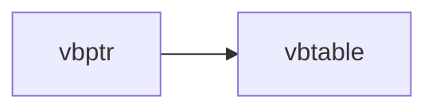
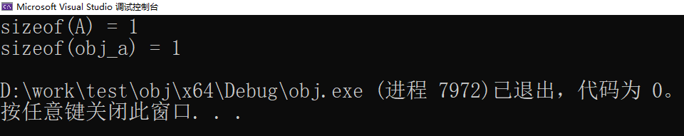
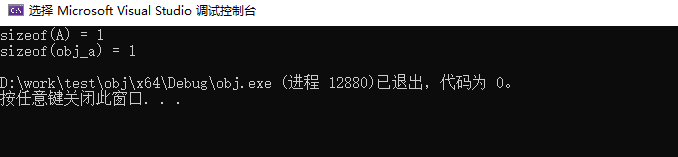
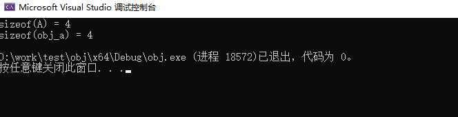
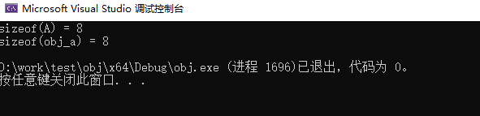

# C++提高笔记


<!--more-->

> 这个是我在学习`C++`语言中所记录的笔记,有可能会存在错误和遗漏,并且我有一点点C语言基础,
> 会大量的提及C语言与C++的不同,从而造成笔记晦涩;
> 另外C++的学习是一个长期且艰难的过程,因此本文进行了切分;

[C++基础笔记]()</br>
[C++提高笔记]()</br>
[C++增强笔记]()</br>
[C++模板笔记]()</br>

<!--more-->

## 类和对象

+ 类的访问属性
+ 类的继承属性

1. **public(公共)** 公共成员变量和方法可以被类的任何对象访问，也可以被其他类的对象访问。
2. **protected(受保护的)** 受保护的成员变量和方法可以被同一个类内的其他成员访问，也可以被该类的子类访问，但不能被其他类的对象访问。受保护的成员变量和方法可以被同一个类内的其他成员访问，也可以被该类的子类访问，但不能被其他类的对象访问。
3. **private (私有)** 私有成员变量和方法只能被同一个类内的其他成员（包括其他方法和构造函数）访问，而不能被类的对象或其他类的对象访问。

<table>
  <tbody>
    <tr>
      <td>继承属性\访问属性</td>
      <td>public</td>
      <td>protected</td>
      <td>private</td>
    </tr>
    <tr>
      <td>public</td>
      <td>public</td>
      <td>protected</td>
      <td>private</td>
    </tr>
    <tr>
      <td>protected</td>
      <td></td>
      <td></td>
      <td></td>
    </tr>
    <tr>
      <td>private</td>
      <td>private</td>
      <td>private</td>
      <td>private</td>
    </tr>
  </tbody>
  <colgroup>
    <col style="width: 25%;">
    <col style="width: 25%;">
    <col style="width: 25%;">
    <col style="width: 25%;">
  </colgroup>
</table>

```cpp
#include <iostream>

class BaseClass {
private:

	int BaseClassPrivate;

public:

	int BaseClassPublic;

	void read()
	{
		BaseClassPrivate = 1;
		BaseClassPublic  = 1;
		BaseClassProtected = 1;
	}

protected:

	int BaseClassProtected;
};

class DerivedClassPublic : public BaseClass {
	void read()
	{
		BaseClassPrivate = 1;
		BaseClassPublic  = 1;
		BaseClassProtected = 1;
	}
};

class DerivedClassPrivate : private BaseClass {

	void read()
	{
		BaseClassPrivate = 1;
		BaseClassPublic  = 1;
		BaseClassProtected = 1;
	}

};

class DerivedClassProtected: protected BaseClass {
	void read()
	{
		BaseClassPrivate = 1;
		BaseClassPublic  = 1;
		BaseClassProtected = 1;
	}
};

class DerivedClassPublicPublic : public DerivedClassPublic{
	void read()
	{
		BaseClassPrivate = 1;
		BaseClassPublic  = 1;
		BaseClassProtected = 1;
	}
};

class DerivedClassPrivatePublic : public DerivedClassPrivate{
	void read()
	{
		BaseClassPrivate = 1;
		BaseClassPublic  = 1;
		BaseClassProtected = 1;
	}
};

class DerivedClassProtectedPublic : public DerivedClassProtected {
	void read()
	{
		BaseClassPrivate = 1;
		BaseClassPublic  = 1;
		BaseClassProtected = 1;
	}
};

int main(int argc, char* argv[])
{
	BaseClass O0;
	DerivedClassPublic O1;
	DerivedClassPrivate O2;
	DerivedClassProtected O3;

	DerivedClassPublicPublic O4;
	DerivedClassPrivatePublic O5;
	DerivedClassProtectedPublic O6;

	O0.BaseClassPrivate = 1; 	// 错误: 'int BaseClass::BaseClassPrivate' is private within this context
	O0.BaseClassPublic = 1;  	// 正确:
	O0.BaseClassProtected = 1;	// 错误: 'int BaseClass::BaseClassProtected' is protected within this context

	O1.BaseClassPrivate = 1; 	// 错误: 'int BaseClass::BaseClassPrivate' is private within this context
	O1.BaseClassPublic = 1;  	// 正确:
	O1.BaseClassProtected = 1;	// 错误: 'int BaseClass::BaseClassProtected' is protected within this context

	O2.BaseClassPrivate = 1; 	// 错误: 'int BaseClass::BaseClassPrivate' is private within this context
	O2.BaseClassPublic = 1;  	// 正确:
	O2.BaseClassProtected = 1;	// 错误: 'int BaseClass::BaseClassProtected' is protected within this context

	O3.BaseClassPrivate = 1; 	// 错误: 'int BaseClass::BaseClassPrivate' is private within this context
	O3.BaseClassPublic = 1;  	// 正确:
	O3.BaseClassProtected = 1;	// 错误: 'int BaseClass::BaseClassProtected' is protected within this context

	O4.BaseClassPrivate = 1; 	// 错误: 'int BaseClass::BaseClassPrivate' is private within this context
	O4.BaseClassPublic = 1;  	// 正确:
	O4.BaseClassProtected = 1;	// 错误: 'int BaseClass::BaseClassProtected' is protected within this context

	O5.BaseClassPrivate = 1; 	// 错误: 'int BaseClass::BaseClassPrivate' is private within this context
	O5.BaseClassPublic = 1;  	// 正确:
	O5.BaseClassProtected = 1;	// 错误: 'int BaseClass::BaseClassProtected' is protected within this context

	O6.BaseClassPrivate = 1; 	// 错误: 'int BaseClass::BaseClassPrivate' is private within this context
	O6.BaseClassPublic = 1;  	// 正确:
	O6.BaseClassProtected = 1;	// 错误: 'int BaseClass::BaseClassProtected' is protected within this context

	return 0;
}
```


### 成员函数

+ 成员函数 + delete表示删除此函数
+ 成员函数 + default表示默认函数
+ explicit: 关闭隐式类型转换
  - 关键字只能作用域类构造函数
  - 只作用单个参数的构造函数
+ final:
  - 第一个用在类，用于说明该类是继承体系下最后的一个类，不要其他类继承我，当继承时就会报错。
  - 第二个用在虚函数，表示这个虚函数不能再被override了，再override就会报错

**数据成员强化**

在 C++ 中，`mutable` 是一个关键字，它用于修饰某些类成员变量。`mutable` 的作用是允许在 const 成员函数中修改被 `mutable` 修饰的成员变量。

如果一个成员变量被声明为 `mutable`，那么即使在一个const成员函数中，也可以修改该成员变量的值。这个特性在一些特殊情况下非常有用，例如在维护缓存、统计调用次数或者记录日志时。

例如：

```c++
class MyClass {
public:
    int get_value() const {
        ++call_count; // 可以修改 call_count 值
        return value;
    }
private:
    int value;
    mutable int call_count = 0; // 被 mutable 修饰的成员变量
};
```

在上面的例子中，`call_count` 成员变量被声明为 `mutable`，因此即使在 `get_value()` 函数中，也可以对它进行修改。

需要注意的是，只有被声明为 `mutable` 的成员变量才能在 const 成员函数中修改，其他成员变量则不能被修改。这也符合 const 成员函数的语义，即不能修改对象状态。


### 虚函数与虚函数表

虚函数是一种特殊的成员函数，它允许派生类覆盖基类中的同名函数，并通过基类指针或引用调用派生类中的实现。具体来说，当通过基类指针或引用调用一个虚函数时，编译器会根据对象的实际类型（即运行时类型）来确定要调用哪个版本的函数。

在类定义中，可以将成员函数声明为虚函数，如下所示：

```c++
class Base {
public:
    virtual void foo() { std::cout << "Base::foo()" << std::endl; }
};

class Derived : public Base {
public:
    void foo() override { std::cout << "Derived::foo()" << std::endl; }
};
```

这里，`Base` 类定义了一个名为 `foo()` 的虚函数，在 `Derived` 中进行了重写。注意到在 `Derived` 中，我们使用了 `override` 关键字，这是 C++11 中的新特性，用于明确表示我们正在重写一个虚函数。如果基类中并没有该函数，则编译器会给出错误提示。

对于一个虚函数，有以下几个注意点：

1. 虚函数必须通过指针或引用调用才能实现动态多态。
2. 构造函数不能是虚函数，因为在对象构造期间虚表还未建立。
3. 静态函数和成员函数不能是虚函数，因为它们不属于对象，不存在多态。

虚函数是实现 C++ 运行时多态的关键机制之一，它使得基类指针或引用在运行时能够调用派生类中的函数，从而实现基于实际对象类型的动态绑定。

总结:

+ override用于虚函数,上面的`virtual void func(int)`实际上不是重写父类的虚函数,而是定义一个新的虚函数;
+ 我们的本意是重写虚函数,当不加overrride的时候,这样写编译器不会报错
+ 那如果像下面加上override的话，则会报错，表示告诉了编译器，我确实要重写，但写错了，没有重写，于是就报错了
+ 这样就能给我们对虚函数的重写做检查!

虚函数表（Virtual Table），也称为 V-Table，是实现 C++ 运行时多态的关键机制之一。每个包含虚函数的类都有一个与之对应的虚函数表。

虚函数表是一个指向虚函数地址的指针数组，其中存储了该类及其所有派生类中的所有虚函数的地址。通常情况下，虚函数表位于类对象实例的内存布局末尾，因此可以通过类对象的地址来访问。

```c++
class Base {
public:
    virtual void func1() { std::cout << "Base::func1()" << std::endl; }
    virtual void func2() { std::cout << "Base::func2()" << std::endl; }
};

class Derived : public Base {
public:
    void func1() override { std::cout << "Derived::func1()" << std::endl; }
    void func3() { std::cout << "Derived::func3()" << std::endl; }
};
```

在上述代码中，虚函数表会包含两个指针，分别指向 `Base::func1()` 和 `Base::func2()` 的实现。由于 `Derived` 重写了 `Base::func1()`，因此它需要自己的虚函数表，并在第一个指针中存储 `Derived::func1()` 的地址。另外，由于 `Derived` 中定义了一个非虚函数 `func3()`，因此它不会出现在虚函数表中。

当我们使用基类指针或引用调用虚函数时，编译器会在运行时根据对象的实际类型（即运行时类型）查找正确的虚函数地址，并进行动态绑定。

```
g++ -fdump-lang-class test.cpp
cl /d1 reportSingleClassLayoutDerived "test.cpp"
```

下面是msvc表现

```cmd
cl /d1 reportSingleClassLayoutDerived "test.cpp"
用于 x86 的 Microsoft (R) C/C++ 优化编译器 19.30.30709 版
版权所有(C) Microsoft Corporation。保留所有权利。

test.cpp

class Derived   size(4):
        +---
 0      | +--- (base class Base)
 0      | | {vfptr}
        | +---
        +---

Derived::$vftable@:
        | &Derived_meta
        |  0
 0      | &Derived::func1
 1      | &Base::func2

Derived::func1 this adjustor: 0
C:\Program Files\Microsoft Visual Studio\2022\Community\VC\Tools\MSVC\14.30.30705\include\ostream(743): warning C4530: 使用了 C++ 异常处理程序，但未启用展开语义。请指定 /EHsc
test.cpp(4): note: 查看对正在编译的函数 模板 实例化“std::basic_ostream<char,std::char_traits<char>> &std::operator <<<std::char_traits<char>>(std::basic_ostream<char,std::char_traits<char>> &,const char *)”的引用
Microsoft (R) Incremental Linker Version 14.30.30709.0
Copyright (C) Microsoft Corporation.  All rights reserved.

/out:test.exe
test.obj
```

### class与struct的区别

1. 默认访问控制：对于类(class)来说，默认情况下成员是私有(private)的，而结构体(struct)的成员默认是公有(public)的。
2. 成员函数：类(class)允许在内部声明成员函数，而结构体(struct)不允许。但是，在C++11标准后，结构体也可以定义成员函数了。
3. 继承：类(class)和结构体(struct)都支持继承，但是类(class)默认是私有继承(private inheritance)，而结构体(struct)默认是公有继承(public inheritance)。
4. 类型转换：类(class)可以定义类型转换操作符，而结构体(struct)不行。
5. 使用习惯：通常情况下，当我们需要描述一个“轻量级”的数据类型时，用结构体(struct)更合适；而当我们需要描述一个“重量级”的数据类型时，用类(class)更为恰当。

### 构造函数和析构函数

对象的初始化和清理
* 构造函数有参数
* 析构函数没有参数
* 二者都没有返回值

### 拷贝构造函数

```cpp
class Person {
public:
    /* 构造函数 */
    Person(std::string name, int age) {
        std::cout << "构造函数" << std::endl;
    }

    /* 析构函数 */
    ~Person() {
        std::cout << "析构函数" << std::endl;
    }

    /* 拷贝构造函数 */
    Person(const Person &p) {
        std::cout << "拷贝构造函数" << std::endl;
    }
};
```

* 调用无参构造函数的时候不可以添加();否则就会产生函数声明的效果

```cpp
Person testPerson();	// 表面上是执行构造函数
int func();				// 类似函数声明
```

**构造函数强化**

在 C++ 中，explicit 是一个关键字，它用于修饰构造函数，它的主要作用是防止编译器进行隐式转换。

具体来说，如果一个构造函数被声明为 explicit，那么它就只能用于显式地创建一个新对象，而不能被用于隐式地转换一个类型到另一个类型。这样可以避免一些不必要的类型转换导致的错误，同时也使代码更加易于理解和维护。

例如：

```c++
class A {
public:
    explicit A(int n) { /*...*/ }
};

void func(A a) { /*...*/ }

int main() {
    A a(10); // OK
    A b = 20; // 编译错误，禁止隐式转换
    func(A(30)); // OK，显式创建一个 A 类型的对象
}
```

在上面的例子中，因为 A 的构造函数被声明为 explicit，所以只能通过显式地调用构造函数来创建一个 A 对象，而不能通过将一个 int 类型的值隐式地转换为 A 类型。


### 拷贝构造函数的调用时机

* 使用一个已经创建完毕的对象初始化一个新对象
* 值传递的方式给函数进行参数传递
* 以值的方式返回局部对象

### 构造函数的调用规则
默认情况下:C++编译器至少给一个类添加3个函数
1. 默认构造函数(无参)
2. 默认析构函数(无参)
3. 默认拷贝函数,对属性值进行拷贝

构造函数构造规则如下:

* 用户定义有参构造,C++默认不提供无参构造，但是提供默认拷贝构造
* 用户定义拷贝构造,C++不提供其他构造函数

### 深拷贝和浅拷贝

* 浅拷贝: 简单的复制操作
* 深拷贝: 在堆区重新申请空间，进行复制操作

## 初始化列表

作用:C++提供了初始化列表语法,用来初始化属性;

语法:

```c++
构造函数(): 属性1(值1),属性2(值2),属性3(值3)
{
	/* 函数体 */
}
```

## 类对象作为类成员

### 静态成员
静态成员就是在静态成员变量和成员函数前加上static,称为静态成员;

- 静态成员变量
	+ 所有对象共享一份数据
	+ 编译阶段分配内存
	+ 类内声明,类外初始化
- 静态成员函数
	+ 所有对象共享同一个函数
	+ 静态成员函数只能访问静态成员变量
```c++
class Person {
public:
    static int age;
    static void func()
    {
        std::cout << "静态成员函数" << std::endl;
    }
};
/* 通过对象访问 */
Person p;
p.func();
/* 通过类访问 */
Person::func();
```
### 成员变量和成员函数分开存储
1. 非静态成员,		属于类的对象
2. 静态成员,		不属于类的对象
3. 非静态成员函数,	    不属于类的对象
4. 静态成员函数,          不属于类的对象

**空对象大小为1**

## C++对象模型

## this指针

**this指针指向被调用成员函数所属的对象**
this指针本质：指针常量

## 空指针访问成员函数
C++空指针也是可以访问成员函数的,但是要注意的this指针;

## const修饰成员函数

**常函数:**
+  常函数不可以修改成员属性
+  成员属性加上mutable,常函数也可以修改
** 常对象**
+ 对象之前加const表示常对象
+ 常对象只能调用函数

执行原理

```c++
this ==> Person * const this;
后面新追加的const则会造成
const Person * const this;
```
```c++
class Person {
public:
    int m_A;
    mutable int m_B;
    void showPerson() const
    {
        m_A = 10; /* 错误,不可修改 */
        m_B = 10; /* 正确,可以修改 */
    }
};
```
## 友元
+ 全局函数
+ 全局类
+ 成员函数

## 运算符重载

重载的原理:对已有的运算符进行重新定义,赋予新的功能含义;

### 通过成员函数重载运算符

```c++
class Person {
public:
    int m_A;
    int m_B;

    /* 使用成员函数实现 */
    Person PersonAddPerson(Person &p)
    {
        Person t;
        t.m_A = this->m_A + p.m_A;
        t.m_B = this->m_B + p.m_B;
        return t;
    }

    /* 重载+ */
    Person operator+(Person &p)
    {
        Person t;
        t.m_A = this->m_A + p.m_A;
        t.m_B = this->m_B + p.m_B;
        return t;
    }
};

int main(int argc, char *argv[])
{
    Person p1;
    Person p2;

    Person p3 = p1.PersonAddPerson(p2);

    Person p4 = p1.operator+(p2);

    Person p5 = p1 + p2;

    return 0;
}
```


### 通过全局函数重载

```c++
Person operator+(Person &p1, Person &p2)
{
    Person t;
    t.m_A = p1.m_A + p2.m_A;
    t.m_B = p2.m_B + p2.m_B;
    return t;
}
```

### 重载左移运算符
```c++
std::ostream &operator<<(std::ostream &cout, Person &p)
{
    cout << p.m_A << p.m_B;
    return cout;
}
```

### 递增重载++

注意:
+ 前置递增  **p++**
+ 后置递增 **++p**

### 重载例子(复数)

```c++
#include <iostream>

class Complex {
    friend std::ostream &operator<<(std::ostream &cout, Complex p);

public:
    Complex(int i, int j);

    Complex();

    /* 重载+ */
    Complex operator+(Complex &p)
    {
        Complex t;
        t.i = this->i + p.i;
        t.j = this->j + p.j;
        return t;
    }
    /* 重载前置++ */
    Complex& operator++()
    {
        this->i++;
        this->j++;
        return *this;
    }

    /* 重载后置++ */
    Complex operator++(int)
    {
        Complex t;

        /* 记录 */
        t.i = this->i;
        t.j = this->j;

        /* 递增 */
        this->i++;
        this->j++;

        return t;
    }

    /* 重载= */
    Complex& operator=(Complex &p)
    {
        this->i = p.i;
        this->j = p.j;

        return *this;
    }
private:
    int i;  /* 实部 */
    int j;  /* 虚部 */
};

/* 构造函数 */
Complex::Complex(int i, int j)
{
    this->i = i;
    this->j = j;
}

Complex::Complex()
{
    this->i = 0;
    this->j = 0;
}

std::ostream &operator<<(std::ostream &cout, Complex p)
{
    cout << p.i << "+" << p.j << "i";
    return cout;
}

int main(int argc, char *argv[])
{
    Complex p1(1, 2);
    Complex p2(3, 4);

    std::cout << p1 << std::endl;
    std::cout << p2 << std::endl;
    std::cout << p1 + p2 << std::endl;

    std::cout << ++p1 << std::endl;
    std::cout << p2++ << std::endl;

    Complex p3 = p2 = p1;
    std::cout << p1 << " " << p2 << " " << p3 << std::endl;

    return 0;
}
```

## 继承

减少重复代码

```c++
class 子类 : 继承方式 父类
```

父类:基类
子类:派生类

### 继承方式

+ 公共继承
+ 保护继承
+ 私有继承

### 继承中的对象模型

### 构造和析构的顺序

> 先构造父类再构造子类
> 先析构子类再析构父类

### 继承中同名成员处理

+ 访问子类中同名成员,直接访问即可   s.m_A
+ 访问父类中同名成员,需要加上作用域 s.Base:m_A

## 多重继承

C++允许一个类继承多个基类

```c++
class 子类 : 继承方式 父类1, 继承方式 父类2...
```
> 冲突解决：加上类名

### 菱形继承

菱形继承是指一个派生类同时继承自两个直接或间接基类，而这两个基类又共同继承自同一个虚基类的情况。这样就会出现一个“菱形”继承结构，其中最顶层的虚基类在派生类中只存在一份实例，而不会被重复继承。

孙子类继承了子类1和子类2,但是继承了两次父类。

```asciiarmor
   +---------+
   |  Shape  |
   +---------+
        |
   +---------+
   |  Point  |
   +---------+
    /       \
+------+  +------+
| Line |  | Circle |
+------+  +------+
        |
   +---------+
   |  Draw   |
   +---------+
```

1. 内存浪费：由于派生类继承了多个基类，如果这些基类中有相同的成员变量，则在最终的派生类中会存在多份相同的成员变量，从而导致内存浪费。

2. 成员访问二义性：由于派生类同时继承了多个基类，因此可能会出现成员函数重名的情况，从而导致成员访问二义性。

为了解决这些问题，C++11 标准引入了关键字 final 和 override，可以在派生类中使用这两个关键字对继承关系进行限定和覆盖。此外，C++11 标准还引入了虚继承（virtual inheritance）的概念，可以避免多次继承同一个虚基类所带来的问题。

**那么final与override是如何保证继承的**

在C++中，final和override是两个关键字，用于控制虚函数的行为。

1. final:

final可以修饰类、函数和变量。当final修饰一个类时，该类不能被继承；当final修饰一个虚函数时，该虚函数不能被派生类重写（即不能被覆盖）。

例如，下面的代码定义了一个基类Animal和一个派生类Cat。Cat中的meow()方法被声明成final，因此任何尝试对该方法进行覆盖的操作都会导致编译错误。

```c++
class Animal {
public:
    virtual void make_sound() const = 0;
};

class Cat : public Animal {
public:
    void make_sound() const override {
        std::cout << "Meow\n";
    }

    virtual void meow() const final {
        std::cout << "Meow Meow\n";
    }
};

class Garfield : public Cat {
public:
    void make_sound() const override {
        std::cout << "Purr\n";
    }

    // 下面这行会导致编译错误
    // void meow() const override {}
};
```

1. override:

override也是一个关键字，用于指示当前的函数是一个重写父类中同名虚函数的函数，从而提高代码可读性和健壮性。

例如，上面的代码中，派生类Garfield重写了虚函数make_sound()，我们可以使用override关键字来明确表示这一点。

```c++
class Garfield : public Cat {
public:
    void make_sound() const override {
        std::cout << "Purr\n";
    }

    // 明确指示当前函数是重写父类中的虚函数
    void meow() const override {}
};
```

总之，C++中的final和override关键字用于控制虚函数的行为，final表示一个虚函数不能再被重写，而override则用于明确表示一个函数是重写了父类中同名虚函数的函数。

```c++
/* 动物类 */
class Animal {
public:
    int m_age;
};
class Sheep : public Animal {}; /* 羊类 */
class Camel : public Animal {}; /* 驼类 */
class Alpaca : public Sheep, public Camel {}; /* 羊驼 */
int main(int argc, char *argv[])
{
    Alpaca a;
    a.Sheep::m_age = 18;
    a.Camel::m_age = 18;
    return 0;
}
```

> 虚继承
```c++
class Sheep : virtual public Animal {}; /* 羊类 */
class Camel : virtual public Animal {}; /* 驼类 */
```
### 虚基类指针(vbptr)



## 多态

+ 分类
	+ 静态多态: 重载
	+ 动态多态:虚函数
+ 区别
	+ 静态多态函数地址早绑定:编译期确定函数地址
	+ 动态多态函数地址晚绑定:运行期确定函数地址

父类接收子类的对象,在程序运行期间确定具体改调用那个函数;
+ 有继承关系

+ 子类重写父类的虚函数
  重写：函数完全一致

## 虚函数

> 只要有一个纯虚函数，就称为抽象类

1. 抽象类无法直接实例化对象
2. 抽象子类必须重写父类的纯虚函数,否则也是抽象类

### 虚析构和纯虚析构

虚析构函数是一个带有virtual关键字的类析构函数。它允许子类对象在被删除时调用它们自己的析构函数。这样可以确保在父类指针指向子类对象并且父类指针被delete时能正确地调用子类析构函数。

纯虚析构函数是一个虚析构函数，在其函数声明后面加上"= 0"来表示它是一个纯虚析构函数。它没有函数体，所有的派生类都必须实现自己的析构函数。纯虚析构函数使得基类成为了抽象类，不能直接被实例化。纯虚析构函数的作用是强制派生类实现自己的析构函数，以确保在对象被销毁时能正确地释放资源。

```c++
#include <iostream>

class Base {
public:
    virtual ~Base() {
        std::cout << "Base destructor called" << std::endl;
    }
};

class Derived : public Base {
public:
    ~Derived() {
        std::cout << "Derived destructor called" << std::endl;
    }
};

class Abstract {
public:
    virtual ~Abstract() = 0;
};

Abstract::~Abstract() {}

class Concrete : public Abstract {
public:
    ~Concrete() {
        std::cout << "Concrete destructor called" << std::endl;
    }
};

int main() {
    Base* b = new Derived();
    delete b;

    Abstract* a = new Concrete();
    delete a;

    return 0;
}
```

## C++对象模型(入门版)

> **C++对象模型研究什么?** </br>
> 研究系统内部底层的各种实现,"继承性, 多态性",更多的是围绕类和对象来讨论

### 类对象所占的空间

#### 最少也需要一个大小去保存地址

在C++中，空类（即没有成员变量和成员函数的类）的大小不为零。这是因为C++要确保每个对象都有一个唯一的地址，即使是空类也不例外。

根据C++标准的规定，一个空类的大小至少为1字节。这是因为对于任何对象，它占用的内存空间至少应该是1字节，以便能够获得一个唯一的地址。

虽然空类本身不包含任何数据成员，但是编译器通常会为空类添加一个字节的额外内存来确保其大小不为零。这样做是为了满足对空类对象的唯一性要求。

需要注意的是，空类的大小可能会受到编译器的优化影响。某些编译器可能会使用更小的大小来表示空类对象，但至少会满足标准规定的最小大小为1字节。

```c++
#include <iostream>
using namespace std;

class A {
public:
};

int main()
{
    A obj_a;

    cout << "sizeof(A) = " << sizeof(A) << endl;
    cout << "sizeof(obj_a) = " << sizeof(obj_a) << endl;
}
```



#### 类的成员函数不占用类对象空间


```c++
#include <iostream>
using namespace std;

class A {
public:
    void func1() {}
    void func2() {}
    void func3() {}
};

int main()
{
    A obj_a;

    cout << "sizeof(A) = " << sizeof(A) << endl;
    cout << "sizeof(obj_a) = " << sizeof(obj_a) << endl;
}
```



#### 成员变量是占用内存空间的

此时，如果新增一个变量

```c++
#include <iostream>
using namespace std;

class A {
public:
    char a;
    void func1() {}
    void func2() {}
    void func3() {}
};

int main()
{
    A obj_a;

    cout << "sizeof(A) = " << sizeof(A) << endl;
    cout << "sizeof(obj_a) = " << sizeof(obj_a) << endl;
}

```

此时的结果还是1,那么，大小是谁呢?

类中的一个char成员

### 对象结构的发展和演化

#### 非静态成员变量跟着对象走

```c++
#include <iostream>
using namespace std;

class A {
public:
    int a;
};

int main()
{
    A obj_a;

    cout << "sizeof(A) = " << sizeof(A) << endl;
    cout << "sizeof(obj_a) = " << sizeof(obj_a) << endl;
}
```

#### 静态成员变量跟着类走

> 保存在类中， 对象外面

```c++
#include <iostream>
using namespace std;

class A {
public:
    int a;
    static int b;
};

int main()
{
    A obj_a;

    cout << "sizeof(A) = " << sizeof(A) << endl;
    cout << "sizeof(obj_a) = " << sizeof(obj_a) << endl;
}
```



#### 成员函数

成员函数: 无论是静态还是非静态都是保存在类上

#### 虚函数

```c++
#include <iostream>
using namespace std;

class A {
public:
    virtual void func1() {}
};

int main()
{
    A obj_a;

    cout << "sizeof(A) = " << sizeof(A) << endl;
    cout << "sizeof(obj_a) = " << sizeof(obj_a) << endl;
}
```



只要存在一个虚函数，大小就会多8个字节；

**类** --> 虚函数表的指针 --> 指向虚函数

### `this`指针调整

```C++
#include <iostream>
using namespace std;

class A {
public:
    int a;
    A()
    {
        printf("A:[%s]的this指针是: %p\r\n", __func__, this);
    }
    void funcA()
    {
        printf("A:[%s]的this指针是: %p\r\n", __func__, this);
    }
};

class B {
public:
    int b;
    B()
    {
        printf("A:[%s]的this指针是: %p\r\n", __func__, this);
    }
    void funcB()
    {
        printf("A:[%s]的this指针是: %p\r\n", __func__, this);
    }
};

class C : public A, public B {
public:
    int c;
    C()
    {
        printf("A:[%s]的this指针是: %p\r\n", __func__, this);
    }
    void funcC()
    {
        printf("A:[%s]的this指针是: %p\r\n", __func__, this);
    }
};

int main()
{
    cout << "sizeof(A) " << sizeof(A) << endl;
    cout << "sizeof(B) " << sizeof(B) << endl;
    cout << "sizeof(C) " << sizeof(C) << endl;

    // this指针,多重继承
    C myc;
    myc.funcA();
    myc.funcB();
    myc.funcC();

    return EXIT_SUCCESS;
}
```

当前执行的结果

```console
sizeof(A) 4		# 一个成员变量
sizeof(B) 4     # 一个成员变量
sizeof(C) 12    # 一个成员变量 + 继承的两个成员变量

A:[A]的this指针是: 00000077968FF798
A:[B]的this指针是: 00000077968FF79C
A:[C]的this指针是: 00000077968FF798
A:[funcA]的this指针是: 00000077968FF798
A:[funcB]的this指针是: 00000077968FF79C
A:[funcC]的this指针是: 00000077968FF798

D:\work\test\obj\x64\Debug\obj.exe (进程 19444)已退出，代码为 0。
按任意键关闭此窗口. . .
```
_this指针调正.webp)

可以看出类A和类C的起始地址相同,但是怎么理解呢?

+ 派生类对象包含基类子对象的
+ 如果派生类只有一个父对象，那么派生类和基类子对象地址相同
+ 如果继承多个父对象，那么开始地址和第一个基类子对象相同

### 构造函数语意

### 拷贝构造函数语意

### 程序转化语意

### 程序的优化

### 成员初始化列表

## 补充知识

### 原始字符串(R表示法)

> 原始字符串将"(和)"用作定界符，并使用前缀R标识原始字符串：
> 表示程序不对字符串控制符的进行转义


```c++
#include <iostream>

int main()
{
    std::string str0 =   "hello\nworld";        // 正常情况下
    std::string str1 =   "hello\\nworld";       // C风格转化
    std::string str2 = R"(hello\nworld)";       // C++风格原始字符串
    
    std::cout << "escape string: " << str0 << std::endl;
    std::cout << "simple string: " << str1 << std::endl;
    std::cout << "orignl string: " << str2 << std::endl;
    return 0;
}
```

打印效果

```console
$ escape string: hello
$ world
$ simple string: hello\nworld
$ orignl string: hello\nworld
```
