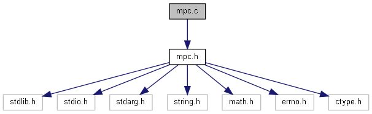
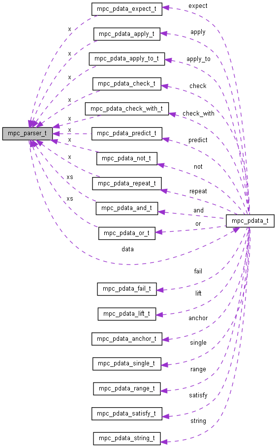
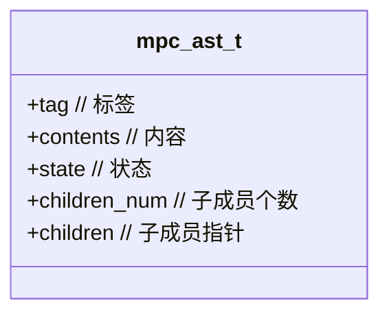

# 宏解析组合器


> Micro Parser Combinators源码分析

参考资料
[Build You Own Lisp](https://ksco.gitbooks.io/build-your-own-lisp)



## 编译运行

> 一个简单的计算器

```c
mpc_parser_t *Expr  = mpc_new("expression");
mpc_parser_t *Prod  = mpc_new("product");
mpc_parser_t *Value = mpc_new("value");
mpc_parser_t *Maths = mpc_new("maths");

mpca_lang(MPCA_LANG_DEFAULT,
  " expression : <product> (('+' | '-') <product>)*; "
  " product    : <value>   (('*' | '/')   <value>)*; "
  " value      : /[0-9]+/ | '(' <expression> ')';    "
  " maths      : /^/ <expression> /$/;               ",
  Expr, Prod, Value, Maths, NULL);

mpc_result_t r;

if (mpc_parse("input", input, Maths, &r)) {
  mpc_ast_print(r.output);
  mpc_ast_delete(r.output);
} else {
  mpc_err_print(r.error);
  mpc_err_delete(r.error);
}

mpc_cleanup(4, Expr, Prod, Value, Maths);
```

输入测试文本

```c
char *input = "1+2*3";
```

日志打印

```shell
  regex 
  expression|> 
    product|value|regex:1:1 '1'
    char:1:2 '+'
    product|> 
      value|regex:1:3 '2'
      char:1:4 '*'
      value|regex:1:5 '3'
  regex 
```

+ mpc_new(): 创建新的解析子
+ mpc_lang(): 利用已创建的解析子定义语言
+ mpc_parse(): 对输入字符串进行解析
+ mpc_result(): 返回解析后的结果
+ mpc_ast_print(): 打印解析成功时返回的结果
+ mpc_err_print(): 打印解析失败时返回的结果
+ mpc_ast_delete(): 释放被解析的表达式所占用的资源
+ mpc_cleanup(): 释放所有解析器所占用的资源。

## 数据结构

+ mpc_ast_t
+ mpc_err_t
+ mpc_input_t
+ mpc_result_t
+ mpc_state_t
+ mpc_parser_t

+ mpca_grammar_st_t	
+ mpca_stmt_t

### 解析状态

```c
typedef struct {
  long pos;
  long row;
  long col;
  int term;
} mpc_state_t;
```

### 解析子

```c
// 定义解析函数
typedef void(*mpc_dtor_t)(mpc_val_t*);
typedef mpc_val_t*(*mpc_ctor_t)(void);

typedef mpc_val_t*(*mpc_apply_t)(mpc_val_t*);
typedef mpc_val_t*(*mpc_apply_to_t)(mpc_val_t*,void*);
typedef mpc_val_t*(*mpc_fold_t)(int,mpc_val_t**);

typedef int(*mpc_check_t)(mpc_val_t**);
typedef int(*mpc_check_with_t)(mpc_val_t**,void*);

// 定义数据类型
typedef struct { char *m; } mpc_pdata_fail_t;
typedef struct { mpc_ctor_t lf; void *x; } mpc_pdata_lift_t;
typedef struct { mpc_parser_t *x; char *m; } mpc_pdata_expect_t;
typedef struct { int(*f)(char,char); } mpc_pdata_anchor_t;
typedef struct { char x; } mpc_pdata_single_t;
typedef struct { char x; char y; } mpc_pdata_range_t;
typedef struct { int(*f)(char); } mpc_pdata_satisfy_t;
typedef struct { char *x; } mpc_pdata_string_t;
typedef struct { mpc_parser_t *x; mpc_apply_t f; } mpc_pdata_apply_t;
typedef struct { mpc_parser_t *x; mpc_apply_to_t f; void *d; } mpc_pdata_apply_to_t;
typedef struct { mpc_parser_t *x; mpc_dtor_t dx; mpc_check_t f; char *e; } mpc_pdata_check_t;
typedef struct { mpc_parser_t *x; mpc_dtor_t dx; mpc_check_with_t f; void *d; char *e; } mpc_pdata_check_with_t;
typedef struct { mpc_parser_t *x; } mpc_pdata_predict_t;
typedef struct { mpc_parser_t *x; mpc_dtor_t dx; mpc_ctor_t lf; } mpc_pdata_not_t;
typedef struct { int n; mpc_fold_t f; mpc_parser_t *x; mpc_dtor_t dx; } mpc_pdata_repeat_t;
typedef struct { int n; mpc_parser_t **xs; } mpc_pdata_or_t;
typedef struct { int n; mpc_fold_t f; mpc_parser_t **xs; mpc_dtor_t *dxs;  } mpc_pdata_and_t;

typedef union {
  mpc_pdata_fail_t fail;
  mpc_pdata_lift_t lift;
  mpc_pdata_expect_t expect;
  mpc_pdata_anchor_t anchor;
  mpc_pdata_single_t single;
  mpc_pdata_range_t range;
  mpc_pdata_satisfy_t satisfy;
  mpc_pdata_string_t string;
  mpc_pdata_apply_t apply;
  mpc_pdata_apply_to_t apply_to;
  mpc_pdata_check_t check;
  mpc_pdata_check_with_t check_with;
  mpc_pdata_predict_t predict;
  mpc_pdata_not_t not;
  mpc_pdata_repeat_t repeat;
  mpc_pdata_and_t and;
  mpc_pdata_or_t or;
} mpc_pdata_t;

struct mpc_parser_t {
  char *name;
  mpc_pdata_t data;
  char type;
  char retained;
};
```



### 抽象语法树

```c
typedef struct mpc_ast_t {
  char *tag;
  char *contents;
  mpc_state_t state;
  int children_num;
  struct mpc_ast_t** children;
} mpc_ast_t;
```



### 输入信息描述

```c
typedef struct {

  int type;
  char *filename;
  mpc_state_t state;

  char *string;
  char *buffer;
  FILE *file;

  int suppress;
  int backtrack;
  int marks_slots;
  int marks_num;
  mpc_state_t *marks;

  char *lasts;
  char last;

  size_t mem_index;
  char mem_full[MPC_INPUT_MEM_NUM];
  mpc_mem_t mem[MPC_INPUT_MEM_NUM];

} mpc_input_t;
```


## 流程分析

### 创建解析体

```c
static mpc_parser_t *mpc_undefined(void) {
  mpc_parser_t *p = calloc(1, sizeof(mpc_parser_t));
  p->retained = 0;
  p->type = MPC_TYPE_UNDEFINED;
  p->name = NULL;
  return p;
}

mpc_parser_t *mpc_new(const char *name) {
  mpc_parser_t *p = mpc_undefined();
  p->retained = 1;
  p->name = realloc(p->name, strlen(name) + 1);
  strcpy(p->name, name);
  return p;
}
```

但是稍加分析就会明白,创建mpc解析子仅仅使用填充了
**name**, **retained**, 
剩余的
**type = MPC_TYPE_UNDEFINED**,
**data**没有填充;

那么继续分析例子程序,可以得到,应该是`mpca_lang`,实现的解析子的填充

+ mpc_input_new_string --> 生成语言
+ 创建**mpca_grammar_st_t**保存**va_args**结构体,
+ `mpca_lang_st`解析语言生成AST

```c
static mpc_err_t *mpca_lang_st(mpc_input_t *i, mpca_grammar_st_t *st) {

  mpc_result_t r;
  mpc_err_t *e;
  mpc_parser_t *Lang, *Stmt, *Grammar, *Term, *Factor, *Base;

  Lang    = mpc_new("lang");
  Stmt    = mpc_new("stmt");
  Grammar = mpc_new("grammar");
  Term    = mpc_new("term");
  Factor  = mpc_new("factor");
  Base    = mpc_new("base");

  mpc_define(Lang, mpc_apply_to(
    mpc_total(mpc_predictive(mpc_many(mpca_stmt_fold, Stmt)), mpca_stmt_list_delete),
    mpca_stmt_list_apply_to, st
  ));

  mpc_define(Stmt, mpc_and(5, mpca_stmt_afold,
    mpc_tok(mpc_ident()), mpc_maybe(mpc_tok(mpc_string_lit())), mpc_sym(":"), Grammar, mpc_sym(";"),
    free, free, free, mpc_soft_delete
  ));

  mpc_define(Grammar, mpc_and(2, mpcaf_grammar_or,
      Term,
      mpc_maybe(mpc_and(2, mpcf_snd_free, mpc_sym("|"), Grammar, free)),
      mpc_soft_delete
  ));

  mpc_define(Term, mpc_many1(mpcaf_grammar_and, Factor));

  mpc_define(Factor, mpc_and(2, mpcaf_grammar_repeat,
    Base,
      mpc_or(6,
        mpc_sym("*"),
        mpc_sym("+"),
        mpc_sym("?"),
        mpc_sym("!"),
        mpc_tok_brackets(mpc_int(), free),
        mpc_pass()),
    mpc_soft_delete
  ));

  mpc_define(Base, mpc_or(5,
    mpc_apply_to(mpc_tok(mpc_string_lit()), mpcaf_grammar_string, st),
    mpc_apply_to(mpc_tok(mpc_char_lit()),   mpcaf_grammar_char, st),
    mpc_tok(mpc_and(3, mpcaf_fold_regex, mpc_regex_lit(), mpc_many(mpcf_strfold, mpc_oneof("ms")), mpc_lift_val(st), free, free)),
    mpc_apply_to(mpc_tok_braces(mpc_or(2, mpc_digits(), mpc_ident()), free), mpcaf_grammar_id, st),
    mpc_tok_parens(Grammar, mpc_soft_delete)
  ));

  mpc_optimise(Lang);
  mpc_optimise(Stmt);
  mpc_optimise(Grammar);
  mpc_optimise(Term);
  mpc_optimise(Factor);
  mpc_optimise(Base);

  if (!mpc_parse_input(i, Lang, &r)) {
    e = r.error;
  } else {
    e = NULL;
  }

  mpc_cleanup(6, Lang, Stmt, Grammar, Term, Factor, Base);

  return e;
}
```
