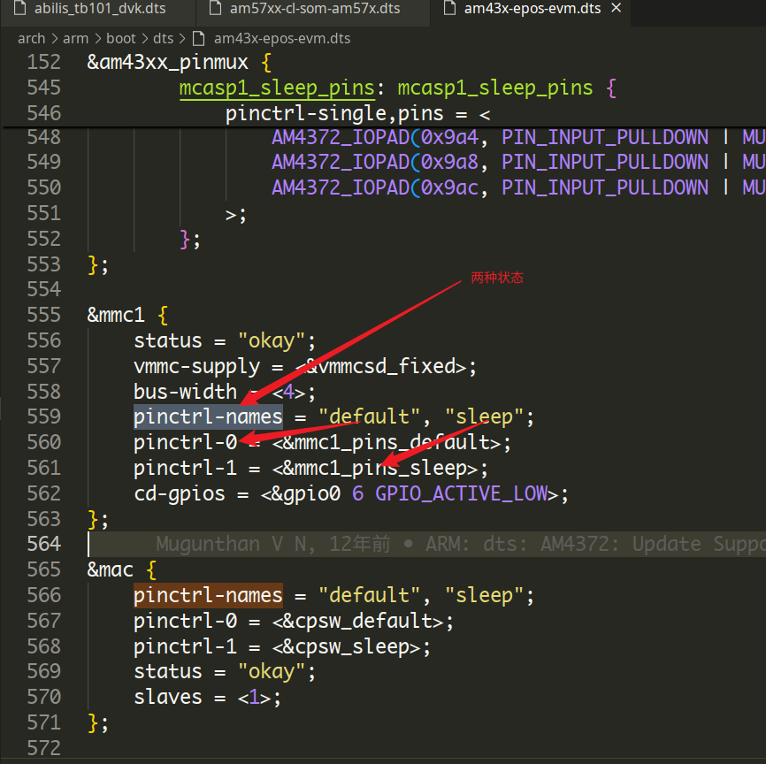
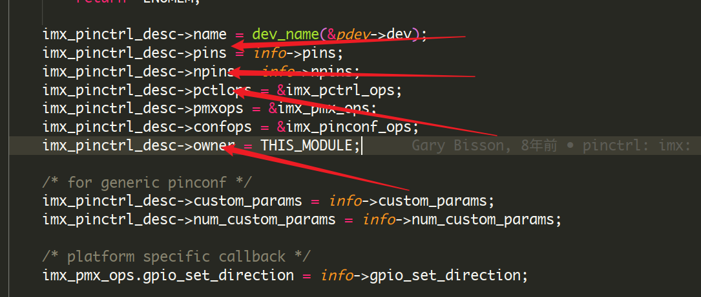
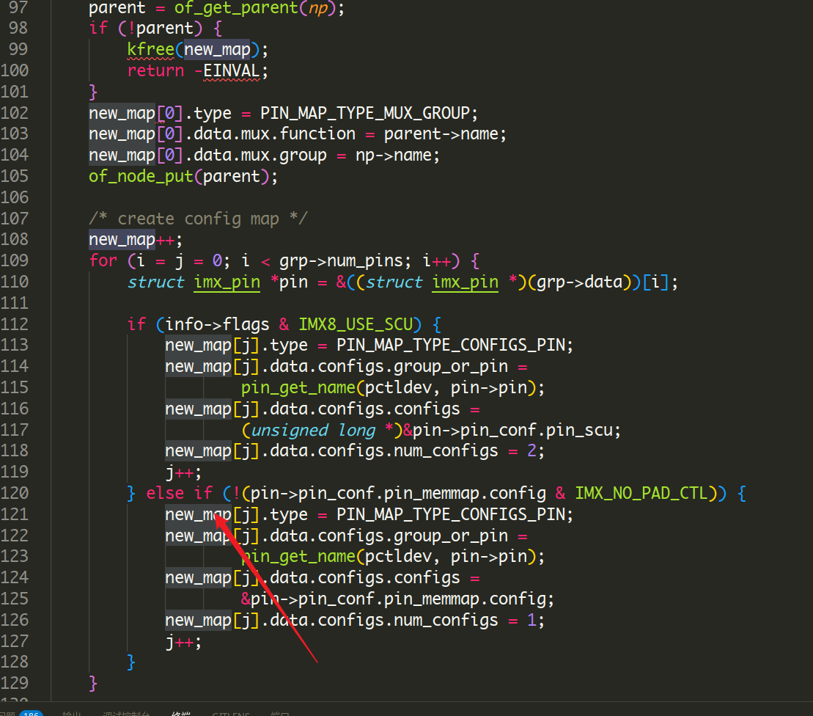
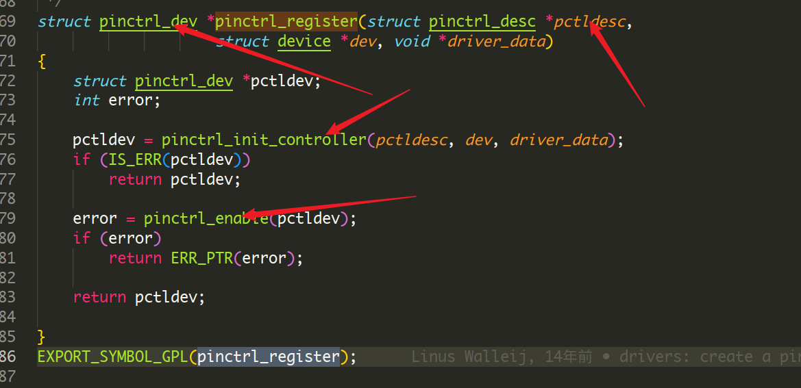
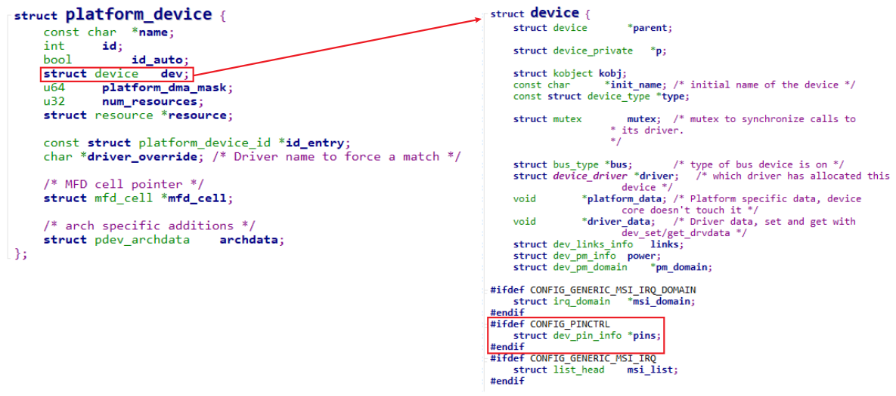
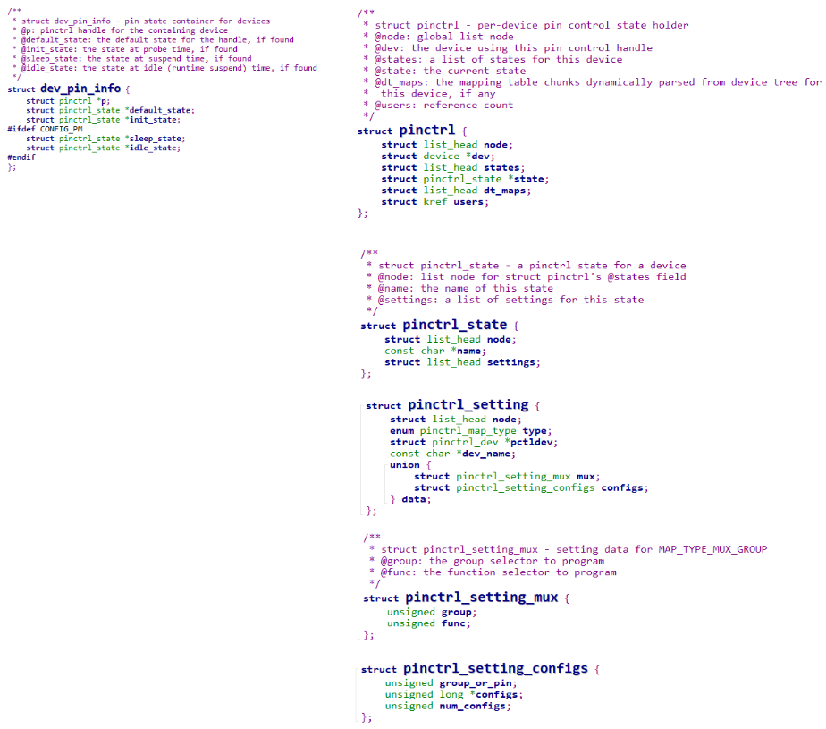
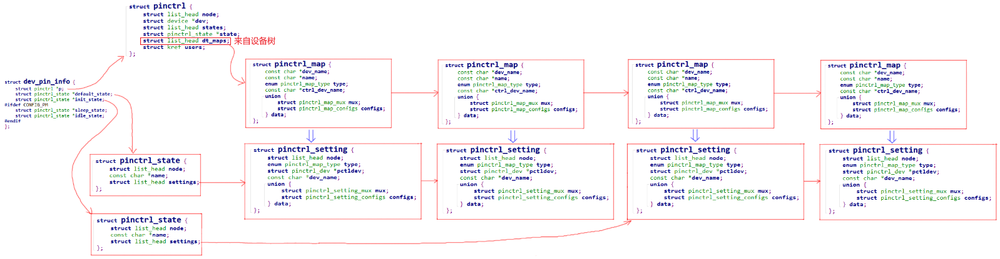
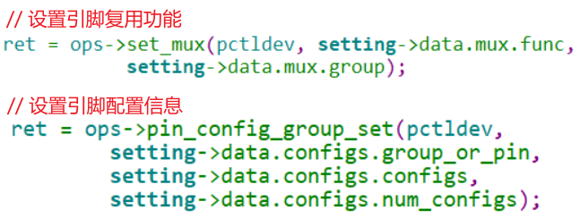

# Pinctrl驱动子系统笔记


<!--more-->
Pinctrl驱动子系统笔记
<!--more-->

## 概述

> pinctrl ==> pin controler的缩写

Pinctrl：Pin Controller，顾名思义，就是用来控制引脚的：

* 引脚枚举与命名(Enumerating and naming)
* 引脚复用(Multiplexing)：比如用作GPIO、I2C或其他功能
* 引脚配置(Configuration)：比如上拉、下来、open drain、驱动强度等


Pinctrl驱动由芯片厂家的BSP工程师提供，一般的驱动工程师只需要在设备树里：

* 指明使用那些引脚
* 复用为哪些功能
* 配置为哪些状态


## `pintrl`配置

### 在设备树中定义

**client**端定义



状态的对应:

`"default"` ==> `pinctrl-0 = <&mmc1_pins_default>;`
`"sleep"`  ==> `pinctrl-1 = <&mmc1_pins_sleep>`

上面的状态是如何实现的？

在类似的文件中

```dts
mmc1_pins_default: pinmux_mmc1_pins_default {
    pinctrl-single,pins = <
        AM4372_IOPAD(0x960, PIN_INPUT | MUX_MODE7) /* spi0_cs1.gpio0_6 */
    >;
};

mmc1_pins_sleep: pinmux_mmc1_pins_sleep {
    pinctrl-single,pins = <
        AM4372_IOPAD(0x960, DS0_PIN_OUTPUT_PULLUP | PIN_INPUT | MUX_MODE7)
    >;
};
```

可以得到定义实现

### pinctrl数据结构

记住pinctrl的三大作用，有助于理解所涉及的数据结构：

* 引脚枚举与命名(Enumerating and naming)
* 引脚复用(Multiplexing)：比如用作GPIO、I2C或其他功能
* 引脚配置(Configuration)：比如上拉、下来、open drain、驱动强度等

#### `pinctrl_desc和pinctrl_dev`

pincontroller虽然是一个软件的概念，但是它背后是有硬件支持的，所以可以使用一个结构体来表示它：pinctrl_dev。

怎么构造出pinctrl_dev？我们只需要描述它：提供一个pinctrl_desc，然后调用pinctrl_register就可以：

```c
struct pinctrl_dev *pinctrl_register(struct pinctrl_desc *pctldesc,
				    struct device *dev, void *driver_data);
```


**pinctrl_dev**

```c
struct pinctrl_dev {
	struct list_head node;
	struct pinctrl_desc *desc;
	struct radix_tree_root pin_desc_tree;
#ifdef CONFIG_GENERIC_PINCTRL_GROUPS
	struct radix_tree_root pin_group_tree;
	unsigned int num_groups;
#endif
#ifdef CONFIG_GENERIC_PINMUX_FUNCTIONS
	struct radix_tree_root pin_function_tree;
	unsigned int num_functions;
#endif
	struct list_head gpio_ranges;
	struct device *dev;
	struct module *owner;
	void *driver_data;
	struct pinctrl *p;
	struct pinctrl_state *hog_default;
	struct pinctrl_state *hog_sleep;
	struct mutex mutex;
#ifdef CONFIG_DEBUG_FS
	struct dentry *device_root;
#endif
};
```

**pinctrl_desc**

```c
struct pinctrl_desc {
	const char *name;
	const struct pinctrl_pin_desc *pins;
	unsigned int npins;
	const struct pinctrl_ops *pctlops;
	const struct pinmux_ops *pmxops;
	const struct pinconf_ops *confops;
	struct module *owner;
#ifdef CONFIG_GENERIC_PINCONF
	unsigned int num_custom_params;
	const struct pinconf_generic_params *custom_params;
	const struct pin_config_item *custom_conf_items;
#endif
};
```


imx6ull的pinctrl_desc,实现的函数名字
```c
int imx_pinctrl_probe(struct platform_device *pdev, const struct imx_pinctrl_soc_info *info);
```



在imx6ull中,

```c
static int imx6ul_pinctrl_probe(struct platform_device *pdev)
{
	const struct imx_pinctrl_soc_info *pinctrl_info;
	const struct of_device_id *match;

	pinctrl_info = of_device_get_match_data(&pdev->dev);
	if (!pinctrl_info)
		return -ENODEV;

	match = of_match_device(imx6ul_pinctrl_of_match, &pdev->dev);

	if (!match)
		return -ENODEV;

	pinctrl_info = (struct imx_pinctrl_soc_info *) match->data;

	return imx_pinctrl_probe(pdev, pinctrl_info);
}

static struct platform_driver imx6ul_pinctrl_driver = {
	.driver = {
		.name = "imx6ul-pinctrl",
		.of_match_table = of_match_ptr(imx6ul_pinctrl_of_match),
	},
	.probe = imx6ul_pinctrl_probe,
};
```

此时我们就明白设备树到pinctrl的实现


### 设备树到pinctrl_map的

在函数`imx_dt_node_to_map`实现

```c
struct pinctrl_maps {
	struct list_head node;
	const struct pinctrl_map *maps;
	unsigned num_maps;
};

struct pinctrl_map {
	const char *dev_name;
	const char *name;
	enum pinctrl_map_type type;
	const char *ctrl_dev_name;
	union {
		struct pinctrl_map_mux mux;
		struct pinctrl_map_configs configs;
	} data;
};
```




##### 1. 描述、获得引脚

使用pinctrl描述引脚

```c
static const struct pinctrl_pin_desc imx6ul_pinctrl_pads[] = {
	IMX_PINCTRL_PIN(MX6UL_PAD_RESERVE0),
	IMX_PINCTRL_PIN(MX6UL_PAD_RESERVE1),
	IMX_PINCTRL_PIN(MX6UL_PAD_RESERVE2),
	IMX_PINCTRL_PIN(MX6UL_PAD_RESERVE3),
	IMX_PINCTRL_PIN(MX6UL_PAD_RESERVE4),
	IMX_PINCTRL_PIN(MX6UL_PAD_RESERVE5),
	IMX_PINCTRL_PIN(MX6UL_PAD_RESERVE6),
	IMX_PINCTRL_PIN(MX6UL_PAD_RESERVE7),
	IMX_PINCTRL_PIN(MX6UL_PAD_RESERVE8),
	IMX_PINCTRL_PIN(MX6UL_PAD_RESERVE9),
	IMX_PINCTRL_PIN(MX6UL_PAD_RESERVE10),
	IMX_PINCTRL_PIN(MX6UL_PAD_SNVS_TAMPER4),
	IMX_PINCTRL_PIN(MX6UL_PAD_RESERVE12),
	IMX_PINCTRL_PIN(MX6UL_PAD_RESERVE13),
	IMX_PINCTRL_PIN(MX6UL_PAD_RESERVE14),
	IMX_PINCTRL_PIN(MX6UL_PAD_RESERVE15),
	IMX_PINCTRL_PIN(MX6UL_PAD_RESERVE16),
	IMX_PINCTRL_PIN(MX6UL_PAD_JTAG_MOD),
	IMX_PINCTRL_PIN(MX6UL_PAD_JTAG_TMS),
	IMX_PINCTRL_PIN(MX6UL_PAD_JTAG_TDO),
	IMX_PINCTRL_PIN(MX6UL_PAD_JTAG_TDI),
	IMX_PINCTRL_PIN(MX6UL_PAD_JTAG_TCK),
	IMX_PINCTRL_PIN(MX6UL_PAD_JTAG_TRST_B),
	IMX_PINCTRL_PIN(MX6UL_PAD_GPIO1_IO00),
	IMX_PINCTRL_PIN(MX6UL_PAD_GPIO1_IO01),
	IMX_PINCTRL_PIN(MX6UL_PAD_GPIO1_IO02),
	IMX_PINCTRL_PIN(MX6UL_PAD_GPIO1_IO03),
	IMX_PINCTRL_PIN(MX6UL_PAD_GPIO1_IO04),
	IMX_PINCTRL_PIN(MX6UL_PAD_GPIO1_IO05),
	IMX_PINCTRL_PIN(MX6UL_PAD_GPIO1_IO06),
	IMX_PINCTRL_PIN(MX6UL_PAD_GPIO1_IO07),
	IMX_PINCTRL_PIN(MX6UL_PAD_GPIO1_IO08),
	IMX_PINCTRL_PIN(MX6UL_PAD_GPIO1_IO09),
	IMX_PINCTRL_PIN(MX6UL_PAD_UART1_TX_DATA),
	IMX_PINCTRL_PIN(MX6UL_PAD_UART1_RX_DATA),
	IMX_PINCTRL_PIN(MX6UL_PAD_UART1_CTS_B),
	IMX_PINCTRL_PIN(MX6UL_PAD_UART1_RTS_B),
	IMX_PINCTRL_PIN(MX6UL_PAD_UART2_TX_DATA),
	IMX_PINCTRL_PIN(MX6UL_PAD_UART2_RX_DATA),
	IMX_PINCTRL_PIN(MX6UL_PAD_UART2_CTS_B),
	IMX_PINCTRL_PIN(MX6UL_PAD_UART2_RTS_B),
	IMX_PINCTRL_PIN(MX6UL_PAD_UART3_TX_DATA),
	IMX_PINCTRL_PIN(MX6UL_PAD_UART3_RX_DATA),
	IMX_PINCTRL_PIN(MX6UL_PAD_UART3_CTS_B),
	IMX_PINCTRL_PIN(MX6UL_PAD_UART3_RTS_B),
	IMX_PINCTRL_PIN(MX6UL_PAD_UART4_TX_DATA),
	IMX_PINCTRL_PIN(MX6UL_PAD_UART4_RX_DATA),
	IMX_PINCTRL_PIN(MX6UL_PAD_UART5_TX_DATA),
	IMX_PINCTRL_PIN(MX6UL_PAD_UART5_RX_DATA),
	IMX_PINCTRL_PIN(MX6UL_PAD_ENET1_RX_DATA0),
	IMX_PINCTRL_PIN(MX6UL_PAD_ENET1_RX_DATA1),
	IMX_PINCTRL_PIN(MX6UL_PAD_ENET1_RX_EN),
	IMX_PINCTRL_PIN(MX6UL_PAD_ENET1_TX_DATA0),
	IMX_PINCTRL_PIN(MX6UL_PAD_ENET1_TX_DATA1),
	IMX_PINCTRL_PIN(MX6UL_PAD_ENET1_TX_EN),
	IMX_PINCTRL_PIN(MX6UL_PAD_ENET1_TX_CLK),
	IMX_PINCTRL_PIN(MX6UL_PAD_ENET1_RX_ER),
	IMX_PINCTRL_PIN(MX6UL_PAD_ENET2_RX_DATA0),
	IMX_PINCTRL_PIN(MX6UL_PAD_ENET2_RX_DATA1),
	IMX_PINCTRL_PIN(MX6UL_PAD_ENET2_RX_EN),
	IMX_PINCTRL_PIN(MX6UL_PAD_ENET2_TX_DATA0),
	IMX_PINCTRL_PIN(MX6UL_PAD_ENET2_TX_DATA1),
	IMX_PINCTRL_PIN(MX6UL_PAD_ENET2_TX_EN),
	IMX_PINCTRL_PIN(MX6UL_PAD_ENET2_TX_CLK),
	IMX_PINCTRL_PIN(MX6UL_PAD_ENET2_RX_ER),
	IMX_PINCTRL_PIN(MX6UL_PAD_LCD_CLK),
	IMX_PINCTRL_PIN(MX6UL_PAD_LCD_ENABLE),
	IMX_PINCTRL_PIN(MX6UL_PAD_LCD_HSYNC),
	IMX_PINCTRL_PIN(MX6UL_PAD_LCD_VSYNC),
	IMX_PINCTRL_PIN(MX6UL_PAD_LCD_RESET),
	IMX_PINCTRL_PIN(MX6UL_PAD_LCD_DATA00),
	IMX_PINCTRL_PIN(MX6UL_PAD_LCD_DATA01),
	IMX_PINCTRL_PIN(MX6UL_PAD_LCD_DATA02),
	IMX_PINCTRL_PIN(MX6UL_PAD_LCD_DATA03),
	IMX_PINCTRL_PIN(MX6UL_PAD_LCD_DATA04),
	IMX_PINCTRL_PIN(MX6UL_PAD_LCD_DATA05),
	IMX_PINCTRL_PIN(MX6UL_PAD_LCD_DATA06),
	IMX_PINCTRL_PIN(MX6UL_PAD_LCD_DATA07),
	IMX_PINCTRL_PIN(MX6UL_PAD_LCD_DATA08),
	IMX_PINCTRL_PIN(MX6UL_PAD_LCD_DATA09),
	IMX_PINCTRL_PIN(MX6UL_PAD_LCD_DATA10),
	IMX_PINCTRL_PIN(MX6UL_PAD_LCD_DATA11),
	IMX_PINCTRL_PIN(MX6UL_PAD_LCD_DATA12),
	IMX_PINCTRL_PIN(MX6UL_PAD_LCD_DATA13),
	IMX_PINCTRL_PIN(MX6UL_PAD_LCD_DATA14),
	IMX_PINCTRL_PIN(MX6UL_PAD_LCD_DATA15),
	IMX_PINCTRL_PIN(MX6UL_PAD_LCD_DATA16),
	IMX_PINCTRL_PIN(MX6UL_PAD_LCD_DATA17),
	IMX_PINCTRL_PIN(MX6UL_PAD_LCD_DATA18),
	IMX_PINCTRL_PIN(MX6UL_PAD_LCD_DATA19),
	IMX_PINCTRL_PIN(MX6UL_PAD_LCD_DATA20),
	IMX_PINCTRL_PIN(MX6UL_PAD_LCD_DATA21),
	IMX_PINCTRL_PIN(MX6UL_PAD_LCD_DATA22),
	IMX_PINCTRL_PIN(MX6UL_PAD_LCD_DATA23),
	IMX_PINCTRL_PIN(MX6UL_PAD_NAND_RE_B),
	IMX_PINCTRL_PIN(MX6UL_PAD_NAND_WE_B),
	IMX_PINCTRL_PIN(MX6UL_PAD_NAND_DATA00),
	IMX_PINCTRL_PIN(MX6UL_PAD_NAND_DATA01),
	IMX_PINCTRL_PIN(MX6UL_PAD_NAND_DATA02),
	IMX_PINCTRL_PIN(MX6UL_PAD_NAND_DATA03),
	IMX_PINCTRL_PIN(MX6UL_PAD_NAND_DATA04),
	IMX_PINCTRL_PIN(MX6UL_PAD_NAND_DATA05),
	IMX_PINCTRL_PIN(MX6UL_PAD_NAND_DATA06),
	IMX_PINCTRL_PIN(MX6UL_PAD_NAND_DATA07),
	IMX_PINCTRL_PIN(MX6UL_PAD_NAND_ALE),
	IMX_PINCTRL_PIN(MX6UL_PAD_NAND_WP_B),
	IMX_PINCTRL_PIN(MX6UL_PAD_NAND_READY_B),
	IMX_PINCTRL_PIN(MX6UL_PAD_NAND_CE0_B),
	IMX_PINCTRL_PIN(MX6UL_PAD_NAND_CE1_B),
	IMX_PINCTRL_PIN(MX6UL_PAD_NAND_CLE),
	IMX_PINCTRL_PIN(MX6UL_PAD_NAND_DQS),
	IMX_PINCTRL_PIN(MX6UL_PAD_SD1_CMD),
	IMX_PINCTRL_PIN(MX6UL_PAD_SD1_CLK),
	IMX_PINCTRL_PIN(MX6UL_PAD_SD1_DATA0),
	IMX_PINCTRL_PIN(MX6UL_PAD_SD1_DATA1),
	IMX_PINCTRL_PIN(MX6UL_PAD_SD1_DATA2),
	IMX_PINCTRL_PIN(MX6UL_PAD_SD1_DATA3),
	IMX_PINCTRL_PIN(MX6UL_PAD_CSI_MCLK),
	IMX_PINCTRL_PIN(MX6UL_PAD_CSI_PIXCLK),
	IMX_PINCTRL_PIN(MX6UL_PAD_CSI_VSYNC),
	IMX_PINCTRL_PIN(MX6UL_PAD_CSI_HSYNC),
	IMX_PINCTRL_PIN(MX6UL_PAD_CSI_DATA00),
	IMX_PINCTRL_PIN(MX6UL_PAD_CSI_DATA01),
	IMX_PINCTRL_PIN(MX6UL_PAD_CSI_DATA02),
	IMX_PINCTRL_PIN(MX6UL_PAD_CSI_DATA03),
	IMX_PINCTRL_PIN(MX6UL_PAD_CSI_DATA04),
	IMX_PINCTRL_PIN(MX6UL_PAD_CSI_DATA05),
	IMX_PINCTRL_PIN(MX6UL_PAD_CSI_DATA06),
	IMX_PINCTRL_PIN(MX6UL_PAD_CSI_DATA07),
};
```

使用pinctrl_ops来操作引脚，主要功能有二：

* 来取出某组的引脚：get_groups_count、get_group_pins
* 处理设备树中pin controller中的某个节点：dt_node_to_map，把device_node转换为一系列的pinctrl_map

```c
struct pinctrl_ops {
	int (*get_groups_count) (struct pinctrl_dev *pctldev);
	const char *(*get_group_name) (struct pinctrl_dev *pctldev,
				       unsigned selector);
	int (*get_group_pins) (struct pinctrl_dev *pctldev,
			       unsigned selector,
			       const unsigned **pins,
			       unsigned *num_pins);
	void (*pin_dbg_show) (struct pinctrl_dev *pctldev, struct seq_file *s,
			  unsigned offset);
	int (*dt_node_to_map) (struct pinctrl_dev *pctldev,
			       struct device_node *np_config,
			       struct pinctrl_map **map, unsigned *num_maps);
	void (*dt_free_map) (struct pinctrl_dev *pctldev,
			     struct pinctrl_map *map, unsigned num_maps);
};

static const struct pinctrl_ops imx_pctrl_ops = {
	.get_groups_count = pinctrl_generic_get_group_count,
	.get_group_name = pinctrl_generic_get_group_name,
	.get_group_pins = pinctrl_generic_get_group_pins,
	.pin_dbg_show = imx_pin_dbg_show,
	.dt_node_to_map = imx_dt_node_to_map,
	.dt_free_map = imx_dt_free_map,
};
```

##### 2. 引脚复用

使用`pinmux`描述

```c
struct pinmux_ops imx_pmx_ops = {
	.get_functions_count = pinmux_generic_get_function_count,
	.get_function_name = pinmux_generic_get_function_name,
	.get_function_groups = pinmux_generic_get_function_groups,
	.set_mux = imx_pmx_set,
};
```


##### 3. 引脚配置

```c
static const struct pinconf_ops imx_pinconf_ops = {
	.pin_config_get = imx_pinconf_get,
	.pin_config_set = imx_pinconf_set,
	.pin_config_dbg_show = imx_pinconf_dbg_show,
	.pin_config_group_dbg_show = imx_pinconf_group_dbg_show,
};
```


##### pinctrl_desc注册得到pinctrl_dev





使能`pinctrl`配置

```c
/* Global list of pin control devices (struct pinctrl_dev) */
static LIST_HEAD(pinctrldev_list);

int pinctrl_enable(struct pinctrl_dev *pctldev)
{
	int error;

	error = pinctrl_claim_hogs(pctldev);
	if (error) {
		dev_err(pctldev->dev, "could not claim hogs: %i\n",
			error);
		mutex_destroy(&pctldev->mutex);
		kfree(pctldev);

		return error;
	}

	mutex_lock(&pinctrldev_list_mutex);
	list_add_tail(&pctldev->node, &pinctrldev_list);
	mutex_unlock(&pinctrldev_list_mutex);

	pinctrl_init_device_debugfs(pctldev);

	return 0;
}
```

## client的数据结构




每一个device结构体都有一个dev_pin_info结构体,保存设备的pinctrl信息




假设芯片上有多个pin controller，那么这个设备使用哪个pin controller？

这需要通过设备树来确定：

* 分析设备树，找到pin controller
* 对于每个状态，比如default、init，去分析pin controller中的设备树节点
   * 使用pin controller的pinctrl_ops.dt_node_to_map来处理设备树的pinctrl节点信息，得到一系列的pinctrl_map
   * 这些pinctrl_map放在pinctrl.dt_maps链表中
   * 每个pinctrl_map都被转换为pinctrl_setting，放在对应的pinctrl_state.settings链表中




调用过程


最终调用到



