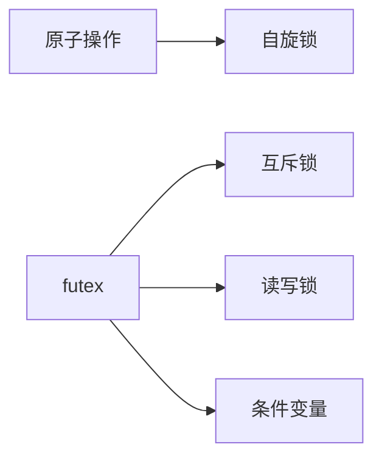
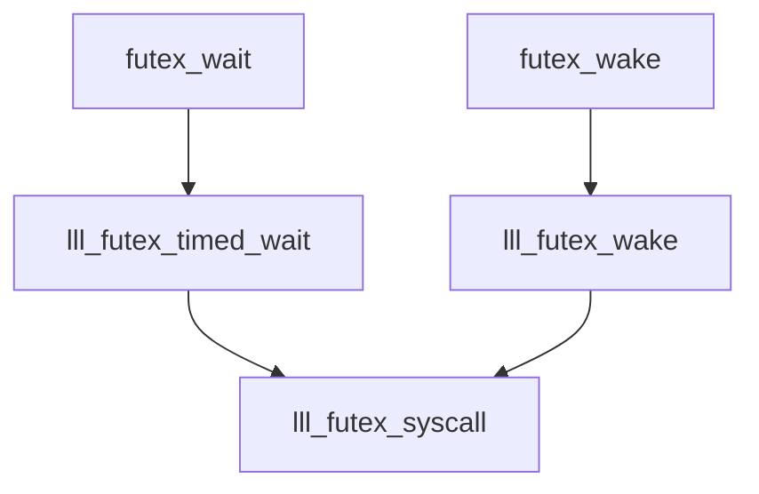

# pthread线程同步


## futex原理

> 高级锁的实现都是与futex实现相关

**Futex**是**Fast Userspace muTexes**的缩写

常用的锁都是通过futex实现的

+ mutex (互斥锁)
+ rwlock (读写锁)
+ cond  (条件变量)



```c
#include <linux/futex.h>      /* Definition of FUTEX_* constants */
#include <sys/syscall.h>      /* Definition of SYS_* constants */
#include <unistd.h>

long syscall(SYS_futex, uint32_t *uaddr, int futex_op, uint32_t val,
             const struct timespec *timeout,   /* or: uint32_t val2 */
             uint32_t *uaddr2, uint32_t val3);
```

+ uaddr
+ futex_op
+ val
+ timeout
+ uaddr2
+ val3


但是我并没有搞明白futex实现的原理,造成难以继续分析,
因此只能分析别人的文档(注:不分析原理,只进行使用)

主要存在文件`futex-internal.c/futex-internal.h,lowlevellock-futex.h,lowlevellock.c`

另外`lll->lowlevellock`缩写形式

其中futex提供的最重要的两个操作**wait**和**wake**

```c
// 可以使用的op定义类型
#define FUTEX_WAIT			0
#define FUTEX_WAKE			1
#define FUTEX_REQUEUE		3
#define FUTEX_CMP_REQUEUE	4
#define FUTEX_WAKE_OP		5

#define FUTEX_OP_CLEAR_WAKE_IF_GT_ONE	((4 << 24) | 1)

#define FUTEX_LOCK_PI		6
#define FUTEX_UNLOCK_PI		7
#define FUTEX_TRYLOCK_PI	8

#define FUTEX_WAIT_BITSET	9
#define FUTEX_WAKE_BITSET	10

#define FUTEX_WAIT_REQUEUE_PI   11
#define FUTEX_CMP_REQUEUE_PI    12

#define FUTEX_LOCK_PI2			13

#define FUTEX_PRIVATE_FLAG		128
#define FUTEX_CLOCK_REALTIME	256  
```

```
```


## futex实现

> futex接口的用户层界面封装

+ `futex_wait`
+ `futex_wake`

### musl实现

```c
#define lll_trylock(lock) 		原子的(lock 0 --> 1) 	// 不等待
#define lll_cond_trylock(lock) 	原子的(lock 0 --> 2)	// 不等待

#define lll_lock(futex, private) 
1. 原子的(futex 0 --> 1) // 等待 
2. __lll_lock_wait (futex, private)

#define __lll_cond_lock(futex, private)
1. 原子的(futex 0 --> 2) // 等待 
2. __lll_lock_wait (futex, private)

#define __lll_unlock(futex, private)
1. 原子的(futex ? --> 0) // 等待 
2. __lll_lock_wait (futex, private)

void __lll_lock_wake_private (int *futex);
void __lll_lock_wait_private (int *futex);
void __lll_lock_wait (int *futex, int private);
void __lll_lock_wake (int *futex, int private);

int lll_futex_wake(int *futex, int nr, int private);
int lll_futex_wait(int *futex, int val, int private);

int futex_wait(unsigned int *futex_word, unsigned int expected, int private);
void futex_wake(unsigned int* futex_word, int processes_to_wake, int private);

// 进入系统调用阶段
int lll_futex_syscall(int nargs, int *futexp, int op, ...);
```

那么进入到最后可以得知,一般会进行一些原子操作,启动的操作都是`INTERNAL_SYSCALL`进行实现的,然后就是`swi`指令实现的原理

### glibc实现




```c
# define lll_futex_wake(futexp, nr, private)                             	\
  lll_futex_syscall (4, futexp,                                         	\
		     __lll_private_flag (FUTEX_WAKE, private), nr, 0)

# define lll_futex_timed_wait(futexp, val, timeout, private)     			\
  lll_futex_syscall (4, futexp,                                 			\
		     __lll_private_flag (FUTEX_WAIT, private),  					\
		     val, timeout)
```

**进入到INTERNAL_SYSCALL**,详情可以查看[Linux系统调用]

```c
# define lll_futex_syscall(nargs, futexp, op, ...)                      	\
  ({                                                                    	\
    long int __ret = INTERNAL_SYSCALL (futex, nargs, futexp, op, 			\
				       __VA_ARGS__);                    					\
    (__glibc_unlikely (INTERNAL_SYSCALL_ERROR_P (__ret))         			\
     ? -INTERNAL_SYSCALL_ERRNO (__ret) : 0);                     			\
  })
```

## 原子操作

### musl实现

```c
static inline int a_ll(volatile int *p)
{
	int v;
	__asm__ __volatile__ ("ldrex %0, %1" : "=r"(v) : "Q"(*p));
	return v;
}

static inline int a_sc(volatile int *p, int v)
{
	int r;
	__asm__ __volatile__ ("strex %0,%2,%1" : "=&r"(r), "=Q"(*p) : "r"(v) : "memory");
	return !r;
}

static inline void a_barrier()
{
	__asm__ __volatile__ ("dmb ish" : : : "memory");
}

static inline int a_cas(volatile int *p, int t, int s)
{
	for (;;) {
		register int r0 __asm__("r0") = t;
		register int r1 __asm__("r1") = s;
		register volatile int *r2 __asm__("r2") = p;
		register uintptr_t r3 __asm__("r3") = __a_cas_ptr;
		int old;
		__asm__ __volatile__ (
			BLX " r3"
			: "+r"(r0), "+r"(r3) : "r"(r1), "r"(r2)
			: "memory", "lr", "ip", "cc" );
		if (!r0) return t;
		if ((old=*p)!=t) return old;
	}
}

static inline void a_barrier()
{
	register uintptr_t ip __asm__("ip") = __a_barrier_ptr;
	__asm__ __volatile__( BLX " ip" : "+r"(ip) : : "memory", "cc", "lr" );
}
```

### glibc实现

主要是gcc是实现的`__atomic`开头的函数,参考[GCC编译器手册](https://gcc.gnu.org/onlinedocs/gcc/_005f_005fatomic-Builtins.html#g_t_005f_005fatomic-Builtins)

+ `__atomic_load_n`
+ `__atomic_load`
+ `__atomic_store_n` 
+ `__atomic_store` 
+ `__atomic_exchange_n`
+ `__atomic_exchange`
+ `__atomic_compare_exchange_n` 
+ `__atomic_compare_exchange `
+ `__atomic_add_fetch`
+ ` __atomic_sub_fetch`
+ `__atomic_and_fetch`
+ `__atomic_xor_fetch`
+ `__atomic_or_fetch`
+ `__atomic_nand_fetch`
+ `__atomic_fetch_add `
+ `__atomic_fetch_sub`
+ `__atomic_fetch_and `
+ `__atomic_fetch_xor `
+ `__atomic_fetch_or`
+ `__atomic_fetch_nand `
+ `__atomic_test_and_set`
+ `__atomic_clear`
+ `__atomic_thread_fence`
+ `__atomic_signal_fence`
+ `__atomic_always_lock_free`
+ `__atomic_is_lock_free`


```c
#define atomic_load_relaxed(mem) \
 ({ __atomic_check_size_ls((mem));                                           \
    __atomic_load_n ((mem), __ATOMIC_RELAXED); })

#define atomic_load_acquire(mem) \
 ({ __atomic_check_size_ls((mem));                                           \
    __atomic_load_n ((mem), __ATOMIC_ACQUIRE); })
```

```c
#define atomic_store_relaxed(mem, val) \
 do {                                                                        \
   __atomic_check_size_ls((mem));                                            \
   __atomic_store_n ((mem), (val), __ATOMIC_RELAXED);                        \
 } while (0)

#define atomic_store_release(mem, val) \
 do {                                                                        \
   __atomic_check_size_ls((mem));                                            \
   __atomic_store_n ((mem), (val), __ATOMIC_RELEASE);                        \
 } while (0)
```

## 自旋锁

```c
int pthread_spin_init(pthread_spinlock_t *, int);
int pthread_spin_destroy(pthread_spinlock_t *);
int pthread_spin_lock(pthread_spinlock_t *);
int pthread_spin_trylock(pthread_spinlock_t *);
int pthread_spin_unlock(pthread_spinlock_t *);
```

### musl实现

spinlock句柄就是一个32位的数;

```c
typedef int pthread_spinlock_t;
```

五种函数的实现

```c
int pthread_spin_init(pthread_spinlock_t *s, int shared)
{
	return *s = 0;
}

int pthread_spin_destroy(pthread_spinlock_t *s)
{
	return 0;
}

int pthread_spin_lock(pthread_spinlock_t *s)
{
	while (*(volatile int *)s || a_cas(s, 0, EBUSY)) a_spin();
	return 0;
}

int pthread_spin_trylock(pthread_spinlock_t *s)
{
	return a_cas(s, 0, EBUSY);
}

int pthread_spin_unlock(pthread_spinlock_t *s)
{
	a_store(s, 0);
	return 0;
}
```

### glibc实现

glibc的实现就较为复杂了点

```c
typedef __pthread_spinlock_t pthread_spinlock_t;
typedef volatile int __pthread_spinlock_t;
```

+ 加上`__`作为内部使用的句柄
+ volatile使编译器强行读取

```c
int pthread_spin_init(pthread_spinlock_t *lock, int pshared)
{
  /* Relaxed MO is fine because this is an initializing store.  */
  atomic_store_relaxed(lock, 0);
  return 0;
}

int pthread_spin_destroy (pthread_spinlock_t *lock)
{
  /* Nothing to do.  */
  return 0;
}

int pthread_spin_lock (pthread_spinlock_t *lock)
{
	int val = 0;

#if ! ATOMIC_EXCHANGE_USES_CAS
	if (__glibc_likely(atomic_exchange_acquire(lock, 1) == 0)) {
		return 0;
	}
#else
	if (__glibc_likely(atomic_compare_exchange_weak_acquire(lock, &val, 1))) {
		return 0;
	}
#endif

	do {
		do {
			atomic_spin_nop();
			val = atomic_load_relaxed(lock);
		} while (val != 0);
	} while (!atomic_compare_exchange_weak_acquire (lock, &val, 1));
	return 0;
}

int pthread_spin_trylock(pthread_spinlock_t *lock)
{
#if ! ATOMIC_EXCHANGE_USES_CAS
	if (atomic_exchange_acquire (lock, 1) == 0) {
		return 0;
  	}
#else
	do {
		int val = 0;
		if (atomic_compare_exchange_weak_acquire (lock, &val, 1))
			return 0;
	} while (atomic_load_relaxed (lock) == 0);
#endif

	return EBUSY;
}

int pthread_spin_unlock(pthread_spinlock_t *lock)
{
	atomic_store_release(lock, 0);
	return 0;
}
```

## 内存屏障

```c
int pthread_barrier_init(pthread_barrier_t *__restrict, const pthread_barrierattr_t *__restrict, unsigned);
int pthread_barrier_destroy(pthread_barrier_t *);
int pthread_barrier_wait(pthread_barrier_t *);

int pthread_barrierattr_destroy(pthread_barrierattr_t *);
int pthread_barrierattr_getpshared(const pthread_barrierattr_t *__restrict, int *__restrict);
int pthread_barrierattr_init(pthread_barrierattr_t *);
int pthread_barrierattr_setpshared(pthread_barrierattr_t *, int);
```

```c
pthread_t p1, p2, p3;
pthread_barrier_t test_barrier;

void *test_thread(void *arg)
{
    // make gcc happy
    unsigned int sleep_time = (unsigned int)((unsigned long)arg);
    sleep(sleep_time);
    
    printf("wait begin %d\r\n", gettid());
    pthread_barrier_wait(&test_barrier);
    printf("wait finish\r\n");

    return NULL;
}

int main(int argc, char *argv[])
{
    pthread_barrier_init(&test_barrier, NULL, 4);

    pthread_create(&p1, NULL, &test_thread, (void *)1);
    pthread_create(&p2, NULL, &test_thread, (void *)2);
    pthread_create(&p3, NULL, &test_thread, (void *)3);
    
    // 设置线程分离
    pthread_detach(p1);
    pthread_detach(p2);
    pthread_detach(p3);

    printf("wait begin %d\r\n", gettid());
    pthread_barrier_wait(&test_barrier);
    printf("wait finish\r\n");
    pthread_barrier_destroy(&test_barrier);

    return 0;
}

```

打印日志

```txt
wait begin 352789
wait begin 352790
wait begin 352791
wait begin 352792
wait finish 352792
wait finish 352791
wait finish 352790
wait finish 352789
```


### musl实现

```c
// 初始化流程
int pthread_barrier_init(pthread_barrier_t *restrict b, 
                  const pthread_barrierattr_t *restrict a, unsigned count)
{
	if (count-1 > INT_MAX-1) return EINVAL;
	*b = (pthread_barrier_t){ ._b_limit = count-1 | (a?a->__attr:0) };
	return 0;
}
```

```c
int pthread_barrier_wait(pthread_barrier_t *b)
{
	int limit = b->_b_limit;
	struct instance *inst;

	/* Trivial case: count was set at 1 */
	if (!limit) return PTHREAD_BARRIER_SERIAL_THREAD;

	/* Process-shared barriers require a separate, inefficient wait */
	if (limit < 0) return pshared_barrier_wait(b);

	/* Otherwise we need a lock on the barrier object */
	while (a_swap(&b->_b_lock, 1))
		__wait(&b->_b_lock, &b->_b_waiters, 1, 1);
	inst = b->_b_inst;

	/* First thread to enter the barrier becomes the "instance owner" */
	if (!inst) {
		struct instance new_inst = { 0 };
		int spins = 200;
		b->_b_inst = inst = &new_inst;
		a_store(&b->_b_lock, 0);
		if (b->_b_waiters) __wake(&b->_b_lock, 1, 1);
		while (spins-- && !inst->finished)
			a_spin();
		a_inc(&inst->finished);
		while (inst->finished == 1)
			__syscall(SYS_futex,&inst->finished,FUTEX_WAIT|FUTEX_PRIVATE,1,0) != -ENOSYS
			|| __syscall(SYS_futex,&inst->finished,FUTEX_WAIT,1,0);
		return PTHREAD_BARRIER_SERIAL_THREAD;
	}

	/* Last thread to enter the barrier wakes all non-instance-owners */
	if (++inst->count == limit) {
		b->_b_inst = 0;
		a_store(&b->_b_lock, 0);
		if (b->_b_waiters) __wake(&b->_b_lock, 1, 1);
		a_store(&inst->last, 1);
		if (inst->waiters)
			__wake(&inst->last, -1, 1);
	} else {
		a_store(&b->_b_lock, 0);
		if (b->_b_waiters) __wake(&b->_b_lock, 1, 1);
		__wait(&inst->last, &inst->waiters, 0, 1);
	}

	/* Last thread to exit the barrier wakes the instance owner */
	if (a_fetch_add(&inst->count,-1)==1 && a_fetch_add(&inst->finished,1))
		__wake(&inst->finished, 1, 1);

	return 0;
}
```


```c
int pthread_barrier_destroy(pthread_barrier_t *b)
{
	if (b->_b_limit < 0) {
		if (b->_b_lock) {
			int v;
			a_or(&b->_b_lock, INT_MIN);
			while ((v = b->_b_lock) & INT_MAX)
				__wait(&b->_b_lock, 0, v, 0);
		}
		__vm_wait();
	}
	return 0;
}

void __wait(volatile int *addr, volatile int *waiters, int val, int priv)
{
	int spins=100;
	if (priv) priv = FUTEX_PRIVATE;
	while (spins-- && (!waiters || !*waiters)) {
		if (*addr==val) a_spin();
		else return;
	}
	if (waiters) a_inc(waiters);
	while (*addr==val) {
		__syscall(SYS_futex, addr, FUTEX_WAIT|priv, val, 0) != -ENOSYS
		|| __syscall(SYS_futex, addr, FUTEX_WAIT, val, 0);
	}
	if (waiters) a_dec(waiters);
}
```


### glibc实现

```c
int
___pthread_barrier_init (pthread_barrier_t *barrier,
			const pthread_barrierattr_t *attr, unsigned int count)
{
  ASSERT_TYPE_SIZE (pthread_barrier_t, __SIZEOF_PTHREAD_BARRIER_T);
  ASSERT_PTHREAD_INTERNAL_SIZE (pthread_barrier_t,
				struct pthread_barrier);

  struct pthread_barrier *ibarrier;

  /* XXX EINVAL is not specified by POSIX as a possible error code for COUNT
     being too large.  See pthread_barrier_wait for the reason for the
     comparison with BARRIER_IN_THRESHOLD.  */
  if (__glibc_unlikely (count == 0 || count >= BARRIER_IN_THRESHOLD))
    return EINVAL;

  const struct pthread_barrierattr *iattr
    = (attr != NULL
       ? (struct pthread_barrierattr *) attr
       : &default_barrierattr);

  ibarrier = (struct pthread_barrier *) barrier;

  /* Initialize the individual fields.  */
  ibarrier->in = 0;
  ibarrier->out = 0;
  ibarrier->count = count;
  ibarrier->current_round = 0;
  ibarrier->shared = (iattr->pshared == PTHREAD_PROCESS_PRIVATE
		      ? FUTEX_PRIVATE : FUTEX_SHARED);

  return 0;
}
```

```c
int
___pthread_barrier_wait (pthread_barrier_t *barrier)
{
  struct pthread_barrier *bar = (struct pthread_barrier *) barrier;

  /* How many threads entered so far, including ourself.  */
  unsigned int i;

 reset_restart:
  /* Try to enter the barrier.  We need acquire MO to (1) ensure that if we
     observe that our round can be completed (see below for our attempt to do
     so), all pre-barrier-entry effects of all threads in our round happen
     before us completing the round, and (2) to make our use of the barrier
     happen after a potential reset.  We need release MO to make sure that our
     pre-barrier-entry effects happen before threads in this round leaving the
     barrier.  */
  i = atomic_fetch_add_acq_rel (&bar->in, 1) + 1;
  /* These loads are after the fetch_add so that we're less likely to first
     pull in the cache line as shared.  */
  unsigned int count = bar->count;
  /* This is the number of threads that can enter before we need to reset.
     Always at the end of a round.  */
  unsigned int max_in_before_reset = BARRIER_IN_THRESHOLD
				   - BARRIER_IN_THRESHOLD % count;

  if (i > max_in_before_reset)
    {
      /* We're in a reset round.  Just wait for a reset to finish; do not
	 help finishing previous rounds because this could happen
	 concurrently with a reset.  */
      while (i > max_in_before_reset)
	{
	  futex_wait_simple (&bar->in, i, bar->shared);
	  /* Relaxed MO is fine here because we just need an indication for
	     when we should retry to enter (which will use acquire MO, see
	     above).  */
	  i = atomic_load_relaxed (&bar->in);
	}
      goto reset_restart;
    }

  /* Look at the current round.  At this point, we are just interested in
     whether we can complete rounds, based on the information we obtained
     through our acquire-MO load of IN.  Nonetheless, if we notice that
     our round has been completed using this load, we use the acquire-MO
     fence below to make sure that all pre-barrier-entry effects of all
     threads in our round happen before us leaving the barrier.  Therefore,
     relaxed MO is sufficient.  */
  unsigned cr = atomic_load_relaxed (&bar->current_round);

  /* Try to finish previous rounds and/or the current round.  We simply
     consider just our position here and do not try to do the work of threads
     that entered more recently.  */
  while (cr + count <= i)
    {
      /* Calculate the new current round based on how many threads entered.
	 NEWCR must be larger than CR because CR+COUNT ends a round.  */
      unsigned int newcr = i - i % count;
      /* Try to complete previous and/or the current round.  We need release
	 MO to propagate the happens-before that we observed through reading
	 with acquire MO from IN to other threads.  If the CAS fails, it
	 is like the relaxed-MO load of CURRENT_ROUND above.  */
      if (atomic_compare_exchange_weak_release (&bar->current_round, &cr,
						newcr))
	{
	  /* Update CR with the modification we just did.  */
	  cr = newcr;
	  /* Wake threads belonging to the rounds we just finished.  We may
	     wake more threads than necessary if more than COUNT threads try
	     to block concurrently on the barrier, but this is not a typical
	     use of barriers.
	     Note that we can still access SHARED because we haven't yet
	     confirmed to have left the barrier.  */
	  futex_wake (&bar->current_round, INT_MAX, bar->shared);
	  /* We did as much as we could based on our position.  If we advanced
	     the current round to a round sufficient for us, do not wait for
	     that to happen and skip the acquire fence (we already
	     synchronize-with all other threads in our round through the
	     initial acquire MO fetch_add of IN.  */
	  if (i <= cr)
	    goto ready_to_leave;
	  else
	    break;
	}
    }

  /* Wait until the current round is more recent than the round we are in.  */
  while (i > cr)
    {
      /* Wait for the current round to finish.  */
      futex_wait_simple (&bar->current_round, cr, bar->shared);
      /* See the fence below.  */
      cr = atomic_load_relaxed (&bar->current_round);
    }

  /* Our round finished.  Use the acquire MO fence to synchronize-with the
     thread that finished the round, either through the initial load of
     CURRENT_ROUND above or a failed CAS in the loop above.  */
  atomic_thread_fence_acquire ();

  /* Now signal that we left.  */
  unsigned int o;
 ready_to_leave:
  /* We need release MO here so that our use of the barrier happens before
     reset or memory reuse after pthread_barrier_destroy.  */
  o = atomic_fetch_add_release (&bar->out, 1) + 1;
  if (o == max_in_before_reset)
    {
      /* Perform a reset if we are the last pre-reset thread leaving.   All
	 other threads accessing the barrier are post-reset threads and are
	 incrementing or spinning on IN.  Thus, resetting IN as the last step
	 of reset ensures that the reset is not concurrent with actual use of
	 the barrier.  We need the acquire MO fence so that the reset happens
	 after use of the barrier by all earlier pre-reset threads.  */
      atomic_thread_fence_acquire ();
      atomic_store_relaxed (&bar->current_round, 0);
      atomic_store_relaxed (&bar->out, 0);
      /* When destroying the barrier, we wait for a reset to happen.  Thus,
	 we must load SHARED now so that this happens before the barrier is
	 destroyed.  */
      int shared = bar->shared;
      atomic_store_release (&bar->in, 0);
      futex_wake (&bar->in, INT_MAX, shared);

    }

  /* Return a special value for exactly one thread per round.  */
  return i % count == 0 ?  PTHREAD_BARRIER_SERIAL_THREAD : 0;
}
```


```c
int
__pthread_barrier_destroy (pthread_barrier_t *barrier)
{
  struct pthread_barrier *bar = (struct pthread_barrier *) barrier;

  /* Destroying a barrier is only allowed if no thread is blocked on it.
     Thus, there is no unfinished round, and all modifications to IN will
     have happened before us (either because the calling thread took part
     in the most recent round and thus synchronized-with all other threads
     entering, or the program ensured this through other synchronization).
     We must wait until all threads that entered so far have confirmed that
     they have exited as well.  To get the notification, pretend that we have
     reached the reset threshold.  */
  unsigned int count = bar->count;
  unsigned int max_in_before_reset = BARRIER_IN_THRESHOLD
				   - BARRIER_IN_THRESHOLD % count;
  /* Relaxed MO sufficient because the program must have ensured that all
     modifications happen-before this load (see above).  */
  unsigned int in = atomic_load_relaxed (&bar->in);
  /* Trigger reset.  The required acquire MO is below.  */
  if (atomic_fetch_add_relaxed (&bar->out, max_in_before_reset - in) < in)
    {
      /* Not all threads confirmed yet that they have exited, so another
	 thread will perform a reset.  Wait until that has happened.  */
      while (in != 0)
	{
	  futex_wait_simple (&bar->in, in, bar->shared);
	  in = atomic_load_relaxed (&bar->in);
	}
    }
  /* We must ensure that memory reuse happens after all prior use of the
     barrier (specifically, synchronize-with the reset of the barrier or the
     confirmation of threads leaving the barrier).  */
  atomic_thread_fence_acquire ();

  return 0;
}
```

## 互斥锁

```c
int pthread_mutex_init(pthread_mutex_t *__restrict, const pthread_mutexattr_t *__restrict);
int pthread_mutex_lock(pthread_mutex_t *);
int pthread_mutex_unlock(pthread_mutex_t *);
int pthread_mutex_trylock(pthread_mutex_t *);
int pthread_mutex_timedlock(pthread_mutex_t *__restrict, const struct timespec *__restrict);
int pthread_mutex_destroy(pthread_mutex_t *);
int pthread_mutex_consistent(pthread_mutex_t *);

int pthread_mutex_getprioceiling(const pthread_mutex_t *__restrict, int *__restrict);
int pthread_mutex_setprioceiling(pthread_mutex_t *__restrict, int, int *__restrict);

int pthread_mutexattr_destroy(pthread_mutexattr_t *);
int pthread_mutexattr_getprioceiling(const pthread_mutexattr_t *__restrict, int *__restrict);
int pthread_mutexattr_getprotocol(const pthread_mutexattr_t *__restrict, int *__restrict);
int pthread_mutexattr_getpshared(const pthread_mutexattr_t *__restrict, int *__restrict);
int pthread_mutexattr_getrobust(const pthread_mutexattr_t *__restrict, int *__restrict);
int pthread_mutexattr_gettype(const pthread_mutexattr_t *__restrict, int *__restrict);
int pthread_mutexattr_init(pthread_mutexattr_t *);
int pthread_mutexattr_setprioceiling(pthread_mutexattr_t *, int);
int pthread_mutexattr_setprotocol(pthread_mutexattr_t *, int);
int pthread_mutexattr_setpshared(pthread_mutexattr_t *, int);
int pthread_mutexattr_setrobust(pthread_mutexattr_t *, int);
int pthread_mutexattr_settype(pthread_mutexattr_t *, int);
```


### musl实现

在musl库上的互斥锁,但是我感觉musl的设计存在一些瑕疵,还是在去分析一下glibc的设计思路吧.

设计并不存在这什么问题,主要是

```c
typedef struct { 
    union { 
        int __i[sizeof(long)==8?10:6]; 
        volatile int __vi[sizeof(long)==8?10:6]; 
        volatile void *volatile __p[sizeof(long)==8?5:6]; 
    } __u; 
} pthread_mutex_t;

int pthread_mutex_init(pthread_mutex_t *restrict m, 
                       const pthread_mutexattr_t *restrict a)
{
	*m = (pthread_mutex_t){0};
	if (a) {
    	m->_m_type = a->__attr;  
    } 
	return 0;
}

int pthread_mutex_destroy(pthread_mutex_t *mutex)
{
	if (mutex->_m_type > 128) {
    	__vm_wait();  
    } 
	return 0;
}

int pthread_mutex_lock(pthread_mutex_t *m)
{
	if ((m->_m_type &15) == PTHREAD_MUTEX_NORMAL
	    && !a_cas(&m->_m_lock, 0, EBUSY))
		return 0;

	return __pthread_mutex_timedlock(m, 0);
}

int __pthread_mutex_timedlock(pthread_mutex_t *restrict m,
							  const struct timespec *restrict at)
{
	/* PTHREAD_MUTEX_NORMAL:死等 */
	if ((m->_m_type&15) == PTHREAD_MUTEX_NORMAL
	    && !a_cas(&m->_m_lock, 0, EBUSY))
		return 0;

	int type = m->_m_type;
	int r, t, priv = (type & 128) ^ 128;

	/* 尝试加锁 */
	r = __pthread_mutex_trylock(m);
	if (r != EBUSY) {
		return r;
	}

	if (type&8) return pthread_mutex_timedlock_pi(m, at);
	
	int spins = 100;
	while (spins-- && m->_m_lock && !m->_m_waiters) a_spin();

	while ((r=__pthread_mutex_trylock(m)) == EBUSY) {
		r = m->_m_lock;
		int own = r & 0x3fffffff;
		if (!own && (!r || (type&4)))
			continue;
		if ((type&3) == PTHREAD_MUTEX_ERRORCHECK
		    && own == __pthread_self()->tid)
			return EDEADLK;

		a_inc(&m->_m_waiters);
		t = r | 0x80000000;
		a_cas(&m->_m_lock, r, t);
		r = __timedwait(&m->_m_lock, t, CLOCK_REALTIME, at, priv);
		a_dec(&m->_m_waiters);
		if (r && r != EINTR) break;
	}
	return r;
}

```

### glibc实现

musl的互斥锁好像缺少了排队机制,造成可能抢占的问题(真正实现排队的是futex)

```c
struct __pthread_mutex_s
{
	int __lock;
	unsigned int __count;
	int __owner;
	int __kind;
	union
	{
		int __spins;
		__pthread_slist_t __list;
	};
};

typedef union
{
  struct __pthread_mutex_s __data;
  char __size[__SIZEOF_PTHREAD_MUTEX_T];
  long int __align;
} pthread_mutex_t;
```

上锁的实现

```c
int __pthread_mutex_lock (pthread_mutex_t *mtxp)
{
	struct __pthread *self;
	int flags = mtxp->__flags & GSYNC_SHARED;
	int ret = 0;
  
	// 根据不同的类型确定
	#define PT_MTX_NORMAL       __PTHREAD_MUTEX_TIMED
	#define PT_MTX_RECURSIVE    (__PTHREAD_MUTEX_RECURSIVE + 1)
	#define PT_MTX_ERRORCHECK   (__PTHREAD_MUTEX_ERRORCHECK + 1)
	switch (MTX_TYPE (mtxp))
	{
	/* 普通上锁方式 */
	case PT_MTX_NORMAL:
		lll_lock (mtxp->__lock, flags);
		break;
	
	/* 迭代锁 */
	case PT_MTX_RECURSIVE:
		self = _pthread_self ();
		if (mtx_owned_p (mtxp, self, flags))
		{
			if (__glibc_unlikely (mtxp->__cnt + 1 == 0))
			return EAGAIN;

			++mtxp->__cnt;
			return ret;
		}

		lll_lock (mtxp->__lock, flags);
		mtx_set_owner (mtxp, self, flags);
		mtxp->__cnt = 1;
		break;

	case PT_MTX_ERRORCHECK:
		self = _pthread_self ();
		if (mtx_owned_p (mtxp, self, flags))
			return EDEADLK;

		lll_lock (mtxp->__lock, flags);
		mtx_set_owner (mtxp, self, flags);
		break;

	case PT_MTX_NORMAL | PTHREAD_MUTEX_ROBUST:
	case PT_MTX_RECURSIVE | PTHREAD_MUTEX_ROBUST:
	case PT_MTX_ERRORCHECK | PTHREAD_MUTEX_ROBUST:
		self = _pthread_self ();
		ROBUST_LOCK (self, mtxp, lll_robust_lock, flags);
		break;

	default:
		ret = EINVAL;
		break;
	}

  return ret;
}
```

解锁实现

```c
int ___pthread_mutex_unlock (pthread_mutex_t *mutex)
{
  return __pthread_mutex_unlock_usercnt (mutex, 1);
}

int __pthread_mutex_unlock_usercnt (pthread_mutex_t *mutex, int decr)
{
  /* See concurrency notes regarding mutex type which is loaded from __kind
     in struct __pthread_mutex_s in sysdeps/nptl/bits/thread-shared-types.h.  */
  int type = PTHREAD_MUTEX_TYPE_ELISION (mutex);
  if (__builtin_expect (type
			& ~(PTHREAD_MUTEX_KIND_MASK_NP
			    |PTHREAD_MUTEX_ELISION_FLAGS_NP), 0))
    return __pthread_mutex_unlock_full (mutex, decr);

  if (__builtin_expect (type, PTHREAD_MUTEX_TIMED_NP)
      == PTHREAD_MUTEX_TIMED_NP)
    {
      /* Always reset the owner field.  */
    normal:
      mutex->__data.__owner = 0;
      if (decr)
	/* One less user.  */
	--mutex->__data.__nusers;

      /* Unlock.  */
      lll_mutex_unlock_optimized (mutex);

      LIBC_PROBE (mutex_release, 1, mutex);

      return 0;
    }
  else if (__glibc_likely (type == PTHREAD_MUTEX_TIMED_ELISION_NP))
    {
      /* Don't reset the owner/users fields for elision.  */
      return lll_unlock_elision (mutex->__data.__lock, mutex->__data.__elision,
				      PTHREAD_MUTEX_PSHARED (mutex));
    }
  else if (__builtin_expect (PTHREAD_MUTEX_TYPE (mutex)
			      == PTHREAD_MUTEX_RECURSIVE_NP, 1))
    {
      /* Recursive mutex.  */
      if (mutex->__data.__owner != THREAD_GETMEM (THREAD_SELF, tid))
	return EPERM;

      if (--mutex->__data.__count != 0)
	/* We still hold the mutex.  */
	return 0;
      goto normal;
    }
  else if (__builtin_expect (PTHREAD_MUTEX_TYPE (mutex)
			      == PTHREAD_MUTEX_ADAPTIVE_NP, 1))
    goto normal;
  else
    {
      /* Error checking mutex.  */
      assert (type == PTHREAD_MUTEX_ERRORCHECK_NP);
      if (mutex->__data.__owner != THREAD_GETMEM (THREAD_SELF, tid)
	  || ! lll_islocked (mutex->__data.__lock))
	return EPERM;
      goto normal;
    }
}
```


## 条件变量

```c
int pthread_cond_init(pthread_cond_t *__restrict, const pthread_condattr_t *__restrict);
int pthread_cond_destroy(pthread_cond_t *);
int pthread_cond_wait(pthread_cond_t *__restrict, pthread_mutex_t *__restrict);
int pthread_cond_timedwait(pthread_cond_t *__restrict, pthread_mutex_t *__restrict, const struct timespec *__restrict);
int pthread_cond_broadcast(pthread_cond_t *);
int pthread_cond_signal(pthread_cond_t *);

int pthread_condattr_init(pthread_condattr_t *);
int pthread_condattr_destroy(pthread_condattr_t *);
int pthread_condattr_setclock(pthread_condattr_t *, clockid_t);
int pthread_condattr_setpshared(pthread_condattr_t *, int);
int pthread_condattr_getclock(const pthread_condattr_t *__restrict, clockid_t *__restrict);
int pthread_condattr_getpshared(const pthread_condattr_t *__restrict, int *__restrict);

```


### musl实现

### glibc实现


## 读写锁

```c
int pthread_rwlock_init(pthread_rwlock_t *__restrict, const pthread_rwlockattr_t *__restrict);
int pthread_rwlock_destroy(pthread_rwlock_t *);
int pthread_rwlock_rdlock(pthread_rwlock_t *);
int pthread_rwlock_tryrdlock(pthread_rwlock_t *);
int pthread_rwlock_timedrdlock(pthread_rwlock_t *__restrict, const struct timespec *__restrict);
int pthread_rwlock_wrlock(pthread_rwlock_t *);
int pthread_rwlock_trywrlock(pthread_rwlock_t *);
int pthread_rwlock_timedwrlock(pthread_rwlock_t *__restrict, const struct timespec *__restrict);
int pthread_rwlock_unlock(pthread_rwlock_t *);

int pthread_rwlockattr_init(pthread_rwlockattr_t *);
int pthread_rwlockattr_destroy(pthread_rwlockattr_t *);
int pthread_rwlockattr_setpshared(pthread_rwlockattr_t *, int);
int pthread_rwlockattr_getpshared(const pthread_rwlockattr_t *__restrict, int *__restrict);
```

### musl实现

### glibc实现

