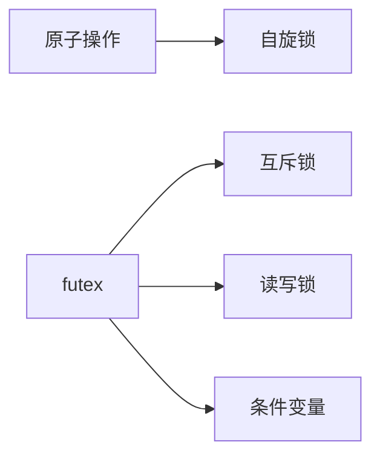

# pthread线程同步


## futex实现

> 高级锁的实现都是与futex实现相关

**Futex**是**Fast Userspace muTexes**的缩写

常用的锁都是通过futex实现的

+ mutex (互斥锁)
+ rwlock (读写锁)
+ cond  (条件变量)



### 内核实现

但是我并没有搞明白futex实现的原理,造成难以继续分析,
因此只能分析别人的文档(注:不分析原理,只进行使用)

主要存在文件`futex-internal.c/futex-internal.h,lowlevellock-futex.h,lowlevellock.c`

另外`lll->lowlevellock`缩写形式

其中futex提供的最重要的两个操作**wait**和**wake**

```c
// 可以使用的op定义类型
#define FUTEX_WAIT			0
#define FUTEX_WAKE			1
#define FUTEX_REQUEUE		3
#define FUTEX_CMP_REQUEUE	4
#define FUTEX_WAKE_OP		5

#define FUTEX_OP_CLEAR_WAKE_IF_GT_ONE	((4 << 24) | 1)

#define FUTEX_LOCK_PI		6
#define FUTEX_UNLOCK_PI		7
#define FUTEX_TRYLOCK_PI	8

#define FUTEX_WAIT_BITSET	9
#define FUTEX_WAKE_BITSET	10

#define FUTEX_WAIT_REQUEUE_PI   11
#define FUTEX_CMP_REQUEUE_PI    12

#define FUTEX_LOCK_PI2			13

#define FUTEX_PRIVATE_FLAG		128
#define FUTEX_CLOCK_REALTIME	256  
```

### musl实现

```c
#define lll_trylock(lock) 		原子的(lock 0 --> 1) 	// 不等待
#define lll_cond_trylock(lock) 	原子的(lock 0 --> 2)	// 不等待

#define lll_lock(futex, private) 
1. 原子的(futex 0 --> 1) // 等待 
2. __lll_lock_wait (futex, private)

#define __lll_cond_lock(futex, private)
1. 原子的(futex 0 --> 2) // 等待 
2. __lll_lock_wait (futex, private)

#define __lll_unlock(futex, private)
1. 原子的(futex ? --> 0) // 等待 
2. __lll_lock_wait (futex, private)

void __lll_lock_wake_private (int *futex);
void __lll_lock_wait_private (int *futex);
void __lll_lock_wait (int *futex, int private);
void __lll_lock_wake (int *futex, int private);

int lll_futex_wake(int *futex, int nr, int private);
int lll_futex_wait(int *futex, int val, int private);

int futex_wait(unsigned int *futex_word, unsigned int expected, int private);
void futex_wake(unsigned int* futex_word, int processes_to_wake, int private);

// 进入系统调用阶段
int lll_futex_syscall(int nargs, int *futexp, int op, ...);
```

那么进入到最后可以得知,一般会进行一些原子操作,启动的操作都是`INTERNAL_SYSCALL`进行实现的,然后就是`swi`指令实现的原理


## 原子操作

### musl实现

```c
/// 原子操作由汇编实现
```

### glibc实现


## 自旋锁

### musl实现

spinlock句柄就是一个32位的数;

```c
typedef int pthread_spinlock_t;
```

五种函数的实现

```c
int pthread_spin_init(pthread_spinlock_t *s, int shared)
{
	return *s = 0;
}

int pthread_spin_destroy(pthread_spinlock_t *s)
{
	return 0;
}

int pthread_spin_lock(pthread_spinlock_t *s)
{
	while (*(volatile int *)s || a_cas(s, 0, EBUSY)) a_spin();
	return 0;
}

int pthread_spin_trylock(pthread_spinlock_t *s)
{
	return a_cas(s, 0, EBUSY);
}

int pthread_spin_unlock(pthread_spinlock_t *s)
{
	a_store(s, 0);
	return 0;
}
```

### glibc实现

glibc的实现就较为复杂了点

```c
typedef __pthread_spinlock_t pthread_spinlock_t;
typedef volatile int __pthread_spinlock_t;
```

+ 加上__作为内部使用的句柄
+ volatile使编译器强行读取

```c
int pthread_spin_init(pthread_spinlock_t *lock, int pshared)
{
  /* Relaxed MO is fine because this is an initializing store.  */
  atomic_store_relaxed(lock, 0);
  return 0;
}

int pthread_spin_destroy (pthread_spinlock_t *lock)
{
  /* Nothing to do.  */
  return 0;
}

int pthread_spin_lock (pthread_spinlock_t *lock)
{
	int val = 0;

#if ! ATOMIC_EXCHANGE_USES_CAS
	if (__glibc_likely(atomic_exchange_acquire(lock, 1) == 0)) {
		return 0;
	}
#else
	if (__glibc_likely(atomic_compare_exchange_weak_acquire(lock, &val, 1))) {
		return 0;
	}
#endif

	do {
		do {
			atomic_spin_nop();
			val = atomic_load_relaxed(lock);
		} while (val != 0);
	} while (!atomic_compare_exchange_weak_acquire (lock, &val, 1));
	return 0;
}

int pthread_spin_trylock(pthread_spinlock_t *lock)
{
#if ! ATOMIC_EXCHANGE_USES_CAS
	if (atomic_exchange_acquire (lock, 1) == 0) {
		return 0;
  	}
#else
	do {
		int val = 0;
		if (atomic_compare_exchange_weak_acquire (lock, &val, 1))
			return 0;
	} while (atomic_load_relaxed (lock) == 0);
#endif

	return EBUSY;
}

int pthread_spin_unlock(pthread_spinlock_t *lock)
{
	atomic_store_release(lock, 0);
	return 0;
}
```

## 内存屏障

### musl实现

```c
int pthread_barrier_init(pthread_barrier_t *__restrict, const pthread_barrierattr_t *__restrict, unsigned);
int pthread_barrier_destroy(pthread_barrier_t *);
int pthread_barrier_wait(pthread_barrier_t *);
```

### glibc实现

## 互斥锁

### musl实现

在musl库上的互斥锁,但是我感觉musl的设计存在一些瑕疵,还是在去分析一下glibc的设计思路吧.

```c
typedef struct { 
    union { 
        int __i[sizeof(long)==8?10:6]; 
        volatile int __vi[sizeof(long)==8?10:6]; 
        volatile void *volatile __p[sizeof(long)==8?5:6]; 
    } __u; 
} pthread_mutex_t;

int pthread_mutex_init(pthread_mutex_t *restrict m, 
                       const pthread_mutexattr_t *restrict a)
{
	*m = (pthread_mutex_t){0};
	if (a) {
    	m->_m_type = a->__attr;  
    } 
	return 0;
}

int pthread_mutex_destroy(pthread_mutex_t *mutex)
{
	if (mutex->_m_type > 128) {
    	__vm_wait();  
    } 
	return 0;
}

int pthread_mutex_lock(pthread_mutex_t *m)
{
	if ((m->_m_type &15) == PTHREAD_MUTEX_NORMAL
	    && !a_cas(&m->_m_lock, 0, EBUSY))
		return 0;

	return __pthread_mutex_timedlock(m, 0);
}

int __pthread_mutex_timedlock(pthread_mutex_t *restrict m,
							  const struct timespec *restrict at)
{
	/* PTHREAD_MUTEX_NORMAL:死等 */
	if ((m->_m_type&15) == PTHREAD_MUTEX_NORMAL
	    && !a_cas(&m->_m_lock, 0, EBUSY))
		return 0;

	int type = m->_m_type;
	int r, t, priv = (type & 128) ^ 128;

	/* 尝试加锁 */
	r = __pthread_mutex_trylock(m);
	if (r != EBUSY) {
		return r;
	}

	if (type&8) return pthread_mutex_timedlock_pi(m, at);
	
	int spins = 100;
	while (spins-- && m->_m_lock && !m->_m_waiters) a_spin();

	while ((r=__pthread_mutex_trylock(m)) == EBUSY) {
		r = m->_m_lock;
		int own = r & 0x3fffffff;
		if (!own && (!r || (type&4)))
			continue;
		if ((type&3) == PTHREAD_MUTEX_ERRORCHECK
		    && own == __pthread_self()->tid)
			return EDEADLK;

		a_inc(&m->_m_waiters);
		t = r | 0x80000000;
		a_cas(&m->_m_lock, r, t);
		r = __timedwait(&m->_m_lock, t, CLOCK_REALTIME, at, priv);
		a_dec(&m->_m_waiters);
		if (r && r != EINTR) break;
	}
	return r;
}

```

### glibc实现

musl的互斥锁好像缺少了排队机制,造成可能抢占的问题(真正实现排队的是futex)

#### 互斥锁的定义

```c
struct __pthread_mutex_s
{
	int __lock;
	unsigned int __count;
	int __owner;
	int __kind;
	union
	{
		int __spins;
		__pthread_slist_t __list;
	};
};

typedef union
{
  struct __pthread_mutex_s __data;
  char __size[__SIZEOF_PTHREAD_MUTEX_T];
  long int __align;
} pthread_mutex_t;
```

上锁的实现

```c
int __pthread_mutex_lock (pthread_mutex_t *mtxp)
{
	struct __pthread *self;
	int flags = mtxp->__flags & GSYNC_SHARED;
	int ret = 0;
  
	// 根据不同的类型确定
	#define PT_MTX_NORMAL       __PTHREAD_MUTEX_TIMED
	#define PT_MTX_RECURSIVE    (__PTHREAD_MUTEX_RECURSIVE + 1)
	#define PT_MTX_ERRORCHECK   (__PTHREAD_MUTEX_ERRORCHECK + 1)
	switch (MTX_TYPE (mtxp))
	{
	/* 普通上锁方式 */
	case PT_MTX_NORMAL:
		lll_lock (mtxp->__lock, flags);
		break;
	
	/* 迭代锁 */
	case PT_MTX_RECURSIVE:
		self = _pthread_self ();
		if (mtx_owned_p (mtxp, self, flags))
		{
			if (__glibc_unlikely (mtxp->__cnt + 1 == 0))
			return EAGAIN;

			++mtxp->__cnt;
			return ret;
		}

		lll_lock (mtxp->__lock, flags);
		mtx_set_owner (mtxp, self, flags);
		mtxp->__cnt = 1;
		break;

	case PT_MTX_ERRORCHECK:
		self = _pthread_self ();
		if (mtx_owned_p (mtxp, self, flags))
			return EDEADLK;

		lll_lock (mtxp->__lock, flags);
		mtx_set_owner (mtxp, self, flags);
		break;

	case PT_MTX_NORMAL | PTHREAD_MUTEX_ROBUST:
	case PT_MTX_RECURSIVE | PTHREAD_MUTEX_ROBUST:
	case PT_MTX_ERRORCHECK | PTHREAD_MUTEX_ROBUST:
		self = _pthread_self ();
		ROBUST_LOCK (self, mtxp, lll_robust_lock, flags);
		break;

	default:
		ret = EINVAL;
		break;
	}

  return ret;
}
```

## 条件变量

### musl实现

### glibc实现

## 读写锁

### musl实现

### glibc实现


## pthread杂项


