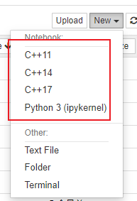
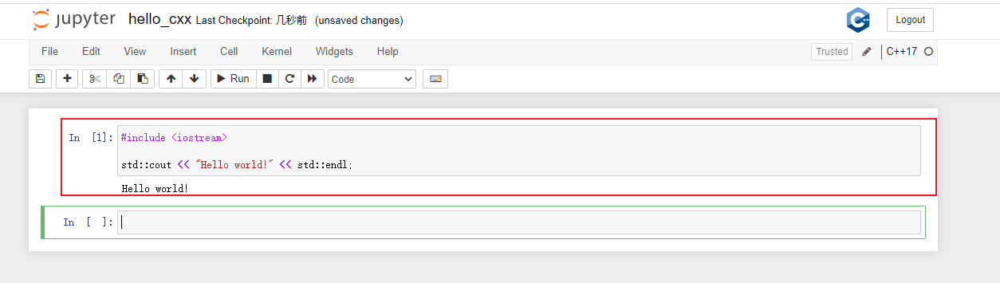

# Python学习笔记


<!--more-->
python学习笔记
<!--more-->

## 开发环境安装
> 推荐Mambaforge,与anaconda相同功能,但是速度更加快;

mamba是包管理器的重新实现,由C++重新实现,主页地址:[miniforge](https://github.com/conda-forge/miniforge),

### 安装软件

```shell
$ curl -L -O "https://github.com/conda-forge/miniforge/releases/latest/download/Mambaforge-$(uname)-$(uname -m).sh"
$ bash Mambaforge-$(uname)-$(uname -m).sh
```

### 配置环境

```txt
CONDA_EXE=mamba
```

+ 配置虚拟环境

```shell
conda env list               #查看虚拟环境
mamba create -n env_name -y  #创建
conda activate env_name      #激活
conda deactivate             #退出
```

+ 配置包下载镜像

```shell
mamba config --add channels https://mirrors.tuna.tsinghua.edu.cn/anaconda/pkgs/free/
mamba config --add channels https://mirrors.tuna.tsinghua.edu.cn/anaconda/pkgs/main/
mamba config --set show_channel_urls yes
```

### jupyter notebook/lab安装

#### 1. 安装

```shell
$ mamaba install jupyter
```

#### 2. 配置

+ ssh远程使用jupyter notebook

```shell
# 远程服务器开启
jupyter notebook --no-browser --port=8889
# ssh forward端口
ssh -N -f -L localhost:8888:localhost:8889 username@serverIP
```

+ 利用jupyter notebook自带的远程访问功能

```shell
# 1. 生成默认配置文件
jupyter notebook --generate-config

# 2.1 自动生成访问密码(token)
jupyter notebook password
Enter password:
Verify password:
[NotebookPasswordApp] Wrote hashed password to ${HOME}/.jupyter/jupyter_notebook_config.json

# 2.2 手动生成访问密码(token)
In [1]: from notebook.auth import passwd
# 2.2.1 官方教程默认情况下生成sha1,但实际情况生成了argon2
In [2]: passwd()
Enter password:
Verify password:
Out[2]: 'argon2:xxxxxxxxxxxxxxxxxxxxxxxxxxxxxxxxxxxxxxxxxxxxxxx'

# 2.2.2 输入sha1的生成算法,即可得到
In [3]: passwd(algorithm='sha1')
Enter password:
Verify password:
Out[3]: 'sha1:xxxxxxxxxxxxxxxxxxxxxxxxxxxxxxxxxxxxxxxxxxxxxxxxxxx'

# 3. 修改./jupyter/jupyter_notebook_config.py
c.NotebookApp.ip='*'
c.NotebookApp.password = u'sha:ce...刚才复制的那个密文'
c.NotebookApp.open_browser = False
c.NotebookApp.port =8888 #可自行指定一个端口, 访问时使用该端口

# 如果是自动的形式此时就可以直接访问

# 4. 配置相关

c.ServerApp.allow_remote_access = True
c.LabApp.open_browser = False

```


#### 安装扩展

1. jupyter_contrib_nbextensions，

```sh
pip install jupyter_contrib_nbextensions
jupyter contrib nbextension install --user
```

2. Jupyter Nbextensions Configurator

```sh
pip install jupyter_nbextensions_configurator
jupyter nbextensions_configurator enable --user
```

### 安装C++ Kernel

```sh
conda install xeus-cling -c conda-forge
```

安装结束,进行测试



可以看到新的几个kernel



## python入门

### 第一个程序

```python
#!/bin/python3
from rich import print
if __name__ == '__main__':
    print('Hello World')
```

### 打印一个彩蛋

```python
import this

# 打印结果
# The Zen of Python, by Tim Peters

# Beautiful is better than ugly.
# Explicit is better than implicit.
# Simple is better than complex.
# Complex is better than complicated.
# Flat is better than nested.
# Sparse is better than dense.
# Readability counts.
# Special cases aren't special enough to break the rules.
# Although practicality beats purity.
# Errors should never pass silently.
# Unless explicitly silenced.
# In the face of ambiguity, refuse the temptation to guess.
# There should be one-- and preferably only one --obvious way to do it.
# Although that way may not be obvious at first unless you're Dutch.
# Now is better than never.
# Although never is often better than *right* now.
# If the implementation is hard to explain, it's a bad idea.
# If the implementation is easy to explain, it may be a good idea.
# Namespaces are one honking great idea -- let's do more of those!
```

>添加一个打印函数

```python
# 使用rich打印
from rich import print
print("Rich Print")
```

Rich中的打印更加漂亮

### 字符串格式化

1. 使用 格式化字符串字面值 ，要在字符串开头的引号/三引号前添加 f 或 F 。在这种字符串中，可以在 { 和 } 字符之间输入引用的变量，或字面值的 Python 表达式。

```python
>>> year = 2016
>>> event = 'Referendum'
>>> f'Results of the {year} {event}'
'Results of the 2016 Referendum'
```

2. 字符串的 str.format() 方法需要更多手动操作。该方法也用 { 和 } 标记替换变量的位置，虽然这种方法支持详细的格式化指令，但需要提供格式化信息。

```python
>>> yes_votes = 42_572_654
>>> no_votes = 43_132_495
>>> percentage = yes_votes / (yes_votes + no_votes)
>>> '{:-9} YES votes  {:2.2%}'.format(yes_votes, percentage)
' 42572654 YES votes  49.67%'
```

3. 旧式字符串格式化方法
不在使用了,还是新的看着舒服

### `main`函数

python中并不会存在着main函数,当前只是模拟了一个入口函数

```python
if __name__ == '__main__':
    main()
```

## 数据类型

### Numbers(数字)

+ int
+ long
+ float
+ double

```python
intA = int(12)
print(type(intA))
```

<pre style="white-space:pre;overflow-x:auto;line-height:normal;font-family:Menlo,'DejaVu Sans Mono',consolas,'Courier New',monospace"><span style="font-weight: bold">&lt;</span><span style="color: #ff00ff; text-decoration-color: #ff00ff; font-weight: bold">class</span><span style="color: #000000; text-decoration-color: #000000"> </span><span style="color: #008000; text-decoration-color: #008000">'int'</span><span style="font-weight: bold">&gt;</span>
</pre>

```python
longB = 0xDAEABEEF
print(type(longB))
```

<pre style="white-space:pre;overflow-x:auto;line-height:normal;font-family:Menlo,'DejaVu Sans Mono',consolas,'Courier New',monospace"><span style="font-weight: bold">&lt;</span><span style="color: #ff00ff; text-decoration-color: #ff00ff; font-weight: bold">class</span><span style="color: #000000; text-decoration-color: #000000"> </span><span style="color: #008000; text-decoration-color: #008000">'int'</span><span style="font-weight: bold">&gt;</span>
</pre>

```python
floatC = 1.2
print(type(floatC))
```

<pre style="white-space:pre;overflow-x:auto;line-height:normal;font-family:Menlo,'DejaVu Sans Mono',consolas,'Courier New',monospace"><span style="font-weight: bold">&lt;</span><span style="color: #ff00ff; text-decoration-color: #ff00ff; font-weight: bold">class</span><span style="color: #000000; text-decoration-color: #000000"> </span><span style="color: #008000; text-decoration-color: #008000">'float'</span><span style="font-weight: bold">&gt;</span>
</pre>

```python
doubleD = 1.2
print(type(doubleD))
```

<pre style="white-space:pre;overflow-x:auto;line-height:normal;font-family:Menlo,'DejaVu Sans Mono',consolas,'Courier New',monospace"><span style="font-weight: bold">&lt;</span><span style="color: #ff00ff; text-decoration-color: #ff00ff; font-weight: bold">class</span><span style="color: #000000; text-decoration-color: #000000"> </span><span style="color: #008000; text-decoration-color: #008000">'float'</span><span style="font-weight: bold">&gt;</span>
</pre>

### 布尔类型
+ True
+ False

```python
boolA = True
boolB = False

print(boolA, type(boolA))
print(boolB, type(boolB))
```

<pre style="white-space:pre;overflow-x:auto;line-height:normal;font-family:Menlo,'DejaVu Sans Mono',consolas,'Courier New',monospace"><span style="color: #00ff00; text-decoration-color: #00ff00; font-style: italic">True</span> <span style="font-weight: bold">&lt;</span><span style="color: #ff00ff; text-decoration-color: #ff00ff; font-weight: bold">class</span><span style="color: #000000; text-decoration-color: #000000"> </span><span style="color: #008000; text-decoration-color: #008000">'bool'</span><span style="font-weight: bold">&gt;</span>
</pre>

<pre style="white-space:pre;overflow-x:auto;line-height:normal;font-family:Menlo,'DejaVu Sans Mono',consolas,'Courier New',monospace"><span style="color: #ff0000; text-decoration-color: #ff0000; font-style: italic">False</span> <span style="font-weight: bold">&lt;</span><span style="color: #ff00ff; text-decoration-color: #ff00ff; font-weight: bold">class</span><span style="color: #000000; text-decoration-color: #000000"> </span><span style="color: #008000; text-decoration-color: #008000">'bool'</span><span style="font-weight: bold">&gt;</span>
</pre>
### String(字符串)

 + 使用""定义字符串
 + r在字符串表示禁止转义
 + 使用"""作用长字符串


```python
# 普通定义字符串
strA = "Hello"
print(strA,  type(strA))

# r禁止转义
strB = r"Hello\nWorld"
print(strB, type(strB))

# 长字符串
strC = """
The Zen of Python, by Tim Peters

Beautiful is better than ugly.
Explicit is better than implicit.
Simple is better than complex.
Complex is better than complicated.
Flat is better than nested.
Sparse is better than dense.
Readability counts.
Special cases aren't special enough to break the rules.
Although practicality beats purity.
Errors should never pass silently.
Unless explicitly silenced.
In the face of ambiguity, refuse the temptation to guess.
There should be one-- and preferably only one --obvious way to do it.
Although that way may not be obvious at first unless you're Dutch.
Now is better than never.
Although never is often better than *right* now.
If the implementation is hard to explain, it's a bad idea.
If the implementation is easy to explain, it may be a good idea.
Namespaces are one honking great idea -- let's do more of those!
"""

print(strC, str(strC))
```


<pre style="white-space:pre;overflow-x:auto;line-height:normal;font-family:Menlo,'DejaVu Sans Mono',consolas,'Courier New',monospace">Hello <span style="font-weight: bold">&lt;</span><span style="color: #ff00ff; text-decoration-color: #ff00ff; font-weight: bold">class</span><span style="color: #000000; text-decoration-color: #000000"> </span><span style="color: #008000; text-decoration-color: #008000">'str'</span><span style="font-weight: bold">&gt;</span>
</pre>
<pre style="white-space:pre;overflow-x:auto;line-height:normal;font-family:Menlo,'DejaVu Sans Mono',consolas,'Courier New',monospace">Hello\nWorld <span style="font-weight: bold">&lt;</span><span style="color: #ff00ff; text-decoration-color: #ff00ff; font-weight: bold">class</span><span style="color: #000000; text-decoration-color: #000000"> </span><span style="color: #008000; text-decoration-color: #008000">'str'</span><span style="font-weight: bold">&gt;</span>
</pre>
<pre style="white-space:pre;overflow-x:auto;line-height:normal;font-family:Menlo,'DejaVu Sans Mono',consolas,'Courier New',monospace">
The Zen of Python, by Tim Peters

Beautiful is better than ugly.
Explicit is better than implicit.
Simple is better than complex.
Complex is better than complicated.
Flat is better than nested.
Sparse is better than dense.
Readability counts.
Special cases aren't special enough to break the rules.
Although practicality beats purity.
Errors should never pass silently.
Unless explicitly silenced.
In the face of ambiguity, refuse the temptation to guess.
There should be one-- and preferably only one --obvious way to do it.
Although that way may not be obvious at first unless you're Dutch.
Now is better than never.
Although never is often better than *right* now.
If the implementation is hard to explain, it's a bad idea.
If the implementation is easy to explain, it may be a good idea.
Namespaces are one honking great idea -- let's do more of those!

The Zen of Python, by Tim Peters

Beautiful is better than ugly.
Explicit is better than implicit.
Simple is better than complex.
Complex is better than complicated.
Flat is better than nested.
Sparse is better than dense.
Readability counts.
Special cases aren't special enough to break the rules.
Although practicality beats purity.
Errors should never pass silently.
Unless explicitly silenced.
In the face of ambiguity, refuse the temptation to guess.
There should be one-- and preferably only one --obvious way to do it.
Although that way may not be obvious at first unless you're Dutch.
Now is better than never.
Although never is often better than *right* now.
If the implementation is hard to explain, it's a bad idea.
If the implementation is easy to explain, it may be a good idea.
Namespaces are one honking great idea -- let's do more of those!

</pre>

### List(列表)

```python
listC = ["12", 3, 4]
print(listC)
```

### Tuple(元组)

```python
tupleD = ('physics', 'chemistry', 1997, 2000)
print(tupleD)
```

### Dictionary(字典)

```python
DictE = {'a': 1, 'b': 2, 'b': '3'}
print(DictE)
```

### set(集合)

```python
SetF = set([1, 2, 3, 3])
print(DictE)
```

## 运算符

## 控制结构

### 单执行语句

```python
if 判断条件：
	执行语句
else：
	执行语句
```

### 多条件语句

```python
if 判断条件1:
    执行语句1……
elif 判断条件2:
    执行语句2……
elif 判断条件3:
    执行语句3……
else:
    执行语句4……
```

### match语句

> match语句类似于c的switch语句,

```python
match status:
    case 400:
        return "Bad request"
    case 404:
        return "Not found"
    case 418:
        return "I'm a teapot"
    case _:
        return "Something's wrong with the internet"
```

### while循环

```python
c = 0
while (c < 10):
    print(c)
    c += 1
print("while Loop finish")
```

### for语句

> `python`中的语句与C不同,`python`不进行数值的计算,而是
> 迭代列表或字符串等任意序列,元素的迭代顺序与在序列中出现的顺序一致

```python

# 定义一个列表
words = ["linux", "macos", "windows"]

# 遍历列表
for word in words:
    print(word, len(word))
```

源码文件:

执行结果:

### range函数

> 内置函数`range()`常用于遍历数字序列,该函数可以生成算术级数

range的语法

```python
# start: 开始
# stop: 结束
# step: 步长
range(start, stop, step)
```

那么是如何排列的

1. 只有一个参数下只会只存在stop

```python
for i in range(10):
    print(i)
```

源码文件:

执行结果:

2. 两个参数下存在start和stop

```python
for i in range(1, 10):
    print(i)
```

源码文件:

执行结果:

3. 三个参数全部填写

```python
for i in range(1, 10, 2):
    print(i)
```

源码文件:

执行结果:

如果直接输出`range`会发生什么

> `range()`返回对象的操作和列表很像,但其实这两种对象不是一回事.
> 迭代时,该对象基于所需序列返回连续项，并没有生成真正的列表，从而节省了空间。
> 这种对象称为可迭代对象 iterable，函数或程序结构可通过该对象获取连续项，直到所有元素全部迭代完毕

将range对象强转为其他类型的数据结构

> 字典是无法进行转换的

```python

l = list(range(10))

t = tuple(range(10))

s = set(range(10))

```

### 跳出语句

`break`语句和`C`中的类似,用于跳出最近的`for`或`while`循环。

```python
for n in range(2, 10):
    for x in range(2, n):
        if n % x == 0:
            print(n, 'equals', x, '*', n//x)
            break
    else:
        print(n, 'is a prime number')
```

但是与C不相同的是,else可以用于for语句,未执行break时执行

### pass语句

`pass`语句不执行任何操作

## 函数

1. 定义函数使用关键字`def`, 后跟函数名与括号内的形参列表.函数语句从下一行开始,并且必须缩进.
2. 函数内的第一条语句是字符串时,该字符串就是文档字符串,也称为`docstring`,详见[文档字符串](#文档字符串)。利用[文档字符串](#文档字符串)可以自动生成在线文档或打印版文档,还可以让开发者在浏览代码时直接查阅文档;`Python`开发者最好养成在代码中加入文档字符串的好习惯.
3. 函数在执行时使用函数局部变量符号表，所有函数变量赋值都存在局部符号表中；引用变量时，首先，在局部符号表里查找变量，然后，是外层函数局部符号表，再是全局符号表，最后是内置名称符号表。因此，尽管可以引用全局变量和外层函数的变量，但最好不要在函数内直接赋值(除非是`global`语句定义的全局变量,`nonlocal`语句定义的外层函数变量)


### 函数参数

从函数定义的角度来看，参数可以分为两种：

1. `必选参数`：调用函数时必须要指定的参数，在定义时没有等号
2. `可选参数`：也叫`默认参数`，调用函数时可以指定也可以不指定，不指定就默认的参数值来。

从函数调用的角度来看，参数可以分为两种：

1.  `关键字参数`：调用时，使用 key=value 形式传参的，这样传递参数就可以不按定义顺序来。
2.  `位置参数`：调用时，不使用关键字参数的 key-value 形式传参，这样传参要注意按照函数定义时参数的顺序来。

```python
def func(a,b,c=0, d=1):
    pass
```

1. a,b称为必选参数
2. c,d称为可选参数

可变参数,类似C语言的`...`参数
加了星号*的变量名会存放所有未命名的变量参数

```python
# 定义函数
def hello(head, *args):
    for arg in args:
        print(f"{head}:{arg}")
    return True

# 调用函数
hello("ERROR", 1, 2, 3)
$ ERROR:1
$ ERROR:2
$ ERROR:3
```

### 匿名函数

`lambda`关键字用于创建小巧的匿名函数;
lambda a, b: a+b 函数返回两个参数的和。Lambda 函数可用于任何需要函数对象的地方。在语法上，匿名函数只能是单个表达式。在语义上，它只是常规函数定义的语法糖。与嵌套函数定义一样，lambda 函数可以引用包含作用域中的变量：

```python
>>> pairs = [(1, 'one'), (2, 'two'), (3, 'three'), (4, 'four')]
>>> pairs.sort(key=lambda pair: pair[1])
>>> pairs
[(4, 'four'), (1, 'one'), (3, 'three'), (2, 'two')]
```

### 文档字符串

对函数进行注释

```python
>>> def func():
...     """
...     Do Nothing
...     仅仅作为演示
...     """
...     pass
...
>>> print(func.__doc__)

    Do Nothing
```

### 函数注解

`函数注解`是可选的用户自定义函数类型的元数据完整信息(详见PEP3107和PEP484)
标注 以字典的形式存放在函数的 __annotations__ 属性中而对函数的其他部分没有影响

+ 形参标注的定义方式是在形参名后加冒号，后面跟一个会被求值为标注的值的表达式。
+ 返回值标注的定义方式是加组合符号 ->，后面跟一个表达式，这样的校注位于形参列表和表示 def 语句结束的冒号

```python
>>> def f(ham: str, eggs: str = 'eggs') -> str:
...     return ham + ' and ' + eggs
>>> f('spam')
'spam and eggs'
>>> f.__annotations__
{'ham': <class 'str'>, 'eggs': <class 'str'>, 'return': <class 'str'>}
```

## 模块

## 异常处理

> 即使语句或表达式使用了正确的语法，执行时仍可能触发错误

```python
while True:
    try:
        x = int(input("Please enter a number: "))
        break
    except ValueError:
        print("Oops!  That was no valid number.  Try again...")
```

执行结果:
```txt
D:\python\异常处理\.venv\Scripts\python.exe D:\python\异常处理\main.py
Please enter a number: a
Oops!  That was no valid number.  Try again...
Please enter a number: 12

Process finished with exit code 0
```

## 文件操作

### 文件打开模式
打开文件获取文件描述符，打开文件时需要指定对文件的读写模式，和写追加模式。常见的文件模式如下：

| 模式   | 描述                                                                     |
| ------ | ------------------------------------------------------------             |
| ‘r’  | 以只读方式打开文件（默认），不存在报错 FileNotFoundError                |
| ‘w’  | 以写方式打开文件，如果文件存在，首先清空原内容，如果不存在先创建文件   |
| ‘x’  | 以写方式打开文件，如果文件存在，则报错 FileExistsError                  |
| ‘a’  | 以写方式打开文件，并追加内容到文件结尾，如果文件不能存在则先创建文件   |
| ‘+’  | 可同时读写                                                               |

### 打开文件(open函数)

```python
open(file, mode='r', buffering=-1, encoding=None, errors=None,
     newline=None, closefd=True, opener=None)
    Open file and return a stream.  Raise IOError upon failure.
```

测试代码
```python
# shell echo "Hello World" >> test
Python 3.11.6 (main, Nov 14 2023, 09:36:21) [GCC 13.2.1 20230801] on linux
Type "help", "copyright", "credits" or "license" for more information.
>>> f = open('test.txt', 'r', encoding='utf-8')
>>> print(f.read())
Hello World
>>> f.close()
```

但是这个写法不太好,如果文件打开出现异常,程序会出现崩溃(加上异常处理)

```python
f = None
try:
    f = open('test.txt', 'r', encoding='utf-8')
    print(f.read())
except FileNotFoundError:
    print('无法打开指定的文件!')
except LookupError:
    print('指定了未知的编码!')
except UnicodeDecodeError:
    print('读取文件时解码错误!')
finally:
    if f:
        f.close()

```

加上`with`关键字,在正常的情况下我们不需要进行手动关闭

```python
def main():
    try:
        with open('致橡树.txt', 'r', encoding='utf-8') as f:
            print(f.read())
    except FileNotFoundError:
        print('无法打开指定的文件!')
    except LookupError:
        print('指定了未知的编码!')
    except UnicodeDecodeError:
        print('读取文件时解码错误!')


if __name__ == '__main__':
    main()
```

### 文件描述符的属性

在 Python 中，文件描述符就是一个文件对象，它具有如下属性：

| 属性        | 描述                        |
| ----------- | --------------------------- |
| file.closed | 返回布尔值，True 已被关闭。 |
| file.mode   | 返回被打开文件的访问模式。  |
| file.name   | 返回文件的名称。            |


### 读取文件

```python
>>> f = open('test.txt', 'r', encoding='utf-8')

>>> f.read()
'Hello World\n'
>>> f.readline()
''
>>> f.readlines()
[]

>>> type(f.readline())
<class 'str'>
>>> type(f.readlines())
<class 'list'>
>>> type(f.read())
<class 'str'>
```

### 写入文件


## 正则表达式


## 进程线程


## 面向对象

>  面向对象编程（Object Oriented Programming，OOP）是一种程序设计思想。它把对象作为程序的基本单元，一个对象包含了数据和操作数据的函数，相同属:性和操作方法的对象被抽象为类。类（Class）就类似上面所说的模具，而对象（Object）就是使用模具生产出的零件，对象就是类的实例(Instance)

继承和多态、封装是面向对象编程的三个基本特征

```python
print(isinstance(object, type))
print(isinstance(type, object))
print(isinstance(type, type))
print(isinstance(object, object))

>>>
True
True
True
True
```

### 类和对象

> 在Python中可以使用`class`关键字定义类，然后在类中通过之前学习过的函数来> 定义方法，这样就可以将对象的动态特征描述出来，代码如下所示。

```python
# 1.1 定义类
class clsTest:
    clsNum = 0

    def clsFunc(self):
        print("执行方法")

# 1.2 实例化对象
t = clsTest()

t.clsFunc()
```

> **说明：** 写在类中的函数，我们通常称之为（对象的）方法，这些方法就是对象可以接收的消息。

### 抽象/封装/继承/多态

### 属性

### 方法

### 运算符重载

### 类对象

### 继承和多态

## 标准库

## 虚拟环境

## GUI基础(tkinter)

