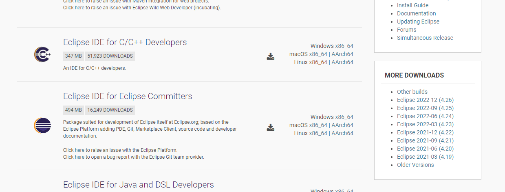
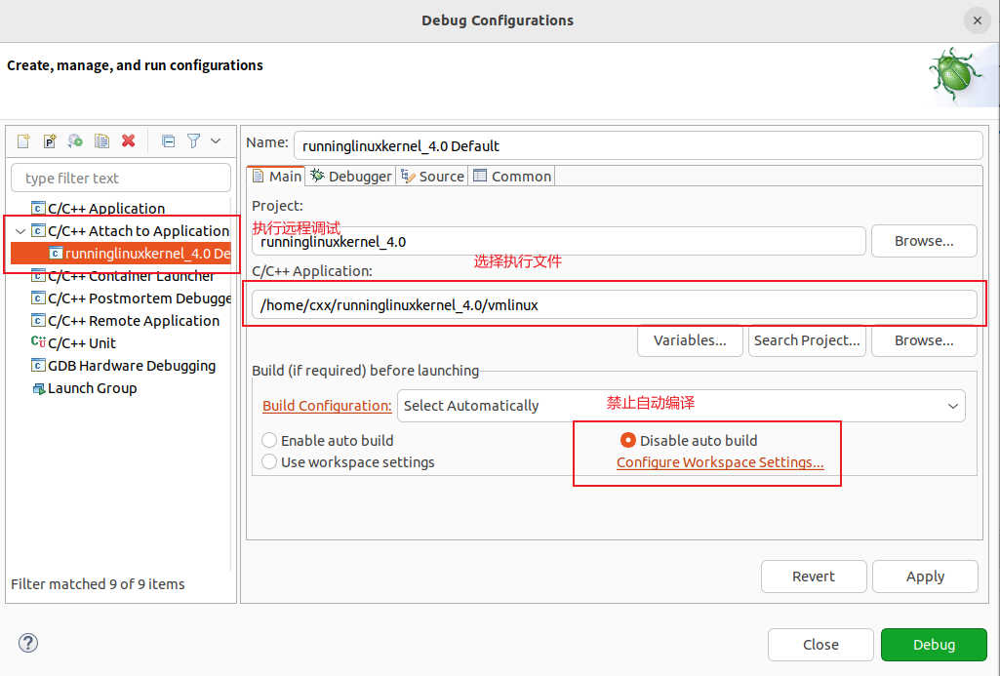
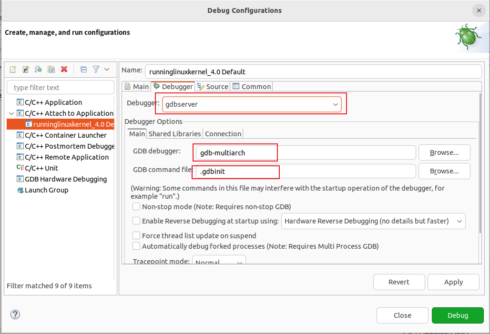
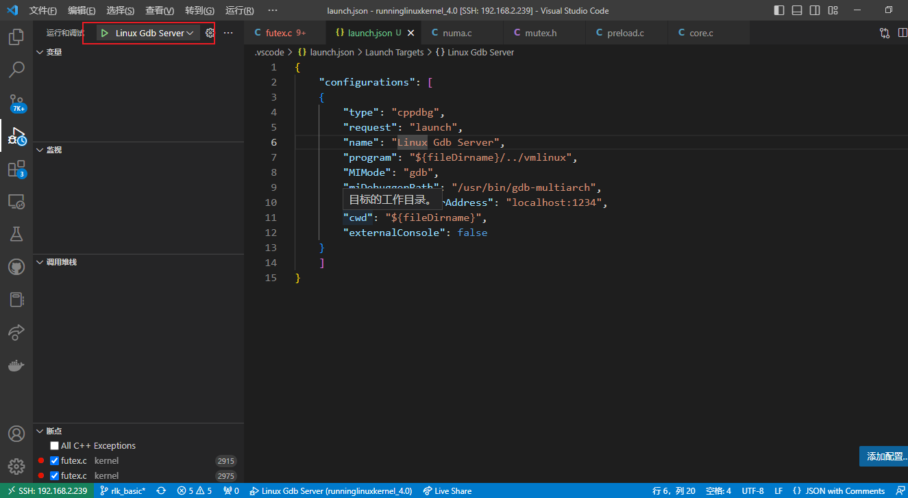
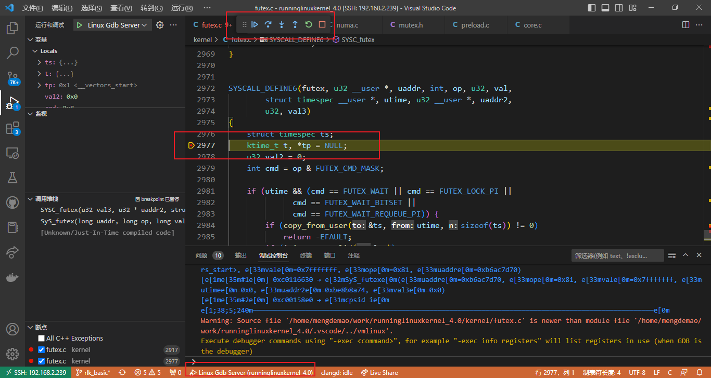
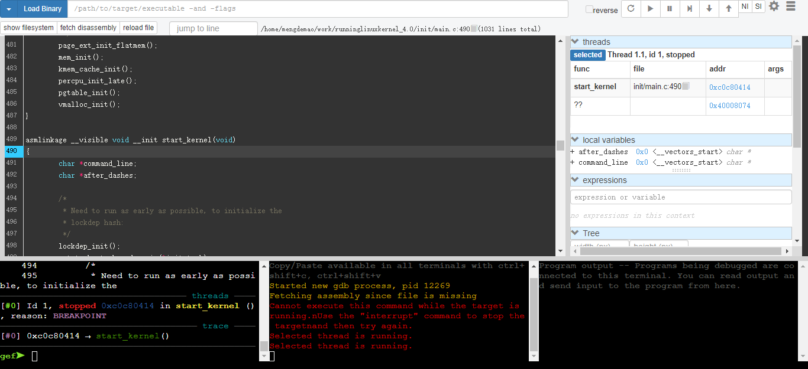
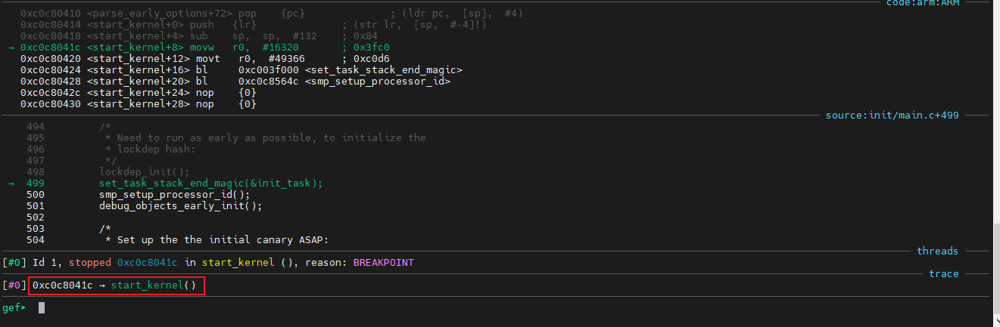
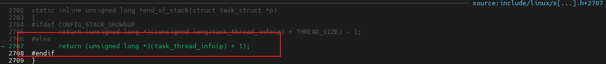

# Linux内核源码阅读


<!--more-->

**内核源码阅读**

<!--more-->

+ 源码版本: [Linux 4.0.0](https://github.com/figozhang/runninglinuxkernel_4.0.git)
+ 参考书籍: <<奔跑吧Linux内核>>

## 建立环境

### 基础环境

1. 安装软件

```shell
$ sudo apt install qemu
$ sudo apt install gcc-arm-none-eabi
```

2. 下载源码

```shell
$ git clone https://github.com/figozhang/runninglinuxkernel_4.0.git
```

3. 构建运行

+ 编译32位arm

```shell
cd runninglinuxkernel_4.0
./run_debian_arm32.sh build_kernel
sudo ./run_debian_arm32.sh build_rootfs
./run_debian_arm32.sh build_run
```

+ 编译64位arm

```shell
cd runninglinuxkernel_4.0
./run_debian_arm64.sh build_kernel
sudo ./run_debian_arm64.sh build_rootfs
./run_debian_arm64.sh build_run
```

+ 安装gdb-multiarch

> 参考资料:[Archlinux gdb-multiarch构建](https://aur.archlinux.org/packages/gdb-multiarch)

```shell
# 下载代码
git clone --branch gdb-13-branch https://sourceware.org/git/binutils-gdb.git

# 执行构建
mkdir build && cd build
  ../configure \
    --enable-targets=all \
    --prefix=/build \
    --enable-languages=all \
    --enable-multilib \
    --enable-interwork \
    --with-system-readline \
    --disable-nls \
    --with-python=/usr/bin/python \
    --with-system-gdbinit=/etc/gdb/gdbinit
make -j`nproc`
make install

# 修改文件名
mv /usr/bin/gdb /usr/bin/gdb-multiarch
```

+ 运行gdb-multiarch

```shell
# 加载执行文件
$ file vmlinux

# 设置架构
$ set architecture arm

# 远程连接
$ target remote localhost:1234
```

### 调试环境(eclipse)

1. 安装eclipse

+ 安装jdk

```shell
$ sudo apt update
$ sudo apt install default-jre
```

+ 下载[eclipse C/C++](https://www.eclipse.org/downloads/packages/)

+ 配置调试





### 调试环境(vscode)

当然`vscode`也是相当好用的,作为调试程序

+ 在当前工程中添加配置文件**launch.json**

```json
{
    "configurations": [
    {
        "type": "cppdbg",
        "request": "launch",
        "name": "Linux Gdb Server",
        "program": "${workspaceRoot}/vmlinux",
        "MIMode": "gdb",
        "miDebuggerPath": "/usr/bin/gdb-multiarch",
        "miDebuggerServerAddress": "localhost:1234",
        "cwd": "${workspaceRoot}",
        "externalConsole": false
    }
    ]
}
```

+ 安装调试器

```shell
yay -S gdb-multiarch
```

+ 启动调试器





### 调试环境(原始gdb)

+ 安装gdbgui

```shell
# 安装
pip install gdbgui

# 设计
pip install --upgrade gdbgui

# 卸载
$ pip uninstall gdbgui
```
+ 运行gdbgui

```shell
gdbgui -g arm-multiarch
```



## 启动分析

一般情况下，我们都会讲断点打在`start_kernel`上,

**启动前夕(ARM32)**

```assembly
__mmap_switched:
	adr	r3, __mmap_switched_data

	ldmia	r3!, {r4, r5, r6, r7}
	cmp	r4, r5				@ Copy data segment if needed
1:	cmpne	r5, r6
	ldrne	fp, [r4], #4
	strne	fp, [r5], #4
	bne	1b

	mov	fp, #0				@ Clear BSS (and zero fp)
1:	cmp	r6, r7
	strcc	fp, [r6],#4
	bcc	1b

 ARM(	ldmia	r3, {r4, r5, r6, r7, sp})
 THUMB(	ldmia	r3, {r4, r5, r6, r7}	)
 THUMB(	ldr	sp, [r3, #16]		)
	str	r9, [r4]			@ Save processor ID
	str	r1, [r5]			@ Save machine type
	str	r2, [r6]			@ Save atags pointer
	cmp	r7, #0
	strne	r0, [r7]			@ Save control register values
	b	start_kernel
ENDPROC(__mmap_switched)
```

**启动前夕(ARM64)**

```assembly
__mmap_switched:
	adr	x3, __switch_data + 8

	ldp	x6, x7, [x3], #16
1:	cmp	x6, x7
	b.hs	2f
	str	xzr, [x6], #8			// Clear BSS
	b	1b
2:
	ldp	x4, x5, [x3], #16
	ldr	x6, [x3], #8
	ldr	x16, [x3]
	mov	sp, x16
	str	x22, [x4]			// Save processor ID
	str	x21, [x5]			// Save FDT pointer
	str	x24, [x6]			// Save PHYS_OFFSET
	mov	x29, #0
	b	start_kernel
ENDPROC(__mmap_switched)
```

上面的汇编函数都是由[head.s](https://elixir.bootlin.com/linux/v4.0/source/arch/arm/boot/compressed/head.S)跳入继续向下分析,谁开启了汇编,如何执行到这个函数**vmlinux.lds**决定，分析实现;

```lds
OUTPUT_ARCH(arm)
ENTRY(_start)
SECTIONS
{
  /DISCARD/ : {
    *(.ARM.exidx*)
    *(.ARM.extab*)
    /*
     * Discard any r/w data - this produces a link error if we have any,
     * which is required for PIC decompression.  Local data generates
     * GOTOFF relocations, which prevents it being relocated independently
     * of the text/got segments.
     */
    *(.data)
  }

  . = TEXT_START;
  _text = .;

  .text : {
    _start = .;
    *(.start)
    *(.text)
    *(.text.*)
    *(.fixup)
    *(.gnu.warning)
    *(.glue_7t)
    *(.glue_7)
  }
  .rodata : {
    *(.rodata)
    *(.rodata.*)
  }
  .piggydata : {
    *(.piggydata)
  }
```

本来启动标签是从`_start`开始,但是

需要分析bootloader的实现;

下面我们开始分析



```c
asmlinkage __visible void __init start_kernel(void)
{
	char *command_line;
	char *after_dashes;

	// 死锁检测
    lockdep_init();

    // 设置启动任务的结束磨数
	set_task_stack_end_magic(&init_task);

    // 设置smp id
	smp_setup_processor_id();

    // debug
    debug_objects_early_init();

    // 堆栈保护机制
	boot_init_stack_canary();

    // cgroup初始化
	cgroup_init_early();

    // irq中断停止，设置标志位
	local_irq_disable();
	early_boot_irqs_disabled = true;

    // 激活启动CPU
	boot_cpu_init();

    // 单独章节分析
	page_address_init();
	pr_notice("%s", linux_banner);

    // 设置架构
    setup_arch(&command_line);
	mm_init_cpumask(&init_mm);
	setup_command_line(command_line);
	setup_nr_cpu_ids();
	setup_per_cpu_areas();
	smp_prepare_boot_cpu();	/* arch-specific boot-cpu hooks */

	build_all_zonelists(NULL, NULL);
	page_alloc_init();

	pr_notice("Kernel command line: %s\n", boot_command_line);
	parse_early_param();
	after_dashes = parse_args("Booting kernel",
				  static_command_line, __start___param,
				  __stop___param - __start___param,
				  -1, -1, &unknown_bootoption);
	if (!IS_ERR_OR_NULL(after_dashes))
		parse_args("Setting init args", after_dashes, NULL, 0, -1, -1,
			   set_init_arg);

	jump_label_init();

	/*
	 * These use large bootmem allocations and must precede
	 * kmem_cache_init()
	 */
	setup_log_buf(0);
	pidhash_init();
	vfs_caches_init_early();
	sort_main_extable();
	trap_init();
	mm_init();

	/*
	 * Set up the scheduler prior starting any interrupts (such as the
	 * timer interrupt). Full topology setup happens at smp_init()
	 * time - but meanwhile we still have a functioning scheduler.
	 */
	sched_init();
	/*
	 * Disable preemption - early bootup scheduling is extremely
	 * fragile until we cpu_idle() for the first time.
	 */
	preempt_disable();
	if (WARN(!irqs_disabled(),
		 "Interrupts were enabled *very* early, fixing it\n"))
		local_irq_disable();
	idr_init_cache();
	rcu_init();

	/* trace_printk() and trace points may be used after this */
	trace_init();

	context_tracking_init();
	radix_tree_init();
	/* init some links before init_ISA_irqs() */
	early_irq_init();
	init_IRQ();
	tick_init();
	rcu_init_nohz();
	init_timers();
	hrtimers_init();
	softirq_init();
	timekeeping_init();
	time_init();
	sched_clock_postinit();
	perf_event_init();
	profile_init();
	call_function_init();
	WARN(!irqs_disabled(), "Interrupts were enabled early\n");
	early_boot_irqs_disabled = false;
	local_irq_enable();

	kmem_cache_init_late();

	/*
	 * HACK ALERT! This is early. We're enabling the console before
	 * we've done PCI setups etc, and console_init() must be aware of
	 * this. But we do want output early, in case something goes wrong.
	 */
	console_init();
	if (panic_later)
		panic("Too many boot %s vars at `%s'", panic_later,
		      panic_param);

	lockdep_info();

	/*
	 * Need to run this when irqs are enabled, because it wants
	 * to self-test [hard/soft]-irqs on/off lock inversion bugs
	 * too:
	 */
	locking_selftest();

#ifdef CONFIG_BLK_DEV_INITRD
	if (initrd_start && !initrd_below_start_ok &&
	    page_to_pfn(virt_to_page((void *)initrd_start)) < min_low_pfn) {
		pr_crit("initrd overwritten (0x%08lx < 0x%08lx) - disabling it.\n",
		    page_to_pfn(virt_to_page((void *)initrd_start)),
		    min_low_pfn);
		initrd_start = 0;
	}
#endif
	page_ext_init();
	debug_objects_mem_init();
	kmemleak_init();
	setup_per_cpu_pageset();
	numa_policy_init();
	if (late_time_init)
		late_time_init();
	sched_clock_init();
	calibrate_delay();
	pidmap_init();
	anon_vma_init();
	acpi_early_init();
#ifdef CONFIG_X86
	if (efi_enabled(EFI_RUNTIME_SERVICES))
		efi_enter_virtual_mode();
#endif
#ifdef CONFIG_X86_ESPFIX64
	/* Should be run before the first non-init thread is created */
	init_espfix_bsp();
#endif
	thread_info_cache_init();
	cred_init();
	fork_init(totalram_pages);
	proc_caches_init();
	buffer_init();
	key_init();
	security_init();
	dbg_late_init();
	vfs_caches_init(totalram_pages);
	signals_init();
	/* rootfs populating might need page-writeback */
	page_writeback_init();
	proc_root_init();
	nsfs_init();
	cgroup_init();
	cpuset_init();
	taskstats_init_early();
	delayacct_init();

	check_bugs();

	sfi_init_late();

	if (efi_enabled(EFI_RUNTIME_SERVICES)) {
		efi_late_init();
		efi_free_boot_services();
	}

	ftrace_init();

	/* Do the rest non-__init'ed, we're now alive */
	rest_init();
}
```

但是谁调用了此函数呢?

### reset_init

这个是系统调用的最后一个函数,调用结束后不会返回

```c
static noinline void __init_refok rest_init(void)
{
	int pid;

	rcu_scheduler_starting();
	/*
	 * We need to spawn init first so that it obtains pid 1, however
	 * the init task will end up wanting to create kthreads, which, if
	 * we schedule it before we create kthreadd, will OOPS.
	 */
	kernel_thread(kernel_init, NULL, CLONE_FS);
	numa_default_policy();
	pid = kernel_thread(kthreadd, NULL, CLONE_FS | CLONE_FILES);
	rcu_read_lock();
	kthreadd_task = find_task_by_pid_ns(pid, &init_pid_ns);
	rcu_read_unlock();
	complete(&kthreadd_done);

	/*
	 * The boot idle thread must execute schedule()
	 * at least once to get things moving:
	 */
	init_idle_bootup_task(current);
	schedule_preempt_disabled();
	/* Call into cpu_idle with preempt disabled */
	cpu_startup_entry(CPUHP_ONLINE);
}
```

### 设置`init`任务堆栈

```c
set_task_stack_end_magic(&init_task);

void set_task_stack_end_magic(struct task_struct *tsk)
{
	unsigned long *stackend;

	stackend = end_of_stack(tsk);
	*stackend = STACK_END_MAGIC;	/* for overflow detection */
}
```



此处可以得知:

```c
static inline unsigned long *end_of_stack(struct task_struct *p)
{
#ifdef CONFIG_STACK_GROWSUP
	return (unsigned long *)((unsigned long)task_thread_info(p) + THREAD_SIZE) - 1;
#else
	return (unsigned long *)(task_thread_info(p) + 1);
#endif
}
```

### 设置smp的CPU ID

```c
int nr_cpu_ids __read_mostly = NR_CPUS;		// 此参数通过配置文件得到
EXPORT_SYMBOL(nr_cpu_ids);

u32 __cpu_logical_map[NR_CPUS] = { [0 ... NR_CPUS-1] = MPIDR_INVALID };
#define cpu_logical_map(cpu)	__cpu_logical_map[cpu]

// 1. 设置cpu_logical_map
// 2. 设置线程ID
// 3. 打印日志
void __init smp_setup_processor_id(void)
{
	int i;
	u32 mpidr = is_smp() ? read_cpuid_mpidr() & MPIDR_HWID_BITMASK : 0;
	u32 cpu = MPIDR_AFFINITY_LEVEL(mpidr, 0);

	cpu_logical_map(0) = cpu;
	for (i = 1; i < nr_cpu_ids; ++i)
		cpu_logical_map(i) = i == cpu ? 0 : i;

	/*
	 * clear __my_cpu_offset on boot CPU to avoid hang caused by
	 * using percpu variable early, for example, lockdep will
	 * access percpu variable inside lock_release
	 */
	set_my_cpu_offset(0);

	pr_info("Booting Linux on physical CPU 0x%x\n", mpidr);
}

// 设置线程ID
static inline void set_my_cpu_offset(unsigned long off)
{
	/* Set TPIDRPRW */
    // off=0x0
 	asm volatile("mcr p15, 0, %0, c13, c0, 4" : : "r" (off) : "memory");
}
```

### 激活启动CPU

```c
static void __init boot_cpu_init(void)
{
	int cpu = smp_processor_id();
	/* Mark the boot cpu "present", "online" etc for SMP and UP case */
	set_cpu_online(cpu, true);
	set_cpu_active(cpu, true);
	set_cpu_present(cpu, true);
	set_cpu_possible(cpu, true);
}
```

### 设置架构

读取配置文件(设置树),设置内存信息

在设备树一章节中会详细分析

```c
void __init setup_arch(char **cmdline_p)
{
    // 机器描述符
	const struct machine_desc *mdesc;

    // 设置处理器相关信息
	setup_processor();

    // 读取设备树信息
	mdesc = setup_machine_fdt(__atags_pointer);
	if (!mdesc)
		mdesc = setup_machine_tags(__atags_pointer, __machine_arch_type);

    // 设置到全局变量
    machine_desc = mdesc;
	machine_name = mdesc->name;
	dump_stack_set_arch_desc("%s", mdesc->name);

	if (mdesc->reboot_mode != REBOOT_HARD)
		reboot_mode = mdesc->reboot_mode;

    // 设置init任务
	init_mm.start_code = (unsigned long) _text;
	init_mm.end_code   = (unsigned long) _etext;
	init_mm.end_data   = (unsigned long) _edata;
	init_mm.brk	   	   = (unsigned long) _end;

	/* populate cmd_line too for later use, preserving boot_command_line */
	strlcpy(cmd_line, boot_command_line, COMMAND_LINE_SIZE);
	*cmdline_p = cmd_line;

	parse_early_param();

    // 读取设备树
	early_paging_init(mdesc, lookup_processor_type(read_cpuid_id()));
	setup_dma_zone(mdesc);
	sanity_check_meminfo();
	arm_memblock_init(mdesc);
	paging_init(mdesc);
	request_standard_resources(mdesc);

	if (mdesc->restart)
		arm_pm_restart = mdesc->restart;

	unflatten_device_tree();

	arm_dt_init_cpu_maps();
	psci_init();
#ifdef CONFIG_SMP
	if (is_smp()) {
		if (!mdesc->smp_init || !mdesc->smp_init()) {
			if (psci_smp_available())
				smp_set_ops(&psci_smp_ops);
			else if (mdesc->smp)
				smp_set_ops(mdesc->smp);
		}
		smp_init_cpus();
		smp_build_mpidr_hash();
	}
#endif

	if (!is_smp())
		hyp_mode_check();

	reserve_crashkernel();

#ifdef CONFIG_MULTI_IRQ_HANDLER
	handle_arch_irq = mdesc->handle_irq;
#endif

#ifdef CONFIG_VT
#if defined(CONFIG_VGA_CONSOLE)
	conswitchp = &vga_con;
#elif defined(CONFIG_DUMMY_CONSOLE)
	conswitchp = &dummy_con;
#endif
#endif

	if (mdesc->init_early)
		mdesc->init_early();
}
```


