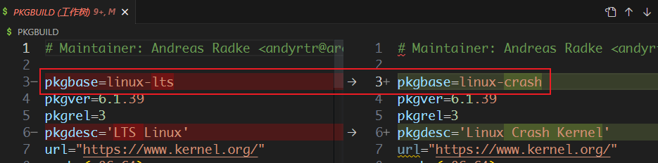
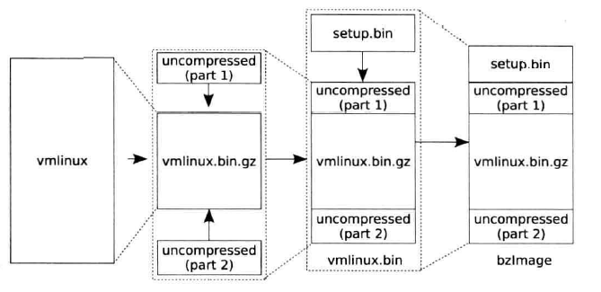
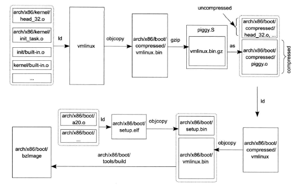
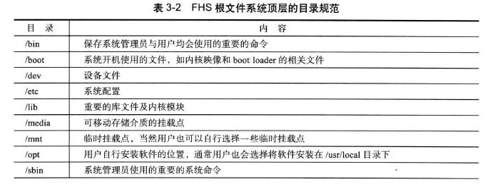
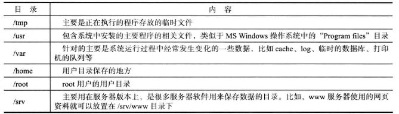
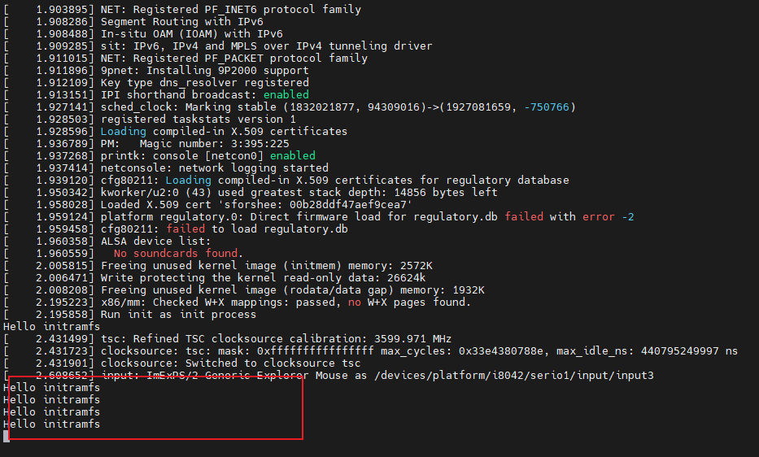
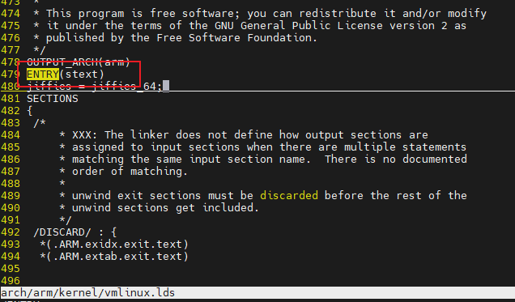
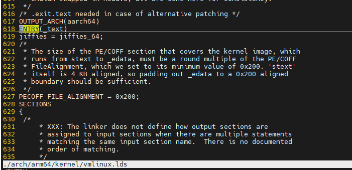

# Linux内核源码阅读


<!--more-->

**内核源码阅读**

<!--more-->

+ 源码版本: [Linux 4.0.0](https://github.com/figozhang/runninglinuxkernel_4.0.git)
+ 参考书籍:
	1.  << 奔跑吧Linux内核 >>
	2.  << 深度探索linux系统虚拟化:原理与实现 >>

## 建立环境

### 崩溃内核

[参考文档](https://wiki.archlinux.org/title/Kdump)

#### 安装拯救内核

下载内核[稳定版](https://gitlab.archlinux.org/archlinux/packaging/packages/linux-lts.git),修改构建脚本为了和主线内核区分即可



修改配置脚本**config**

```ini
CONFIG_DEBUG_INFO=y
CONFIG_CRASH_DUMP=y
CONFIG_PROC_VMCORE=y
```

构建此内核

```shell
# 更新校验值
updpkgsums

# 构建内核
makepkg -s --skippgpcheck

# 安装程序

```

修改`/etc/default/grub`,为**crash kernel**配置空间

```diff
- GRUB_CMDLINE_LINUX_DEFAULT="loglevel=7"
+ GRUB_CMDLINE_LINUX_DEFAULT="loglevel=7 crashkernel=256M@16M"
```

更新grub配置`grub-mkconfig`

#### 启动kdump服务

```shell
/etc/systemd/system/kdump.service
[Unit]
Description=Load dump capture kernel
After=local-fs.target

[Service]
ExecStart=/usr/bin/kexec -p [/boot/vmlinuz-linux-kdump] --initrd=[/boot/initramfs-linux-kdump.img] --append="root=[root-device] single irqpoll maxcpus=1 reset_devices"
Type=oneshot

[Install]
WantedBy=multi-user.target
```


### 基础环境

1. 安装软件

```shell
$ sudo apt install qemu
$ sudo apt install gcc-arm-none-eabi
```

2. 下载源码

```shell
$ git clone https://github.com/figozhang/runninglinuxkernel_4.0.git
```

3. 构建运行

+ 编译32位arm

```shell
qemu-system-arm -m 1024 -M virt\
    -nographic -smp 4 -kernel arch/arm/boot/zImage \
    -append "crashkernel=128M root=/dev/vda rootfstype=ext4 rw"\
    -drive if=none,file=rootfs_debian_arm32.ext4,id=hd0 \
    -device virtio-blk-device,drive=hd0 \
    -netdev user,id=mynet\
    -device virtio-net-device,netdev=mynet\
    --fsdev local,id=kmod_dev,path=./kmodules,security_model=none\
    -device virtio-9p-device,fsdev=kmod_dev,mount_tag=kmod_mount\
    -S -s
```

+ 编译64位arm

```shell
qemu-system-aarch64 -m 1024 -cpu cortex-a57 -M virt\
    -nographic -smp 4 -kernel arch/arm64/boot/Image \
    -append "noinintrd root=/dev/vda rootfstype=ext4 rw loglevel=8" \
    -drive if=none,file=rootfs_debian_arm64.ext4,id=hd0 \
    -device virtio-blk-device,drive=hd0 \
    --fsdev local,id=kmod_dev,path=./kmodules,security_model=none \
    -device virtio-9p-device,fsdev=kmod_dev,mount_tag=kmod_mount\
    -netdev user,id=mynet\
    -device virtio-net-device,netdev=mynet\
    -S -s
```

+ 安装gdb-multiarch

> 参考资料:[Archlinux gdb-multiarch构建](https://aur.archlinux.org/packages/gdb-multiarch)

```shell
# 下载代码
git clone --branch gdb-13-branch https://sourceware.org/git/binutils-gdb.git

# 执行构建
mkdir build && cd build
  ../configure \
    --enable-targets=all \
    --prefix=/build \
    --enable-languages=all \
    --enable-multilib \
    --enable-interwork \
    --with-system-readline \
    --disable-nls \
    --with-python=/usr/bin/python \
    --with-system-gdbinit=/etc/gdb/gdbinit
make -j`nproc`
make install

# 修改文件名
mv /usr/bin/gdb /usr/bin/gdb-multiarch
```

+ 运行gdb-multiarch

```shell
# 加载执行文件
$ file vmlinux

# 设置架构
$ set architecture arm

# 远程连接
$ target remote localhost:1234
```

### 调试环境(eclipse)

1. 安装eclipse

+ 安装jdk

```shell
$ sudo apt update
$ sudo apt install default-jre
```

+ 下载[eclipse C/C++](https://www.eclipse.org/downloads/packages/)

+ 配置调试


### 调试环境(vscode)

当然`vscode`也是相当好用的,作为调试程序

+ 在当前工程中添加配置文件**launch.json**

```json
{
    "configurations": [
    {
        "type": "cppdbg",
        "request": "launch",
        "name": "Linux Gdb Server",
        "program": "${workspaceRoot}/vmlinux",
        "MIMode": "gdb",
        "miDebuggerPath": "/usr/bin/gdb-multiarch",
        "miDebuggerServerAddress": "localhost:1234",
        "cwd": "${workspaceRoot}",
        "externalConsole": false
    }
    ]
}
```

+ 安装调试器

```shell
yay -S gdb-multiarch
```

+ 启动调试器


### 调试环境(原始gdb)

+ 安装gdbgui

```shell
# 安装
pip install gdbgui

# 设计
pip install --upgrade gdbgui

# 卸载
$ pip uninstall gdbgui
```
+ 运行gdbgui

```shell
gdbgui -g arm-multiarch
```


## 系统构建

镜像文件的整体过程





+ 构建**vmlinux**,objcopy生成vmlinux.bin,然后将其压缩为vmlinux.bin.gz
+ 添加操作,生成**vmlinux.bin**
+ 构造**setup.bin**
+ 将setup.bin与vmlinux.bin进行合成,生成bzImage

### vmlinux生成过程

```shell
# x86_64架构链接过程
ld -m elf_x86_64 --no-ld-generated-unwind-info  -pie  --no-dynamic-linker --orphan-handling=error -z noexecstack --no-warn-rwx-segments
-T arch/x86/boot/compressed/vmlinux.lds
	arch/x86/boot/compressed/kernel_info.o arch/x86/boot/compressed/head_64.o 				arch/x86/boot/compressed/misc.o arch/x86/boot/compressed/string.o 						arch/x86/boot/compressed/cmdline.o arch/x86/boot/compressed/error.o           			arch/x86/boot/compressed/piggy.o arch/x86/boot/compressed/cpuflags.o    				arch/x86/boot/compressed/early_serial_console.o arch/x86/boot/compressed/kaslr.o arch/x86/boot/compressed/ident_map_64.o arch/x86/boot/compressed/idt_64.o arch/x86/boot/compressed/idt_handlers_64.o arch/x86/boot/compressed/pgtable_64.o arch/x86/boot/compressed/acpi.o arch/x86/boot/compressed/efi.o arch/x86/boot/compressed/efi_mixed.o drivers/firmware/efi/libstub/lib.a
	-o arch/x86/boot/compressed/vmlinux

# arm32链接过程
```

### vmlinux.bin生成过程

```shell
objcopy  -O binary -R .note -R .comment -S arch/x86/boot/compressed/vmlinux arch/x86/boot/vmlinux.bin
```

### header.o

```shell
gcc -Wp,-MMD,arch/x86/boot/.header.o.d -nostdinc -I./arch/x86/include -I./arch/x86/include/generated  -I./include -I./arch/x86/include/uapi -I./arch/x86/include/generated/uapi -I./include/uapi -I./include/generated/uapi -include ./include/linux/compiler-version.h -include ./include/linux/kconfig.h -D__KERNEL__ -Werror -fmacro-prefix-map=./= -m16 -g -Os -DDISABLE_BRANCH_PROFILING -D__DISABLE_EXPORTS -Wall -Wstrict-prototypes -march=i386 -mregparm=3 -fno-strict-aliasing -fomit-frame-pointer -fno-pic -mno-mmx -mno-sse -fcf-protection=none -ffreestanding -fno-stack-protector -Wno-address-of-packed-member -mpreferred-stack-boundary=2 -D_SETUP -D__ASSEMBLY__ -DSVGA_MODE=NORMAL_VGA -I./arch/x86/boot    -c -o arch/x86/boot/header.o arch/x86/boot/header.S
```


### setup.bin生成过程

```shell
ld -m elf_x86_64 -z noexecstack --no-warn-rwx-segments  -m elf_i386 -z noexecstack -T arch/x86/boot/setup.ld arch/x86/boot/a20.o arch/x86/boot/bioscall.o arch/x86/boot/cmdline.o arch/x86/boot/copy.o arch/x86/boot/cpu.o arch/x86/boot/cpuflags.o arch/x86/boot/cpucheck.o arch/x86/boot/early_serial_console.o arch/x86/boot/edd.o arch/x86/boot/header.o arch/x86/boot/main.o arch/x86/boot/memory.o arch/x86/boot/pm.o arch/x86/boot/pmjump.o arch/x86/boot/printf.o arch/x86/boot/regs.o arch/x86/boot/string.o arch/x86/boot/tty.o arch/x86/boot/video.o arch/x86/boot/video-mode.o arch/x86/boot/version.o arch/x86/boot/video-vga.o arch/x86/boot/video-vesa.o arch/x86/boot/video-bios.o -o arch/x86/boot/setup.elf
objcopy  -O binary arch/x86/boot/setup.elf arch/x86/boot/setup.bin
```


### 最后生成

```shell
arch/x86/boot/tools/build arch/x86/boot/setup.bin arch/x86/boot/vmlinux.bin arch/x86/boot/zoffset.h arch/x86/boot/bzImag
```


## 根文件系统

linux系统在启动之后需要加载根文件系统





### 编译busybox


### 安装C库

从交叉编译器中拷贝即可


## initramfs

### Hello initramfs

```c
#include <stdio.h>

void main(int argc, char *argv[])
{
    printf("Hello initramfs\n");
    fflush(stdout);
    while(1);
}
```

执行构建

```shell
gcc -static -o init init.c
echo init | cpio -o --format=newc > initramfs
```

启动测试

```
qemu-system-x86_64 -kernel linux/arch/x86_64/boot/bzImage -initrd initramfs -append "console=ttyS0 rdinit=init" -nographic
```

然后就可以发现打印的数据



## 启动分析

一般情况下，我们都会讲断点打在`start_kernel`上,但是在进入C语言之前会存在一段汇编代码;

入口地址,我们可以通过链接脚本分析得到

[链接头文件](https://elixir.bootlin.com/linux/v4.0/source/include/asm-generic/vmlinux.lds.h),那么真正的链接文件在**[arch/arm/kernel/vmlinux.lds]**,但是这个文件是生成的;

这个链接脚本用来描述vmlinux的生成



但是aarch64入口地址就是




### 启动前夕

**启动前夕(ARM32)**

```assembly
__mmap_switched:
	adr	r3, __mmap_switched_data

	ldmia	r3!, {r4, r5, r6, r7}
	cmp	r4, r5				@ Copy data segment if needed
1:	cmpne	r5, r6
	ldrne	fp, [r4], #4
	strne	fp, [r5], #4
	bne	1b

	mov	fp, #0				@ Clear BSS (and zero fp)
1:	cmp	r6, r7
	strcc	fp, [r6],#4
	bcc	1b

 ARM(	ldmia	r3, {r4, r5, r6, r7, sp})
 THUMB(	ldmia	r3, {r4, r5, r6, r7}	)
 THUMB(	ldr	sp, [r3, #16]		)
	str	r9, [r4]			@ Save processor ID
	str	r1, [r5]			@ Save machine type
	str	r2, [r6]			@ Save atags pointer
	cmp	r7, #0
	strne	r0, [r7]			@ Save control register values
	b	start_kernel
ENDPROC(__mmap_switched)
```

**启动前夕(ARM64)**

```assembly
__mmap_switched:
	adr	x3, __switch_data + 8

	ldp	x6, x7, [x3], #16
1:	cmp	x6, x7
	b.hs	2f
	str	xzr, [x6], #8			// Clear BSS
	b	1b
2:
	ldp	x4, x5, [x3], #16
	ldr	x6, [x3], #8
	ldr	x16, [x3]
	mov	sp, x16
	str	x22, [x4]			// Save processor ID
	str	x21, [x5]			// Save FDT pointer
	str	x24, [x6]			// Save PHYS_OFFSET
	mov	x29, #0
	b	start_kernel
ENDPROC(__mmap_switched)

	.align	3
	.type	__switch_data, %object
__switch_data:
	.quad	__mmap_switched
	.quad	__bss_start			// x6
	.quad	__bss_stop			// x7
	.quad	processor_id			// x4
	.quad	__fdt_pointer			// x5
	.quad	memstart_addr			// x6
	.quad	init_thread_union + THREAD_START_SP // sp

ENTRY(stext)
	mov	x21, x0				// x21=FDT
	bl	el2_setup			// Drop to EL1, w20=cpu_boot_mode
	bl	__calc_phys_offset		// x24=PHYS_OFFSET, x28=PHYS_OFFSET-PAGE_OFFSET
	bl	set_cpu_boot_mode_flag
	mrs	x22, midr_el1			// x22=cpuid
	mov	x0, x22
	bl	lookup_processor_type
	mov	x23, x0				// x23=current cpu_table
	/*
	 * __error_p may end up out of range for cbz if text areas are
	 * aligned up to section sizes.
	 */
	cbnz	x23, 1f				// invalid processor (x23=0)?
	b	__error_p
1:
	bl	__vet_fdt
	bl	__create_page_tables		// x25=TTBR0, x26=TTBR1
	/*
	 * The following calls CPU specific code in a position independent
	 * manner. See arch/arm64/mm/proc.S for details. x23 = base of
	 * cpu_info structure selected by lookup_processor_type above.
	 * On return, the CPU will be ready for the MMU to be turned on and
	 * the TCR will have been set.
	 */
	ldr	x27, __switch_data		// address to jump to after
						// MMU has been enabled
	adrp	lr, __enable_mmu		// return (PIC) address
	add	lr, lr, #:lo12:__enable_mmu
	ldr	x12, [x23, #CPU_INFO_SETUP]
	add	x12, x12, x28			// __virt_to_phys
	br	x12				// initialise processor
ENDPROC(stext)
```

上面的汇编函数都是由[head.s](https://elixir.bootlin.com/linux/v4.0/source/arch/arm/boot/compressed/head.S)跳入继续向下分析,谁开启了汇编,如何执行到这个函数**vmlinux.lds**决定，分析实现;

需要分析bootloader的实现;

下面我们开始分析


### start_kernel

进入内核中第一个C语言启动函数;[源码位置](https://elixir.bootlin.com/linux/v4.0/source/init/main.c#L489)

```c
asmlinkage __visible void __init start_kernel(void)
{
	char *command_line;
	char *after_dashes;

	// 死锁检测
    lockdep_init();

    // 设置启动任务的结束磨数
	set_task_stack_end_magic(&init_task);

    // 设置smp id
	smp_setup_processor_id();

    // debug
    debug_objects_early_init();

    // 堆栈保护机制
	boot_init_stack_canary();

    // cgroup初始化
	cgroup_init_early();

    // irq中断停止，设置标志位
	local_irq_disable();
	early_boot_irqs_disabled = true;

    // 激活启动CPU
	boot_cpu_init();

    // 单独章节分析
	page_address_init();
	pr_notice("%s", linux_banner);

    // 设置架构
    setup_arch(&command_line);
	mm_init_cpumask(&init_mm);
	setup_command_line(command_line);
	setup_nr_cpu_ids();
	setup_per_cpu_areas();
	smp_prepare_boot_cpu();	/* arch-specific boot-cpu hooks */

	build_all_zonelists(NULL, NULL);
	page_alloc_init();

	pr_notice("Kernel command line: %s\n", boot_command_line);
	parse_early_param();
	after_dashes = parse_args("Booting kernel",
				  static_command_line, __start___param,
				  __stop___param - __start___param,
				  -1, -1, &unknown_bootoption);
	if (!IS_ERR_OR_NULL(after_dashes))
		parse_args("Setting init args", after_dashes, NULL, 0, -1, -1,
			   set_init_arg);

	jump_label_init();

	/*
	 * These use large bootmem allocations and must precede
	 * kmem_cache_init()
	 */
	setup_log_buf(0);
	pidhash_init();
	vfs_caches_init_early();
	sort_main_extable();
	trap_init();
	mm_init();

	/*
	 * Set up the scheduler prior starting any interrupts (such as the
	 * timer interrupt). Full topology setup happens at smp_init()
	 * time - but meanwhile we still have a functioning scheduler.
	 */
	sched_init();
	/*
	 * Disable preemption - early bootup scheduling is extremely
	 * fragile until we cpu_idle() for the first time.
	 */
	preempt_disable();
	if (WARN(!irqs_disabled(),
		 "Interrupts were enabled *very* early, fixing it\n"))
		local_irq_disable();
	idr_init_cache();
	rcu_init();

	/* trace_printk() and trace points may be used after this */
	trace_init();

	context_tracking_init();
	radix_tree_init();
	/* init some links before init_ISA_irqs() */
	early_irq_init();
	init_IRQ();
	tick_init();
	rcu_init_nohz();
	init_timers();
	hrtimers_init();
	softirq_init();
	timekeeping_init();
	time_init();
	sched_clock_postinit();
	perf_event_init();
	profile_init();
	call_function_init();
	WARN(!irqs_disabled(), "Interrupts were enabled early\n");
	early_boot_irqs_disabled = false;
	local_irq_enable();

	kmem_cache_init_late();

	/*
	 * HACK ALERT! This is early. We're enabling the console before
	 * we've done PCI setups etc, and console_init() must be aware of
	 * this. But we do want output early, in case something goes wrong.
	 */
	console_init();
	if (panic_later)
		panic("Too many boot %s vars at `%s'", panic_later,
		      panic_param);

	lockdep_info();

	/*
	 * Need to run this when irqs are enabled, because it wants
	 * to self-test [hard/soft]-irqs on/off lock inversion bugs
	 * too:
	 */
	locking_selftest();

#ifdef CONFIG_BLK_DEV_INITRD
	if (initrd_start && !initrd_below_start_ok &&
	    page_to_pfn(virt_to_page((void *)initrd_start)) < min_low_pfn) {
		pr_crit("initrd overwritten (0x%08lx < 0x%08lx) - disabling it.\n",
		    page_to_pfn(virt_to_page((void *)initrd_start)),
		    min_low_pfn);
		initrd_start = 0;
	}
#endif
	page_ext_init();
	debug_objects_mem_init();
	kmemleak_init();
	setup_per_cpu_pageset();
	numa_policy_init();
	if (late_time_init)
		late_time_init();
	sched_clock_init();
	calibrate_delay();
	pidmap_init();
	anon_vma_init();
	acpi_early_init();
#ifdef CONFIG_X86
	if (efi_enabled(EFI_RUNTIME_SERVICES))
		efi_enter_virtual_mode();
#endif
#ifdef CONFIG_X86_ESPFIX64
	/* Should be run before the first non-init thread is created */
	init_espfix_bsp();
#endif
	thread_info_cache_init();
	cred_init();
	fork_init(totalram_pages);
	proc_caches_init();
	buffer_init();
	key_init();
	security_init();
	dbg_late_init();
	vfs_caches_init(totalram_pages);
	signals_init();
	/* rootfs populating might need page-writeback */
	page_writeback_init();
	proc_root_init();
	nsfs_init();
	cgroup_init();
	cpuset_init();
	taskstats_init_early();
	delayacct_init();

	check_bugs();

	sfi_init_late();

	if (efi_enabled(EFI_RUNTIME_SERVICES)) {
		efi_late_init();
		efi_free_boot_services();
	}

	ftrace_init();

	/* Do the rest non-__init'ed, we're now alive */
	rest_init();
}
```

但是谁调用了此函数呢?

### reset_init

这个是系统调用的最后一个函数,调用结束后不会返回

```c
static noinline void __init_refok rest_init(void)
{
	int pid;

	rcu_scheduler_starting();
	/*
	 * We need to spawn init first so that it obtains pid 1, however
	 * the init task will end up wanting to create kthreads, which, if
	 * we schedule it before we create kthreadd, will OOPS.
	 */
	kernel_thread(kernel_init, NULL, CLONE_FS);
	numa_default_policy();
	pid = kernel_thread(kthreadd, NULL, CLONE_FS | CLONE_FILES);
	rcu_read_lock();
	kthreadd_task = find_task_by_pid_ns(pid, &init_pid_ns);
	rcu_read_unlock();
	complete(&kthreadd_done);

	/*
	 * The boot idle thread must execute schedule()
	 * at least once to get things moving:
	 */
	init_idle_bootup_task(current);
	schedule_preempt_disabled();
	/* Call into cpu_idle with preempt disabled */
	cpu_startup_entry(CPUHP_ONLINE);
}
```

### 设置`init`任务堆栈

```c
set_task_stack_end_magic(&init_task);

void set_task_stack_end_magic(struct task_struct *tsk)
{
	unsigned long *stackend;

	stackend = end_of_stack(tsk);
	*stackend = STACK_END_MAGIC;	/* for overflow detection */
}
```


此处可以得知:

```c
static inline unsigned long *end_of_stack(struct task_struct *p)
{
#ifdef CONFIG_STACK_GROWSUP
	return (unsigned long *)((unsigned long)task_thread_info(p) + THREAD_SIZE) - 1;
#else
	return (unsigned long *)(task_thread_info(p) + 1);
#endif
}
```

### 设置smp的CPU ID

```c
int nr_cpu_ids __read_mostly = NR_CPUS;		// 此参数通过配置文件得到
EXPORT_SYMBOL(nr_cpu_ids);

u32 __cpu_logical_map[NR_CPUS] = { [0 ... NR_CPUS-1] = MPIDR_INVALID };
#define cpu_logical_map(cpu)	__cpu_logical_map[cpu]

// 1. 设置cpu_logical_map
// 2. 设置线程ID
// 3. 打印日志
void __init smp_setup_processor_id(void)
{
	int i;
	u32 mpidr = is_smp() ? read_cpuid_mpidr() & MPIDR_HWID_BITMASK : 0;
	u32 cpu = MPIDR_AFFINITY_LEVEL(mpidr, 0);

	cpu_logical_map(0) = cpu;
	for (i = 1; i < nr_cpu_ids; ++i)
		cpu_logical_map(i) = i == cpu ? 0 : i;

	/*
	 * clear __my_cpu_offset on boot CPU to avoid hang caused by
	 * using percpu variable early, for example, lockdep will
	 * access percpu variable inside lock_release
	 */
	set_my_cpu_offset(0);

	pr_info("Booting Linux on physical CPU 0x%x\n", mpidr);
}

// 设置线程ID
static inline void set_my_cpu_offset(unsigned long off)
{
	/* Set TPIDRPRW */
    // off=0x0
 	asm volatile("mcr p15, 0, %0, c13, c0, 4" : : "r" (off) : "memory");
}
```

### 激活启动CPU

```c
static void __init boot_cpu_init(void)
{
	int cpu = smp_processor_id();
	/* Mark the boot cpu "present", "online" etc for SMP and UP case */
	set_cpu_online(cpu, true);
	set_cpu_active(cpu, true);
	set_cpu_present(cpu, true);
	set_cpu_possible(cpu, true);
}
```

### 设置架构

读取配置文件(设置树),设置内存信息

在设备树一章节中会详细分析

```c
void __init setup_arch(char **cmdline_p)
{
    // 机器描述符
	const struct machine_desc *mdesc;

    // 设置处理器相关信息
	setup_processor();

    // 读取设备树信息
	mdesc = setup_machine_fdt(__atags_pointer);
	if (!mdesc)
		mdesc = setup_machine_tags(__atags_pointer, __machine_arch_type);

    // 设置到全局变量
    machine_desc = mdesc;
	machine_name = mdesc->name;
	dump_stack_set_arch_desc("%s", mdesc->name);

	if (mdesc->reboot_mode != REBOOT_HARD)
		reboot_mode = mdesc->reboot_mode;

    // 设置init任务
	init_mm.start_code = (unsigned long) _text;
	init_mm.end_code   = (unsigned long) _etext;
	init_mm.end_data   = (unsigned long) _edata;
	init_mm.brk	   	   = (unsigned long) _end;

	/* populate cmd_line too for later use, preserving boot_command_line */
	strlcpy(cmd_line, boot_command_line, COMMAND_LINE_SIZE);
	*cmdline_p = cmd_line;

	parse_early_param();

    // 读取设备树
	early_paging_init(mdesc, lookup_processor_type(read_cpuid_id()));
	setup_dma_zone(mdesc);
	sanity_check_meminfo();
	arm_memblock_init(mdesc);
	paging_init(mdesc);
	request_standard_resources(mdesc);

	if (mdesc->restart)
		arm_pm_restart = mdesc->restart;

	unflatten_device_tree();

	arm_dt_init_cpu_maps();
	psci_init();
#ifdef CONFIG_SMP
	if (is_smp()) {
		if (!mdesc->smp_init || !mdesc->smp_init()) {
			if (psci_smp_available())
				smp_set_ops(&psci_smp_ops);
			else if (mdesc->smp)
				smp_set_ops(mdesc->smp);
		}
		smp_init_cpus();
		smp_build_mpidr_hash();
	}
#endif

	if (!is_smp())
		hyp_mode_check();

	reserve_crashkernel();

#ifdef CONFIG_MULTI_IRQ_HANDLER
	handle_arch_irq = mdesc->handle_irq;
#endif

#ifdef CONFIG_VT
#if defined(CONFIG_VGA_CONSOLE)
	conswitchp = &vga_con;
#elif defined(CONFIG_DUMMY_CONSOLE)
	conswitchp = &dummy_con;
#endif
#endif

	if (mdesc->init_early)
		mdesc->init_early();
}
```

### mm_init_cpumask

清理内存管理系统的`init_mm->cpu_vm_mask_var`

```c
static inline void mm_init_cpumask(struct mm_struct *mm)
{
#ifdef CONFIG_CPUMASK_OFFSTACK
	mm->cpu_vm_mask_var = &mm->cpumask_allocation;
#endif
	cpumask_clear(mm->cpu_vm_mask_var);
}
```

### 设置命令行`command_line`

申请内存， 保存命令行参数

```c
/* Untouched saved command line (eg. for /proc) */
char *saved_command_line;
/* Command line for parameter parsing */
static char *static_command_line;
/* Command line for per-initcall parameter parsing */
static char *initcall_command_line;

static void __init setup_command_line(char *command_line)
{
	saved_command_line =
		memblock_virt_alloc(strlen(boot_command_line) + 1, 0);
	initcall_command_line =
		memblock_virt_alloc(strlen(boot_command_line) + 1, 0);
	static_command_line = memblock_virt_alloc(strlen(command_line) + 1, 0);
	strcpy(saved_command_line, boot_command_line);
	strcpy(static_command_line, command_line);
}
```

### 设置CPU

1. `setup_nr_cpu_ids`
2. `setup_per_cpu_areas`

```c
/* Setup number of possible processor ids */
int nr_cpu_ids __read_mostly = NR_CPUS;
EXPORT_SYMBOL(nr_cpu_ids);

/* An arch may set nr_cpu_ids earlier if needed, so this would be redundant */
void __init setup_nr_cpu_ids(void)
{
	nr_cpu_ids = find_last_bit(cpumask_bits(cpu_possible_mask),NR_CPUS) + 1;
}
```

### smp_prepare_boot_cpu

```c
static inline void set_my_cpu_offset(unsigned long off)
{
	/* Set TPIDRPRW */
	asm volatile("mcr p15, 0, %0, c13, c0, 4" : : "r" (off) : "memory");
}

void __init smp_prepare_boot_cpu(void)
{
	set_my_cpu_offset(per_cpu_offset(smp_processor_id()));
}
```

### build_all_zonelists

启动期间构建zone,

**[build_all_zonelists --> build_all_zonelists_init]**

```c
/*
 *  zonelist_order:
 *  0 = automatic detection of better ordering.
 *  1 = order by ([node] distance, -zonetype)
 *  2 = order by (-zonetype, [node] distance)
 *
 *  If not NUMA, ZONELIST_ORDER_ZONE and ZONELIST_ORDER_NODE will create
 *  the same zonelist. So only NUMA can configure this param.
 */
#define ZONELIST_ORDER_DEFAULT  0
#define ZONELIST_ORDER_NODE     1
#define ZONELIST_ORDER_ZONE     2

/* zonelist order in the kernel.
 * set_zonelist_order() will set this to NODE or ZONE.
 */
static int current_zonelist_order = ZONELIST_ORDER_DEFAULT;
static char zonelist_order_name[3][8] = {"Default", "Node", "Zone"};

static void set_zonelist_order(void)
{
	current_zonelist_order = ZONELIST_ORDER_ZONE;
}
```

最终调用到`build_all_zonelists_init`

```c
static noinline void __init build_all_zonelists_init(void)
{
	__build_all_zonelists(NULL);
	mminit_verify_zonelist();
	cpuset_init_current_mems_allowed();
}
```

### page_alloc_init

```c
void __init page_alloc_init(void)
{
	hotcpu_notifier(page_alloc_cpu_notify, 0);
}
```

### jump_label_init

```c
/*
 * Used to generate warnings if static_key manipulation functions are used
 * before jump_label_init is called.
 */
bool static_key_initialized __read_mostly;
EXPORT_SYMBOL_GPL(static_key_initialized);

static __always_inline void jump_label_init(void)
{
	static_key_initialized = true;
}
```

### setup_log_buf

设置日志buf

### pidhash_init

```c
struct hlist_head {
	struct hlist_node *first;
};
struct hlist_node {
	struct hlist_node *next, **pprev;
};
static struct hlist_head *pid_hash;
static unsigned int pidhash_shift = 4;

void __init pidhash_init(void)
{
	unsigned int i, pidhash_size;

	pid_hash = alloc_large_system_hash("PID", sizeof(*pid_hash), 0, 18,
					   HASH_EARLY | HASH_SMALL,
					   &pidhash_shift, NULL,
					   0, 4096);
	pidhash_size = 1U << pidhash_shift;

	for (i = 0; i < pidhash_size; i++)
		INIT_HLIST_HEAD(&pid_hash[i]);
}
```

### vfs_caches_init_early

```c
void __init vfs_caches_init_early(void)
{
	dcache_init_early();
	inode_init_early();
}
```

### sort_main_extable

**异常修复表**

```c
struct exception_table_entry
{
	unsigned long insn, fixup;
};

extern struct exception_table_entry __start___ex_table[];
extern struct exception_table_entry __stop___ex_table[];

void __init sort_main_extable(void)
{
	if (main_extable_sort_needed && __stop___ex_table > __start___ex_table) {
		pr_notice("Sorting __ex_table...\n");
		sort_extable(__start___ex_table, __stop___ex_table);
	}
}

static int cmp_ex(const void *a, const void *b)
{
	const struct exception_table_entry *x = a, *y = b;

	/* avoid overflow */
	if (x->insn > y->insn)
		return 1;
	if (x->insn < y->insn)
		return -1;
	return 0;
}

void sort_extable(struct exception_table_entry *start,
		  struct exception_table_entry *finish)
{
	sort(start, finish - start, sizeof(struct exception_table_entry),
	     cmp_ex, NULL);
}
```

但是这个表定义在什么位置内?

```lds
	. = ALIGN(4);
	__ex_table : AT(ADDR(__ex_table) - LOAD_OFFSET) {
		__start___ex_table = .;
#ifdef CONFIG_MMU
		*(__ex_table)
#endif
		__stop___ex_table = .;
	}
```

在链接脚本中定义,代表着什么呢？如何定义这个表呢？

大部分都是汇编实现的，当前不进行分析了

```assembly
# define _ASM_EXTABLE_TYPE(from, to, type)			\
	.pushsection "__ex_table","a" ;					\
	.balign 4 ;										\
	.long (from) - . ;								\
	.long (to) - . ;								\
	.long type ;									\
	.popsection
```

如何调用这个**异常修复表**呢?

```c
int fixup_exception(struct pt_regs *regs)
{
	const struct exception_table_entry *fixup;

	fixup = search_exception_tables(instruction_pointer(regs));
	if (fixup) {
		regs->ARM_pc = fixup->fixup;
#ifdef CONFIG_THUMB2_KERNEL
		/* Clear the IT state to avoid nasty surprises in the fixup */
		regs->ARM_cpsr &= ~PSR_IT_MASK;
#endif
	}

	return fixup != NULL;
}
```

调用线路


### trap_init

中断描述符初始化，但是在arm上初始化好像不是这样进行的

arm上此选项无效

### mm_init

内存分配器初始化(单独分析)

```c
static void __init mm_init(void)
{
	/*
	 * page_ext requires contiguous pages,
	 * bigger than MAX_ORDER unless SPARSEMEM.
	 */
	page_ext_init_flatmem();
	mem_init();
	kmem_cache_init();
	percpu_init_late();
	pgtable_init();
	vmalloc_init();
}
```

### sched_init

调度器初始化(单独分析)

### idr_init_cache

整数ID管理机制

```c
void __init idr_init_cache(void)
{
	idr_layer_cache = kmem_cache_create("idr_layer_cache",
				sizeof(struct idr_layer), 0, SLAB_PANIC, NULL);
}
```

### rcu_init

```c
void __init rcu_init(void)
{
	int cpu;

	rcu_bootup_announce();
	rcu_init_geometry();
	rcu_init_one(&rcu_bh_state, &rcu_bh_data);
	rcu_init_one(&rcu_sched_state, &rcu_sched_data);
	__rcu_init_preempt();
	open_softirq(RCU_SOFTIRQ, rcu_process_callbacks);

	/*
	 * We don't need protection against CPU-hotplug here because
	 * this is called early in boot, before either interrupts
	 * or the scheduler are operational.
	 */
	cpu_notifier(rcu_cpu_notify, 0);
	pm_notifier(rcu_pm_notify, 0);
	for_each_online_cpu(cpu)
		rcu_cpu_notify(NULL, CPU_UP_PREPARE, (void *)(long)cpu);

	rcu_early_boot_tests();
}
```


