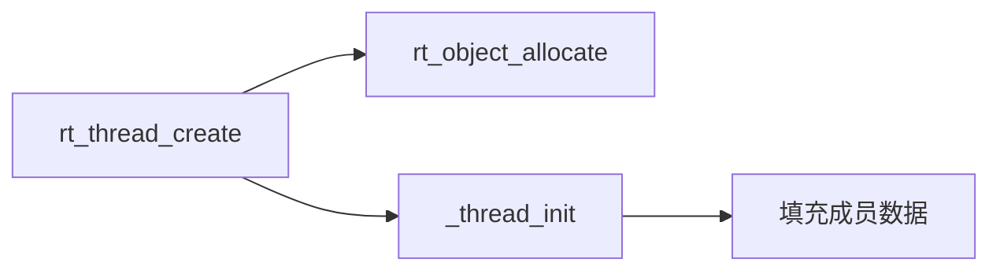
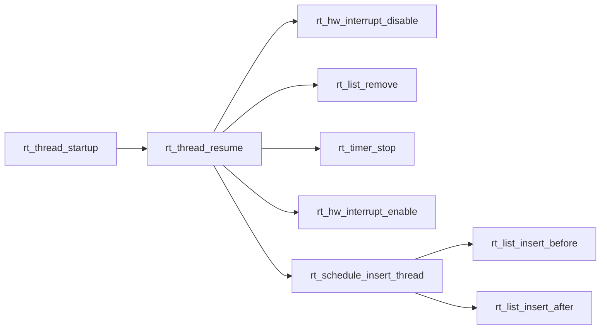
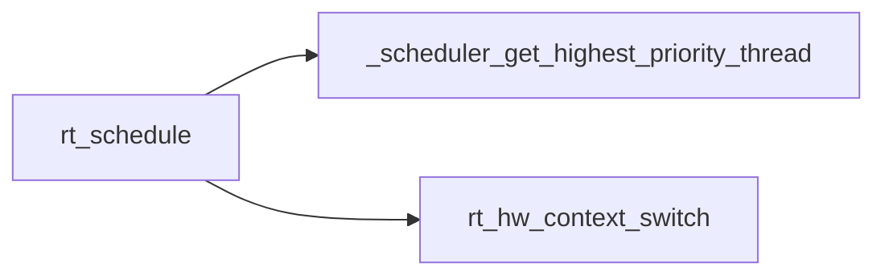
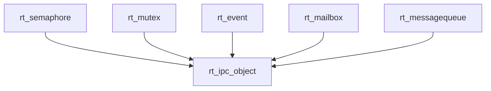

# RT-Thread


## 线程管理

### 线程对象

```c

struct rt_thread
{
    struct rt_object parent;							/** object结构实现 */
    rt_list_t   tlist;                                  /**< the thread list */

    /* stack point and entry */
    void       *sp;                                     /**< stack point */
    void       *entry;                                  /**< entry */
    void       *parameter;                              /**< parameter */
    void       *stack_addr;                             /**< stack address */
    rt_uint32_t stack_size;                             /**< stack size */

    /* error code */
    rt_err_t    error;                                  /**< error code */

    rt_uint8_t  stat;                                   /**< thread status */

#ifdef RT_USING_SMP
    rt_uint8_t  bind_cpu;                               /**< thread is bind to cpu */
    rt_uint8_t  oncpu;                                  /**< process on cpu */

    rt_uint16_t scheduler_lock_nest;                    /**< scheduler lock count */
    rt_uint16_t cpus_lock_nest;                         /**< cpus lock count */
    rt_uint16_t critical_lock_nest;                     /**< critical lock count */
#endif /*RT_USING_SMP*/

    /* priority */
    rt_uint8_t  current_priority;                       /**< current priority */
    rt_uint8_t  init_priority;                          /**< initialized priority */
#if RT_THREAD_PRIORITY_MAX > 32
    rt_uint8_t  number;
    rt_uint8_t  high_mask;
#endif /* RT_THREAD_PRIORITY_MAX > 32 */
    rt_uint32_t number_mask;                            /**< priority number mask */

#ifdef RT_USING_MUTEX
    /* object for IPC */
    rt_list_t taken_object_list;
    rt_object_t pending_object;
#endif

#ifdef RT_USING_EVENT
    /* thread event */
    rt_uint32_t event_set;
    rt_uint8_t  event_info;
#endif /* RT_USING_EVENT */

#ifdef RT_USING_SIGNALS
    rt_sigset_t     sig_pending;                        /**< the pending signals */
    rt_sigset_t     sig_mask;                           /**< the mask bits of signal */

#ifndef RT_USING_SMP
    void            *sig_ret;                           /**< the return stack pointer from signal */
#endif /* RT_USING_SMP */
    rt_sighandler_t *sig_vectors;                       /**< vectors of signal handler */
    void            *si_list;                           /**< the signal infor list */
#endif /* RT_USING_SIGNALS */

#ifdef RT_USING_SMART
    void            *msg_ret;                           /**< the return msg */
#endif

    rt_ubase_t  init_tick;                              /**< thread's initialized tick */
    rt_ubase_t  remaining_tick;                         /**< remaining tick */

#ifdef RT_USING_CPU_USAGE
    rt_uint64_t  duration_tick;                         /**< cpu usage tick */
#endif /* RT_USING_CPU_USAGE */

#ifdef RT_USING_PTHREADS
    void  *pthread_data;                                /**< the handle of pthread data, adapt 32/64bit */
#endif /* RT_USING_PTHREADS */

    struct rt_timer thread_timer;                       /**< built-in thread timer */

    void (*cleanup)(struct rt_thread *tid);             /**< cleanup function when thread exit */

    /* light weight process if present */
#ifdef RT_USING_SMART
    void        *lwp;
    /* for user create */
    void        *user_entry;
    void        *user_stack;
    rt_uint32_t user_stack_size;
    rt_uint32_t *kernel_sp;                             /**< kernel stack point */
    rt_list_t   sibling;                                /**< next thread of same process */

    lwp_sigset_t signal;
    lwp_sigset_t signal_mask;
    int signal_mask_bak;
    rt_uint32_t signal_in_process;
#ifndef ARCH_MM_MMU
    lwp_sighandler_t signal_handler[32];
#endif
    struct rt_user_context user_ctx;

    struct rt_wakeup wakeup;                            /**< wakeup data */
    int exit_request;
#if defined(ARCH_MM_MMU)
    int step_exec;
    int debug_attach_req;
    int debug_ret_user;
    int debug_suspend;
    struct rt_hw_exp_stack *regs;
    void * thread_idr;                                 /** lwp thread indicator */
    int *clear_child_tid;
#endif
    int tid;
#endif

    rt_ubase_t user_data;                             /**< private user data beyond this thread */
};

typedef struct rt_thread *rt_thread_t;
```

### 创建任务

```c
rt_thread_t rt_thread_create(const char *name,
                             void (*entry)(void *parameter),
                             void       *parameter,
                             rt_uint32_t stack_size,
                             rt_uint8_t  priority,
                             rt_uint32_t tick);
```



### 启动任务

```c
rt_err_t rt_thread_startup(rt_thread_t thread);
```



经过上面的代码分析，创建任务与启动的操作时将任务管理结构体链接进入`rt_thread_priority_table`

```c
rt_list_t rt_thread_priority_table[RT_THREAD_PRIORITY_MAX];
rt_uint32_t rt_thread_ready_priority_group;
```

### 删除任务

```c
rt_err_t rt_thread_delete(rt_thread_t thread);
```

与创建任务相反的操作,删除任务的流程大致如下


### 任务调度

> 任务调度实现实时操作系统的核心

```
void rt_schedule(void);
```



调度是如何发生的呢？

调度器rt_schedule的调用路线

ARM64调度
**scheduler_mp.c**
```shell
(gdb) bt
#0  rt_schedule () at /home/mengdemao/work/rt-thread/src/scheduler_mp.c:820
#1  0x00000000400e28c8 in rt_scheduler_ipi_handler (vector=0, param=0x0)
    at /home/mengdemao/work/rt-thread/src/scheduler_mp.c:515
#2  0x00000000400958b0 in _rt_hw_trap_irq (
    irq_context=0x40156d70 <rt_system_stack+7360>)
    at /home/mengdemao/work/rt-thread/libcpu/aarch64/common/trap.c:264
#3  0x00000000400958f0 in rt_hw_trap_irq (
    regs=0x40156d80 <rt_system_stack+7376>)
    at /home/mengdemao/work/rt-thread/libcpu/aarch64/common/trap.c:286
#4  0x0000000040096b2c in vector_irq ()
    at /home/mengdemao/work/rt-thread/libcpu/aarch64/common/vector_gcc.S:114
```

ARM32调度器实现
**scheduler_up.c**
```shell
#0  rt_schedule () at /home/mengdemao/work/rt-thread/src/scheduler_up.c:206
#1  0x6009be04 in rt_exit_critical ()
    at /home/mengdemao/work/rt-thread/src/scheduler_up.c:542
#2  0x6009bd18 in rt_exit_critical_safe (critical_level=0)
    at /home/mengdemao/work/rt-thread/src/scheduler_up.c:491
#3  0x6008fe0c in rt_spin_unlock_irqrestore (lock=0x600e6190 <_htimer_lock>,
    level=-1610612334) at /home/mengdemao/work/rt-thread/src/cpu_up.c:84
#4  0x6009dba8 in _timer_check (timer_list=0x600e6188 <_timer_list>,
    lock=0x600e6190 <_htimer_lock>)
    at /home/mengdemao/work/rt-thread/src/timer.c:527
#5  0x6009e1c0 in rt_timer_check ()
    at /home/mengdemao/work/rt-thread/src/timer.c:771
#6  0x6008f9d0 in rt_tick_increase ()
    at /home/mengdemao/work/rt-thread/src/clock.c:147
#7  0x6006cdf4 in rt_hw_timer_isr (vector=35, param=0x0)
    at drivers/drv_timer.c:68
#8  0x600690dc in rt_hw_trap_irq ()
    at /home/mengdemao/work/rt-thread/libcpu/arm/cortex-a/trap.c:363
#9  0x6009f4ac in vector_irq ()
    at /home/mengdemao/work/rt-thread/libcpu/arm/cortex-a/start_gcc.S:385
```

## 线程间同步与通信

[线程间同步](https://www.rt-thread.org/document/site/#/rt-thread-version/rt-thread-standard/programming-manual/ipc1/ipc1?id=%e7%ba%bf%e7%a8%8b%e9%97%b4%e5%90%8c%e6%ad%a5)
[线程间通信](https://www.rt-thread.org/document/site/#/rt-thread-version/rt-thread-standard/programming-manual/ipc2/ipc2?id=%e7%ba%bf%e7%a8%8b%e9%97%b4%e9%80%9a%e4%bf%a1)


## IPC对象

```c
struct rt_ipc_object
{
    struct rt_object parent;                            /**< inherit from rt_object */

    rt_list_t        suspend_thread;                    /**< threads pended on this resource */
};
```




## 信号量

```c
struct rt_semaphore
{
    struct rt_ipc_object parent;                        /**< inherit from ipc_object */

    rt_uint16_t          value;                         /**< value of semaphore. */
    rt_uint16_t          reserved;                      /**< reserved field */
};
typedef struct rt_semaphore *rt_sem_t;

// sem初始化
rt_err_t rt_sem_init(rt_sem_t    sem,
                     const char *name,
                     rt_uint32_t value,
                     rt_uint8_t  flag);
```


## 互斥量

```c
struct rt_mutex
{
    struct rt_ipc_object parent;                        /**< inherit from ipc_object */

    rt_uint8_t           ceiling_priority;              /**< the priority ceiling of mutexe */
    rt_uint8_t           priority;                      /**< the maximal priority for pending thread */
    rt_uint8_t           hold;                          /**< numbers of thread hold the mutex */
    rt_uint8_t           reserved;                      /**< reserved field */

    struct rt_thread    *owner;                         /**< current owner of mutex */
    rt_list_t            taken_list;                    /**< the object list taken by thread */
};
typedef struct rt_mutex *rt_mutex_t;
```

## 事件集

```c
#define RT_EVENT_FLAG_AND               0x01            /**< logic and */
#define RT_EVENT_FLAG_OR                0x02            /**< logic or */
#define RT_EVENT_FLAG_CLEAR             0x04            /**< clear flag */

struct rt_event
{
    struct rt_ipc_object parent;                        /**< inherit from ipc_object */

    rt_uint32_t          set;                           /**< event set */
};
typedef struct rt_event *rt_event_t;
```

## 邮箱

```c
struct rt_mailbox
{
    struct rt_ipc_object parent;                        /**< inherit from ipc_object */

    rt_ubase_t          *msg_pool;                      /**< start address of message buffer */

    rt_uint16_t          size;                          /**< size of message pool */

    rt_uint16_t          entry;                         /**< index of messages in msg_pool */
    rt_uint16_t          in_offset;                     /**< input offset of the message buffer */
    rt_uint16_t          out_offset;                    /**< output offset of the message buffer */

    rt_list_t            suspend_sender_thread;         /**< sender thread suspended on this mailbox */
};
typedef struct rt_mailbox *rt_mailbox_t;
```

## 消息队列

```c
struct rt_messagequeue
{
    struct rt_ipc_object parent;                        /**< inherit from ipc_object */

    void                *msg_pool;                      /**< start address of message queue */

    rt_uint16_t          msg_size;                      /**< message size of each message */
    rt_uint16_t          max_msgs;                      /**< max number of messages */

    rt_uint16_t          entry;                         /**< index of messages in the queue */

    void                *msg_queue_head;                /**< list head */
    void                *msg_queue_tail;                /**< list tail */
    void                *msg_queue_free;                /**< pointer indicated the free node of queue */

    rt_list_t            suspend_sender_thread;         /**< sender thread suspended on this message queue */
};
typedef struct rt_messagequeue *rt_mq_t;
```

## 信号

```c
typedef unsigned long rt_sigset_t;
typedef siginfo_t rt_siginfo_t;
typedef void (*rt_sighandler_t)(int signo);

#define RT_SIG_MAX          32
```

## 内存管理


```c
rt_weak void rt_system_heap_init(void *begin_addr, void *end_addr)
{
    rt_ubase_t begin_align = RT_ALIGN((rt_ubase_t)begin_addr, RT_ALIGN_SIZE);
    rt_ubase_t end_align   = RT_ALIGN_DOWN((rt_ubase_t)end_addr, RT_ALIGN_SIZE);

    RT_ASSERT(end_align > begin_align);

    /* Initialize system memory heap */
    _MEM_INIT("heap", begin_addr, end_align - begin_align);
    /* Initialize multi thread contention lock */
    _heap_lock_init();
}

rt_weak void *rt_malloc(rt_size_t size)
{
    rt_base_t level;
    void *ptr;

    /* Enter critical zone */
    level = _heap_lock();
    /* allocate memory block from system heap */
    ptr = _MEM_MALLOC(size);
    /* Exit critical zone */
    _heap_unlock(level);
    /* call 'rt_malloc' hook */
    RT_OBJECT_HOOK_CALL(rt_malloc_hook, (ptr, size));
    return ptr;
}

rt_weak void *rt_realloc(void *ptr, rt_size_t newsize)
{
    rt_base_t level;
    void *nptr;

    /* Enter critical zone */
    level = _heap_lock();
    /* Change the size of previously allocated memory block */
    nptr = _MEM_REALLOC(ptr, newsize);
    /* Exit critical zone */
    _heap_unlock(level);
    return nptr;
}

rt_weak void rt_free(void *ptr)
{
    rt_base_t level;

    /* call 'rt_free' hook */
    RT_OBJECT_HOOK_CALL(rt_free_hook, (ptr));
    /* NULL check */
    if (ptr == RT_NULL) return;
    /* Enter critical zone */
    level = _heap_lock();
    _MEM_FREE(ptr);
    /* Exit critical zone */
    _heap_unlock(level);
}
```

进入不同的分配算法实现

* 小内存分配算法

```c
#define _MEM_INIT(_name, _start, _size) \
	system_heap = rt_smem_init(_name, _start, _size)
#define _MEM_MALLOC(_size)           \
	rt_smem_alloc(system_heap, _size)
#define _MEM_REALLOC(_ptr, _newsize)\
    rt_smem_realloc(system_heap, _ptr, _newsize)
#define _MEM_FREE(_ptr) \
    rt_smem_free(_ptr)
#define _MEM_INFO(_total, _used, _max)  \
    _smem_info(_total, _used, _max)
```

* slab分配算法

```c
#define _MEM_INIT(_name, _start, _size) \
    rt_memheap_init(&system_heap, _name, _start, _size)
#define _MEM_MALLOC(_size)  \
    _memheap_alloc(&system_heap, _size)
#define _MEM_REALLOC(_ptr, _newsize)    \
    _memheap_realloc(&system_heap, _ptr, _newsize)
#define _MEM_FREE(_ptr)   \
    _memheap_free(_ptr)
#define _MEM_INFO(_total, _used, _max)   \
    rt_memheap_info(&system_heap, _total, _used, _max)
```

* 内存池分配算法

```c
#define _MEM_INIT(_name, _start, _size) \
    system_heap = rt_slab_init(_name, _start, _size)
#define _MEM_MALLOC(_size)  \
    rt_slab_alloc(system_heap, _size)
#define _MEM_REALLOC(_ptr, _newsize)    \
    rt_slab_realloc(system_heap, _ptr, _newsize)
#define _MEM_FREE(_ptr) \
    rt_slab_free(system_heap, _ptr)
#define _MEM_INFO       _slab_info
```

## 时钟管理

### `tick`自增函数

```c
void rt_tick_increase(void)
{
    struct rt_thread *thread;
    rt_base_t level;

    RT_OBJECT_HOOK_CALL(rt_tick_hook, ());

    /* 关闭全局中断 */
    level = rt_hw_interrupt_disable();

    /* 增加全局的ticks */
#ifdef RT_USING_SMP
    rt_cpu_self()->tick ++;
#else
    ++ rt_tick;
#endif /* RT_USING_SMP */

    /* 检查当前thread的时间片 */
    thread = rt_thread_self();

    /* 时间片已经使用结束 */
    -- thread->remaining_tick;
    if (thread->remaining_tick == 0)
    {
        /* 重载剩余的时间 */
        thread->remaining_tick = thread->init_tick;

        /* 设置线程的状态为yield */
        thread->stat |= RT_THREAD_STAT_YIELD;

        /* 开启中断 */
        rt_hw_interrupt_enable(level);

        /* 执行调度器 */
        rt_schedule();
    }
    else
    {
        /* 时间片没有使用完，直接全局中断 */
        rt_hw_interrupt_enable(level);
    }

    /* check timer */
    rt_timer_check();
}
```

### 获取tick

> 直接获取滴答函数的计数

```c
#ifdef RT_USING_SMP
#define rt_tick rt_cpu_index(0)->tick
#else
static volatile rt_tick_t rt_tick = 0;
#endif /* RT_USING_SMP */

rt_tick_t rt_tick_get(void)
{
    /* return the global tick */
    return rt_tick;
}
```

### 定时器实现

```c
struct rt_timer
{
    struct rt_object parent;                            /**< inherit from rt_object */

    rt_list_t        row[RT_TIMER_SKIP_LIST_LEVEL];

    void (*timeout_func)(void *parameter);              /**< timeout function */
    void            *parameter;                         /**< timeout function's parameter */

    rt_tick_t        init_tick;                         /**< timer timeout tick */
    rt_tick_t        timeout_tick;                      /**< timeout tick */
};
typedef struct rt_timer *rt_timer_t;

**开启定时器**
> rt_timer_start

## 内核移植

[内核移植](https://www.rt-thread.org/document/site/#/rt-thread-version/rt-thread-standard/programming-manual/porting/porting?id=%e5%86%85%e6%a0%b8%e7%a7%bb%e6%a4%8d)


| **Functions and Variables**                                  | **Description**                                              |
| ------------------------------------------------------------ | ------------------------------------------------------------ |
| rt_base_t rt_hw_interrupt_disable(void);                     | disable global interrupt                                     |
| void rt_hw_interrupt_enable(rt_base_t level);                | enable global interrupt                                      |
| rt_uint8_t \*rt_hw_stack_init(void \*tentry, void \*parameter, rt_uint8_t \*stack_addr, void \*texit); | The initialization of the thread stack, the kernel will call this function during thread creation and thread initialization. |
| void rt_hw_context_switch_to(rt_uint32 to);                  | Context switch without source thread, which is called when the scheduler starts the first thread, and is called in the signal. |
| void rt_hw_context_switch(rt_uint32 from, rt_uint32 to);     | Switch from *from* thread to *to* thread, used for switch between threads. |
| void rt_hw_context_switch_interrupt(rt_uint32 from, rt_uint32 to); | Switch from *from* thread to *to* thread, used for switch in interrupt. |
| rt_uint32_t rt_thread_switch_interrupt_flag;                 | A flag indicating that a switch is needed in the interrupt.  |
| rt_uint32_t rt_interrupt_from_thread, rt_interrupt_to_thread; | Used to save *from* and *to* threads when the thread is context switching. |

## 调试指令

+ 配置vscode arm调试指令
+ 配置vscode aarch64调试指令

```json
{
    "version": "0.2.0",
    "configurations": [
        {
            "name": "rt-thread-aarch64",
            "type": "cppdbg",
            "request": "launch",
            "program": "${workspaceRoot}/bsp/qemu-virt64-aarch64/rtthread.elf",
            "args": [],
            "stopAtEntry": true,
            "cwd": "${workspaceRoot}",
            "environment": [],
            "externalConsole": true,
            "MIMode": "gdb",
            "logging": {
                "moduleLoad": false,
                "engineLogging": false,
                "trace": false
            },
            "setupCommands": [
                {
                    "description": "Enable pretty-printing for gdb",
                    "text": "-enable-pretty-printing",
                    "ignoreFailures": true
                },
                {
                    "description": "set architecture aarch64",
                    "text": "set architecture aarch64",
                    "ignoreFailures": true
                }
            ],
            "miDebuggerPath":"gdb-multiarch",
            "miDebuggerServerAddress":"localhost:1234"
        },
        {
            "name": "rt-thread-arm",
            "type": "cppdbg",
            "request": "launch",
            "program": "${workspaceRoot}/bsp/qemu-vexpress-a9/rtthread.elf",
            "args": [],
            "stopAtEntry": true,
            "cwd": "${workspaceRoot}",
            "environment": [],
            "externalConsole": true,
            "MIMode": "gdb",
            "logging": {
                "moduleLoad": false,
                "engineLogging": false,
                "trace": false
            },
            "setupCommands": [
                {
                    "description": "Enable pretty-printing for gdb",
                    "text": "-enable-pretty-printing",
                    "ignoreFailures": true
                },
                {
                    "description": "set architecture arm",
                    "text": "set architecture arm",
                    "ignoreFailures": true
                }
            ],
            "miDebuggerPath":"gdb-multiarch",
            "miDebuggerServerAddress":"localhost:1234"
        }
    ]
}
```

