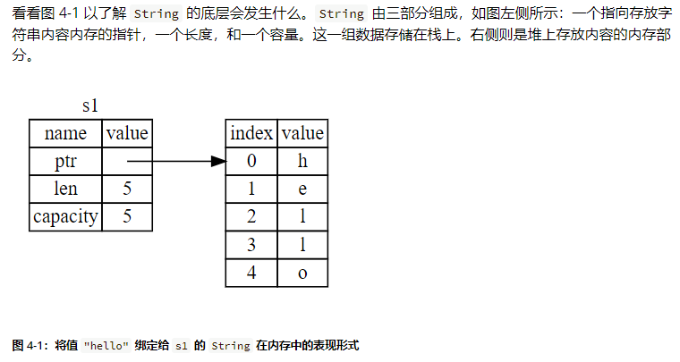
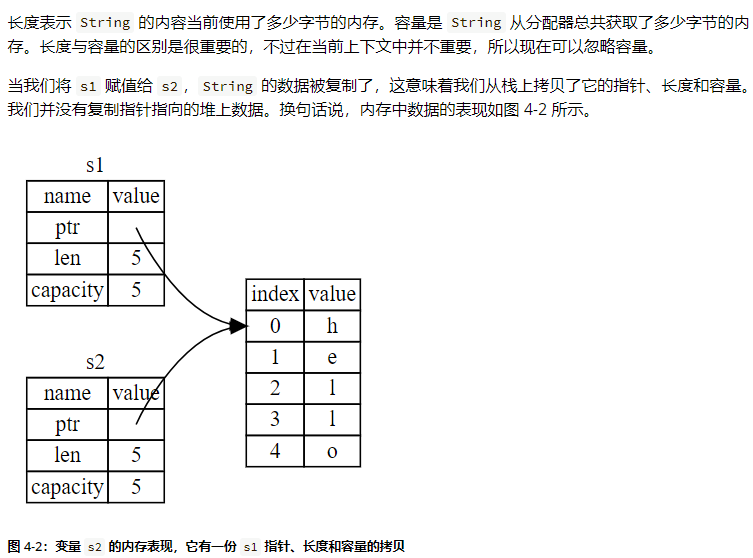
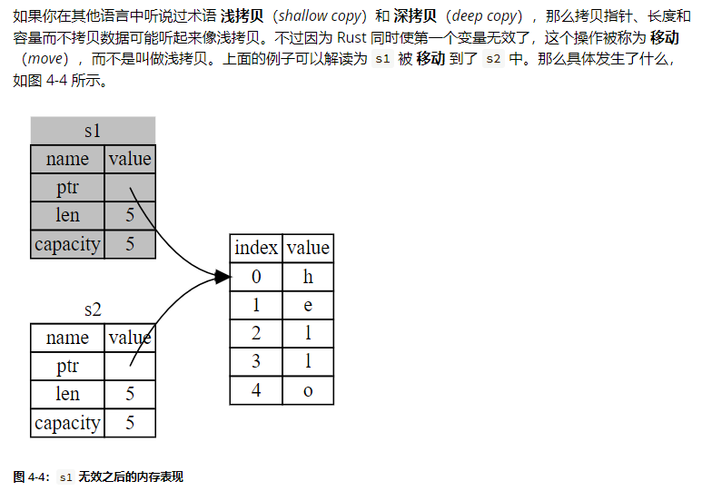
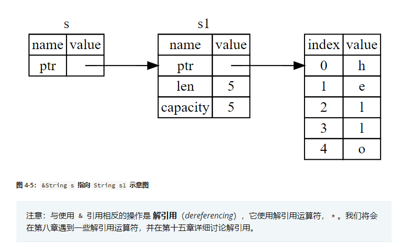

# rust基础笔记


<!--more-->
Rust基础笔记
<!--more-->

## 环境搭建

### 安装rust软件

[rust官方网站](https://www.rust-lang.org/)</br>
[rust官方教程](https://kaisery.github.io/trpl-zh-cn/)</br>

### hello world程序

1. 创建hello_world程序
```bash
$ cargo new hello_world
     Created binary (application) `hello_world` package
```

+ Cargo.toml: 配置文件
+ src文件夹: 存放rust源文件

2. 构建

```bash
$ cargo build
   Compiling hello_world v0.1.0 (D:\learn_rust\hello_world)
    Finished dev [unoptimized + debuginfo] target(s) in 1.25s
```

3. 运行

```bash
$ cargo run
    Finished dev [unoptimized + debuginfo] target(s) in 0.01s
     Running `target\debug\hello_world.exe`
Hello, world!
```

至此,我们就可以运行进行rust程序的学习了;

## 数据类型

### 变量

1. 默认let定义的是不可变变量
2. 使用`mut`创建可变变量

```rust
let _a = 12;        //  不可变变量
let mut  _b = 12;   // 可变变量

_a = 13;    // 编译报错: cannot assign twice to immutable variable
_b = 13;    // 编译成功
```

那为什么可以称之为不可变变量,为什么不可以称之为常量;
因为,虽然不可以修改,但是可以重新绑定

```rust
let _a = 13;        //  不可变变量重新绑定13
let _a = 14;        //  不可变变量重新绑定14
```

是否可以这样理解,let翻译为绑定,
1. 一般let绑定到常量上
2. mut绑定到内存上

那么进行一下测试

```rust
let _c = 12;        // 1. 首先绑定到12这个常量上
let mut _c  = 14;   // 2. 绑定到变量上
_c = 15;            // 3. 可以修改
```

在进行分析,但是下面的这种绑定的概念出现了问题

```rust
fn main() {
    let mut _c = 12;
    let _d = _c;
    _d = 12; // 编译报错
    println!("The value of x is: {_c}");
    println!("The value of x is: {_d}");
}
```

```shell
$ cargo build
   Compiling variables_mutability v0.1.0 (D:\github.io\static\demo\rust\variable
s_mutability)
error[E0384]: cannot assign twice to immutable variable `_d`
 --> src\main.rs:4:5
  |
3 |     let _d = _c;
  |         --
  |         |
  |         first assignment to `_d`
  |         help: consider making this binding mutable: `mut _d`
4 |     _d = 12; // 编译报错
  |     ^^^^^^^ cannot assign twice to immutable variable

For more information about this error, try `rustc --explain E0384`.
error: could not compile `variables_mutability` due to previous error
```

> 当然,此时我还不了解什么概念,因此作出猜测
> 编译期间通过符号表的属性判断变量是否进行修改

但是可以重新绑定

```rust
fn main() {
    let mut _c = 12;
    let _d = _c;
    let _d = 12; // 编译报错
    println!("The value of x is: {_c}");
    println!("The value of x is: {_d}");
}
```

### 常量
类似于不可变变量, 常量 (constants) 是绑定到一个名称的不允许改变的值，不过常量与变量还是有一些区别。

```rust
const HOURS_IN_SECONDS: u32 = 60 * 60;
```

### 标量类型

####  整数类型

+ 整数没有小数部分

+ 无符号以u开头

+ 有符号以i开头

  | Length  | Signed  | Unsigned |
  | ------- | ------- | -------- |
  | 8-Bit   | `i8`    | `u8`     |
  | 16-Bit  | `i16`   | `u16`    |
  | 32-Bit  | `i32`   | `u32`    |
  | 64-Bit  | `i64`   | `u64`    |
  | 128-Bit | `i128`  | `u128`   |
  | arch    | `iszie` | `usize`  |

####  浮点类型

默认浮点为64

+ `f32` --> 32浮点
+ `f64` --> 64浮点

####  布尔类型

+ 一个字节的大小
+ 符号是`bool`
+ 两个值`true/false`

####  字符类型

+ rust使用`char`描述
+ 使用4个字节存储

### 复合类型

#### 元组(tuple)

+ Tuple可以将多个值放在一个数据类型里
+ Tuple长度是固定的

```rust
let tup:(i32, i64, i128) = (500, 1000, 1500);
let (x, y, z) = tup;
println!("{} {} {}", x, y, z);
```

#### 数组(array)

+ 数组也可以将多个值放在一个类型里
+ 数组的元素必须相同
+ 数组的长度是固定的

```rust
let months = [
     "Jan",
     "Feb",
     "Mar",
     "Apr",
     "Jun",
     "Jly",
     "Aug",
     "Sep",
     "Oct",
     "Nov",
     "Dec"
];
let mount_1st = months[0];
let mount_2nd = months[2];
println!("mount_1st:{mount_1st} mount_2nd:{mount_2nd}");
```

## 控制流

### 条件语句

```rust
let number = 3;

if number < 5 {
     println!("condition was true");
} else {
     println!("condition was false");
}

// condition was true
```

```rust
let number = 5;

if number < 5 {
     println!("condition was true");
} else if number > 5 {
     println!("condition was false");
} else {
     println!("condition was five");
}

// condition was five
```

```rust
fn main() {
    // 1. if条件语句
    let number = 3;

    if number < 5 {
        println!("condition was true");
    } else {
        println!("condition was false");
    }

    // 2. 使用 else if 处理多重条件
    if number % 4 == 0 {
        println!("number is divisible by 4");
    } else if number % 3 == 0 {
        println!("number is divisible by 3");
    } else if number % 2 == 0 {
        println!("number is divisible by 2");
    } else {
        println!("number is not divisible by 4, 3, or 2");
    }

    // 3.在 let 语句中使用 if
    let condition = true;
    let number = if condition { 5 } else { 6 };

    println!("The value of number is: {number}");

    // 4. 使用 loop 重复执行代码
    let mut x = 0;
    loop {
        println!("again! {}", x);
        x += 1;
        if x > 12 {
            break;
        }
    }

    // 5. 从循环返回值
    let mut counter = 0;

    let result = loop {
        counter += 1;

        if counter == 10 {
            break counter * 2;
        }
    };

    println!("The result is {result}");

    // 如果存在嵌套循环，break 和 continue 应用于此时最内层的循环。
    // 你可以选择在一个循环上指定一个 循环标签（loop label），
    // 然后将标签与 break 或 continue 一起使用，
    // 使这些关键字应用于已标记的循环而不是最内层的循环

    // 6. 循环标签：在多个循环之间消除歧义
    let mut count = 0;
    'counting_up: loop {
        println!("count = {count}");
        let mut remaining = 10;

        loop {
            println!("remaining = {remaining}");
            if remaining == 9 {
                break;
            }
            if count == 2 {
                break 'counting_up;
            }
            remaining -= 1;
        }

        count += 1;
    }
    println!("End count = {count}");

    // 7. while 条件循环
    let mut number = 3;

    while number != 0 {
        println!("{number}!");

        number -= 1;
    }

    println!("LIFTOFF!!!");

    // 8. 使用 for 遍历集合
    let a = [10, 20, 30, 40, 50];

    for element in a {
        println!("the value is: {element}");
    }
}
```

## 函数

定义普通函数

```rust
fn <函数名> (<参数>) {
     <函数体>
}
```

```rust
fn another_function() {
    println!("Another function.");
}
```

定义输入参数

> 参数必须指定类型

```rust
/// rust函数带参数
fn another_function_with_args(x: i32) {
    println!("The value of x is: {x}");
}

/// rust函数带两个参数
fn print_labeled_measurement(value: i32, unit_label: char) {
    println!("The measurement is: {value}{unit_label}");
}
```

定义返回值

> 必须指定返回值

函数可以向调用它的代码返回值。我们并不对返回值命名，但要在箭头（->）后声明它的类型。
在`Rust`中，函数的返回值等同于函数体最后一个表达式的值。
使用`return`关键字和指定值，可从函数中提前返回；但大部分函数隐式的返回最后的表达式.

```rust
/// 带返回值的函数
fn function_with_return_value1() -> i32 {
    println!("带返回值的函数");
    5
}

/// 带返回值的函数
fn function_with_return_value2() -> i32 {
    println!("带返回值的函数在return之前");
    return 5;
    println!("带返回值的函数在return之后");
}
```

## 所有权

> 所有程序都必须管理其运行时使用计算机内存的方式。一些语言中具有垃圾回收机制，
> 在程序运行时有规律地寻找> 不再使用的内存；在另一些语言中，程序员必须亲自分配和释放内存。
> Rust 则选择了第三种方式：通过所有权系统管理内存，编译器在编译时会根据一系列的规则进行检查。
> 如果违反了任何这些规则，程序都不能编译。在运行时，所有权系统的任何功能都不会减慢程序

所有权规则
1. Rust 中的每一个值都有一个 所有者（owner）。
2. 值在任一时刻有且只有一个所有者。
3. 当所有者（变量）离开作用域，这个值将被丢弃。

首先， 我们需要看一个代码,并且执行编译;

```rust
fn main() {
    let s1 = String::from("hello");
    let s2 = s1;

    println!("{} {}", s1, s2);
}
```

```txt
error[E0382]: borrow of moved value: `s1`
 --> src\main.rs:5:23
  |
2 |     let s1 = String::from("hello");
  |         -- move occurs because `s1` has type `String`, which does not implement the `Copy` trait
3 |     let s2 = s1;
  |              -- value moved here
4 |
5 |     println!("{} {}", s1, s2);
  |                       ^^ value borrowed here after move
  |
  = note: this error originates in the macro `$crate::format_args_nl` which comes from the expansion of the macro `println` (in Nightly builds, run with -Z macro-backtrace for more info)
help: consider cloning the value if the performance cost is acceptable
  |
3 |     let s2 = s1.clone();
  |                ++++++++

For more information about this error, try `rustc --explain E0382`.
error: could not compile `ownship` due to previous error
```

在我们看来， 这个程序为啥编译失败了呢？

不应该s2保留了s1的备份么？






之前我们提到过当变量离开作用域后，Rust 自动调用 `drop` 函数并清理变量的堆内存。不过图 4-2 展示了两个数据指针指向了同一位置。这就有了一个问题：当 `s2` 和 `s1` 离开作用域，他们都会尝试释放相同的内存。这是一个叫做 **二次释放**（*double free*）的错误，也是之前提到过的内存安全性 bug 之一。两次释放（相同）内存会导致内存污染，它可能会导致潜在的安全漏洞。

为了确保内存安全，在 `let s2 = s1;` 之后，Rust 认为 `s1` 不再有效，因此 Rust 不需要在 `s1` 离开作用域后清理任何东西。看看在 `s2` 被创建之后尝试使用 `s1` 会发生什么；这段代码不能运行：

那么就可以知道，此时s1移动了s2上面，s1不在合法的运行.



但是， 我们确实需要一个保证两个变量都是有效的,那么

```rust
fn main() {
    let s1 = String::from("hello");
    let s2 = s1.clone();

    println!("s1 = {}, s2 = {}", s1, s2);
}
```

此时编译的结果就可以通过了.

但是呢？

```rust
    let x = 5;
    let y = x;

    println!("x = {}, y = {}", x, y);
```

我们可以知道，上面的确实可以编译通过， 这个又是什么原因呢？

从根本上来说， 我们可以这样理解，rust保护内存，防止泄露

x,y保存在栈上，不会泄露，因此可以直接拷贝

原因是像整型这样的在编译时已知大小的类型被整个存储在栈上，所以拷贝其实际的值是快速的。这意味着没有理由在创建变量 `y` 后使 `x` 无效。换句话说，这里没有深浅拷贝的区别，所以这里调用 `clone` 并不会与通常的浅拷贝有什么不同，我们可以不用管它。

那么哪些类型实现了 `Copy` trait 呢？你可以查看给定类型的文档来确认，不过作为一个通用的规则，任何一组简单标量值的组合都可以实现 `Copy`，任何不需要分配内存或某种形式资源的类型都可以实现 `Copy` 。如下是一些 `Copy` 的类型：

- 所有整数类型，比如 `u32`。
- 布尔类型，`bool`，它的值是 `true` 和 `false`。
- 所有浮点数类型，比如 `f64`。
- 字符类型，`char`。
- 元组，当且仅当其包含的类型也都实现 `Copy` 的时候。比如，`(i32, i32)` 实现了 `Copy`，但 `(i32, String)` 就没有。

```rust
fn main() {
	let s = String::from("Test");  // s 进入作用域
	takes_ownership(s);
	println!("{}", s);  // value borrowed here after move
}

fn takes_ownership(some_string: String) { // some_string 进入作用域
	println!("{}", some_string);
} // 这里，some_string 移出作用域并调用 `drop` 方法。
// 占用的内存被释放
```

```txt
$ cargo build
   Compiling ownship v0.1.0 (D:\github.io\static\demo\rust\ownship)
error[E0382]: borrow of moved value: `s`
  --> src\main.rs:14:20
   |
12 |     let s = String::from("Test");  // s 进入作用域
   |         - move occurs because `s` has type `String`, which does not implement the `Copy` trait
13 |     takes_ownership(s);
   |                     - value moved here
14 |     println!("{}", s);
   |                    ^ value borrowed here after move
   |
note: consider changing this parameter type in function `takes_ownership` to borrow instead if owning the value isn't necessary
  --> src\main.rs:20:33
   |
20 | fn takes_ownership(some_string: String) { // some_string 进入作用域
   |    ---------------              ^^^^^^ this parameter takes ownership of the value
   |    |
   |    in this function
   = note: this error originates in the macro `$crate::format_args_nl` which comes from the expansion of the macro `println` (in Nightly builds, run with -Z macro-backtrace for more info)
help: consider cloning the value if the performance cost is acceptable
   |
13 |     takes_ownership(s.clone());
   |                      ++++++++

For more information about this error, try `rustc --explain E0382`.
error: could not compile `ownship` due to previous error
```

但是如果可以使用copy的话会造成大量的拷贝,因此需要使用**引用与借用**，

```rust
fn main() {
    let s1 = String::from("hello");

    let len = calculate_length(&s1);

    println!("The length of '{}' is {}.", s1, len);
}

fn calculate_length(s: &String) -> usize {
    s.len()
}
```

首先，注意变量声明和函数返回值中的所有元组代码都消失了。其次，注意我们传递 `&s1` 给 `calculate_length`，同时在函数定义中，我们获取 `&String` 而不是 `String`。这些 & 符号就是 **引用**，它们允许你使用值但不获取其所有权。图 4-5 展示了一张示意图。



我们将创建一个引用的行为称为 借用（borrowing）

如果我们尝试修改借用的变量呢？

```rust
fn main() {
    let s = String::from("hello");

    change(&s);
}

fn change(some_string: &String) {
    some_string.push_str(", world");
}
```

```tcl
$ cargo run
   Compiling ownership v0.1.0 (file:///projects/ownership)
error[E0596]: cannot borrow `*some_string` as mutable, as it is behind a `&` reference
 --> src/main.rs:8:5
  |
7 | fn change(some_string: &String) {
  |                        ------- help: consider changing this to be a mutable reference: `&mut String`
8 |     some_string.push_str(", world");
  |     ^^^^^^^^^^^^^^^^^^^^^^^^^^^^^^^ `some_string` is a `&` reference, so the data it refers to cannot be borrowed as mutable

For more information about this error, try `rustc --explain E0596`.
error: could not compile `ownership` due to previous error
```

那么如何变动呢？

```rust
fn main() {
    let mut s = String::from("hello");

    change(&mut s);
}

fn change(some_string: &mut String) {
    some_string.push_str(", world");
}
```

**数据竞争**（*data race*）类似于竞态条件，它可由这三个行为造成

- 两个或更多指针同时访问同一数据。

- 至少有一个指针被用来写入数据。

- 没有同步数据访问的机制。

数据竞争会导致未定义行为，难以在运行时追踪，并且难以诊断和修复；Rust 避免了这种情况的发生，因为它甚至不会编译存在数据竞争的代码！

```rust
let mut s = String::from("hello");

let r1 = &mut s;
let r2 = &mut s;

println!("{}, {}", r1, r2);
```

```tex
error[E0499]: cannot borrow `s` as mutable more than once at a time
  --> src\main.rs:28:14
   |
27 |     let r1 = &mut s;
   |              ------ first mutable borrow occurs here
28 |     let r2 = &mut s;
   |              ^^^^^^ second mutable borrow occurs here
29 |
30 |     println!("{}, {}", r1, r2);
   |                        -- first borrow later used here

For more information about this error, try `rustc --explain E0499`.
error: could not compile `ownship` due to previous error
```

**悬垂引用（Dangling References)**

在具有指针的语言中，很容易通过释放内存时保留指向它的指针而错误地生成一个 **悬垂指针**（*dangling pointer*），所谓悬垂指针是其指向的内存可能已经被分配给其它持有者。相比之下，在 Rust 中编译器确保引用永远也不会变成悬垂状态：当你拥有一些数据的引用，编译器确保数据不会在其引用之前离开作用域。

```rust
fn main() {
    let reference_to_nothing = dangle();
}

fn dangle() -> &String {
    let s = String::from("hello");

    &s
}
```

```tex
$ cargo run
   Compiling ownership v0.1.0 (file:///projects/ownership)
error[E0106]: missing lifetime specifier
 --> src/main.rs:5:16
  |
5 | fn dangle() -> &String {
  |                ^ expected named lifetime parameter
  |
  = help: this function's return type contains a borrowed value, but there is no value for it to be borrowed from
help: consider using the `'static` lifetime
  |
5 | fn dangle() -> &'static String {
  |                 +++++++

For more information about this error, try `rustc --explain E0106`.
error: could not compile `ownership` due to previous error
```

因为 `s` 是在 `dangle` 函数内创建的，当 `dangle` 的代码执行完毕后，`s` 将被释放。不过我们尝试返回它的引用。这意味着这个引用会指向一个无效的 `String`，这可不对！Rust 不会允许我们这么做。

```rust
fn no_dangle() -> String {
    let s = String::from("hello");

    s
}
```

这样就没有任何错误了。所有权被移动出去，所以没有值被释放。

**引用的规则**

让我们概括一下之前对引用的讨论：

- 在任意给定时间，**要么** 只能有一个可变引用，**要么** 只能有多个不可变引用。
- 引用必须总是有效的。

## 枚举

### 定义枚举

```rust
定义枚举
#[derive(Debug)]
enum IpAddrKind {
    V4,
    V6,
}

// 实例化枚举
let addr1 = IpAddrKind::V4;
let addr2 = IpAddrKind::V6;

// 打印枚举值
println!("{:#?}", addr1);
println!("{:#?}", addr2);
```

### 枚举值作为函数参数

```rust
fn route(ip_kind : IpAddrKind) {
    println!("{:#?}", ip_kind);
}

route(addr1);
route(addr2);
```

### 枚举值作为结构体成员

```rust
#[derive(Debug)]
struct  IpAddr {
    kind : IpAddrKind,
    addr : String,
}
```

### `match`控制流结构

```rust
enum Coin {
    Penny,
    Nickel,
    Dime,
    Quarter,
}

fn value_in_cents(coin: Coin) -> u8 {
    match coin {
        Coin::Penny => 1,
        Coin::Nickel => 5,
        Coin::Dime => 10,
        Coin::Quarter => 25,
    }
}
```

### `option`匹配

```rust
fn main() {
    let x: i32 = 5;
    let y: Option<i32> = Some(5);
    let _z = x + y;
}
```

但是此时会编译报错

```txt
error[E0277]: cannot add `Option<i32>` to `i32`
 --> src\main.rs:4:16
  |
4 |     let _z = x + y;
  |                ^ no implementation for `i32 + Option<i32>`
  |
  = help: the trait `Add<Option<i32>>` is not implemented for `i32`
  = help: the following other types implement trait `Add<Rhs>`:
            <&'a i32 as Add<i32>>
            <&i32 as Add<&i32>>
            <i32 as Add<&i32>>
            <i32 as Add>
```

```rust
fn main() {
    let x: i32 = 5;
    let y: Option<i32> = Some(5);
    let _z = x + y.unwrap();
}
```

### `if let`语法糖

```rust
fn main() {
    let v = Some(8);

    // grammar sugar
    if let Some(3) = v {
        println!("Succ");
    } else {
        println!("Fail")
    }
}
```

## 工程管理

- Package(包)
- Crate(单元包)
- Moule(模块)
- Path(路径)

### Package&Crate

```shell
# 创建package
cargo new package_name

```

## 集合

+ vector 允许我们一个挨着一个地储存一系列数量可变的值
+ string 是字符的集合。我们之前见过 String 类型，不过在本章我们将深入了解。
+ Hashmap 允许我们将值与一个特定的键（key）相关联。这是一个叫做 map 的更通用的数据结构的特定实现。

### Vector

#### 新建 vector

```rust
fn main() {
    // 1. 新建vector
    let _v: Vec<i32> = Vec::new();

    // 2. 使用宏来初始化vector
    let _v = vec![1, 2, 3];
}
```

#### 更新 vector

> 对于新建一个 vector 并向其增加元素，可以使用 push 方法，如示例 8-3 所示：

```rust
fn main() {
    let mut v = Vec::new();
    v.push(5);
    v.push(6);
    v.push(7);
    v.push(8);
}
```

#### 读取`vector`的元素

```rust
    // 直接读取
    println!("v[0] {}", v[0]); // 5
    println!("v[1] {}", v[1]); // 5

    // 引用数据
    println!("v[0] {}", &v[0]); // 5
    println!("v[1] {}", &v[1]); // 5

    // get方法
    println!("v[0] {:?}", v.get(0)); // Some(5)
    println!("v[1] {:?}", v.get(1)); // Some(6)

    // 遍历方法
    for i in &v {
        println!("{}", i);
    }
```

### String

#### 创建字符串

```rust
fn main() {
    // 1.创建字符串
    let mut _s = String::new();

    // 2.创建空字符串
    let data = "initial contents";

    let _s = data.to_string();

    // 该方法也可直接用于字符串字面值：
    let _s = "initial contents".to_string();

    // 直接对字符串进行转化
    let _s = String::from("initial contents");
}
```

####  更新字符串

```rust
    // 1. 使用 push_str 和 push 附加字符串
    let mut s = String::from("Hello");
    s.push_str("World");
    println!("{}", s);

    s.push('!');
    println!("{}", s);
```

#### 索引字符串

编译报错
```rust
    let _s1 = String::from("hello");
    let h = s1[0]; // error[E0277]: the type `String` cannot be indexed by `{integer}
```

但是可以直接进行遍历
```rust
    for c in "Зд".chars() {
        println!("{c}");
    }
```

#### slice

```rust
    let hello = "Здравствуйте";
    let s = &hello[0..4];
    println!("{}", s);
```

### Hashmap

> 最后介绍的常用集合类型是 哈希 map（hash map）。HashMap<K, V> 类型储存了一个键类型 K 对应一个值类型 V 的映射。它通过一个 哈希函数（hashing function）来实现映射，决定如何将键和值放入内存中

#### 创建hanshmap

Hashmap不是一个preload的包，需要手动导入

```rust
use std::collections::HashMap;
```

```rust
    let mut scores = HashMap::new();
```

#### 访问hashmap的值

```rust
    let team_name = String::from("Blue");
    let score = scores.get(&team_name).copied().unwrap_or(0);
    println!("{}", score);
```

```rust
    for (key, value) in &scores {
        println!("{key}: {value}");
    }
```

#### 更新hashmap

```rust
    scores.insert(String::from("Blue"), 10);
    scores.insert(String::from("Blue"), 25);
    println!("{:?}", scores);
```

```rust
    scores.entry(String::from("Yellow")).or_insert(50);
    scores.entry(String::from("Blue")).or_insert(50);
    scores.entry(String::from("Green")).or_insert(30);
    println!("{:?}", scores);
```

## 错误处理

#### panic!

> 用 panic! 处理不可恢复的错误

```rust
fn main() {
    panic!("crash and burn");
}
```
执行运行

```shell
   Compiling error_handle v0.1.0 (D:\github.io\static\demo\rust\error_handle)
    Finished dev [unoptimized + debuginfo] target(s) in 0.86s
     Running `target\debug\error_handle.exe`
thread 'main' panicked at 'Hello, world!', src\main.rs:2:5
note: run with `RUST_BACKTRACE=1` environment variable to display a backtrace
error: process didn't exit successfully: `target\debug\error_handle.exe` (exit code: 101)
```

#### Result枚举

> 用`Result枚举`处理可恢复的错误

```rust
enum Result<T, E> {
    OK(T),
    Err(E),
}
```
`T`和`E`是泛型类型参数:
+ `T`代表成功时返回的`Ok`成员中的数据的类型,
+ `E`代表失败时返回的`Err`成员中的错误的类型

#### match处理
```rust
use std::fs::File;

fn main() {
    // 1. panic! 处理不可以恢复的错误
    // 比较类似C/C++的assert语法
    // panic!("Hello, world!");

    // 2. Result!可以恢复的错误
    let f = File::open("Heelo.txt");
    match f {
        Ok(file) => file,
        Err(error) => {
            panic!("Error opening file {:?}", error);
        }
    };
}
```
尝试恢复某一错误
```rust
use std::fs::File;

fn main() {
    let f = File::open("Hello.txt");

    match f {
        Ok(file) => file,
        Err(error) => match error.kind()  {
            ErrorKind::NotFound => match File::create("Hello.txt") {
                Ok(fc) => fc,
                Err(e) => panic!("Error creating file {:?}", e),
            },
            oe => panic!("Error opening file {:?}", oe),
        },
    };
}
```

此时如果运行此程序就不会显示报错了，并且会创建一个新的文件

使用unwarp执行快捷操作

```rust
use std::fs::File;

fn main() {
    let f = File::open("Hello.txt").unwrap();
}
```

+ Result 值是成员 Ok，unwrap 会返回 Ok 中的值。
+ Result 是成员 Err，unwrap 会为我们调用 panic!

使用`expect`执行快捷操作

```rust
use std::fs::File;

fn main() {
    let f = File::open("Hello.txt").expect("无法打开文件");
}
```


