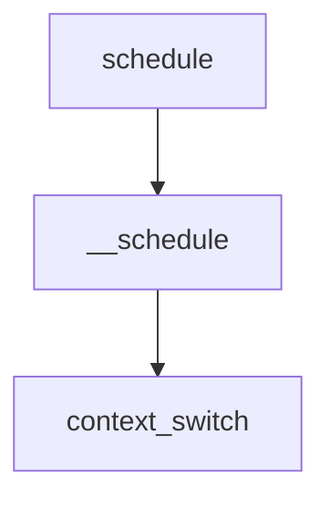

# 调度器基础


<!--more-->

> 调度器分为主调度器和周期调度器
> 但是本节不考虑调度器的具体实现
> 只进行大方向接口的分析

<!--more-->

[系统调度器基础]()</br>
[完全公平调度器]()</br>

## 权重计算

### 优先级计算

优先级
```c
// 1. 当前优先级normal_prio
p->prio = current->normal_prio;

// 2. 静态优先级 
p->static_prio = NICE_TO_PRIO(0)

// 3. 继续计算优先级
p->prio = p->normal_prio = __normal_prio(p);

// 4. 这在计算什么?
#define NICE_TO_PRIO(nice)	((nice) + DEFAULT_PRIO)
#define PRIO_TO_NICE(prio)	((prio) - DEFAULT_PRIO)

static inline int __normal_prio(struct task_struct *p)
{
	return p->static_prio;
}
```

### 权重计算

```c
struct load_weight {
	unsigned long weight;
	u32 inv_weight;
};
static void set_load_weight(struct task_struct *p)
{
	int prio = p->static_prio - MAX_RT_PRIO;
	struct load_weight *load = &p->se.load;

	/*
	 * SCHED_IDLE tasks get minimal weight:
	 */
	if (p->policy == SCHED_IDLE) {
		load->weight = scale_load(WEIGHT_IDLEPRIO);
		load->inv_weight = WMULT_IDLEPRIO;
		return;
	}

	load->weight = scale_load(prio_to_weight[prio]);
	load->inv_weight = prio_to_wmult[prio];
}

static const int prio_to_weight[40] = {
 /* -20 */     88761,     71755,     56483,     46273,     36291,
 /* -15 */     29154,     23254,     18705,     14949,     11916,
 /* -10 */      9548,      7620,      6100,      4904,      3906,
 /*  -5 */      3121,      2501,      1991,      1586,      1277,
 /*   0 */      1024,       820,       655,       526,       423,
 /*   5 */       335,       272,       215,       172,       137,
 /*  10 */       110,        87,        70,        56,        45,
 /*  15 */        36,        29,        23,        18,        15,
};

static const u32 prio_to_wmult[40] = {
 /* -20 */     48388,     59856,     76040,     92818,    118348,
 /* -15 */    147320,    184698,    229616,    287308,    360437,
 /* -10 */    449829,    563644,    704093,    875809,   1099582,
 /*  -5 */   1376151,   1717300,   2157191,   2708050,   3363326,
 /*   0 */   4194304,   5237765,   6557202,   8165337,  10153587,
 /*   5 */  12820798,  15790321,  19976592,  24970740,  31350126,
 /*  10 */  39045157,  49367440,  61356676,  76695844,  95443717,
 /*  15 */ 119304647, 148102320, 186737708, 238609294, 286331153,
};
```

优先级与负载计算关系 
			$weight = \frac{1024}{1.25^{nice}}$
			${inv\_weight} = \frac{2^{32}}{weight}$

## 调度器类

linux内核充分使用了面向对象的思想,
依靠`sched_class`将所有的调度器整合

linux上的调度器

|     调度器类     |    描述信息    |        用户接口调度策略        |
| :--------------: | :------------: | :----------------------------: |
|  dl_sched_class  | deadline调度器 |        `SCHED_DEADLINE`        |
|  rt_sched_class  |   实时调度器   |   `SCHED_FIFO`、``SCHED_RR`    |
| fair_sched_class | 完全公平调度器 | `SCHED_NORMAL`、``SCHED_BATCH` |
| idle_sched_class |   idle task    |          `SCHED_IDLE`          |

### 调度器类结构体

```c
struct sched_class {
	const struct sched_class *next;

	void (*enqueue_task) (struct rq *rq, struct task_struct *p, int flags);
	void (*dequeue_task) (struct rq *rq, struct task_struct *p, int flags);
	void (*yield_task) (struct rq *rq);
	bool (*yield_to_task) (struct rq *rq, struct task_struct *p, bool preempt);

	void (*check_preempt_curr) (struct rq *rq, struct task_struct *p, int flags);

	/*
	 * It is the responsibility of the pick_next_task() method that will
	 * return the next task to call put_prev_task() on the @prev task or
	 * something equivalent.
	 *
	 * May return RETRY_TASK when it finds a higher prio class has runnable
	 * tasks.
	 */
	struct task_struct * (*pick_next_task) (struct rq *rq,
						struct task_struct *prev);
	void (*put_prev_task) (struct rq *rq, struct task_struct *p);

#ifdef CONFIG_SMP
	int  (*select_task_rq)(struct task_struct *p, int task_cpu, int sd_flag, int flags);
	void (*migrate_task_rq)(struct task_struct *p, int next_cpu);

	void (*post_schedule) (struct rq *this_rq);
	void (*task_waking) (struct task_struct *task);
	void (*task_woken) (struct rq *this_rq, struct task_struct *task);

	void (*set_cpus_allowed)(struct task_struct *p,
				 const struct cpumask *newmask);

	void (*rq_online)(struct rq *rq);
	void (*rq_offline)(struct rq *rq);
#endif

	void (*set_curr_task) (struct rq *rq);
	void (*task_tick) (struct rq *rq, struct task_struct *p, int queued);
	void (*task_fork) (struct task_struct *p);
	void (*task_dead) (struct task_struct *p);

	/*
	 * The switched_from() call is allowed to drop rq->lock, therefore we
	 * cannot assume the switched_from/switched_to pair is serliazed by
	 * rq->lock. They are however serialized by p->pi_lock.
	 */
	void (*switched_from) (struct rq *this_rq, struct task_struct *task);
	void (*switched_to) (struct rq *this_rq, struct task_struct *task);
	void (*prio_changed) (struct rq *this_rq, struct task_struct *task,
			     int oldprio);

	unsigned int (*get_rr_interval) (struct rq *rq,
					 struct task_struct *task);

	void (*update_curr) (struct rq *rq);

#ifdef CONFIG_FAIR_GROUP_SCHED
	void (*task_move_group) (struct task_struct *p, int on_rq);
#endif
};
```

### 调度器封装

对调度器进行`多态`实现;

#### 入队/出队

+ enqueue_task
+ dequeue_task

```c
static void enqueue_task(struct rq *rq, 
						 struct task_struct *p, int flags)
{
	update_rq_clock(rq);
	sched_info_queued(rq, p);
	p->sched_class->enqueue_task(rq, p, flags);
}
static void dequeue_task(struct rq *rq, 
				         struct task_struct *p, int flags)
{
	update_rq_clock(rq);
	sched_info_dequeued(rq, p);
	p->sched_class->dequeue_task(rq, p, flags);
}
```

#### 激活/销毁

+ activate_task
+ deactivate_task

```c
void activate_task(struct rq *rq, struct task_struct *p, int flags)
{
	if (task_contributes_to_load(p))
		rq->nr_uninterruptible--;

	enqueue_task(rq, p, flags);
}
void deactivate_task(struct rq *rq, struct task_struct *p, int flags)
{
	if (task_contributes_to_load(p))
		rq->nr_uninterruptible++;

	dequeue_task(rq, p, flags);
}
```

#### 主动放弃

+ sched_yield
+ yield_to

```c
SYSCALL_DEFINE0(sched_yield)
{
	struct rq *rq = this_rq_lock();

	schedstat_inc(rq, yld_count);
	current->sched_class->yield_task(rq);

	/*
	 * Since we are going to call schedule() anyway, there's
	 * no need to preempt or enable interrupts:
	 */
	__release(rq->lock);
	spin_release(&rq->lock.dep_map, 1, _THIS_IP_);
	do_raw_spin_unlock(&rq->lock);
	sched_preempt_enable_no_resched();

	schedule();

	return 0;
}
int __sched yield_to(struct task_struct *p, bool preempt)
{
	struct task_struct *curr = current;
	struct rq *rq, *p_rq;
	unsigned long flags;
	int yielded = 0;

	local_irq_save(flags);
	rq = this_rq();

again:
	p_rq = task_rq(p);
	/*
	 * If we're the only runnable task on the rq and target rq also
	 * has only one task, there's absolutely no point in yielding.
	 */
	if (rq->nr_running == 1 && p_rq->nr_running == 1) {
		yielded = -ESRCH;
		goto out_irq;
	}

	double_rq_lock(rq, p_rq);
	if (task_rq(p) != p_rq) {
		double_rq_unlock(rq, p_rq);
		goto again;
	}

	if (!curr->sched_class->yield_to_task)
		goto out_unlock;

	if (curr->sched_class != p->sched_class)
		goto out_unlock;

	if (task_running(p_rq, p) || p->state)
		goto out_unlock;

	yielded = curr->sched_class->yield_to_task(rq, p, preempt);
	if (yielded) {
		schedstat_inc(rq, yld_count);
		/*
		 * Make p's CPU reschedule; pick_next_entity takes care of
		 * fairness.
		 */
		if (preempt && rq != p_rq)
			resched_curr(p_rq);
	}

out_unlock:
	double_rq_unlock(rq, p_rq);
out_irq:
	local_irq_restore(flags);

	if (yielded > 0)
		schedule();

	return yielded;
}
EXPORT_SYMBOL_GPL(yield_to);
```

#### 唤醒抢占任务

```c
void check_preempt_curr(struct rq *rq, struct task_struct *p, int flags)
{
	const struct sched_class *class;

	if (p->sched_class == rq->curr->sched_class) {
		rq->curr->sched_class->check_preempt_curr(rq, p, flags);
	} else {
		for_each_class(class) {
			if (class == rq->curr->sched_class)
				break;
			if (class == p->sched_class) {
				resched_curr(rq);
				break;
			}
		}
	}

	/*
	 * A queue event has occurred, and we're going to schedule.  In
	 * this case, we can save a useless back to back clock update.
	 */
	if (task_on_rq_queued(rq->curr) && test_tsk_need_resched(rq->curr))
		rq_clock_skip_update(rq, true);
}
```

#### 获取/释放任务

```c
static inline struct task_struct *
pick_next_task(struct rq *rq, struct task_struct *prev)
{
	const struct sched_class *class = &fair_sched_class;
	struct task_struct *p;

	/*
	 * Optimization: we know that if all tasks are in
	 * the fair class we can call that function directly:
	 */
	if (likely(prev->sched_class == class &&
		   rq->nr_running == rq->cfs.h_nr_running)) {
		p = fair_sched_class.pick_next_task(rq, prev);
		if (unlikely(p == RETRY_TASK))
			goto again;

		/* assumes fair_sched_class->next == idle_sched_class */
		if (unlikely(!p))
			p = idle_sched_class.pick_next_task(rq, prev);

		return p;
	}

again:
	for_each_class(class) {
		p = class->pick_next_task(rq, prev);
		if (p) {
			if (unlikely(p == RETRY_TASK))
				goto again;
			return p;
		}
	}

	BUG(); /* the idle class will always have a runnable task */
}

static inline void put_prev_task(struct rq *rq, struct task_struct *prev)
{
	prev->sched_class->put_prev_task(rq, prev);
}
```

#### 任务切换

```c
static inline void check_class_changed(struct rq *rq, struct task_struct *p,
				       const struct sched_class *prev_class,
				       int oldprio)
{
	if (prev_class != p->sched_class) {
		if (prev_class->switched_from)
			prev_class->switched_from(rq, p);
		/* Possble rq->lock 'hole'.  */
		p->sched_class->switched_to(rq, p);
	} else if (oldprio != p->prio || dl_task(p))
		p->sched_class->prio_changed(rq, p, oldprio);
}
```

#### 更新当前任务

```c
unsigned long long task_sched_runtime(struct task_struct *p)
{
	unsigned long flags;
	struct rq *rq;
	u64 ns;

#if defined(CONFIG_64BIT) && defined(CONFIG_SMP)
	/*
	 * 64-bit doesn't need locks to atomically read a 64bit value.
	 * So we have a optimization chance when the task's delta_exec is 0.
	 * Reading ->on_cpu is racy, but this is ok.
	 *
	 * If we race with it leaving cpu, we'll take a lock. So we're correct.
	 * If we race with it entering cpu, unaccounted time is 0. This is
	 * indistinguishable from the read occurring a few cycles earlier.
	 * If we see ->on_cpu without ->on_rq, the task is leaving, and has
	 * been accounted, so we're correct here as well.
	 */
	if (!p->on_cpu || !task_on_rq_queued(p))
		return p->se.sum_exec_runtime;
#endif

	rq = task_rq_lock(p, &flags);
	/*
	 * Must be ->curr _and_ ->on_rq.  If dequeued, we would
	 * project cycles that may never be accounted to this
	 * thread, breaking clock_gettime().
	 */
	if (task_current(rq, p) && task_on_rq_queued(p)) {
		update_rq_clock(rq);
		p->sched_class->update_curr(rq);
	}
	ns = p->se.sum_exec_runtime;
	task_rq_unlock(rq, p, &flags);

	return ns;
}
```

## 任务创建

任务创建是由`do_fork`进行,与调度器进行沟通的函数是`sched_fork`,沟通的数据结构是

```c
int sched_fork(unsigned long clone_flags, struct task_struct *p)
{
	unsigned long flags;
	
	// #define get_cpu()		({ preempt_disable(); smp_processor_id(); })
	// #define put_cpu()		preempt_enable()
	int cpu = get_cpu();		// 获取CPUID
	
    // 进入内部实现
	__sched_fork(clone_flags, p);
	/*
	 * We mark the process as running here. This guarantees that
	 * nobody will actually run it, and a signal or other external
	 * event cannot wake it up and insert it on the runqueue either.
	 */
	p->state = TASK_RUNNING; // 设置运行状态

	/*
	 * Make sure we do not leak PI boosting priority to the child.
	 */
	p->prio = current->normal_prio; // 复制父优先级到当前

	/*
	 * Revert to default priority/policy on fork if requested.
	 */
	if (unlikely(p->sched_reset_on_fork)) {
		if (task_has_dl_policy(p) || task_has_rt_policy(p)) {
			p->policy = SCHED_NORMAL;
			p->static_prio = NICE_TO_PRIO(0);
			p->rt_priority = 0;
		} else if (PRIO_TO_NICE(p->static_prio) < 0)
			p->static_prio = NICE_TO_PRIO(0);

		p->prio = p->normal_prio = __normal_prio(p);
		set_load_weight(p);

		/*
		 * We don't need the reset flag anymore after the fork. It has
		 * fulfilled its duty:
		 */
		p->sched_reset_on_fork = 0;
	}

	if (dl_prio(p->prio)) {
		put_cpu();
		return -EAGAIN;
	} else if (rt_prio(p->prio)) {
		p->sched_class = &rt_sched_class;
	} else {
		p->sched_class = &fair_sched_class;
	}

	if (p->sched_class->task_fork)
		p->sched_class->task_fork(p);

	/*
	 * The child is not yet in the pid-hash so no cgroup attach races,
	 * and the cgroup is pinned to this child due to cgroup_fork()
	 * is ran before sched_fork().
	 *
	 * Silence PROVE_RCU.
	 */
	raw_spin_lock_irqsave(&p->pi_lock, flags);
	set_task_cpu(p, cpu);
	raw_spin_unlock_irqrestore(&p->pi_lock, flags);

#if defined(CONFIG_SCHEDSTATS) || defined(CONFIG_TASK_DELAY_ACCT)
	if (likely(sched_info_on()))
		memset(&p->sched_info, 0, sizeof(p->sched_info));
#endif
#if defined(CONFIG_SMP)
	p->on_cpu = 0;
#endif
	init_task_preempt_count(p);
#ifdef CONFIG_SMP
	plist_node_init(&p->pushable_tasks, MAX_PRIO);
	RB_CLEAR_NODE(&p->pushable_dl_tasks);
#endif

	put_cpu();
	return 0;
}

static void __sched_fork(unsigned long clone_flags, struct task_struct *p)
{
	p->on_rq			= 0;	// 当前不在队列中
	
    // 设置sched_entity
	p->se.on_rq			= 0;	// 当前不在队列中
	p->se.exec_start		= 0;
	p->se.sum_exec_runtime		= 0;
	p->se.prev_sum_exec_runtime	= 0;
	p->se.nr_migrations		= 0;
	p->se.vruntime			= 0;
#ifdef CONFIG_SMP
	p->se.avg.decay_count		= 0;
#endif
	INIT_LIST_HEAD(&p->se.group_node);

#ifdef CONFIG_SCHEDSTATS
	memset(&p->se.statistics, 0, sizeof(p->se.statistics));
#endif

	RB_CLEAR_NODE(&p->dl.rb_node);
	init_dl_task_timer(&p->dl);
	__dl_clear_params(p);

	INIT_LIST_HEAD(&p->rt.run_list);

#ifdef CONFIG_PREEMPT_NOTIFIERS
	INIT_HLIST_HEAD(&p->preempt_notifiers);
#endif

#ifdef CONFIG_NUMA_BALANCING
	if (p->mm && atomic_read(&p->mm->mm_users) == 1) {
		p->mm->numa_next_scan = jiffies + msecs_to_jiffies(sysctl_numa_balancing_scan_delay);
		p->mm->numa_scan_seq = 0;
	}

	if (clone_flags & CLONE_VM)
		p->numa_preferred_nid = current->numa_preferred_nid;
	else
		p->numa_preferred_nid = -1;

	p->node_stamp = 0ULL;
	p->numa_scan_seq = p->mm ? p->mm->numa_scan_seq : 0;
	p->numa_scan_period = sysctl_numa_balancing_scan_delay;
	p->numa_work.next = &p->numa_work;
	p->numa_faults = NULL;
	p->last_task_numa_placement = 0;
	p->last_sum_exec_runtime = 0;

	p->numa_group = NULL;
#endif /* CONFIG_NUMA_BALANCING */
}
```

分析函数执行


根据上图，我们可以得知创建的是一个线程函数,但是这个不是我们要分析的,我们要分析``sched_fork`函数实现;

1. 设置`sched_entity`成员
2. 设置优先级
3. 调用调度器类中的`task_fork`函数

执行结束之后


```c
// 将任务添加到调度器
void wake_up_new_task(struct task_struct *p)
{
	unsigned long flags;
	struct rq *rq;

	raw_spin_lock_irqsave(&p->pi_lock, flags);
#ifdef CONFIG_SMP
	/*
	 * Fork balancing, do it here and not earlier because:
	 *  - cpus_allowed can change in the fork path
	 *  - any previously selected cpu might disappear through hotplug
	 */
	set_task_cpu(p, select_task_rq(p, task_cpu(p), SD_BALANCE_FORK, 0));
#endif

	/* Initialize new task's runnable average */
	init_task_runnable_average(p);
	rq = __task_rq_lock(p);		
	activate_task(rq, p, 0);				// 激活任务
	p->on_rq = TASK_ON_RQ_QUEUED;   		// 进入队列
	trace_sched_wakeup_new(p, true);
	check_preempt_curr(rq, p, WF_FORK);		// 检查是否可以抢占
#ifdef CONFIG_SMP
	if (p->sched_class->task_woken)
		p->sched_class->task_woken(rq, p);
#endif
	task_rq_unlock(rq, p, &flags);
}
```

## 调度基础

+ 主调度器
+ 滴答调度器

### 主调度器

```c
static void __sched __schedule(void)
{
	struct task_struct *prev, *next;
	unsigned long *switch_count;
	struct rq *rq;
	int cpu;

	preempt_disable();
	cpu = smp_processor_id();
	rq = cpu_rq(cpu);
	rcu_note_context_switch();
	prev = rq->curr;

	schedule_debug(prev);

	if (sched_feat(HRTICK))
		hrtick_clear(rq);

	/*
	 * Make sure that signal_pending_state()->signal_pending() below
	 * can't be reordered with __set_current_state(TASK_INTERRUPTIBLE)
	 * done by the caller to avoid the race with signal_wake_up().
	 */
	smp_mb__before_spinlock();
	raw_spin_lock_irq(&rq->lock);

	rq->clock_skip_update <<= 1; /* promote REQ to ACT */

	switch_count = &prev->nivcsw;
	if (prev->state && !(preempt_count() & PREEMPT_ACTIVE)) {
		if (unlikely(signal_pending_state(prev->state, prev))) {
			prev->state = TASK_RUNNING;
		} else {
			deactivate_task(rq, prev, DEQUEUE_SLEEP);
			prev->on_rq = 0;

			/*
			 * If a worker went to sleep, notify and ask workqueue
			 * whether it wants to wake up a task to maintain
			 * concurrency.
			 */
			if (prev->flags & PF_WQ_WORKER) {
				struct task_struct *to_wakeup;

				to_wakeup = wq_worker_sleeping(prev, cpu);
				if (to_wakeup)
					try_to_wake_up_local(to_wakeup);
			}
		}
		switch_count = &prev->nvcsw;
	}

	if (task_on_rq_queued(prev))
		update_rq_clock(rq);

	next = pick_next_task(rq, prev);
	clear_tsk_need_resched(prev);
	clear_preempt_need_resched();
	rq->clock_skip_update = 0;

	if (likely(prev != next)) {
		rq->nr_switches++;
		rq->curr = next;
		++*switch_count;

		rq = context_switch(rq, prev, next); /* unlocks the rq */
		cpu = cpu_of(rq);
	} else
		raw_spin_unlock_irq(&rq->lock);

	post_schedule(rq);

	sched_preempt_enable_no_resched();
}
```



进入任务切换的核心函数`context_switch`,这个函数真够复杂的;

```c
static inline struct rq *context_switch(struct rq *rq, 
                                        struct task_struct *prev,
	       								struct task_struct *next)
{
	struct mm_struct *mm, *oldmm;
	
    // 执行切换前准备
	prepare_task_switch(rq, prev, next);
	
    // 普通进程mm和active_mm相等
	// 但是内核线程没有mm,只有active_mm
    mm = next->mm;
	oldmm = prev->active_mm;
    
	arch_start_context_switch(prev);

	if (!mm) {	// 这个是内核线程
		next->active_mm = oldmm; 		// next线程借用oldmem，什么原因
		atomic_inc(&oldmm->mm_count);	// 减少计数
		enter_lazy_tlb(oldmm, next);	// 进入lazytlb，arm上为空
	} else	// 这个是用户线程
		switch_mm(oldmm, mm, next);

	if (!prev->mm) {					// 代表prev是一个内核线程
		prev->active_mm = NULL;	
		rq->prev_mm = oldmm;			// 内核线程共享内存
	}
	/*
	 * Since the runqueue lock will be released by the next
	 * task (which is an invalid locking op but in the case
	 * of the scheduler it's an obvious special-case), so we
	 * do an early lockdep release here:
	 */
	spin_release(&rq->lock.dep_map, 1, _THIS_IP_);

	context_tracking_task_switch(prev, next);		// 调试使用
	
    /* Here we just switch the register state and the stack. */
	switch_to(prev, next, prev); // 这个函数和体系相关
	
    barrier();

	return finish_task_switch(prev);
}

extern struct task_struct *__switch_to(struct task_struct *, 
                                       struct thread_info *, 
                                       struct thread_info *);

#define switch_to(prev,next,last)					\
do {									\
	last = __switch_to(prev,task_thread_info(prev), task_thread_info(next));	\
} while (0)
```

在arm32的实现中,这个是汇编编写的；我并没有看明白
这个地方和硬件进行强相关；

最终需要考虑的是进程在队列中的实现;

### 内存空间切换`switch_mm`

当然也是和硬件体系强相关

```c
static inline void
switch_mm(struct mm_struct *prev, struct mm_struct *next,
	  struct task_struct *tsk)
{
#ifdef CONFIG_MMU
	unsigned int cpu = smp_processor_id();

	/*
	 * __sync_icache_dcache doesn't broadcast the I-cache invalidation,
	 * so check for possible thread migration and invalidate the I-cache
	 * if we're new to this CPU.
	 */
	if (cache_ops_need_broadcast() &&
	    !cpumask_empty(mm_cpumask(next)) &&
	    !cpumask_test_cpu(cpu, mm_cpumask(next)))
		__flush_icache_all();

	if (!cpumask_test_and_set_cpu(cpu, mm_cpumask(next)) || prev != next) {
		check_and_switch_context(next, tsk);
		if (cache_is_vivt())
			cpumask_clear_cpu(cpu, mm_cpumask(prev));
	}
#endif
}
```

### 滴答调度器

```c
void scheduler_tick(void)
{
	int cpu = smp_processor_id();
	struct rq *rq = cpu_rq(cpu);
	struct task_struct *curr = rq->curr;

	sched_clock_tick();

	raw_spin_lock(&rq->lock);
	update_rq_clock(rq);
	curr->sched_class->task_tick(rq, curr, 0);
	update_cpu_load_active(rq);
	raw_spin_unlock(&rq->lock);

	perf_event_task_tick();

#ifdef CONFIG_SMP
	rq->idle_balance = idle_cpu(cpu);
	trigger_load_balance(rq);
#endif
	rq_last_tick_reset(rq);
}
```

## 就绪队列

### 成员分析

```c
struct rq {
	/* runqueue lock: */
	raw_spinlock_t lock;

	/*
	 * nr_running and cpu_load should be in the same cacheline because
	 * remote CPUs use both these fields when doing load calculation.
	 */
	unsigned int nr_running;
#ifdef CONFIG_NUMA_BALANCING
	unsigned int nr_numa_running;
	unsigned int nr_preferred_running;
#endif
	#define CPU_LOAD_IDX_MAX 5
	unsigned long cpu_load[CPU_LOAD_IDX_MAX];
	unsigned long last_load_update_tick;
#ifdef CONFIG_NO_HZ_COMMON
	u64 nohz_stamp;
	unsigned long nohz_flags;
#endif
#ifdef CONFIG_NO_HZ_FULL
	unsigned long last_sched_tick;
#endif
	/* capture load from *all* tasks on this cpu: */
	struct load_weight load;
	unsigned long nr_load_updates;
	u64 nr_switches;

	struct cfs_rq cfs;
	struct rt_rq rt;
	struct dl_rq dl;

#ifdef CONFIG_FAIR_GROUP_SCHED
	/* list of leaf cfs_rq on this cpu: */
	struct list_head leaf_cfs_rq_list;

	struct sched_avg avg;
#endif /* CONFIG_FAIR_GROUP_SCHED */

	/*
	 * This is part of a global counter where only the total sum
	 * over all CPUs matters. A task can increase this counter on
	 * one CPU and if it got migrated afterwards it may decrease
	 * it on another CPU. Always updated under the runqueue lock:
	 */
	unsigned long nr_uninterruptible;

	struct task_struct *curr, *idle, *stop;
	unsigned long next_balance;
	struct mm_struct *prev_mm;

	unsigned int clock_skip_update;
	u64 clock;
	u64 clock_task;

	atomic_t nr_iowait;

#ifdef CONFIG_SMP
	struct root_domain *rd;
	struct sched_domain *sd;

	unsigned long cpu_capacity;

	unsigned char idle_balance;
	/* For active balancing */
	int post_schedule;
	int active_balance;
	int push_cpu;
	struct cpu_stop_work active_balance_work;
	/* cpu of this runqueue: */
	int cpu;
	int online;

	struct list_head cfs_tasks;

	u64 rt_avg;
	u64 age_stamp;
	u64 idle_stamp;
	u64 avg_idle;

	/* This is used to determine avg_idle's max value */
	u64 max_idle_balance_cost;
#endif

#ifdef CONFIG_IRQ_TIME_ACCOUNTING
	u64 prev_irq_time;
#endif
#ifdef CONFIG_PARAVIRT
	u64 prev_steal_time;
#endif
#ifdef CONFIG_PARAVIRT_TIME_ACCOUNTING
	u64 prev_steal_time_rq;
#endif

	/* calc_load related fields */
	unsigned long calc_load_update;
	long calc_load_active;

#ifdef CONFIG_SCHED_HRTICK
#ifdef CONFIG_SMP
	int hrtick_csd_pending;
	struct call_single_data hrtick_csd;
#endif
	struct hrtimer hrtick_timer;
#endif

#ifdef CONFIG_SCHEDSTATS
	/* latency stats */
	struct sched_info rq_sched_info;
	unsigned long long rq_cpu_time;
	/* could above be rq->cfs_rq.exec_clock + rq->rt_rq.rt_runtime ? */

	/* sys_sched_yield() stats */
	unsigned int yld_count;

	/* schedule() stats */
	unsigned int sched_count;
	unsigned int sched_goidle;

	/* try_to_wake_up() stats */
	unsigned int ttwu_count;
	unsigned int ttwu_local;
#endif

#ifdef CONFIG_SMP
	struct llist_head wake_list;
#endif

#ifdef CONFIG_CPU_IDLE
	/* Must be inspected within a rcu lock section */
	struct cpuidle_state *idle_state;
#endif
};
```

系统中每一个CPU都存在一个就绪队列,一个percpu变量.
```c
#define DEFINE_PER_CPU_SHARED_ALIGNED(type, name)			\
	DEFINE_PER_CPU_SECTION(type, name, PER_CPU_SHARED_ALIGNED_SECTION) \
	____cacheline_aligned_in_smp

DEFINE_PER_CPU_SHARED_ALIGNED(struct rq, runqueues);
```

操作宏

```c
DECLARE_PER_CPU_SHARED_ALIGNED(struct rq, runqueues);

#define cpu_rq(cpu)		(&per_cpu(runqueues, (cpu)))
#define this_rq()		this_cpu_ptr(&runqueues)
#define task_rq(p)		cpu_rq(task_cpu(p))
#define cpu_curr(cpu)		(cpu_rq(cpu)->curr)
#define raw_rq()		raw_cpu_ptr(&runqueues)
```

设置当前运行队列的任务

```c

```

### 操作函数

```c
void update_rq_clock(struct rq *rq)
{
	s64 delta;

	lockdep_assert_held(&rq->lock);

	if (rq->clock_skip_update & RQCF_ACT_SKIP)
		return;

	delta = sched_clock_cpu(cpu_of(rq)) - rq->clock;
	if (delta < 0)
		return;
	rq->clock += delta;
	update_rq_clock_task(rq, delta);
}
```

## 调度增强

### 组调度

组调度:多个用户登录时平均分配计算机时间;

```c
/* task group related information */
struct task_group {
	struct cgroup_subsys_state css;

#ifdef CONFIG_FAIR_GROUP_SCHED
	/* schedulable entities of this group on each cpu */
	struct sched_entity **se;
	/* runqueue "owned" by this group on each cpu */
	struct cfs_rq **cfs_rq;
	unsigned long shares;

#ifdef	CONFIG_SMP
	atomic_long_t load_avg;
	atomic_t runnable_avg;
#endif
#endif

#ifdef CONFIG_RT_GROUP_SCHED
	struct sched_rt_entity **rt_se;
	struct rt_rq **rt_rq;

	struct rt_bandwidth rt_bandwidth;
#endif

	struct rcu_head rcu;
	struct list_head list;

	struct task_group *parent;
	struct list_head siblings;
	struct list_head children;

#ifdef CONFIG_SCHED_AUTOGROUP
	struct autogroup *autogroup;
#endif

	struct cfs_bandwidth cfs_bandwidth;
};
```

### 负载均衡

