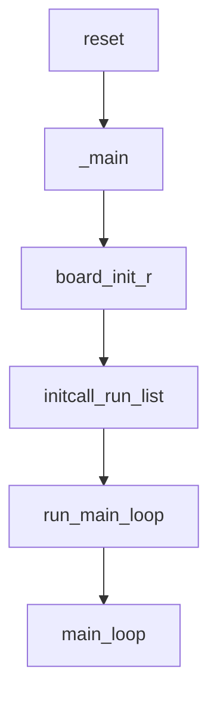
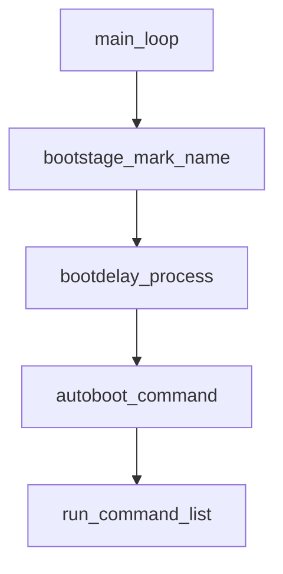

# Uboot


## 构建源码

```shell
# 下载源码
$ git clone git@github.com:Embedfire/ebf_6ull_uboot.git

# 清理编译信息
$ make ARCH=arm clean

# 配置信息
make ARCH=arm mx6ull_14x14_evk_emmc_defconfig
make ARCH=arm mx6ull_14x14_evk_nand_defconfig

# 执行编译
make -j4 ARCH=arm CROSS_COMPILE=arm-none-eabi-
```

## 启动前夕




**[arch/arm/cpu/armv7/start.S]**

```assembly
	.globl	reset
	.globl	save_boot_params_ret

reset:
	/* Allow the board to save important registers */
	b	save_boot_params
save_boot_params_ret:
	/*
	 * disable interrupts (FIQ and IRQ), also set the cpu to SVC32 mode,
	 * except if in HYP mode already
	 */
	mrs	r0, cpsr
	and	r1, r0, #0x1f		@ mask mode bits
	teq	r1, #0x1a		@ test for HYP mode
	bicne	r0, r0, #0x1f		@ clear all mode bits
	orrne	r0, r0, #0x13		@ set SVC mode
	orr	r0, r0, #0xc0		@ disable FIQ and IRQ
	msr	cpsr,r0

/*
 * Setup vector:
 * (OMAP4 spl TEXT_BASE is not 32 byte aligned.
 * Continue to use ROM code vector only in OMAP4 spl)
 */
#if !(defined(CONFIG_OMAP44XX) && defined(CONFIG_SPL_BUILD))
	/* Set V=0 in CP15 SCTLR register - for VBAR to point to vector */
	mrc	p15, 0, r0, c1, c0, 0	@ Read CP15 SCTLR Register
	bic	r0, #CR_V		@ V = 0
	mcr	p15, 0, r0, c1, c0, 0	@ Write CP15 SCTLR Register

	/* Set vector address in CP15 VBAR register */
	ldr	r0, =_start
	mcr	p15, 0, r0, c12, c0, 0	@Set VBAR
#endif

	/* the mask ROM code should have PLL and others stable */
#ifndef CONFIG_SKIP_LOWLEVEL_INIT
	bl	cpu_init_cp15
	bl	cpu_init_crit
#endif

	bl	_main
```

**[arch/arm/lib/crt0_64.S]**

```assembly
ENTRY(_main)

/*
 * Set up initial C runtime environment and call board_init_f(0).
 */

#if defined(CONFIG_SPL_BUILD) && defined(CONFIG_SPL_STACK)
	ldr	sp, =(CONFIG_SPL_STACK)
#else
	ldr	sp, =(CONFIG_SYS_INIT_SP_ADDR)
#endif
#if defined(CONFIG_CPU_V7M)	/* v7M forbids using SP as BIC destination */
	mov	r3, sp
	bic	r3, r3, #7
	mov	sp, r3
#else
	bic	sp, sp, #7	/* 8-byte alignment for ABI compliance */
#endif
	mov	r0, sp
	bl	board_init_f_alloc_reserve
	mov	sp, r0
	/* set up gd here, outside any C code */
	mov	r9, r0
	bl	board_init_f_init_reserve

	mov	r0, #0
	bl	board_init_f

#if ! defined(CONFIG_SPL_BUILD)

/*
 * Set up intermediate environment (new sp and gd) and call
 * relocate_code(addr_moni). Trick here is that we'll return
 * 'here' but relocated.
 */

	ldr	sp, [r9, #GD_START_ADDR_SP]	/* sp = gd->start_addr_sp */
#if defined(CONFIG_CPU_V7M)	/* v7M forbids using SP as BIC destination */
	mov	r3, sp
	bic	r3, r3, #7
	mov	sp, r3
#else
	bic	sp, sp, #7	/* 8-byte alignment for ABI compliance */
#endif
	ldr	r9, [r9, #GD_BD]		/* r9 = gd->bd */
	sub	r9, r9, #GD_SIZE		/* new GD is below bd */

	adr	lr, here
	ldr	r0, [r9, #GD_RELOC_OFF]		/* r0 = gd->reloc_off */
	add	lr, lr, r0
#if defined(CONFIG_CPU_V7M)
	orr	lr, #1				/* As required by Thumb-only */
#endif
	ldr	r0, [r9, #GD_RELOCADDR]		/* r0 = gd->relocaddr */
	b	relocate_code
here:
/*
 * now relocate vectors
 */

	bl	relocate_vectors

/* Set up final (full) environment */

	bl	c_runtime_cpu_setup	/* we still call old routine here */
#endif
#if !defined(CONFIG_SPL_BUILD) || defined(CONFIG_SPL_FRAMEWORK)
# ifdef CONFIG_SPL_BUILD
	/* Use a DRAM stack for the rest of SPL, if requested */
	bl	spl_relocate_stack_gd
	cmp	r0, #0
	movne	sp, r0
	movne	r9, r0
# endif
	ldr	r0, =__bss_start	/* this is auto-relocated! */

#ifdef CONFIG_USE_ARCH_MEMSET
	ldr	r3, =__bss_end		/* this is auto-relocated! */
	mov	r1, #0x00000000		/* prepare zero to clear BSS */

	subs	r2, r3, r0		/* r2 = memset len */
	bl	memset
#else
	ldr	r1, =__bss_end		/* this is auto-relocated! */
	mov	r2, #0x00000000		/* prepare zero to clear BSS */

clbss_l:cmp	r0, r1			/* while not at end of BSS */
#if defined(CONFIG_CPU_V7M)
	itt	lo
#endif
	strlo	r2, [r0]		/* clear 32-bit BSS word */
	addlo	r0, r0, #4		/* move to next */
	blo	clbss_l
#endif

#if ! defined(CONFIG_SPL_BUILD)
	bl coloured_LED_init
	bl red_led_on
#endif
	/* call board_init_r(gd_t *id, ulong dest_addr) */
	mov     r0, r9                  /* gd_t */
	ldr	r1, [r9, #GD_RELOCADDR]	/* dest_addr */
	/* call board_init_r */
#if defined(CONFIG_SYS_THUMB_BUILD)
	ldr	lr, =board_init_r	/* this is auto-relocated! */
	bx	lr
#else
	ldr	pc, =board_init_r	/* this is auto-relocated! */
#endif
	/* we should not return here. */
#endif

ENDPROC(_main)
```


**[arch/arm/cpu/armv8/start.S]**

```assembly
.globl	_start
_start:
	b	reset

reset:
#ifdef CONFIG_SYS_RESET_SCTRL
	bl reset_sctrl
#endif
	/*
	 * Could be EL3/EL2/EL1, Initial State:
	 * Little Endian, MMU Disabled, i/dCache Disabled
	 */
	adr	x0, vectors
	switch_el x1, 3f, 2f, 1f
3:	msr	vbar_el3, x0
	mrs	x0, scr_el3
	orr	x0, x0, #0xf			/* SCR_EL3.NS|IRQ|FIQ|EA */
	msr	scr_el3, x0
	msr	cptr_el3, xzr			/* Enable FP/SIMD */
#ifdef COUNTER_FREQUENCY
	ldr	x0, =COUNTER_FREQUENCY
	msr	cntfrq_el0, x0			/* Initialize CNTFRQ */
#endif
	b	0f
2:	msr	vbar_el2, x0
	mov	x0, #0x33ff
	msr	cptr_el2, x0			/* Enable FP/SIMD */
	b	0f
1:	msr	vbar_el1, x0
	mov	x0, #3 << 20
	msr	cpacr_el1, x0			/* Enable FP/SIMD */
0:

	/* Apply ARM core specific erratas */
	bl	apply_core_errata

	/*
	 * Cache/BPB/TLB Invalidate
	 * i-cache is invalidated before enabled in icache_enable()
	 * tlb is invalidated before mmu is enabled in dcache_enable()
	 * d-cache is invalidated before enabled in dcache_enable()
	 */

	/* Processor specific initialization */
	bl	lowlevel_init

#ifdef CONFIG_ARMV8_MULTIENTRY
	branch_if_master x0, x1, master_cpu

	/*
	 * Slave CPUs
	 */
slave_cpu:
	wfe
	ldr	x1, =CPU_RELEASE_ADDR
	ldr	x0, [x1]
	cbz	x0, slave_cpu
	br	x0			/* branch to the given address */
master_cpu:
	/* On the master CPU */
#endif /* CONFIG_ARMV8_MULTIENTRY */

	bl	_main
```

**[arch/arm/lib/crt0_64.S]**

```assembly
ENTRY(_main)

/*
 * Set up initial C runtime environment and call board_init_f(0).
 */
#if defined(CONFIG_SPL_BUILD) && defined(CONFIG_SPL_STACK)
	ldr	x0, =(CONFIG_SPL_STACK)
#else
	ldr	x0, =(CONFIG_SYS_INIT_SP_ADDR)
#endif
	bic	sp, x0, #0xf	/* 16-byte alignment for ABI compliance */
	mov	x0, sp
	bl	board_init_f_alloc_reserve
	mov	sp, x0
	/* set up gd here, outside any C code */
	mov	x18, x0
	bl	board_init_f_init_reserve

	mov	x0, #0
	bl	board_init_f

#if !defined(CONFIG_SPL_BUILD)
/*
 * Set up intermediate environment (new sp and gd) and call
 * relocate_code(addr_moni). Trick here is that we'll return
 * 'here' but relocated.
 */
	ldr	x0, [x18, #GD_START_ADDR_SP]	/* x0 <- gd->start_addr_sp */
	bic	sp, x0, #0xf	/* 16-byte alignment for ABI compliance */
	ldr	x18, [x18, #GD_BD]		/* x18 <- gd->bd */
	sub	x18, x18, #GD_SIZE		/* new GD is below bd */

	adr	lr, relocation_return
	ldr	x9, [x18, #GD_RELOC_OFF]	/* x9 <- gd->reloc_off */
	add	lr, lr, x9	/* new return address after relocation */
	ldr	x0, [x18, #GD_RELOCADDR]	/* x0 <- gd->relocaddr */
	b	relocate_code

relocation_return:

/*
 * Set up final (full) environment
 */
	bl	c_runtime_cpu_setup		/* still call old routine */

/* TODO: For SPL, call spl_relocate_stack_gd() to alloc stack relocation */

/*
 * Clear BSS section
 */
	ldr	x0, =__bss_start		/* this is auto-relocated! */
	ldr	x1, =__bss_end			/* this is auto-relocated! */
	mov	x2, #0
clear_loop:
	str	x2, [x0]
	add	x0, x0, #8
	cmp	x0, x1
	b.lo	clear_loop

	/* call board_init_r(gd_t *id, ulong dest_addr) */
	mov	x0, x18				/* gd_t */
	ldr	x1, [x18, #GD_RELOCADDR]	/* dest_addr */
	b	board_init_r			/* PC relative jump */

	/* NOTREACHED - board_init_r() does not return */

#endif /* !CONFIG_SPL_BUILD */

ENDPROC(_main)
```

无论32位还是64位最后进入`board_init_r`实现,分析实现;

```c
void board_init_r(gd_t *new_gd, ulong dest_addr)
{
#ifdef CONFIG_NEEDS_MANUAL_RELOC
	int i;
#endif

#ifdef CONFIG_AVR32
	mmu_init_r(dest_addr);
#endif

#if !defined(CONFIG_X86) && !defined(CONFIG_ARM) && !defined(CONFIG_ARM64)
	gd = new_gd;
#endif

#ifdef CONFIG_NEEDS_MANUAL_RELOC
	for (i = 0; i < ARRAY_SIZE(init_sequence_r); i++)
		init_sequence_r[i] += gd->reloc_off;
#endif

	if (initcall_run_list(init_sequence_r))
		hang();

	/* NOTREACHED - run_main_loop() does not return */
	hang();
}
```

进入`initcall_run_list`实现，实现初始化函数

```c
int initcall_run_list(const init_fnc_t init_sequence[])
{
	const init_fnc_t *init_fnc_ptr;

	for (init_fnc_ptr = init_sequence; *init_fnc_ptr; ++init_fnc_ptr) {
		unsigned long reloc_ofs = 0;
		int ret;

		if (gd->flags & GD_FLG_RELOC)
			reloc_ofs = gd->reloc_off;
#ifdef CONFIG_EFI_APP
		reloc_ofs = (unsigned long)image_base;
#endif
		debug("initcall: %p", (char *)*init_fnc_ptr - reloc_ofs);
		if (gd->flags & GD_FLG_RELOC)
			debug(" (relocated to %p)\n", (char *)*init_fnc_ptr);
		else
			debug("\n");
		ret = (*init_fnc_ptr)();
		if (ret) {
			printf("initcall sequence %p failed at call %p (err=%d)\n",
			       init_sequence,
			       (char *)*init_fnc_ptr - reloc_ofs, ret);
			return -1;
		}
	}
	return 0;
}
```

## 启动实现

### main_loop



### do_bootm

```c
int do_bootm(cmd_tbl_t *cmdtp, int flag, int argc, char * const argv[])
{
#ifdef CONFIG_NEEDS_MANUAL_RELOC
	static int relocated = 0;

	if (!relocated) {
		int i;

		/* relocate names of sub-command table */
		for (i = 0; i < ARRAY_SIZE(cmd_bootm_sub); i++)
			cmd_bootm_sub[i].name += gd->reloc_off;

		relocated = 1;
	}
#endif

	/* determine if we have a sub command */
	argc--; argv++;
	if (argc > 0) {
		char *endp;

		simple_strtoul(argv[0], &endp, 16);
		/* endp pointing to NULL means that argv[0] was just a
		 * valid number, pass it along to the normal bootm processing
		 *
		 * If endp is ':' or '#' assume a FIT identifier so pass
		 * along for normal processing.
		 *
		 * Right now we assume the first arg should never be '-'
		 */
		if ((*endp != 0) && (*endp != ':') && (*endp != '#'))
			return do_bootm_subcommand(cmdtp, flag, argc, argv);
	}

#ifdef CONFIG_SECURE_BOOT
	extern uint32_t authenticate_image(
			uint32_t ddr_start, uint32_t image_size);

	switch (genimg_get_format((const void *)load_addr)) {
#if defined(CONFIG_IMAGE_FORMAT_LEGACY)
	case IMAGE_FORMAT_LEGACY:
		if (authenticate_image(load_addr,
			image_get_image_size((image_header_t *)load_addr)) == 0) {
			printf("Authenticate uImage Fail, Please check\n");
			return 1;
		}
		break;
#endif
#ifdef CONFIG_ANDROID_BOOT_IMAGE
	case IMAGE_FORMAT_ANDROID:
		/* Do this authentication in boota command */
		break;
#endif
	default:
		printf("Not valid image format for Authentication, Please check\n");
		return 1;
	}
#endif

	return do_bootm_states(cmdtp, flag, argc, argv, BOOTM_STATE_START |
		BOOTM_STATE_FINDOS | BOOTM_STATE_FINDOTHER |
		BOOTM_STATE_LOADOS |
#if defined(CONFIG_PPC) || defined(CONFIG_MIPS)
		BOOTM_STATE_OS_CMDLINE |
#endif
		BOOTM_STATE_OS_PREP | BOOTM_STATE_OS_FAKE_GO |
		BOOTM_STATE_OS_GO, &images, 1);
}
```

### boot_jump_linux

```c
static void boot_jump_linux(bootm_headers_t *images, int flag)
{
#ifdef CONFIG_ARM64
	void (*kernel_entry)(void *fdt_addr, void *res0, void *res1,
			void *res2);
	int fake = (flag & BOOTM_STATE_OS_FAKE_GO);

	kernel_entry = (void (*)(void *fdt_addr, void *res0, void *res1,
				void *res2))images->ep;

	debug("## Transferring control to Linux (at address %lx)...\n",
		(ulong) kernel_entry);
	bootstage_mark(BOOTSTAGE_ID_RUN_OS);

	announce_and_cleanup(fake);

	if (!fake) {
		do_nonsec_virt_switch();
		kernel_entry(images->ft_addr, NULL, NULL, NULL);
	}
#else
	unsigned long machid = gd->bd->bi_arch_number;
	char *s;
	void (*kernel_entry)(int zero, int arch, uint params);
	unsigned long r2;
	int fake = (flag & BOOTM_STATE_OS_FAKE_GO);

	kernel_entry = (void (*)(int, int, uint))images->ep;

	s = getenv("machid");
	if (s) {
		if (strict_strtoul(s, 16, &machid) < 0) {
			debug("strict_strtoul failed!\n");
			return;
		}
		printf("Using machid 0x%lx from environment\n", machid);
	}

	debug("## Transferring control to Linux (at address %08lx)" \
		"...\n", (ulong) kernel_entry);
	bootstage_mark(BOOTSTAGE_ID_RUN_OS);
	announce_and_cleanup(fake);

	if (IMAGE_ENABLE_OF_LIBFDT && images->ft_len)
		r2 = (unsigned long)images->ft_addr;
	else
		r2 = gd->bd->bi_boot_params;

	if (!fake) {
#ifdef CONFIG_ARMV7_NONSEC
		if (armv7_boot_nonsec()) {
			armv7_init_nonsec();
			secure_ram_addr(_do_nonsec_entry)(kernel_entry,
							  0, machid, r2);
		} else
#endif
			kernel_entry(0, machid, r2);
	}
#endif
}
```

## 加载内核

```c
static void do_nonsec_virt_switch(void)
{
	smp_kick_all_cpus();
	dcache_disable();	/* flush cache before swtiching to EL2 */
	armv8_switch_to_el2();
#ifdef CONFIG_ARMV8_SWITCH_TO_EL1
	armv8_switch_to_el1();
#endif
}

ENTRY(armv8_switch_to_el2)
	switch_el x0, 1f, 0f, 0f
0:	ret
1:	armv8_switch_to_el2_m x0
ENDPROC(armv8_switch_to_el2)

ENTRY(armv8_switch_to_el1)
	switch_el x0, 0f, 1f, 0f
0:	ret
1:	armv8_switch_to_el1_m x0, x1
ENDPROC(armv8_switch_to_el1)
```

```
.macro armv8_switch_to_el2_m, xreg1
	/* 64bit EL2 | HCE | SMD | RES1 (Bits[5:4]) | Non-secure EL0/EL1 */
	mov	\xreg1, #0x5b1
	msr	scr_el3, \xreg1
	msr	cptr_el3, xzr		/* Disable coprocessor traps to EL3 */
	mov	\xreg1, #0x33ff
	msr	cptr_el2, \xreg1	/* Disable coprocessor traps to EL2 */

	/* Initialize Generic Timers */
	msr	cntvoff_el2, xzr

	/* Initialize SCTLR_EL2
	 *
	 * setting RES1 bits (29,28,23,22,18,16,11,5,4) to 1
	 * and RES0 bits (31,30,27,26,24,21,20,17,15-13,10-6) +
	 * EE,WXN,I,SA,C,A,M to 0
	 */
	mov	\xreg1, #0x0830
	movk	\xreg1, #0x30C5, lsl #16
	msr	sctlr_el2, \xreg1

	/* Return to the EL2_SP2 mode from EL3 */
	mov	\xreg1, sp
	msr	sp_el2, \xreg1		/* Migrate SP */
	mrs	\xreg1, vbar_el3
	msr	vbar_el2, \xreg1	/* Migrate VBAR */
	mov	\xreg1, #0x3c9
	msr	spsr_el3, \xreg1	/* EL2_SP2 | D | A | I | F */
	msr	elr_el3, lr
	eret
.endm
```


