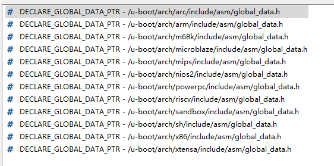
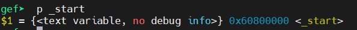
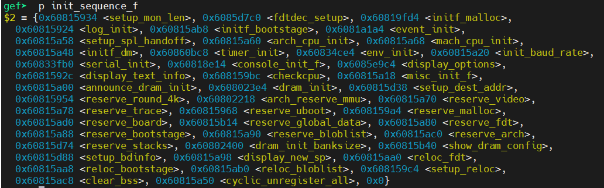
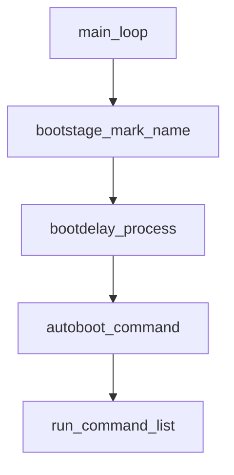

# Uboot基础框架


<!--more-->

**u-boot源码阅读:整体框架**

<!--more-->

## 构建源码

```shell
# 下载源码
$ git clone git@github.com:Embedfire/ebf_6ull_uboot.git

# 清理编译信息
$ make ARCH=arm clean

# 配置信息
make ARCH=arm mx6ull_14x14_evk_emmc_defconfig
make ARCH=arm mx6ull_14x14_evk_nand_defconfig

# 执行编译
make -j$(nproc) ARCH=arm CROSS_COMPILE=arm-none-eabi-
```

## 功能仿真

如果没有开发板的情况下,我们执行板子的仿真
仿真版本:`2024.04`

```shell
# 编译vexpress_ca9 u-boot
make ARCH=arm vexpress_ca9x4_defconfig
make ARCH=arm CROSS_COMPILE=arm-none-eabi-
qemu-system-arm -M vexpress-a9 -kernel u-boot --nographic -m 512M -S -s

# 编译内核
make ARCH=arm vexpress_defconfig
make ARCH=arm CROSS_COMPILE=arm-linux-gnueabi-

# 创建sdcard.img
dd if=/dev/zero of=sdcard.img bs=1024 count=102400
mkfs.fat sdcard.img
mount -o loop sdcard.img /mnt
cp zImage vexpress-v2p-ca9.dtb /mnt
umount /mnt

# 设置tftp启动
$ qemu-system-arm -M vexpress-a9 -m 256M -kernel u-boot -sd sdcard.img -nographic
=> mmcinfo
=> load mmc 0:0 0x60008000 zImage
=> load mmc 0:0 0x61000000 vexpress-v2p-ca9.dtb
=> setenv bootargs "root=/dev/mmcblk0 rw console=ttyAMA0"
=> bootz 0x60008000 - 0x61000000

# 启动程序
$ qemu-system-arm -M vexpress-a9 -m 256M -kernel u-boot -sd sdcard.img -nographic
=> mmcinfo
=> load mmc 0:0 0x60008000 zImage
=> load mmc 0:0 0x61000000 vexpress-v2p-ca9.dtb
=> setenv bootargs "root=/dev/mmcblk0 rw console=ttyAMA0"
=> bootz 0x60008000 - 0x61000000

# u-boot脚本
mkimage -C none -A arm -T script -d boot.cmd boot.scr
$ qemu-system-arm -M vexpress-a9 -m 256M -kernel u-boot -sd sdcard.img -nographic
=> load mmc 0:0 0x62000000 boot.scr
=> source 0x62000000

# 多分区1
dd if=/dev/zero of=sdcard.img bs=1024 count=102400
fdisk sdcard.img                                        # 简单起见这里只分一个区
losetup -f                                              # 查询可用的块设备地址, 记下来如 /dev/loop16
losetup -P /dev/loop16 sdcard.img                       # 关联块设备
lsblk                                                   # 可以看到块设备已经关联, 并且看到分区信息
mkfs.fat  /dev/loop16p1                                 # 格式化第一分区
mount /dev/loop16p1 /mnt                                # 挂载块设备的第一分区
cp boot.scr zImage vexpress-v2p-ca9.dtb /mnt            # 复制到 第一分区
umount /mnt                                             # 卸载设备

# 多分区的实现2
parted sdcard.img

# u-boot打包
mkimage -A arm -C none -O linux -T kernel -d zImage -a 0x00010000 -e 0x00010000 zImage.uimg
mkimage -A arm -C none -O linux -T ramdisk -d rootfs.img.gz -a 0x00800000 -e 0x00800000 rootfs.uimg
dd if=/dev/zero of=flash.bin bs=1 count=6M
dd if=u-boot.bin of=flash.bin conv=notrunc bs=1
dd if=zImage.uimg of=flash.bin conv=notrunc bs=1 seek=2M
dd if=rootfs.uimg of=flash.bin conv=notrunc bs=1 seek=4M

qemu-system-arm -M vexpress-a9 -device loader,file=flash.bin,addr=0x60800000,cpu-num=0,force-raw=on -nographic
```

```shell
make qemu_arm_defconfig
make ARCH=arm CROSS_COMPILE=arm-none-eabi-
qemu-system-arm -machine virt -nographic -bios u-boot.bin

make qemu_arm64_defconfig
make ARCH=arm CROSS_COMPILE=aarch64-linux-gnu-
qemu-system-aarch64 -machine virt -nographic -cpu cortex-a57 -bios u-boot.bin
```

运行程序
```shell
pulseaudio: set_sink_input_volume() failed
pulseaudio: Reason: Invalid argument
pulseaudio: set_sink_input_mute() failed
pulseaudio: Reason: Invalid argument
```

## 全局参数

**DECLARE_GLOBAL_DATA_PTR**

```c
// 声明全局数据
DECLARE_GLOBAL_DATA_PTR;

#ifdef CONFIG_ARM64
#define DECLARE_GLOBAL_DATA_PTR		register volatile gd_t *gd asm ("x18")
#else
#define DECLARE_GLOBAL_DATA_PTR		register volatile gd_t *gd asm ("r9")
#endif
#endif

typedef struct global_data gd_t;

```

我们可以看出下面的数据基本上每一个架构各有一个



这个数据结构真是不小

```c
struct global_data {
	/**
	 * @bd: board information
	 */
	struct bd_info *bd;
	/**
	 * @flags: global data flags
	 *
	 * See &enum gd_flags
	 */
	unsigned long flags;
	/**
	 * @baudrate: baud rate of the serial interface
	 */
	unsigned int baudrate;
	/**
	 * @cpu_clk: CPU clock rate in Hz
	 */
	unsigned long cpu_clk;
	/**
	 * @bus_clk: platform clock rate in Hz
	 */
	unsigned long bus_clk;
	/**
	 * @pci_clk: PCI clock rate in Hz
	 */
	/* We cannot bracket this with CONFIG_PCI due to mpc5xxx */
	unsigned long pci_clk;
	/**
	 * @mem_clk: memory clock rate in Hz
	 */
	unsigned long mem_clk;
#if CONFIG_IS_ENABLED(VIDEO)
	/**
	 * @fb_base: base address of frame buffer memory
	 */
	unsigned long fb_base;
#endif
#if defined(CONFIG_POST)
	/**
	 * @post_log_word: active POST tests
	 *
	 * @post_log_word is a bit mask defining which POST tests are recorded
	 * (see constants POST_*).
	 */
	unsigned long post_log_word;
	/**
	 * @post_log_res: POST results
	 *
	 * @post_log_res is a bit mask with the POST results. A bit with value 1
	 * indicates successful execution.
	 */
	unsigned long post_log_res;
	/**
	 * @post_init_f_time: time in ms when post_init_f() started
	 */
	unsigned long post_init_f_time;
#endif
#ifdef CONFIG_BOARD_TYPES
	/**
	 * @board_type: board type
	 *
	 * If a U-Boot configuration supports multiple board types, the actual
	 * board type may be stored in this field.
	 */
	unsigned long board_type;
#endif
	/**
	 * @have_console: console is available
	 *
	 * A value of 1 indicates that serial_init() was called and a console
	 * is available.
	 * A value of 0 indicates that console input and output drivers shall
	 * not be called.
	 */
	unsigned long have_console;
#if CONFIG_IS_ENABLED(PRE_CONSOLE_BUFFER)
	/**
	 * @precon_buf_idx: pre-console buffer index
	 *
	 * @precon_buf_idx indicates the current position of the
	 * buffer used to collect output before the console becomes
	 * available. When negative, the pre-console buffer is
	 * temporarily disabled (used when the pre-console buffer is
	 * being written out, to prevent adding its contents to
	 * itself).
	 */
	long precon_buf_idx;
#endif
	/**
	 * @env_addr: address of environment structure
	 *
	 * @env_addr contains the address of the structure holding the
	 * environment variables.
	 */
	unsigned long env_addr;
	/**
	 * @env_valid: environment is valid
	 *
	 * See &enum env_valid
	 */
	unsigned long env_valid;
	/**
	 * @env_has_init: bit mask indicating environment locations
	 *
	 * &enum env_location defines which bit relates to which location
	 */
	unsigned long env_has_init;
	/**
	 * @env_load_prio: priority of the loaded environment
	 */
	int env_load_prio;
	/**
	 * @ram_base: base address of RAM used by U-Boot
	 */
	unsigned long ram_base;
	/**
	 * @ram_top: top address of RAM used by U-Boot
	 */
	phys_addr_t ram_top;
	/**
	 * @relocaddr: start address of U-Boot in RAM
	 *
	 * After relocation this field indicates the address to which U-Boot
	 * has been relocated. It can be displayed using the bdinfo command.
	 * Its value is needed to display the source code when debugging with
	 * GDB using the 'add-symbol-file u-boot <relocaddr>' command.
	 */
	unsigned long relocaddr;
	/**
	 * @ram_size: RAM size in bytes
	 */
	phys_size_t ram_size;
	/**
	 * @mon_len: monitor length in bytes
	 */
	unsigned long mon_len;
	/**
	 * @irq_sp: IRQ stack pointer
	 */
	unsigned long irq_sp;
	/**
	 * @start_addr_sp: initial stack pointer address
	 */
	unsigned long start_addr_sp;
	/**
	 * @reloc_off: relocation offset
	 */
	unsigned long reloc_off;
	/**
	 * @new_gd: pointer to relocated global data
	 */
	struct global_data *new_gd;

#ifdef CONFIG_DM
	/**
	 * @dm_root: root instance for Driver Model
	 */
	struct udevice *dm_root;
	/**
	 * @dm_root_f: pre-relocation root instance
	 */
	struct udevice *dm_root_f;
	/**
	 * @uclass_root_s:
	 * head of core tree when uclasses are not in read-only memory.
	 *
	 * When uclasses are in read-only memory, @uclass_root_s is not used and
	 * @uclass_root points to the root node generated by dtoc.
	 */
	struct list_head uclass_root_s;
	/**
	 * @uclass_root:
	 * pointer to head of core tree, if uclasses are in read-only memory and
	 * cannot be adjusted to use @uclass_root as a list head.
	 *
	 * When not in read-only memory, @uclass_root_s is used to hold the
	 * uclass root, and @uclass_root points to the address of
	 * @uclass_root_s.
	 */
	struct list_head *uclass_root;
# if CONFIG_IS_ENABLED(OF_PLATDATA_DRIVER_RT)
	/** @dm_driver_rt: Dynamic info about the driver */
	struct driver_rt *dm_driver_rt;
# endif
#if CONFIG_IS_ENABLED(OF_PLATDATA_RT)
	/** @dm_udevice_rt: Dynamic info about the udevice */
	struct udevice_rt *dm_udevice_rt;
	/**
	 * @dm_priv_base: Base address of the priv/plat region used when
	 * udevices and uclasses are in read-only memory. This is NULL if not
	 * used
	 */
	void *dm_priv_base;
# endif
#endif
#ifdef CONFIG_TIMER
	/**
	 * @timer: timer instance for Driver Model
	 */
	struct udevice *timer;
#endif
	/**
	 * @fdt_blob: U-Boot's own device tree, NULL if none
	 */
	const void *fdt_blob;
	/**
	 * @new_fdt: relocated device tree
	 */
	void *new_fdt;
	/**
	 * @fdt_size: space reserved for relocated device space
	 */
	unsigned long fdt_size;
	/**
	 * @fdt_src: Source of FDT
	 */
	enum fdt_source_t fdt_src;
#if CONFIG_IS_ENABLED(OF_LIVE)
	/**
	 * @of_root: root node of the live tree
	 */
	struct device_node *of_root;
#endif

#if CONFIG_IS_ENABLED(MULTI_DTB_FIT)
	/**
	 * @multi_dtb_fit: pointer to uncompressed multi-dtb FIT image
	 */
	const void *multi_dtb_fit;
#endif
	/**
	 * @jt: jump table
	 *
	 * The jump table contains pointers to exported functions. A pointer to
	 * the jump table is passed to standalone applications.
	 */
	struct jt_funcs *jt;
	/**
	 * @env_buf: buffer for env_get() before reloc
	 */
	char env_buf[32];
#ifdef CONFIG_TRACE
	/**
	 * @trace_buff: trace buffer
	 *
	 * When tracing function in U-Boot this field points to the buffer
	 * recording the function calls.
	 */
	void *trace_buff;
#endif
#if CONFIG_IS_ENABLED(SYS_I2C_LEGACY)
	/**
	 * @cur_i2c_bus: currently used I2C bus
	 */
	int cur_i2c_bus;
#endif
	/**
	 * @timebase_h: high 32 bits of timer
	 */
	unsigned int timebase_h;
	/**
	 * @timebase_l: low 32 bits of timer
	 */
	unsigned int timebase_l;
	/**
	 * @malloc_start: start of malloc() region
	 */
#if CONFIG_IS_ENABLED(CMD_BDINFO_EXTRA)
	unsigned long malloc_start;
#endif
#if CONFIG_VAL(SYS_MALLOC_F_LEN)
	/**
	 * @malloc_base: base address of early malloc()
	 */
	unsigned long malloc_base;
	/**
	 * @malloc_limit: limit address of early malloc()
	 */
	unsigned long malloc_limit;
	/**
	 * @malloc_ptr: current address of early malloc()
	 */
	unsigned long malloc_ptr;
#endif
#ifdef CONFIG_PCI
	/**
	 * @hose: PCI hose for early use
	 */
	struct pci_controller *hose;
	/**
	 * @pci_ram_top: top of region accessible to PCI
	 */
	phys_addr_t pci_ram_top;
#endif
#ifdef CONFIG_PCI_BOOTDELAY
	/**
	 * @pcidelay_done: delay time before scanning of PIC hose expired
	 *
	 * If CONFIG_PCI_BOOTDELAY=y, pci_hose_scan() waits for the number of
	 * milliseconds defined by environment variable pcidelay before
	 * scanning. Once this delay has expired the flag @pcidelay_done
	 * is set to 1.
	 */
	int pcidelay_done;
#endif
	/**
	 * @cur_serial_dev: current serial device
	 */
	struct udevice *cur_serial_dev;
	/**
	 * @arch: architecture-specific data
	 */
	struct arch_global_data arch;
#ifdef CONFIG_CONSOLE_RECORD
	/**
	 * @console_out: output buffer for console recording
	 *
	 * This buffer is used to collect output during console recording.
	 */
	struct membuff console_out;
	/**
	 * @console_in: input buffer for console recording
	 *
	 * If console recording is activated, this buffer can be used to
	 * emulate input.
	 */
	struct membuff console_in;
#endif
#if CONFIG_IS_ENABLED(VIDEO)
	/**
	 * @video_top: top of video frame buffer area
	 */
	ulong video_top;
	/**
	 * @video_bottom: bottom of video frame buffer area
	 */
	ulong video_bottom;
#endif
#ifdef CONFIG_BOOTSTAGE
	/**
	 * @bootstage: boot stage information
	 */
	struct bootstage_data *bootstage;
	/**
	 * @new_bootstage: relocated boot stage information
	 */
	struct bootstage_data *new_bootstage;
#endif
#ifdef CONFIG_LOG
	/**
	 * @log_drop_count: number of dropped log messages
	 *
	 * This counter is incremented for each log message which can not
	 * be processed because logging is not yet available as signaled by
	 * flag %GD_FLG_LOG_READY in @flags.
	 */
	int log_drop_count;
	/**
	 * @default_log_level: default logging level
	 *
	 * For logging devices without filters @default_log_level defines the
	 * logging level, cf. &enum log_level_t.
	 */
	int default_log_level;
	/**
	 * @log_head: list of logging devices
	 */
	struct list_head log_head;
	/**
	 * @log_fmt: bit mask for logging format
	 *
	 * The @log_fmt bit mask selects the fields to be shown in log messages.
	 * &enum log_fmt defines the bits of the bit mask.
	 */
	int log_fmt;

	/**
	 * @processing_msg: a log message is being processed
	 *
	 * This flag is used to suppress the creation of additional messages
	 * while another message is being processed.
	 */
	bool processing_msg;
	/**
	 * @logc_prev: logging category of previous message
	 *
	 * This value is used as logging category for continuation messages.
	 */
	int logc_prev;
	/**
	 * @logl_prev: logging level of the previous message
	 *
	 * This value is used as logging level for continuation messages.
	 */
	int logl_prev;
	/**
	 * @log_cont: Previous log line did not finished wtih \n
	 *
	 * This allows for chained log messages on the same line
	 */
	bool log_cont;
#endif
#if CONFIG_IS_ENABLED(BLOBLIST)
	/**
	 * @bloblist: blob list information
	 */
	struct bloblist_hdr *bloblist;
	/**
	 * @new_bloblist: relocated blob list information
	 */
	struct bloblist_hdr *new_bloblist;
#endif
#if CONFIG_IS_ENABLED(HANDOFF)
	/**
	 * @spl_handoff: SPL hand-off information
	 */
	struct spl_handoff *spl_handoff;
#endif
#if defined(CONFIG_TRANSLATION_OFFSET)
	/**
	 * @translation_offset: optional translation offset
	 *
	 * See CONFIG_TRANSLATION_OFFSET.
	 */
	fdt_addr_t translation_offset;
#endif
#ifdef CONFIG_ACPI
	/**
	 * @acpi_ctx: ACPI context pointer
	 */
	struct acpi_ctx *acpi_ctx;
	/**
	 * @acpi_start: Start address of ACPI tables
	 */
	ulong acpi_start;
#endif
#if CONFIG_IS_ENABLED(GENERATE_SMBIOS_TABLE)
	/**
	 * @smbios_version: Points to SMBIOS type 0 version
	 */
	char *smbios_version;
#endif
#if CONFIG_IS_ENABLED(EVENT)
	/**
	 * @event_state: Points to the current state of events
	 */
	struct event_state event_state;
#endif
#ifdef CONFIG_CYCLIC
	/**
	 * @cyclic_list: list of registered cyclic functions
	 */
	struct hlist_head cyclic_list;
#endif
	/**
	 * @dmtag_list: List of DM tags
	 */
	struct list_head dmtag_list;
};
```

## 辅助程序

```assembly
#define SYMBOL_NAME(X)		X

#define ENTRY(name) \
	.globl SYMBOL_NAME(name) ASM_NL \
	LENTRY(name)

#ifndef END
#define END(name) \
	.size name, .-name
#endif

#ifndef ENDPROC
#define ENDPROC(name) \
	.type name STT_FUNC ASM_NL \
	END(name)
#endif
```

## 主要流程

**代码重定位前**
```text
reset
	--> _main
		--> board_init_f_alloc_reserve
			--> board_init_f_init_reserve
				--> debug_uart_init
					--> CLEAR_BSS
						--> board_init_f
							--> initcall_run_list
								--> init_sequence_f
									--> relocate_code
										--> relocate_vectors
```

**代码重定位后**

```
_main
	--> board_init_r
		--> initcall_run_list
			--> init_sequence_r
```

```c
static const init_fnc_t init_sequence_f[] = {
	setup_mon_len,
#ifdef CONFIG_OF_CONTROL
	fdtdec_setup,
#endif
#ifdef CONFIG_TRACE_EARLY
	trace_early_init,
#endif
	initf_malloc,
	log_init,
	initf_bootstage,	/* uses its own timer, so does not need DM */
	event_init,
	bloblist_maybe_init,
	setup_spl_handoff,
#if defined(CONFIG_CONSOLE_RECORD_INIT_F)
	console_record_init,
#endif
	INITCALL_EVENT(EVT_FSP_INIT_F),
	arch_cpu_init,		/* basic arch cpu dependent setup */
	mach_cpu_init,		/* SoC/machine dependent CPU setup */
	initf_dm,
#if defined(CONFIG_BOARD_EARLY_INIT_F)
	board_early_init_f,
#endif
#if defined(CONFIG_PPC) || defined(CONFIG_SYS_FSL_CLK) || defined(CONFIG_M68K)
	/* get CPU and bus clocks according to the environment variable */
	get_clocks,		/* get CPU and bus clocks (etc.) */
#endif
#if !defined(CONFIG_M68K) || (defined(CONFIG_M68K) && !defined(CONFIG_MCFTMR))
	timer_init,		/* initialize timer */
#endif
#if defined(CONFIG_BOARD_POSTCLK_INIT)
	board_postclk_init,
#endif
	env_init,		/* initialize environment */
	init_baud_rate,		/* initialze baudrate settings */
	serial_init,		/* serial communications setup */
	console_init_f,		/* stage 1 init of console */
	display_options,	/* say that we are here */
	display_text_info,	/* show debugging info if required */
	checkcpu,
#if defined(CONFIG_SYSRESET)
	print_resetinfo,
#endif
#if defined(CONFIG_DISPLAY_CPUINFO)
	print_cpuinfo,		/* display cpu info (and speed) */
#endif
#if defined(CONFIG_DTB_RESELECT)
	embedded_dtb_select,
#endif
#if defined(CONFIG_DISPLAY_BOARDINFO)
	show_board_info,
#endif
	INIT_FUNC_WATCHDOG_INIT
	INITCALL_EVENT(EVT_MISC_INIT_F),
	INIT_FUNC_WATCHDOG_RESET
#if CONFIG_IS_ENABLED(SYS_I2C_LEGACY)
	init_func_i2c,
#endif
	announce_dram_init,
	dram_init,		/* configure available RAM banks */
#ifdef CONFIG_POST
	post_init_f,
#endif
	INIT_FUNC_WATCHDOG_RESET
#if defined(CFG_SYS_DRAM_TEST)
	testdram,
#endif /* CFG_SYS_DRAM_TEST */
	INIT_FUNC_WATCHDOG_RESET

#ifdef CONFIG_POST
	init_post,
#endif
	INIT_FUNC_WATCHDOG_RESET
	/*
	 * Now that we have DRAM mapped and working, we can
	 * relocate the code and continue running from DRAM.
	 *
	 * Reserve memory at end of RAM for (top down in that order):
	 *  - area that won't get touched by U-Boot and Linux (optional)
	 *  - kernel log buffer
	 *  - protected RAM
	 *  - LCD framebuffer
	 *  - monitor code
	 *  - board info struct
	 */
	setup_dest_addr,
#ifdef CONFIG_OF_BOARD_FIXUP
	fix_fdt,
#endif
#ifdef CFG_PRAM
	reserve_pram,
#endif
	reserve_round_4k,
	setup_relocaddr_from_bloblist,
	arch_reserve_mmu,
	reserve_video,
	reserve_trace,
	reserve_uboot,
	reserve_malloc,
	reserve_board,
	reserve_global_data,
	reserve_fdt,
	reserve_bootstage,
	reserve_bloblist,
	reserve_arch,
	reserve_stacks,
	dram_init_banksize,
	show_dram_config,
	INIT_FUNC_WATCHDOG_RESET
	setup_bdinfo,
	display_new_sp,
	INIT_FUNC_WATCHDOG_RESET
	reloc_fdt,
	reloc_bootstage,
	reloc_bloblist,
	setup_reloc,
#if defined(CONFIG_X86) || defined(CONFIG_ARC)
	copy_uboot_to_ram,
	do_elf_reloc_fixups,
#endif
	clear_bss,
	/*
	 * Deregister all cyclic functions before relocation, so that
	 * gd->cyclic_list does not contain any references to pre-relocation
	 * devices. Drivers will register their cyclic functions anew when the
	 * devices are probed again.
	 *
	 * This should happen as late as possible so that the window where a
	 * watchdog device is not serviced is as small as possible.
	 */
	cyclic_unregister_all,
#if !defined(CONFIG_ARM) && !defined(CONFIG_SANDBOX)
	jump_to_copy,
#endif
	NULL,
};
```

```c
static init_fnc_t init_sequence_r[] = {
	initr_trace,
	initr_reloc,
	event_init,
	/* TODO: could x86/PPC have this also perhaps? */
#if defined(CONFIG_ARM) || defined(CONFIG_RISCV)
	initr_caches,
	/* Note: For Freescale LS2 SoCs, new MMU table is created in DDR.
	 *	 A temporary mapping of IFC high region is since removed,
	 *	 so environmental variables in NOR flash is not available
	 *	 until board_init() is called below to remap IFC to high
	 *	 region.
	 */
#endif
	initr_reloc_global_data,
#if defined(CONFIG_SYS_INIT_RAM_LOCK) && defined(CONFIG_E500)
	initr_unlock_ram_in_cache,
#endif
	initr_barrier,
	initr_malloc,
	log_init,
	initr_bootstage,	/* Needs malloc() but has its own timer */
#if defined(CONFIG_CONSOLE_RECORD)
	console_record_init,
#endif
#ifdef CONFIG_SYS_NONCACHED_MEMORY
	noncached_init,
#endif
	initr_of_live,
#ifdef CONFIG_DM
	initr_dm,
#endif
#ifdef CONFIG_ADDR_MAP
	init_addr_map,
#endif
#if defined(CONFIG_ARM) || defined(CONFIG_RISCV) || defined(CONFIG_SANDBOX)
	board_init,	/* Setup chipselects */
#endif
	/*
	 * TODO: printing of the clock inforamtion of the board is now
	 * implemented as part of bdinfo command. Currently only support for
	 * davinci SOC's is added. Remove this check once all the board
	 * implement this.
	 */
#ifdef CONFIG_CLOCKS
	set_cpu_clk_info, /* Setup clock information */
#endif
#ifdef CONFIG_EFI_LOADER
	efi_memory_init,
#endif
	initr_binman,
#ifdef CONFIG_FSP_VERSION2
	arch_fsp_init_r,
#endif
	initr_dm_devices,
	stdio_init_tables,
	serial_initialize,
	initr_announce,
	dm_announce,
#if CONFIG_IS_ENABLED(WDT)
	initr_watchdog,
#endif
	INIT_FUNC_WATCHDOG_RESET
	arch_initr_trap,
#if defined(CONFIG_BOARD_EARLY_INIT_R)
	board_early_init_r,
#endif
	INIT_FUNC_WATCHDOG_RESET
#ifdef CONFIG_POST
	post_output_backlog,
#endif
	INIT_FUNC_WATCHDOG_RESET
#if defined(CONFIG_PCI_INIT_R) && defined(CONFIG_SYS_EARLY_PCI_INIT)
	/*
	 * Do early PCI configuration _before_ the flash gets initialised,
	 * because PCU resources are crucial for flash access on some boards.
	 */
	pci_init,
#endif
#ifdef CONFIG_ARCH_EARLY_INIT_R
	arch_early_init_r,
#endif
	power_init_board,
#ifdef CONFIG_MTD_NOR_FLASH
	initr_flash,
#endif
	INIT_FUNC_WATCHDOG_RESET
#if defined(CONFIG_PPC) || defined(CONFIG_M68K) || defined(CONFIG_X86)
	/* initialize higher level parts of CPU like time base and timers */
	cpu_init_r,
#endif
#ifdef CONFIG_EFI_LOADER
	efi_init_early,
#endif
#ifdef CONFIG_CMD_NAND
	initr_nand,
#endif
#ifdef CONFIG_CMD_ONENAND
	initr_onenand,
#endif
#ifdef CONFIG_MMC
	initr_mmc,
#endif
#ifdef CONFIG_XEN
	xen_init,
#endif
#ifdef CONFIG_PVBLOCK
	initr_pvblock,
#endif
	initr_env,
#ifdef CONFIG_SYS_MALLOC_BOOTPARAMS
	initr_malloc_bootparams,
#endif
	INIT_FUNC_WATCHDOG_RESET
	cpu_secondary_init_r,
#if defined(CONFIG_ID_EEPROM)
	mac_read_from_eeprom,
#endif
	INITCALL_EVENT(EVT_SETTINGS_R),
	INIT_FUNC_WATCHDOG_RESET
#if defined(CONFIG_PCI_INIT_R) && !defined(CONFIG_SYS_EARLY_PCI_INIT)
	/*
	 * Do pci configuration
	 */
	pci_init,
#endif
	stdio_add_devices,
	jumptable_init,
#ifdef CONFIG_API
	api_init,
#endif
	console_init_r,		/* fully init console as a device */
#ifdef CONFIG_DISPLAY_BOARDINFO_LATE
	console_announce_r,
	show_board_info,
#endif
#ifdef CONFIG_ARCH_MISC_INIT
	arch_misc_init,		/* miscellaneous arch-dependent init */
#endif
#ifdef CONFIG_MISC_INIT_R
	misc_init_r,		/* miscellaneous platform-dependent init */
#endif
	INIT_FUNC_WATCHDOG_RESET
#ifdef CONFIG_CMD_KGDB
	kgdb_init,
#endif
	interrupt_init,
#if defined(CONFIG_MICROBLAZE) || defined(CONFIG_M68K)
	timer_init,		/* initialize timer */
#endif
#if defined(CONFIG_LED_STATUS)
	initr_status_led,
#endif
	/* PPC has a udelay(20) here dating from 2002. Why? */
#ifdef CONFIG_BOARD_LATE_INIT
	board_late_init,
#endif
#ifdef CONFIG_BITBANGMII
	bb_miiphy_init,
#endif
#ifdef CONFIG_PCI_ENDPOINT
	pci_ep_init,
#endif
#ifdef CONFIG_CMD_NET
	INIT_FUNC_WATCHDOG_RESET
	initr_net,
#endif
#ifdef CONFIG_POST
	initr_post,
#endif
	INIT_FUNC_WATCHDOG_RESET
	INITCALL_EVENT(EVT_LAST_STAGE_INIT),
#if defined(CFG_PRAM)
	initr_mem,
#endif
	run_main_loop,
};
```

## 启动前夕

### 分析头实现

```shell
$ arm-non-eabi-objdump -S u-boot > u-boot.S
```

### 中断向量表

```assembly
	.macro ARM_VECTORS
#ifdef CONFIG_ARCH_K3
	ldr     pc, _reset
#else
	b	reset
#endif
#if !CONFIG_IS_ENABLED(SYS_NO_VECTOR_TABLE)
	ldr	pc, _undefined_instruction
	ldr	pc, _software_interrupt
	ldr	pc, _prefetch_abort
	ldr	pc, _data_abort
	ldr	pc, _not_used
	ldr	pc, _irq
	ldr	pc, _fiq
#endif
	.endm
```

**[arch/arm/cpu/armv7/start.S]**

```assembly
	.globl	reset
	.globl	save_boot_params_ret

reset:
	/* Allow the board to save important registers */
	b	save_boot_params
save_boot_params_ret:
	/*
	 * disable interrupts (FIQ and IRQ), also set the cpu to SVC32 mode,
	 * except if in HYP mode already
	 */
	mrs	r0, cpsr
	and	r1, r0, #0x1f		@ mask mode bits
	teq	r1, #0x1a		@ test for HYP mode
	bicne	r0, r0, #0x1f		@ clear all mode bits
	orrne	r0, r0, #0x13		@ set SVC mode
	orr	r0, r0, #0xc0		@ disable FIQ and IRQ
	msr	cpsr,r0

/*
 * Setup vector:
 * (OMAP4 spl TEXT_BASE is not 32 byte aligned.
 * Continue to use ROM code vector only in OMAP4 spl)
 */
#if !(defined(CONFIG_OMAP44XX) && defined(CONFIG_SPL_BUILD))
	/* Set V=0 in CP15 SCTLR register - for VBAR to point to vector */
	mrc	p15, 0, r0, c1, c0, 0	@ Read CP15 SCTLR Register
	bic	r0, #CR_V		@ V = 0
	mcr	p15, 0, r0, c1, c0, 0	@ Write CP15 SCTLR Register

	/* Set vector address in CP15 VBAR register */
	ldr	r0, =_start
	mcr	p15, 0, r0, c12, c0, 0	@Set VBAR
#endif

	/* the mask ROM code should have PLL and others stable */
#ifndef CONFIG_SKIP_LOWLEVEL_INIT
	bl	cpu_init_cp15
	bl	cpu_init_crit
#endif

	bl	_main
```

### `save_boot_params`函数实现

>  此函数什么也没有做

```
WEAK(save_boot_params)
	b	save_boot_params_ret		@ back to my caller
ENDPROC(save_boot_params)
```

### 进入svc32模式

> 下面进入设置SVC32模式,并且关闭FIQ and IRQ

```assembly
/*
* disable interrupts (FIQ and IRQ), also set the cpu to SVC32 mode,
* except if in HYP mode already
*/
mrs	r0, cpsr
and	r1, r0, #0x1f		@ mask mode bits
teq	r1, #0x1a		@ test for HYP mode
bicne	r0, r0, #0x1f		@ clear all mode bits
orrne	r0, r0, #0x13		@ set SVC mode
orr	r0, r0, #0xc0		@ disable FIQ and IRQ
msr	cpsr,r0
```

### 设置中断向量表

`_start`标号指向 [中断向量表](#中断向量表)



```assembly
/* Set V=0 in CP15 SCTLR register - for VBAR to point to vector */
mrc	p15, 0, r0, c1, c0, 0	@ Read CP15 SCTLR Register
bic	r0, #CR_V				@ V = 0
mcr	p15, 0, r0, c1, c0, 0	@ Write CP15 SCTLR Register
ldr	r0, =_start
mcr	p15, 0, r0, c12, c0, 0	@Set VBAR
```

### `cpu_init_cp15`函数

```assembly
ENTRY(cpu_init_cp15)

#if CONFIG_IS_ENABLED(ARMV7_SET_CORTEX_SMPEN)
	/*
	 * The Arm Cortex-A7 TRM says this bit must be enabled before
	 * "any cache or TLB maintenance operations are performed".
	 */
	mrc	p15, 0, r0, c1, c0, 1	@ read auxilary control register
	orr	r0, r0, #1 << 6		@ set SMP bit to enable coherency
	mcr	p15, 0, r0, c1, c0, 1	@ write auxilary control register
#endif

	/*
	 * Invalidate L1 I/D
	 */
	mov	r0, #0			@ set up for MCR
	mcr	p15, 0, r0, c8, c7, 0	@ invalidate TLBs
	mcr	p15, 0, r0, c7, c5, 0	@ invalidate icache
	mcr	p15, 0, r0, c7, c5, 6	@ invalidate BP array
	dsb
	isb

	/*
	 * disable MMU stuff and caches
	 */
	mrc	p15, 0, r0, c1, c0, 0
	bic	r0, r0, #0x00002000	@ clear bits 13 (--V-)
	bic	r0, r0, #0x00000007	@ clear bits 2:0 (-CAM)
	orr	r0, r0, #0x00000002	@ set bit 1 (--A-) Align
	orr	r0, r0, #0x00000800	@ set bit 11 (Z---) BTB
#if CONFIG_IS_ENABLED(SYS_ICACHE_OFF)
	bic	r0, r0, #0x00001000	@ clear bit 12 (I) I-cache
#else
	orr	r0, r0, #0x00001000	@ set bit 12 (I) I-cache
#endif
	mcr	p15, 0, r0, c1, c0, 0

#ifdef CONFIG_ARM_ERRATA_716044
	mrc	p15, 0, r0, c1, c0, 0	@ read system control register
	orr	r0, r0, #1 << 11	@ set bit #11
	mcr	p15, 0, r0, c1, c0, 0	@ write system control register
#endif

#if (defined(CONFIG_ARM_ERRATA_742230) || defined(CONFIG_ARM_ERRATA_794072))
	mrc	p15, 0, r0, c15, c0, 1	@ read diagnostic register
	orr	r0, r0, #1 << 4		@ set bit #4
	mcr	p15, 0, r0, c15, c0, 1	@ write diagnostic register
#endif

#ifdef CONFIG_ARM_ERRATA_743622
	mrc	p15, 0, r0, c15, c0, 1	@ read diagnostic register
	orr	r0, r0, #1 << 6		@ set bit #6
	mcr	p15, 0, r0, c15, c0, 1	@ write diagnostic register
#endif

#ifdef CONFIG_ARM_ERRATA_751472
	mrc	p15, 0, r0, c15, c0, 1	@ read diagnostic register
	orr	r0, r0, #1 << 11	@ set bit #11
	mcr	p15, 0, r0, c15, c0, 1	@ write diagnostic register
#endif
#ifdef CONFIG_ARM_ERRATA_761320
	mrc	p15, 0, r0, c15, c0, 1	@ read diagnostic register
	orr	r0, r0, #1 << 21	@ set bit #21
	mcr	p15, 0, r0, c15, c0, 1	@ write diagnostic register
#endif

#ifdef CONFIG_ARM_ERRATA_845369
	mrc     p15, 0, r0, c15, c0, 1	@ read diagnostic register
	orr     r0, r0, #1 << 22	@ set bit #22
	mcr     p15, 0, r0, c15, c0, 1	@ write diagnostic register
#endif

	mov	r5, lr			@ Store my Caller
	mrc	p15, 0, r1, c0, c0, 0	@ r1 has Read Main ID Register (MIDR)
	mov	r3, r1, lsr #20		@ get variant field
	and	r3, r3, #0xf		@ r3 has CPU variant
	and	r4, r1, #0xf		@ r4 has CPU revision
	mov	r2, r3, lsl #4		@ shift variant field for combined value
	orr	r2, r4, r2		@ r2 has combined CPU variant + revision

/* Early stack for ERRATA that needs into call C code */
#if defined(CONFIG_SPL_BUILD) && defined(CONFIG_SPL_STACK)
	ldr	r0, =(CONFIG_SPL_STACK)
#else
	ldr	r0, =(SYS_INIT_SP_ADDR)
#endif
	bic	r0, r0, #7	/* 8-byte alignment for ABI compliance */
	mov	sp, r0

#ifdef CONFIG_ARM_ERRATA_798870
	cmp	r2, #0x30		@ Applies to lower than R3p0
	bge	skip_errata_798870      @ skip if not affected rev
	cmp	r2, #0x20		@ Applies to including and above R2p0
	blt	skip_errata_798870      @ skip if not affected rev

	mrc	p15, 1, r0, c15, c0, 0  @ read l2 aux ctrl reg
	orr	r0, r0, #1 << 7         @ Enable hazard-detect timeout
	push	{r1-r5}			@ Save the cpu info registers
	bl	v7_arch_cp15_set_l2aux_ctrl
	isb				@ Recommended ISB after l2actlr update
	pop	{r1-r5}			@ Restore the cpu info - fall through
skip_errata_798870:
#endif

#ifdef CONFIG_ARM_ERRATA_801819
	cmp	r2, #0x24		@ Applies to lt including R2p4
	bgt	skip_errata_801819      @ skip if not affected rev
	cmp	r2, #0x20		@ Applies to including and above R2p0
	blt	skip_errata_801819      @ skip if not affected rev
	mrc	p15, 0, r0, c0, c0, 6	@ pick up REVIDR reg
	and	r0, r0, #1 << 3		@ check REVIDR[3]
	cmp	r0, #1 << 3
	beq	skip_errata_801819	@ skip erratum if REVIDR[3] is set

	mrc	p15, 0, r0, c1, c0, 1	@ read auxilary control register
	orr	r0, r0, #3 << 27	@ Disables streaming. All write-allocate
					@ lines allocate in the L1 or L2 cache.
	orr	r0, r0, #3 << 25	@ Disables streaming. All write-allocate
					@ lines allocate in the L1 cache.
	push	{r1-r5}			@ Save the cpu info registers
	bl	v7_arch_cp15_set_acr
	pop	{r1-r5}			@ Restore the cpu info - fall through
skip_errata_801819:
#endif

#ifdef CONFIG_ARM_CORTEX_A15_CVE_2017_5715
	mrc	p15, 0, r0, c1, c0, 1	@ read auxilary control register
	orr	r0, r0, #1 << 0		@ Enable invalidates of BTB
	push	{r1-r5}			@ Save the cpu info registers
	bl	v7_arch_cp15_set_acr
	pop	{r1-r5}			@ Restore the cpu info - fall through
#endif

#ifdef CONFIG_ARM_ERRATA_454179
	mrc	p15, 0, r0, c1, c0, 1	@ Read ACR

	cmp	r2, #0x21		@ Only on < r2p1
	orrlt	r0, r0, #(0x3 << 6)	@ Set DBSM(BIT7) and IBE(BIT6) bits

	push	{r1-r5}			@ Save the cpu info registers
	bl	v7_arch_cp15_set_acr
	pop	{r1-r5}			@ Restore the cpu info - fall through
#endif

#if defined(CONFIG_ARM_ERRATA_430973) || defined (CONFIG_ARM_CORTEX_A8_CVE_2017_5715)
	mrc	p15, 0, r0, c1, c0, 1	@ Read ACR

#ifdef CONFIG_ARM_CORTEX_A8_CVE_2017_5715
	orr	r0, r0, #(0x1 << 6)	@ Set IBE bit always to enable OS WA
#else
	cmp	r2, #0x21		@ Only on < r2p1
	orrlt	r0, r0, #(0x1 << 6)	@ Set IBE bit
#endif
	push	{r1-r5}			@ Save the cpu info registers
	bl	v7_arch_cp15_set_acr
	pop	{r1-r5}			@ Restore the cpu info - fall through
#endif

#ifdef CONFIG_ARM_ERRATA_621766
	mrc	p15, 0, r0, c1, c0, 1	@ Read ACR

	cmp	r2, #0x21		@ Only on < r2p1
	orrlt	r0, r0, #(0x1 << 5)	@ Set L1NEON bit

	push	{r1-r5}			@ Save the cpu info registers
	bl	v7_arch_cp15_set_acr
	pop	{r1-r5}			@ Restore the cpu info - fall through
#endif

#ifdef CONFIG_ARM_ERRATA_725233
	mrc	p15, 1, r0, c9, c0, 2	@ Read L2ACR

	cmp	r2, #0x21		@ Only on < r2p1 (Cortex A8)
	orrlt	r0, r0, #(0x1 << 27)	@ L2 PLD data forwarding disable

	push	{r1-r5}			@ Save the cpu info registers
	bl	v7_arch_cp15_set_l2aux_ctrl
	pop	{r1-r5}			@ Restore the cpu info - fall through
#endif

#ifdef CONFIG_ARM_ERRATA_852421
	mrc	p15, 0, r0, c15, c0, 1	@ read diagnostic register
	orr	r0, r0, #1 << 24	@ set bit #24
	mcr	p15, 0, r0, c15, c0, 1	@ write diagnostic register
#endif

#ifdef CONFIG_ARM_ERRATA_852423
	mrc	p15, 0, r0, c15, c0, 1	@ read diagnostic register
	orr	r0, r0, #1 << 12	@ set bit #12
	mcr	p15, 0, r0, c15, c0, 1	@ write diagnostic register
#endif

	mov	pc, r5			@ back to my caller
ENDPROC(cpu_init_cp15)
```

### `cpu_init_crit`函数

```assembly
ENTRY(cpu_init_crit)
	/*
	 * Jump to board specific initialization...
	 * The Mask ROM will have already initialized
	 * basic memory. Go here to bump up clock rate and handle
	 * wake up conditions.
	 */
	b	lowlevel_init		@ go setup pll,mux,memory
ENDPROC(cpu_init_crit)
```

### `lowlevel_init`功能初始化

进入了**board/armltd/vexpress/vexpress_common.c**

函数为空

```c
void lowlevel_init(void)
{
}
```

### C语言初始化

32程序进入`crt0.S`
64为程序进入`crt0_64.S`
**[arch/arm/lib/crt0.S]**

```assembly
ENTRY(_main)

/*
 * Set up initial C runtime environment and call board_init_f(0).
 */

#if defined(CONFIG_SPL_BUILD) && defined(CONFIG_SPL_STACK)
	ldr	sp, =(CONFIG_SPL_STACK)
#else
	ldr	sp, =(CONFIG_SYS_INIT_SP_ADDR)
#endif
#if defined(CONFIG_CPU_V7M)	/* v7M forbids using SP as BIC destination */
	mov	r3, sp
	bic	r3, r3, #7
	mov	sp, r3
#else
	bic	sp, sp, #7	/* 8-byte alignment for ABI compliance */
#endif
	mov	r0, sp
	bl	board_init_f_alloc_reserve
	mov	sp, r0
	/* set up gd here, outside any C code */
	mov	r9, r0
	bl	board_init_f_init_reserve

	mov	r0, #0
	bl	board_init_f

#if ! defined(CONFIG_SPL_BUILD)

/*
 * Set up intermediate environment (new sp and gd) and call
 * relocate_code(addr_moni). Trick here is that we'll return
 * 'here' but relocated.
 */

	ldr	sp, [r9, #GD_START_ADDR_SP]	/* sp = gd->start_addr_sp */
#if defined(CONFIG_CPU_V7M)	/* v7M forbids using SP as BIC destination */
	mov	r3, sp
	bic	r3, r3, #7
	mov	sp, r3
#else
	bic	sp, sp, #7	/* 8-byte alignment for ABI compliance */
#endif
	ldr	r9, [r9, #GD_BD]		/* r9 = gd->bd */
	sub	r9, r9, #GD_SIZE		/* new GD is below bd */

	adr	lr, here
	ldr	r0, [r9, #GD_RELOC_OFF]		/* r0 = gd->reloc_off */
	add	lr, lr, r0
#if defined(CONFIG_CPU_V7M)
	orr	lr, #1				/* As required by Thumb-only */
#endif
	ldr	r0, [r9, #GD_RELOCADDR]		/* r0 = gd->relocaddr */
	b	relocate_code
here:
/*
 * now relocate vectors
 */

	bl	relocate_vectors

/* Set up final (full) environment */

	bl	c_runtime_cpu_setup	/* we still call old routine here */
#endif
#if !defined(CONFIG_SPL_BUILD) || defined(CONFIG_SPL_FRAMEWORK)
# ifdef CONFIG_SPL_BUILD
	/* Use a DRAM stack for the rest of SPL, if requested */
	bl	spl_relocate_stack_gd
	cmp	r0, #0
	movne	sp, r0
	movne	r9, r0
# endif
	ldr	r0, =__bss_start	/* this is auto-relocated! */

#ifdef CONFIG_USE_ARCH_MEMSET
	ldr	r3, =__bss_end		/* this is auto-relocated! */
	mov	r1, #0x00000000		/* prepare zero to clear BSS */

	subs	r2, r3, r0		/* r2 = memset len */
	bl	memset
#else
	ldr	r1, =__bss_end		/* this is auto-relocated! */
	mov	r2, #0x00000000		/* prepare zero to clear BSS */

clbss_l:cmp	r0, r1			/* while not at end of BSS */
#if defined(CONFIG_CPU_V7M)
	itt	lo
#endif
	strlo	r2, [r0]		/* clear 32-bit BSS word */
	addlo	r0, r0, #4		/* move to next */
	blo	clbss_l
#endif

#if ! defined(CONFIG_SPL_BUILD)
	bl coloured_LED_init
	bl red_led_on
#endif
	/* call board_init_r(gd_t *id, ulong dest_addr) */
	mov     r0, r9                  /* gd_t */
	ldr	r1, [r9, #GD_RELOCADDR]	/* dest_addr */
	/* call board_init_r */
#if defined(CONFIG_SYS_THUMB_BUILD)
	ldr	lr, =board_init_r	/* this is auto-relocated! */
	bx	lr
#else
	ldr	pc, =board_init_r	/* this is auto-relocated! */
#endif
	/* we should not return here. */
#endif

ENDPROC(_main)
```

### `board_init_f`函数

> 进入此文件**common/board_f.c**

```c
void board_init_f(ulong boot_flags)
{
	gd->flags = boot_flags;
	gd->have_console = 0;

	if (initcall_run_list(init_sequence_f))
		hang();

#if !defined(CONFIG_ARM) && !defined(CONFIG_SANDBOX) && \
		!defined(CONFIG_EFI_APP) && !CONFIG_IS_ENABLED(X86_64) && \
		!defined(CONFIG_ARC)
	/* NOTREACHED - jump_to_copy() does not return */
	hang();
#endif
}
```


### `initcall_run_list`

>  进入初始化列表

```c
typedef int (*init_fnc_t)(void);

static inline int initcall_run_list(const init_fnc_t init_sequence[])
{
	const init_fnc_t *init_fnc_ptr;

	for (init_fnc_ptr = init_sequence; *init_fnc_ptr; ++init_fnc_ptr) {
		unsigned long reloc_ofs = 0;
		int ret;

		/*
		 * Sandbox is relocated by the OS, so symbols always appear at
		 * the relocated address.
		 */
		if (IS_ENABLED(CONFIG_SANDBOX) || (gd->flags & GD_FLG_RELOC))
			reloc_ofs = gd->reloc_off;
#ifdef CONFIG_EFI_APP
		reloc_ofs = (unsigned long)image_base;
#endif
		if (reloc_ofs)
			debug("initcall: %p (relocated to %p)\n",
					(char *)*init_fnc_ptr - reloc_ofs,
					(char *)*init_fnc_ptr);
		else
			debug("initcall: %p\n", (char *)*init_fnc_ptr - reloc_ofs);

		ret = (*init_fnc_ptr)();
		if (ret) {
			printf("initcall sequence %p failed at call %p (err=%d)\n",
			       init_sequence,
			       (char *)*init_fnc_ptr - reloc_ofs, ret);
			return -1;
		}
	}
	return 0;
}
```



**[arch/arm/cpu/armv8/start.S]**

```assembly
.globl	_start
_start:
	b	reset

reset:
#ifdef CONFIG_SYS_RESET_SCTRL
	bl reset_sctrl
#endif
	/*
	 * Could be EL3/EL2/EL1, Initial State:
	 * Little Endian, MMU Disabled, i/dCache Disabled
	 */
	adr	x0, vectors
	switch_el x1, 3f, 2f, 1f
3:	msr	vbar_el3, x0
	mrs	x0, scr_el3
	orr	x0, x0, #0xf			/* SCR_EL3.NS|IRQ|FIQ|EA */
	msr	scr_el3, x0
	msr	cptr_el3, xzr			/* Enable FP/SIMD */
#ifdef COUNTER_FREQUENCY
	ldr	x0, =COUNTER_FREQUENCY
	msr	cntfrq_el0, x0			/* Initialize CNTFRQ */
#endif
	b	0f
2:	msr	vbar_el2, x0
	mov	x0, #0x33ff
	msr	cptr_el2, x0			/* Enable FP/SIMD */
	b	0f
1:	msr	vbar_el1, x0
	mov	x0, #3 << 20
	msr	cpacr_el1, x0			/* Enable FP/SIMD */
0:

	/* Apply ARM core specific erratas */
	bl	apply_core_errata

	/*
	 * Cache/BPB/TLB Invalidate
	 * i-cache is invalidated before enabled in icache_enable()
	 * tlb is invalidated before mmu is enabled in dcache_enable()
	 * d-cache is invalidated before enabled in dcache_enable()
	 */

	/* Processor specific initialization */
	bl	lowlevel_init

#ifdef CONFIG_ARMV8_MULTIENTRY
	branch_if_master x0, x1, master_cpu

	/*
	 * Slave CPUs
	 */
slave_cpu:
	wfe
	ldr	x1, =CPU_RELEASE_ADDR
	ldr	x0, [x1]
	cbz	x0, slave_cpu
	br	x0			/* branch to the given address */
master_cpu:
	/* On the master CPU */
#endif /* CONFIG_ARMV8_MULTIENTRY */

	bl	_main
```

**[arch/arm/lib/crt0_64.S]**

```assembly
ENTRY(_main)

/*
 * Set up initial C runtime environment and call board_init_f(0).
 */
#if defined(CONFIG_SPL_BUILD) && defined(CONFIG_SPL_STACK)
	ldr	x0, =(CONFIG_SPL_STACK)
#else
	ldr	x0, =(CONFIG_SYS_INIT_SP_ADDR)
#endif
	bic	sp, x0, #0xf	/* 16-byte alignment for ABI compliance */
	mov	x0, sp
	bl	board_init_f_alloc_reserve
	mov	sp, x0
	/* set up gd here, outside any C code */
	mov	x18, x0
	bl	board_init_f_init_reserve

	mov	x0, #0
	bl	board_init_f

#if !defined(CONFIG_SPL_BUILD)
/*
 * Set up intermediate environment (new sp and gd) and call
 * relocate_code(addr_moni). Trick here is that we'll return
 * 'here' but relocated.
 */
	ldr	x0, [x18, #GD_START_ADDR_SP]	/* x0 <- gd->start_addr_sp */
	bic	sp, x0, #0xf	/* 16-byte alignment for ABI compliance */
	ldr	x18, [x18, #GD_BD]		/* x18 <- gd->bd */
	sub	x18, x18, #GD_SIZE		/* new GD is below bd */

	adr	lr, relocation_return
	ldr	x9, [x18, #GD_RELOC_OFF]	/* x9 <- gd->reloc_off */
	add	lr, lr, x9	/* new return address after relocation */
	ldr	x0, [x18, #GD_RELOCADDR]	/* x0 <- gd->relocaddr */
	b	relocate_code

relocation_return:

/*
 * Set up final (full) environment
 */
	bl	c_runtime_cpu_setup		/* still call old routine */

/* TODO: For SPL, call spl_relocate_stack_gd() to alloc stack relocation */

/*
 * Clear BSS section
 */
	ldr	x0, =__bss_start		/* this is auto-relocated! */
	ldr	x1, =__bss_end			/* this is auto-relocated! */
	mov	x2, #0
clear_loop:
	str	x2, [x0]
	add	x0, x0, #8
	cmp	x0, x1
	b.lo	clear_loop

	/* call board_init_r(gd_t *id, ulong dest_addr) */
	mov	x0, x18				/* gd_t */
	ldr	x1, [x18, #GD_RELOCADDR]	/* dest_addr */
	b	board_init_r			/* PC relative jump */

	/* NOTREACHED - board_init_r() does not return */

#endif /* !CONFIG_SPL_BUILD */

ENDPROC(_main)
```

无论32位还是64位最后进入`board_init_r`实现,分析实现;

```c
void board_init_r(gd_t *new_gd, ulong dest_addr)
{
#ifdef CONFIG_NEEDS_MANUAL_RELOC
	int i;
#endif

#ifdef CONFIG_AVR32
	mmu_init_r(dest_addr);
#endif

#if !defined(CONFIG_X86) && !defined(CONFIG_ARM) && !defined(CONFIG_ARM64)
	gd = new_gd;
#endif

#ifdef CONFIG_NEEDS_MANUAL_RELOC
	for (i = 0; i < ARRAY_SIZE(init_sequence_r); i++)
		init_sequence_r[i] += gd->reloc_off;
#endif

	if (initcall_run_list(init_sequence_r))
		hang();

	/* NOTREACHED - run_main_loop() does not return */
	hang();
}
```

进入`initcall_run_list`实现，实现初始化函数

```c
int initcall_run_list(const init_fnc_t init_sequence[])
{
	const init_fnc_t *init_fnc_ptr;

	for (init_fnc_ptr = init_sequence; *init_fnc_ptr; ++init_fnc_ptr) {
		unsigned long reloc_ofs = 0;
		int ret;

		if (gd->flags & GD_FLG_RELOC)
			reloc_ofs = gd->reloc_off;
#ifdef CONFIG_EFI_APP
		reloc_ofs = (unsigned long)image_base;
#endif
		debug("initcall: %p", (char *)*init_fnc_ptr - reloc_ofs);
		if (gd->flags & GD_FLG_RELOC)
			debug(" (relocated to %p)\n", (char *)*init_fnc_ptr);
		else
			debug("\n");
		ret = (*init_fnc_ptr)();
		if (ret) {
			printf("initcall sequence %p failed at call %p (err=%d)\n",
			       init_sequence,
			       (char *)*init_fnc_ptr - reloc_ofs, ret);
			return -1;
		}
	}
	return 0;
}
```

### DDR初始化

### UART初始化

### 代码重定位

> 代码重定位这个功能涉及到东西较多，专门写一篇笔记

[代码重定位]()

## 启动中期

> 我程序在重定位之前称之为启动前夕
> 重定位之后到设备初始化完成称之为启动中期
> 剩余启动称之为启动后期


### `board_init_r`函数


```c
void board_init_r(gd_t *new_gd, ulong dest_addr)
{
	/*
	 * The pre-relocation drivers may be using memory that has now gone
	 * away. Mark serial as unavailable - this will fall back to the debug
	 * UART if available.
	 *
	 * Do the same with log drivers since the memory may not be available.
	 */
	gd->flags &= ~(GD_FLG_SERIAL_READY | GD_FLG_LOG_READY);

	/*
	 * Set up the new global data pointer. So far only x86 does this
	 * here.
	 * TODO(sjg@chromium.org): Consider doing this for all archs, or
	 * dropping the new_gd parameter.
	 */
	if (CONFIG_IS_ENABLED(X86_64) && !IS_ENABLED(CONFIG_EFI_APP))
		arch_setup_gd(new_gd);

#if !defined(CONFIG_X86) && !defined(CONFIG_ARM) && !defined(CONFIG_ARM64)
	gd = new_gd;
#endif
	gd->flags &= ~GD_FLG_LOG_READY;

	if (IS_ENABLED(CONFIG_NEEDS_MANUAL_RELOC)) {
		for (int i = 0; i < ARRAY_SIZE(init_sequence_r); i++)
			MANUAL_RELOC(init_sequence_r[i]);
	}

	if (initcall_run_list(init_sequence_r))
		hang();

	/* NOTREACHED - run_main_loop() does not return */
	hang();
}
```

### c_runtime_cpu_setup

当前在ARMV7上好像没有什么效果

```assembly
ENTRY(c_runtime_cpu_setup)
/*
 * If I-cache is enabled invalidate it
 */
#if !CONFIG_IS_ENABLED(SYS_ICACHE_OFF)
	mcr	p15, 0, r0, c7, c5, 0	@ invalidate icache
	dsb
	isb
#endif

	bx	lr

ENDPROC(c_runtime_cpu_setup)
```

当前在ARMV8好像也是如此
```assembly
ENTRY(c_runtime_cpu_setup)
#if defined(CONFIG_ARMV8_SPL_EXCEPTION_VECTORS) || !defined(CONFIG_SPL_BUILD)
	/* Relocate vBAR */
	adr	x0, vectors
	switch_el x1, 3f, 2f, 1f
3:	msr	vbar_el3, x0
	b	0f
2:	msr	vbar_el2, x0
	b	0f
1:	msr	vbar_el1, x0
0:
#endif

	ret
ENDPROC(c_runtime_cpu_setup)
```

## 命令实现

以`version`命令作为例子

```c
#define U_BOOT_VERSION_STRING U_BOOT_VERSION " (" U_BOOT_DATE " - " \
	U_BOOT_TIME " " U_BOOT_TZ ")" CONFIG_IDENT_STRING

const char version_string[] = U_BOOT_VERSION_STRING;
const unsigned short version_num = U_BOOT_VERSION_NUM;
const unsigned char version_num_patch = U_BOOT_VERSION_NUM_PATCH;

static int do_version(struct cmd_tbl *cmdtp, int flag, int argc,
		      char *const argv[])
{
	char buf[DISPLAY_OPTIONS_BANNER_LENGTH];

	printf(display_options_get_banner(false, buf, sizeof(buf)));
#ifdef CC_VERSION_STRING
	puts(CC_VERSION_STRING "\n");
#endif
#ifdef LD_VERSION_STRING
	puts(LD_VERSION_STRING "\n");
#endif
#ifdef CONFIG_SYS_COREBOOT
	printf("coreboot-%s (%s)\n", lib_sysinfo.version, lib_sysinfo.build);
#endif
	return 0;
}

U_BOOT_CMD(
	version,	1,		1,	do_version,
	"print monitor, compiler and linker version",
	""
);
```

展开`U_BOOT_CMD`

```c
#define U_BOOT_CMD(_name, _maxargs, _rep, _cmd, _usage, _help)		\
	U_BOOT_CMD_COMPLETE(_name, _maxargs, _rep, _cmd, _usage, _help, NULL)

#define U_BOOT_CMD_COMPLETE(_name, _maxargs, _rep, _cmd, _usage, _help, _comp) \
	ll_entry_declare(struct cmd_tbl, _name, cmd) =			\
		U_BOOT_CMD_MKENT_COMPLETE(_name, _maxargs, _rep, _cmd,	\
						_usage, _help, _comp);
```


`cli_loop` --> `parse_file_outer` -->


## 启动实现

### main_loop



### do_bootm

```c
int do_bootm(cmd_tbl_t *cmdtp, int flag, int argc, char * const argv[])
{
#ifdef CONFIG_NEEDS_MANUAL_RELOC
	static int relocated = 0;

	if (!relocated) {
		int i;

		/* relocate names of sub-command table */
		for (i = 0; i < ARRAY_SIZE(cmd_bootm_sub); i++)
			cmd_bootm_sub[i].name += gd->reloc_off;

		relocated = 1;
	}
#endif

	/* determine if we have a sub command */
	argc--; argv++;
	if (argc > 0) {
		char *endp;

		simple_strtoul(argv[0], &endp, 16);
		/* endp pointing to NULL means that argv[0] was just a
		 * valid number, pass it along to the normal bootm processing
		 *
		 * If endp is ':' or '#' assume a FIT identifier so pass
		 * along for normal processing.
		 *
		 * Right now we assume the first arg should never be '-'
		 */
		if ((*endp != 0) && (*endp != ':') && (*endp != '#'))
			return do_bootm_subcommand(cmdtp, flag, argc, argv);
	}

#ifdef CONFIG_SECURE_BOOT
	extern uint32_t authenticate_image(
			uint32_t ddr_start, uint32_t image_size);

	switch (genimg_get_format((const void *)load_addr)) {
#if defined(CONFIG_IMAGE_FORMAT_LEGACY)
	case IMAGE_FORMAT_LEGACY:
		if (authenticate_image(load_addr,
			image_get_image_size((image_header_t *)load_addr)) == 0) {
			printf("Authenticate uImage Fail, Please check\n");
			return 1;
		}
		break;
#endif
#ifdef CONFIG_ANDROID_BOOT_IMAGE
	case IMAGE_FORMAT_ANDROID:
		/* Do this authentication in boota command */
		break;
#endif
	default:
		printf("Not valid image format for Authentication, Please check\n");
		return 1;
	}
#endif

	return do_bootm_states(cmdtp, flag, argc, argv, BOOTM_STATE_START |
		BOOTM_STATE_FINDOS | BOOTM_STATE_FINDOTHER |
		BOOTM_STATE_LOADOS |
#if defined(CONFIG_PPC) || defined(CONFIG_MIPS)
		BOOTM_STATE_OS_CMDLINE |
#endif
		BOOTM_STATE_OS_PREP | BOOTM_STATE_OS_FAKE_GO |
		BOOTM_STATE_OS_GO, &images, 1);
}
```

### boot_jump_linux

```c
static void boot_jump_linux(bootm_headers_t *images, int flag)
{
#ifdef CONFIG_ARM64
	void (*kernel_entry)(void *fdt_addr, void *res0, void *res1,
			void *res2);
	int fake = (flag & BOOTM_STATE_OS_FAKE_GO);

	kernel_entry = (void (*)(void *fdt_addr, void *res0, void *res1,
				void *res2))images->ep;

	debug("## Transferring control to Linux (at address %lx)...\n",
		(ulong) kernel_entry);
	bootstage_mark(BOOTSTAGE_ID_RUN_OS);

	announce_and_cleanup(fake);

	if (!fake) {
		do_nonsec_virt_switch();
		kernel_entry(images->ft_addr, NULL, NULL, NULL);
	}
#else
	unsigned long machid = gd->bd->bi_arch_number;
	char *s;
	void (*kernel_entry)(int zero, int arch, uint params);
	unsigned long r2;
	int fake = (flag & BOOTM_STATE_OS_FAKE_GO);

	kernel_entry = (void (*)(int, int, uint))images->ep;

	s = getenv("machid");
	if (s) {
		if (strict_strtoul(s, 16, &machid) < 0) {
			debug("strict_strtoul failed!\n");
			return;
		}
		printf("Using machid 0x%lx from environment\n", machid);
	}

	debug("## Transferring control to Linux (at address %08lx)" \
		"...\n", (ulong) kernel_entry);
	bootstage_mark(BOOTSTAGE_ID_RUN_OS);
	announce_and_cleanup(fake);

	if (IMAGE_ENABLE_OF_LIBFDT && images->ft_len)
		r2 = (unsigned long)images->ft_addr;
	else
		r2 = gd->bd->bi_boot_params;

	if (!fake) {
#ifdef CONFIG_ARMV7_NONSEC
		if (armv7_boot_nonsec()) {
			armv7_init_nonsec();
			secure_ram_addr(_do_nonsec_entry)(kernel_entry,
							  0, machid, r2);
		} else
#endif
			kernel_entry(0, machid, r2);
	}
#endif
}
```

## 环境变量

> 1. 初始化功能
> 2. 获取变量`env_get`
> 3. 设置变量`env_set`

```c
char *env_get(const char *name)
{
	if (gd->flags & GD_FLG_ENV_READY) { /* after import into hashtable */
		struct env_entry e, *ep;

		schedule();

		e.key	= name;
		e.data	= NULL;
		hsearch_r(e, ENV_FIND, &ep, &env_htab, 0);

		return ep ? ep->data : NULL;
	}

	/* restricted capabilities before import */
	if (env_get_f(name, (char *)(gd->env_buf), sizeof(gd->env_buf)) >= 0)
		return (char *)(gd->env_buf);

	return NULL;
}
```

```c
int env_set(const char *varname, const char *varvalue)
{
	const char * const argv[4] = { "setenv", varname, varvalue, NULL };

	/* before import into hashtable */
	if (!(gd->flags & GD_FLG_ENV_READY))
		return 1;

	if (varvalue == NULL || varvalue[0] == '\0')
		return _do_env_set(0, 2, (char * const *)argv, H_PROGRAMMATIC);
	else
		return _do_env_set(0, 3, (char * const *)argv, H_PROGRAMMATIC);
}
```


## 加载内核

```c
static void do_nonsec_virt_switch(void)
{
	smp_kick_all_cpus();
	dcache_disable();	/* flush cache before swtiching to EL2 */
	armv8_switch_to_el2();
#ifdef CONFIG_ARMV8_SWITCH_TO_EL1
	armv8_switch_to_el1();
#endif
}

ENTRY(armv8_switch_to_el2)
	switch_el x0, 1f, 0f, 0f
0:	ret
1:	armv8_switch_to_el2_m x0
ENDPROC(armv8_switch_to_el2)

ENTRY(armv8_switch_to_el1)
	switch_el x0, 0f, 1f, 0f
0:	ret
1:	armv8_switch_to_el1_m x0, x1
ENDPROC(armv8_switch_to_el1)
```

```s
.macro armv8_switch_to_el2_m, xreg1
	/* 64bit EL2 | HCE | SMD | RES1 (Bits[5:4]) | Non-secure EL0/EL1 */
	mov	\xreg1, #0x5b1
	msr	scr_el3, \xreg1
	msr	cptr_el3, xzr		/* Disable coprocessor traps to EL3 */
	mov	\xreg1, #0x33ff
	msr	cptr_el2, \xreg1	/* Disable coprocessor traps to EL2 */

	/* Initialize Generic Timers */
	msr	cntvoff_el2, xzr

	/* Initialize SCTLR_EL2
	 *
	 * setting RES1 bits (29,28,23,22,18,16,11,5,4) to 1
	 * and RES0 bits (31,30,27,26,24,21,20,17,15-13,10-6) +
	 * EE,WXN,I,SA,C,A,M to 0
	 */
	mov	\xreg1, #0x0830
	movk	\xreg1, #0x30C5, lsl #16
	msr	sctlr_el2, \xreg1

	/* Return to the EL2_SP2 mode from EL3 */
	mov	\xreg1, sp
	msr	sp_el2, \xreg1		/* Migrate SP */
	mrs	\xreg1, vbar_el3
	msr	vbar_el2, \xreg1	/* Migrate VBAR */
	mov	\xreg1, #0x3c9
	msr	spsr_el3, \xreg1	/* EL2_SP2 | D | A | I | F */
	msr	elr_el3, lr
	eret
.endm
```

## 设备树解析

### 加载设备树

设备树地址会设置到`gd->fdt_blob`变量中，设置方法如下


```c
int fdtdec_setup(void)
{
	int ret;

	/* The devicetree is typically appended to U-Boot */
	if (IS_ENABLED(CONFIG_OF_SEPARATE)) {
		gd->fdt_blob = fdt_find_separate();
		gd->fdt_src = FDTSRC_SEPARATE;
	} else { /* embed dtb in ELF file for testing / development */
		gd->fdt_blob = dtb_dt_embedded();
		gd->fdt_src = FDTSRC_EMBED;
	}

	/* Allow the board to override the fdt address. */
	if (IS_ENABLED(CONFIG_OF_BOARD)) {
		gd->fdt_blob = board_fdt_blob_setup(&ret);
		if (ret)
			return ret;
		gd->fdt_src = FDTSRC_BOARD;
	}

	/* Allow the early environment to override the fdt address */
	if (!IS_ENABLED(CONFIG_SPL_BUILD)) {
		ulong addr;

		addr = env_get_hex("fdtcontroladdr", 0);
		if (addr) {
			gd->fdt_blob = map_sysmem(addr, 0);
			gd->fdt_src = FDTSRC_ENV;
		}
	}

	if (CONFIG_IS_ENABLED(MULTI_DTB_FIT))
		setup_multi_dtb_fit();

	ret = fdtdec_prepare_fdt(gd->fdt_blob);
	if (!ret)
		ret = fdtdec_board_setup(gd->fdt_blob);
	oftree_reset();

	return ret;
}
```

预留地址空间

```c
static int reserve_fdt(void)
{
	if (!IS_ENABLED(CONFIG_OF_EMBED)) {
		/*
		 * If the device tree is sitting immediately above our image
		 * then we must relocate it. If it is embedded in the data
		 * section, then it will be relocated with other data.
		 */
		if (gd->fdt_blob) {
			gd->fdt_size = ALIGN(fdt_totalsize(gd->fdt_blob), 32);

			gd->start_addr_sp = reserve_stack_aligned(gd->fdt_size);
			gd->new_fdt = map_sysmem(gd->start_addr_sp, gd->fdt_size);
			debug("Reserving %lu Bytes for FDT at: %08lx\n",
			      gd->fdt_size, gd->start_addr_sp);
		}
	}

	return 0;
}
```

重新设置fdt

```c
static int reloc_fdt(void)
{
	if (!IS_ENABLED(CONFIG_OF_EMBED)) {
		if (gd->new_fdt) {
			memcpy(gd->new_fdt, gd->fdt_blob,
			       fdt_totalsize(gd->fdt_blob));
			gd->fdt_blob = gd->new_fdt;
		}
	}

	return 0;
}
```

### 设备树解析

> 解析接口定义在libfdt文件夹下面

```c
int fdt_path_offset(const void *fdt, const char *path);

const char *fdt_get_name(const void *fdt, int nodeoffset, int *lenp);
```

