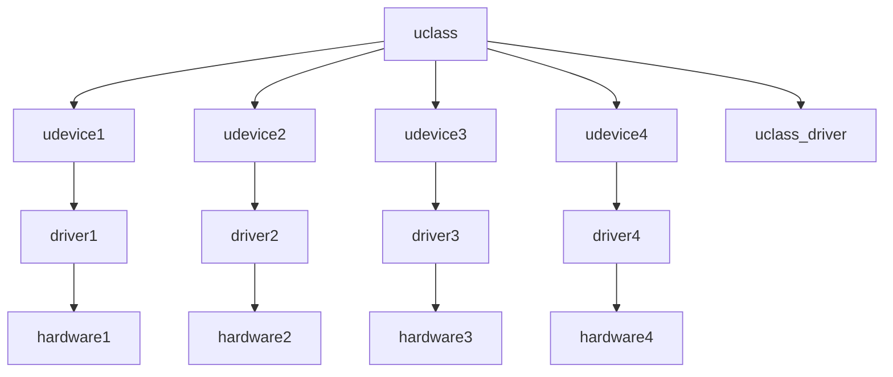

# Uboot驱动框架


<!--more-->
**u-boot源码阅读:驱动框架**
<!--more-->

代码位置: u-boot/drivers/core

## 驱动模型

> 在U-boot中引入驱动模型(driver model)，为驱动的定义和范文接口提供统一的方法，提高驱动间的兼容性以及访问的标准
> 性，u-boot中的驱动模型(DM)和kernel中的设备驱动模型类似，但是也有所区别

U-Boot采用了一种分层的设备模型来管理硬件资源。这个模型包括了设备（device）、总线（bus）、驱动（driver）以及类（class）的概念。每个设备都连接到一个总线上，而每个驱动则与一种类型的设备相对应。

设备(Device)：代表系统中的物理或虚拟硬件。
总线(Bus)：定义了如何枚举和配置连接在其上的设备。
驱动(Driver)：包含了操作特定类型设备的代码。
类(Class)：用于分类相似功能的设备，如USB、I2C等。

### uclass/udevices/drivers三者直接的关联

**uclass**可以理解为具有相同属性的device对外操作的接口, 它与上层接口直接通讯，其驱动为**uclass_driver**，给上层提供接口
**udevice**对具体设备的抽象，对应的驱动是**driver; driver**负责和硬件通讯，为**uclass**提供实际的操作集
**udevice**如何和**uclass**绑定：**udevice**对应的**driver_id**和**uclass**对应的**uclass_driver_id**是否匹配
**hardware**对应的**driver**绑定对应的**udevice，udevice**绑定**uclass**，**uclass**有其对应的**uclass_driver**

> **uclass和udevice是动态生成的**

1. **udevice**在解析fdt中的设备的时候自动生成，然后**udevice**找到对应的**driver**
2. **driver**中保存了**uclass_id**， 根据它找到**uclass_driver_id**
3. 从**uclass**链表中查找对应的**uclass**是否已经生成，若没有生成，则动态生成
4. **重点是解析设备树，生成udevice， 并找到对应的driver**



## uclass
`uclass`有对应的ID号，定义在其`uclass_driver`中,存在于**include/dm/uclass-id.h**文件中

```c
enum uclass_id {
	/* These are used internally by driver model */
	UCLASS_ROOT = 0,
	UCLASS_DEMO,
	UCLASS_TEST,
	UCLASS_TEST_FDT,
	UCLASS_TEST_FDT_MANUAL,
	UCLASS_TEST_BUS,
	UCLASS_TEST_PROBE,
	UCLASS_TEST_DUMMY,
	UCLASS_TEST_DEVRES,
	UCLASS_TEST_ACPI,
	UCLASS_SPI_EMUL,	/* sandbox SPI device emulator */
	UCLASS_I2C_EMUL,	/* sandbox I2C device emulator */
	UCLASS_I2C_EMUL_PARENT,	/* parent for I2C device emulators */
	UCLASS_PCI_EMUL,	/* sandbox PCI device emulator */
	UCLASS_PCI_EMUL_PARENT,	/* parent for PCI device emulators */
	UCLASS_USB_EMUL,	/* sandbox USB bus device emulator */
	UCLASS_AXI_EMUL,	/* sandbox AXI bus device emulator */

	/* U-Boot uclasses start here - in alphabetical order */
	UCLASS_ACPI_PMC,	/* (x86) Power-management controller (PMC) */
	UCLASS_ADC,		/* Analog-to-digital converter */
	UCLASS_AHCI,		/* SATA disk controller */
	UCLASS_AUDIO_CODEC,	/* Audio codec with control and data path */
	UCLASS_AXI,		/* AXI bus */
	UCLASS_BLK,		/* Block device */
	UCLASS_BLKMAP,		/* Composable virtual block device */
	UCLASS_BOOTCOUNT,       /* Bootcount backing store */
	UCLASS_BOOTDEV,		/* Boot device for locating an OS to boot */
	UCLASS_BOOTMETH,	/* Bootmethod for booting an OS */
	UCLASS_BOOTSTD,		/* Standard boot driver */
	UCLASS_BUTTON,		/* Button */
	UCLASS_CACHE,		/* Cache controller */
	UCLASS_CLK,		/* Clock source, e.g. used by peripherals */
	UCLASS_CPU,		/* CPU, typically part of an SoC */
	UCLASS_CROS_EC,		/* Chrome OS EC */
	UCLASS_DISPLAY,		/* Display (e.g. DisplayPort, HDMI) */
	UCLASS_DMA,		/* Direct Memory Access */
	UCLASS_DSA,		/* Distributed (Ethernet) Switch Architecture */
	UCLASS_DSI_HOST,	/* Display Serial Interface host */
	UCLASS_ECDSA,		/* Elliptic curve cryptographic device */
	UCLASS_EFI_LOADER,	/* Devices created by UEFI applications */
	UCLASS_EFI_MEDIA,	/* Devices provided by UEFI firmware */
	UCLASS_ETH,		/* Ethernet device */
	UCLASS_ETH_PHY,		/* Ethernet PHY device */
	UCLASS_EXTCON,		/* External Connector Class */
	UCLASS_FIRMWARE,	/* Firmware */
	UCLASS_FPGA,		/* FPGA device */
	UCLASS_FUZZING_ENGINE,	/* Fuzzing engine */
	UCLASS_FS_FIRMWARE_LOADER,		/* Generic loader */
	UCLASS_FWU_MDATA,	/* FWU Metadata Access */
	UCLASS_GPIO,		/* Bank of general-purpose I/O pins */
	UCLASS_HASH,		/* Hash device */
	UCLASS_HWSPINLOCK,	/* Hardware semaphores */
	UCLASS_HOST,		/* Sandbox host device */
	UCLASS_I2C,		/* I2C bus */
	UCLASS_I2C_EEPROM,	/* I2C EEPROM device */
	UCLASS_I2C_GENERIC,	/* Generic I2C device */
	UCLASS_I2C_MUX,		/* I2C multiplexer */
	UCLASS_I2S,		/* I2S bus */
	UCLASS_IDE,		/* IDE device */
	UCLASS_IOMMU,		/* IOMMU */
	UCLASS_IRQ,		/* Interrupt controller */
	UCLASS_KEYBOARD,	/* Keyboard input device */
	UCLASS_LED,		/* Light-emitting diode (LED) */
	UCLASS_LPC,		/* x86 'low pin count' interface */
	UCLASS_MAILBOX,		/* Mailbox controller */
	UCLASS_MASS_STORAGE,	/* Mass storage device */
	UCLASS_MDIO,		/* MDIO bus */
	UCLASS_MDIO_MUX,	/* MDIO MUX/switch */
	UCLASS_MEMORY,		/* Memory Controller device */
	UCLASS_MISC,		/* Miscellaneous device */
	UCLASS_MMC,		/* SD / MMC card or chip */
	UCLASS_MOD_EXP,		/* RSA Mod Exp device */
	UCLASS_MTD,		/* Memory Technology Device (MTD) device */
	UCLASS_MUX,		/* Multiplexer device */
	UCLASS_NOP,		/* No-op devices */
	UCLASS_NORTHBRIDGE,	/* Intel Northbridge / SDRAM controller */
	UCLASS_NVME,		/* NVM Express device */
	UCLASS_NVMXIP,		/* NVM XIP devices */
	UCLASS_P2SB,		/* (x86) Primary-to-Sideband Bus */
	UCLASS_PANEL,		/* Display panel, such as an LCD */
	UCLASS_PANEL_BACKLIGHT,	/* Backlight controller for panel */
	UCLASS_PARTITION,	/* Logical disk partition device */
	UCLASS_PCH,		/* x86 platform controller hub */
	UCLASS_PCI,		/* PCI bus */
	UCLASS_PCI_EP,		/* PCI endpoint device */
	UCLASS_PCI_GENERIC,	/* Generic PCI bus device */
	UCLASS_PHY,		/* Physical Layer (PHY) device */
	UCLASS_PINCONFIG,	/* Pin configuration node device */
	UCLASS_PINCTRL,		/* Pinctrl (pin muxing/configuration) device */
	UCLASS_PMIC,		/* PMIC I/O device */
	UCLASS_POWER_DOMAIN,	/* (SoC) Power domains */
	UCLASS_PVBLOCK,		/* Xen virtual block device */
	UCLASS_PWM,		/* Pulse-width modulator */
	UCLASS_PWRSEQ,		/* Power sequence device */
	UCLASS_QFW,		/* QEMU firmware config device */
	UCLASS_RAM,		/* RAM controller */
	UCLASS_REBOOT_MODE,	/* Reboot mode */
	UCLASS_REGULATOR,	/* Regulator device */
	UCLASS_REMOTEPROC,	/* Remote Processor device */
	UCLASS_RESET,		/* Reset controller device */
	UCLASS_RNG,		/* Random Number Generator */
	UCLASS_RTC,		/* Real time clock device */
	UCLASS_SCMI_AGENT,	/* Interface with an SCMI server */
	UCLASS_SCSI,		/* SCSI device */
	UCLASS_SERIAL,		/* Serial UART */
	UCLASS_SIMPLE_BUS,	/* Bus with child devices */
	UCLASS_SMEM,		/* Shared memory interface */
	UCLASS_SOC,		/* SOC Device */
	UCLASS_SOUND,		/* Playing simple sounds */
	UCLASS_SPI,		/* SPI bus */
	UCLASS_SPI_FLASH,	/* SPI flash */
	UCLASS_SPI_GENERIC,	/* Generic SPI flash target */
	UCLASS_SPMI,		/* System Power Management Interface bus */
	UCLASS_SYSCON,		/* System configuration device */
	UCLASS_SYSINFO,		/* Device information from hardware */
	UCLASS_SYSRESET,	/* System reset device */
	UCLASS_TEE,		/* Trusted Execution Environment device */
	UCLASS_THERMAL,		/* Thermal sensor */
	UCLASS_TIMER,		/* Timer device */
	UCLASS_TPM,		/* Trusted Platform Module TIS interface */
	UCLASS_UFS,		/* Universal Flash Storage */
	UCLASS_USB,		/* USB bus */
	UCLASS_USB_DEV_GENERIC,	/* USB generic device */
	UCLASS_USB_HUB,		/* USB hub */
	UCLASS_USB_GADGET_GENERIC,	/* USB generic device */
	UCLASS_VIDEO,		/* Video or LCD device */
	UCLASS_VIDEO_BRIDGE,	/* Video bridge, e.g. DisplayPort to LVDS */
	UCLASS_VIDEO_CONSOLE,	/* Text console driver for video device */
	UCLASS_VIDEO_OSD,	/* On-screen display */
	UCLASS_VIRTIO,		/* VirtIO transport device */
	UCLASS_W1,		/* Dallas 1-Wire bus */
	UCLASS_W1_EEPROM,	/* one-wire EEPROMs */
	UCLASS_WDT,		/* Watchdog Timer driver */

	UCLASS_COUNT,
	UCLASS_INVALID = -1,
};
```

### 定义uclass_driver

```c
#define UCLASS_DRIVER(__name) ll_entry_declare(struct uclass_driver, __name, uclass_driver)

#define ll_entry_declare(_type, _name, _list)				\
	_type _u_boot_list_2_##_list##_2_##_name __aligned(4)		\
			__attribute__((unused))			        \
			__section("__u_boot_list_2_"#_list"_2_"#_name)

struct uclass_driver {
	const char *name;
	enum uclass_id id;
	int (*post_bind)(struct udevice *dev);
	int (*pre_unbind)(struct udevice *dev);
	int (*pre_probe)(struct udevice *dev);
	int (*post_probe)(struct udevice *dev);
	int (*pre_remove)(struct udevice *dev);
	int (*child_post_bind)(struct udevice *dev);
	int (*child_pre_probe)(struct udevice *dev);
	int (*child_post_probe)(struct udevice *dev);
	int (*init)(struct uclass *class);
	int (*destroy)(struct uclass *class);
	int priv_auto;
	int per_device_auto;
	int per_device_plat_auto;
	int per_child_auto;
	int per_child_plat_auto;
	uint32_t flags;
};
```
生成结果如下
```map
 __u_boot_list_2_uclass_driver_1
                0x000b277c        0x0 drivers/core/lists.o
 __u_boot_list_2_uclass_driver_1
                0x000b277c        0x0 drivers/core/root.o
 __u_boot_list_2_uclass_driver_2_ahci
                0x000b277c       0x48 drivers/ata/ahci-uclass.o
                0x000b277c                _u_boot_list_2_uclass_driver_2_ahci
 __u_boot_list_2_uclass_driver_2_blk
                0x000b27c4       0x48 drivers/block/blk-uclass.o
                0x000b27c4                _u_boot_list_2_uclass_driver_2_blk
 __u_boot_list_2_uclass_driver_2_bootdev
                0x000b280c       0x48 boot/bootdev-uclass.o
                0x000b280c                _u_boot_list_2_uclass_driver_2_bootdev
 __u_boot_list_2_uclass_driver_2_bootmeth
                0x000b2854       0x48 boot/bootmeth-uclass.o
                0x000b2854                _u_boot_list_2_uclass_driver_2_bootmeth
 __u_boot_list_2_uclass_driver_2_bootstd
                0x000b289c       0x48 boot/bootstd-uclass.o
                0x000b289c                _u_boot_list_2_uclass_driver_2_bootstd
 __u_boot_list_2_uclass_driver_2_efi
                0x000b28e4       0x48 lib/efi_driver/efi_uclass.o
                0x000b28e4                _u_boot_list_2_uclass_driver_2_efi
 __u_boot_list_2_uclass_driver_2_ethernet
                0x000b292c       0x48 net/eth-uclass.o
                0x000b292c                _u_boot_list_2_uclass_driver_2_ethernet
```

### uclass实现

```c
struct uclass {
	void *priv_;
	struct uclass_driver *uc_drv;
	struct list_head dev_head;
	struct list_head sibling_node;
};

#define ll_entry_start(_type, _list)					\
({									\
	static char start[0] __aligned(CONFIG_LINKER_LIST_ALIGN)	\
		__attribute__((unused))					\
		__section("__u_boot_list_2_"#_list"_1");		\
	_type * tmp = (_type *)&start;					\
	asm("":"+r"(tmp));						\
	tmp;								\
})

struct uclass_driver *lists_uclass_lookup(enum uclass_id id)
{
	struct uclass_driver *uclass =
		ll_entry_start(struct uclass_driver, uclass_driver);
	const int n_ents = ll_entry_count(struct uclass_driver, uclass_driver);
	struct uclass_driver *entry;

	for (entry = uclass; entry != uclass + n_ents; entry++) {
		if (entry->id == id)
			return entry;
	}

	return NULL;
}
```

## uclass的使用

**udevice的数据结构**

```c
struct udevice {
	const struct driver *driver;
	const char *name;
	void *plat_;
	void *parent_plat_;
	void *uclass_plat_;
	ulong driver_data;
	struct udevice *parent;
	void *priv_;
	struct uclass *uclass;
	void *uclass_priv_;
	void *parent_priv_;
	struct list_head uclass_node;
	struct list_head child_head;
	struct list_head sibling_node;
};
```

调用函数获取udevices设备

```c
int uclass_get_device_by_name(enum uclass_id id, const char *name, struct udevice **devp);

// 参考下面的例子
// 获取一个gpio@18100的gpio设备
uclass_get_device_by_name(UCLASS_GPIO, "gpio@18100", &gpio_dev1)
uclass_get_device_by_name(UCLASS_GPIO, "gpio@18140", &gpio_dev2);
```

```c
// 获取udevices的私有数据
void *dev_get_uclass_priv(const struct udevice *dev);
```
对获取的私有数据进行操作

## 定义driver

```c
U_BOOT_DRIVER(serial_stm32) = {
	.name = "serial_stm32",
	.id = UCLASS_SERIAL,
	.of_match = of_match_ptr(stm32_serial_id),
	.of_to_plat = of_match_ptr(stm32_serial_of_to_plat),
	.plat_auto	= sizeof(struct stm32x7_serial_plat),
	.ops = &stm32_serial_ops,
	.probe = stm32_serial_probe,
#if !CONFIG_IS_ENABLED(OF_CONTROL)
	.flags = DM_FLAG_PRE_RELOC,
#endif
};

struct driver {
	char *name;
	enum uclass_id id;
	const struct udevice_id *of_match;
	int (*bind)(struct udevice *dev);
	int (*probe)(struct udevice *dev);
	int (*remove)(struct udevice *dev);
	int (*unbind)(struct udevice *dev);
	int (*of_to_plat)(struct udevice *dev);
	int (*child_post_bind)(struct udevice *dev);
	int (*child_pre_probe)(struct udevice *dev);
	int (*child_post_remove)(struct udevice *dev);
	int priv_auto;
	int plat_auto;
	int per_child_auto;
	int per_child_plat_auto;
	const void *ops;	/* driver-specific operations */
	uint32_t flags;
#if CONFIG_IS_ENABLED(ACPIGEN)
	struct acpi_ops *acpi_ops;
#endif
};

#define U_BOOT_DRIVER(__name)						\
	ll_entry_declare(struct driver, __name, driver)


#define ll_entry_declare(_type, _name, _list)				\
	_type _u_boot_list_2_##_list##_2_##_name __aligned(4)		\
			__attribute__((unused))				\
			__section("__u_boot_list_2_"#_list"_2_"#_name)
```

