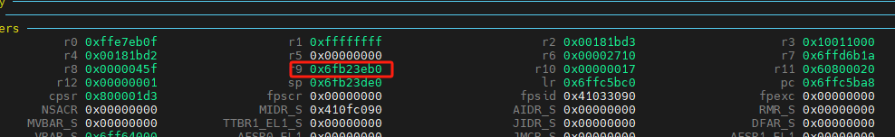

# Uboot代码重定位


<!--more-->

**u-boot源码阅读:代码重定位**

<!--more-->

## 重定位原理

1. 编译时添加-fpie选项
2. 链接添加pie选项
3. 生成段名，用来修正代码位置

```c
char __bss_start[0] __section(".__bss_start");
char __bss_end[0] __section(".__bss_end");
char __image_copy_start[0] __section(".__image_copy_start");
char __image_copy_end[0] __section(".__image_copy_end");
char __rel_dyn_start[0] __section(".__rel_dyn_start");
char __rel_dyn_end[0] __section(".__rel_dyn_end");
char __secure_start[0] __section(".__secure_start");
char __secure_end[0] __section(".__secure_end");
char __secure_stack_start[0] __section(".__secure_stack_start");
char __secure_stack_end[0] __section(".__secure_stack_end");
char __efi_runtime_start[0] __section(".__efi_runtime_start");
char __efi_runtime_stop[0] __section(".__efi_runtime_stop");
char __efi_runtime_rel_start[0] __section(".__efi_runtime_rel_start");
char __efi_runtime_rel_stop[0] __section(".__efi_runtime_rel_stop");
char _end[0] __section(".__end");
```

## 代码重定位

> 进入**arch/arm/lib/relocate.S**
>
> 这个函数执行结束之后，后面的代码没法正常的跟踪gdb运行了
>
> 是否存在特殊的手段实现呢？

https://elixir.bootlin.com/u-boot/latest/source/arch/arm/lib/relocate.S#L79

指定-pie后编译生成的uboot中就会有一个rel.dyn段，uboot就是靠rel.dyn段实现了完美的relocation！

```assembly
ENTRY(relocate_code)
relocate_base:
	adr	r3, relocate_base        		/* R3 = relocate_base - pc */
	ldr	r1, _image_copy_start_ofs		/* R1 = _image_copy_start_ofs */
	add	r1, r3							/* r1 <- Run &__image_copy_start */
	subs	r4, r0, r1					/* r4 <- Run to copy offset      */
	beq	relocate_done					/* skip relocation               */
	ldr	r1, _image_copy_start_ofs
	add	r1, r3							/* r1 <- Run &__image_copy_start */
	ldr	r2, _image_copy_end_ofs
	add	r2, r3							/* r2 <- Run &__image_copy_end   */

copy_loop:
	ldmia	r1!, {r10-r11}		/* copy from source address [r1] */
	stmia	r0!, {r10-r11}		/* copy to   target address [r0] */
	cmp	r1, r2			/* until source end address [r2] */
	blo	copy_loop

	/*
	 * fix .rel.dyn relocations
	 */
	ldr	r1, _rel_dyn_start_ofs
	add	r2, r1, r3		/* r2 <- Run &__rel_dyn_start */
	ldr	r1, _rel_dyn_end_ofs
	add	r3, r1, r3		/* r3 <- Run &__rel_dyn_end */

fixloop:
	ldmia	r2!, {r0-r1}		/* (r0,r1) <- (SRC location,fixup) */
	and	r1, r1, #0xff
	cmp	r1, #R_ARM_RELATIVE
	bne	fixnext

	/* relative fix: increase location by offset */
	add	r0, r0, r4
	ldr	r1, [r0]
	add	r1, r1, r4
	str	r1, [r0]
fixnext:
	cmp	r2, r3
	blo	fixloop


relocate_done:
	ret	lr			/* set pc */

ENDPROC(relocate_code)

_image_copy_start_ofs:
	.word	__image_copy_start - relocate_code
_image_copy_end_ofs:
	.word	__image_copy_end - relocate_code
_rel_dyn_start_ofs:
	.word	__rel_dyn_start - relocate_code
_rel_dyn_end_ofs:
	.word	__rel_dyn_end - relocate_code
```

代码解析:

(TODO)

那么代码现在运行到何处了呢？

在进入代码搬移之前

```assembly
ldr	r0, [r9, #GD_RELOCADDR]		/* r0 = gd->relocaddr */
b	relocate_code
```

## 向量表重定位

> 迁移向量表

```assembly
	.section	.text.relocate_vectors,"ax",%progbits

WEAK(relocate_vectors)

#ifdef CONFIG_CPU_V7M
	/*
	 * On ARMv7-M we only have to write the new vector address
	 * to VTOR register.
	 */
	ldr	r0, [r9, #GD_RELOCADDR]	/* r0 = gd->relocaddr */
	ldr	r1, =V7M_SCB_BASE
	str	r0, [r1, V7M_SCB_VTOR]
#else
#ifdef CONFIG_HAS_VBAR
	/*
	 * If the ARM processor has the security extensions,
	 * use VBAR to relocate the exception vectors.
	 */
	ldr	r0, [r9, #GD_RELOCADDR]	/* r0 = gd->relocaddr */
	mcr     p15, 0, r0, c12, c0, 0  /* Set VBAR */
#else
	/*
	 * Copy the relocated exception vectors to the
	 * correct address
	 * CP15 c1 V bit gives us the location of the vectors:
	 * 0x00000000 or 0xFFFF0000.
	 */
	ldr	r0, [r9, #GD_RELOCADDR]	/* r0 = gd->relocaddr */
	mrc	p15, 0, r2, c1, c0, 0	/* V bit (bit[13]) in CP15 c1 */
	ands	r2, r2, #(1 << 13)
	ldreq	r1, =0x00000000		/* If V=0 */
	ldrne	r1, =0xFFFF0000		/* If V=1 */
	ldmia	r0!, {r2-r8,r10}
	stmia	r1!, {r2-r8,r10}
	ldmia	r0!, {r2-r8,r10}
	stmia	r1!, {r2-r8,r10}
#endif
#endif
	ret	lr

ENDPROC(relocate_vectors)
```

## 调试修复

此时地址无法再次进行gdb调试,然后执行符号重新加载

获取加载地址
```c
static inline gd_t *get_gd(void)
{
	gd_t *gd_ptr;

#ifdef CONFIG_ARM64
	__asm__ volatile("mov %0, x18\n" : "=r" (gd_ptr));
#else
	__asm__ volatile("mov %0, r9\n" : "=r" (gd_ptr));
#endif

	return gd_ptr;
}

relocaddr = gd->relocaddr;
```

执行地址加载

```shell
add-symbol-file u-boot [加载地址]
```

程序好像运行出错了,但是打印还是正在运行;
计算偏移值



对此地址进行反解析;
```shell
p/x *(gd_t *)0x6fb23eb0
$ relocaddr = 0x6ff64000
```

将此地址写入,显示打印效果
```shell 
>>> add-symbol-file u-boot 0x6ff64000
add symbol table from file "u-boot" at
        .text_addr = 0x6ff64000
(y or n) y
Reading symbols from u-boot...
>>> bt
#0  timer_read_counter () at lib/time.c:39
#1  0x6ffc5bc0 in get_ticks () at lib/time.c:117
#2  0x6ffc5ca0 in __udelay (usec=usec@entry=10000) at lib/time.c:187
#3  0x6ffc5cd8 in udelay (usec=10000) at lib/time.c:200
#4  0x6ff7ac14 in abortboot_single_key (bootdelay=<optimized out>) at common/autoboot.c:401
#5  abortboot (bootdelay=<optimized out>) at common/autoboot.c:420
#6  autoboot_command (s=0x6fb28c38 "run distro_bootcmd; run bootflash") at common/autoboot.c:492
#7  0x6ff77908 in main_loop () at common/main.c:72
#8  0x6ff7b0a8 in run_main_loop () at common/board_r.c:554
#9  0x6ffbcd5c in initcall_run_list (init_sequence=<optimized out>) at lib/initcall.c:73
#10 0x6ff7b310 in board_init_r (new_gd=<optimized out>, dest_addr=<optimized out>) at common/board_r.c:770
#11 0x6ff65570 in _main () at arch/arm/lib/crt0.S:190
Backtrace stopped: previous frame identical to this frame (corrupt stack?)
```

此时就可以得到完美的打印效果了
